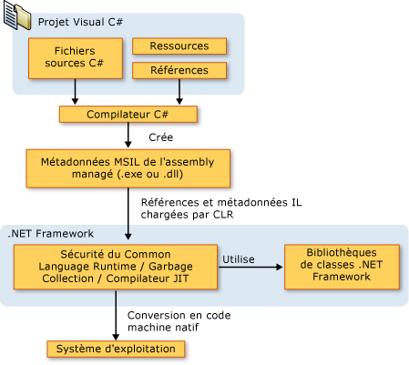

# Introduction au langage C# et au .NET Framework
C# est un langage élégant et de type sécurisé orienté objet qui permet aux développeurs de créer toute une gamme d'applications sûres et solides exécutées sur [!INCLUDE[dnprdnshort](~/includes/dnprdnshort-md.md)]. Vous pouvez utiliser C# pour créer des applications clientes Windows, services Web XML, composants distribués, applications client-serveur, applications de base de données et bien plus encore. Visual C# fournit un éditeur de code avancé, des concepteurs d’interface utilisateur pratiques, un débogueur intégré et de nombreux autres outils pour faciliter le développement d’applications basées sur le langage C# et le [!INCLUDE[dnprdnshort](~/includes/dnprdnshort-md.md)].  
  
> [!NOTE]
> La documentation de [!INCLUDE[csprcs](~/includes/csprcs-md.md)] suppose que vous avez une compréhension des concepts de base de la programmation. Si vous êtes un débutant complet, vous souhaiterez peut-être consulter [!INCLUDE[csprcsxpr](~/includes/csprcsxpr-md.md)], qui est disponible sur le Web. Vous pouvez également tirer parti de la documentation et des ressources Web sur C# pour acquérir des compétences de programmation pratiques.  
  
## Langage C#  
 La syntaxe C# est très expressive, mais elle est également simple et facile à apprendre. La syntaxe avec accolades de C# sera facile à reconnaître pour toute personne familiarisée avec C, C++ ou Java. Les développeurs qui connaissent un de ces langages peuvent généralement commencer à travailler efficacement en C# en très peu de temps. La syntaxe C# simplifie beaucoup des complexités de C++ et fournit des fonctionnalités puissantes, comme les types valeur Nullable, les énumérations, les délégués, les expressions lambda et l’accès direct à la mémoire, qui ne figurent pas dans Java. C# prend en charge des méthodes et types génériques qui fournissent de meilleures performances et plus de sécurité pour les types, et des itérateurs, qui permettent aux implémenteurs de classes de collection de définir des comportements d’itération personnalisés qui peuvent être utilisés facilement par le code client. Les expressions [!INCLUDE[vbteclinqext](~/includes/vbteclinqext-md.md)] font des requêtes fortement typées une construction de première classe du langage.  
  
 En tant que langage orienté objet, C# prend en charge les concepts d’encapsulation, d’héritage et de polymorphisme. Toutes les variables et méthodes, y compris la méthode `Main`, le point d’entrée de l’application, sont encapsulées dans des définitions de classe. Une classe peut hériter directement d'une classe parent, mais peut implémenter un nombre quelconque d'interfaces. Les méthodes qui substituent des méthodes virtuelles dans une classe parente requièrent le mot-clé `override` pour éviter toute redéfinition accidentelle. En C#, un struct est comme une classe légère : il s’agit d’un type alloué par la pile qui peut implémenter des interfaces mais ne prend pas en charge l’héritage.  
  
 Outre ces principes orientés objet de base, C# facilite le développement de composants logiciels à travers plusieurs constructions de langage novatrices, y compris ce qui suit :  
  
-   Des signatures de méthode encapsulées appelées *délégués*, qui activent les notifications d’événement de type sécurisé.  
  
-   Les propriétés, qui sont utilisées comme accesseurs pour les variables de membre privé.  
  
-   Les attributs, qui fournissent des métadonnées déclaratives sur les types au moment de l’exécution.  
  
-   Commentaires de documentation XML inline.  
  
-   [!INCLUDE[vbteclinqext](~/includes/vbteclinqext-md.md)], qui fournit des fonctions de requête intégrées sur diverses sources de données.  
  
 Si vous devez interagir avec d’autres logiciels Windows, comme les objets COM ou les DLL Win32 natives, vous pouvez faire cela dans C# via un processus appelé « Interopérabilité ». L’interopérabilité permet aux programmes C# de faire presque tout ce qu’une application native C++ peut faire. C# prend même en charge les pointeurs et le concept de code « unsafe » pour les cas où l’accès direct à la mémoire est absolument essentiel.  
  
 Le processus de génération de C# est simple par rapport à C et C++ et plus souple qu’avec Java. Il n’existe aucun fichier d’en-tête distinct, et les types et méthodes n’ont pas à être déclarés dans un ordre particulier. Un fichier source C# peut définir un nombre quelconque de classes, structs, interfaces et événements.  
  
 Voici des ressources C# supplémentaires :  
  
-   Pour une bonne présentation générale du langage, consultez le chapitre 1 de la [Spécification du langage C#](../../csharp/language-reference/language-specification/index.md).  
  
-   Pour plus d’informations sur des aspects spécifiques du langage C#, consultez la [Référence de C#](../../csharp/language-reference/index.md).  
  
-   Pour plus d’informations sur [!INCLUDE[vbteclinq](~/includes/vbteclinq-md.md)], consultez [LINQ (Language-Integrated Query)](http://msdn.microsoft.com/library/a73c4aec-5d15-4e98-b962-1274021ea93d).  
  
-   Pour découvrir les derniers articles et ressources de l’équipe Visual C#, consultez le [Centre de développement Visual C#](http://go.microsoft.com/fwlink/?LinkId=47811).  
  
## Architecture de la plateforme .NET Framework  
 C# s’exécute sur [!INCLUDE[dnprdnshort](~/includes/dnprdnshort-md.md)], un composant intégral de Windows qui inclut un système d’exécution virtuel appelé Common Language Runtime (CLR) et un ensemble unifié de bibliothèques de classes. CLR est l’implémentation commerciale par Microsoft de la Common Language Infrastructure (CLI), une norme internationale qui sert de base pour la création d’environnements de développement et d’exécution dans lesquels les langages et bibliothèques fonctionnent ensemble en toute transparence.  
  
 Le code source écrit en C# est compilé dans un langage intermédiaire (IL) qui est conforme à la spécification CLI. Le code de langage intermédiaire et les ressources, comme les bitmaps et les chaînes, sont stockés sur disque dans un fichier exécutable appelé assembly, généralement avec l’extension .exe ou .dll. Un assembly contient un manifeste qui fournit des informations sur les types de l’assembly, sa version, sa culture et ses conditions de sécurité.  
  
 Lorsque le programme C# est exécuté, l’assembly est chargé dans CLR, qui peut prendre différentes mesures selon les informations contenues dans le manifeste. Ensuite, si les exigences de sécurité sont satisfaites, CLR effectue une compilation juste à temps (JIT) pour convertir le code de langage intermédiaire en instructions machine natives. CLR fournit également d’autres services connexes liés au nettoyage automatique de la mémoire (garbage collection), à la gestion des exceptions et à la gestion des ressources. Le code exécuté par CLR est parfois appelé « code managé », contrairement au « code non managé » qui est compilé dans le langage machine natif ciblant un système spécifique. Le diagramme suivant illustre les relations de compilation et d’exécution des fichiers de code source de C#, les bibliothèques de classes .NET Framework, les assemblys et CLR.  
  
   
  
 L’interopérabilité des langages est une fonctionnalité essentielle de [!INCLUDE[dnprdnshort](~/includes/dnprdnshort-md.md)]. Étant donné que le code de langage intermédiaire produit par le compilateur C# est conforme à la spécification de type commun (CTS), le code de langage intermédiaire généré à partir de C# peut interagir avec du code qui a été généré à partir des versions .NET de Visual Basic, Visual C++ ou un des plus de 20 autres langages compatibles CTS. Un seul assembly peut contenir plusieurs modules écrits dans différents langages .NET, et les types peuvent se référencent mutuellement comme s’ils avaient été écrits dans la même langue.  
  
 Outre les services de runtime [!INCLUDE[dnprdnshort](~/includes/dnprdnshort-md.md)] inclut également une bibliothèque étendue de plus de 4 000 classes organisées en espaces de noms qui fournissent une grande variété de fonctionnalités utiles pour tous les éléments allant de l’entrée et la sortie de fichiers pour la manipulation de chaînes à l’analyse de XML, en passant par les contrôles Windows Forms. Une application C# standard utilise énormément la bibliothèque de classes [!INCLUDE[dnprdnshort](~/includes/dnprdnshort-md.md)] pour gérer les tâches fastidieuses.  
  
 Pour plus d’informations sur .NET Framework, consultez [Présentation de Microsoft .NET Framework](http://msdn.microsoft.com/en-us/d05daf50-00fe-45c7-8383-06fe41697355).  
  
## Voir aussi  
 [C#](../../csharp/index.md) [Bien démarrer avec Visual C# et Visual Basic](/visualstudio/ide/getting-started-with-visual-csharp-and-visual-basic)

