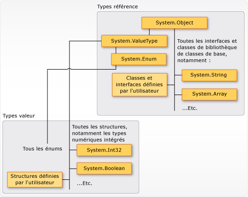

# Types (Guide de programmation&#160;C#)
## Types, variables et valeurs  
 C\# est un langage fortement typé.  Chaque variable et constante dispose d'un type, tout comme chaque expression correspondant à une valeur.  Chaque signature de la méthode spécifie un type pour chaque paramètre d'entrée et pour la valeur de retour.  La bibliothèque de classes .NET Framework définit un ensemble de types numériques intégrés, ainsi que des types plus complexes qui représentent un large éventail de constructions logiques, telles que le système de fichiers, les connexions réseau, les collections et les tableaux d'objets, ainsi que les dates.  Un programme C\# traditionnel exploite les types de la bibliothèque de classes et les types définis par l'utilisateur qui forment les concepts propres au domaine de problème du programme.  
  
 Les informations stockées dans un type peuvent inclure les éléments suivants :  
  
-   Espace de stockage que nécessite une variable du type.  
  
-   Valeurs minimale et maximale que peut représenter le type.  
  
-   Membres \(méthodes, champs, événements, et ainsi de suite\) contenus dans le type.  
  
-   Type de base dont hérite le type.  
  
-   Emplacement où sera allouée la mémoire pour les variables au moment de l'exécution.  
  
-   Types d'opérations autorisés.  
  
 Le compilateur utilise les informations de type afin de s'assurer que toutes les opérations effectuées dans votre code sont de *type sécurisé*.  Par exemple, si vous déclarez une variable de type [int](../../../csharp/language-reference/keywords/int.md), le compilateur vous permet d'utiliser la variable dans les opérations d'addition et de soustraction.  Si vous essayez d'effectuer ces mêmes opérations avec une variable de type [bool](../../../csharp/language-reference/keywords/bool.md), le compilateur génère une erreur, comme le montre l'exemple suivant :  
  
 [!code-cs[csProgGuideTypes#42](../../../csharp/programming-guide/nullable-types/codesnippet/CSharp/index_1.cs)]  
  
> [!NOTE]
>  Les développeurs C et C\+\+ remarqueront qu'en C\#, [bool](../../../csharp/language-reference/keywords/bool.md) n'est pas convertible en [int](../../../csharp/language-reference/keywords/int.md).  
  
 Le compilateur incorpore les informations de type dans le fichier exécutable sous forme de métadonnées.  Le Common Language Runtime \(CLR\) utilise ces métadonnées au moment de l'exécution pour garantir davantage la cohérence des types lorsqu'il alloue et libère de la mémoire.  
  
### Spécification de types dans les déclarations de variable  
 Lorsque vous déclarez une variable ou une constante dans un programme, vous devez spécifier son type ou utiliser le mot clé [var](../../../csharp/language-reference/keywords/var.md) pour permettre au compilateur de déduire le type.  L'exemple suivant montre des déclarations de variable qui utilisent à la fois des types numériques intégrés et des types complexes définis par l'utilisateur :  
  
 [!code-cs[csProgGuideTypes#36](../../../csharp/programming-guide/nullable-types/codesnippet/CSharp/index_2.cs)]  
  
 Les types de paramètres de méthode et de valeurs de retour sont spécifiés dans la signature de méthode.  La signature suivante présente une méthode qui nécessite [int](../../../csharp/language-reference/keywords/int.md) comme argument d'entrée et retourne une chaîne :  
  
 [!code-cs[csProgGuideTypes#35](../../../csharp/programming-guide/nullable-types/codesnippet/CSharp/index_3.cs)]  
  
 Une fois déclarée, une variable ne peut pas être déclarée de nouveau avec un autre type et une valeur incompatible avec son type déclaré ne peut pas lui être assignée.  Par exemple, vous ne pouvez pas déclarer [int](../../../csharp/language-reference/keywords/int.md) et lui assigner la valeur booléenne [true](../../../csharp/language-reference/keywords/true-literal.md).  En revanche, vous pouvez convertir des valeurs vers d'autres types, notamment lorsque vous les assignez à de nouvelles variables ou les passez en tant qu'arguments de méthode.  Toute *conversion de type* qui n'entraîne aucune perte de données est réalisée automatiquement par le compilateur.  Une conversion susceptible d'entraîner la perte de données exige un *cast* dans le code source.  
  
 Pour plus d'informations, consultez [Cast et conversions de types](../../../csharp/programming-guide/types/casting-and-type-conversions.md).  
  
## Types intégrés  
 C\# fournit un jeu de types numériques intégrés standard pour représenter les entiers, les valeurs à virgule flottante, les expressions booléennes, les caractères de texte, les valeurs décimales et d'autres types de données.  Il existe également des types `string` et `object` intégrés.  Vous pouvez les utiliser dans n'importe quel programme C\#.  Pour plus d'informations sur les types intégrés, consultez [Tableaux de référence des types](../../../csharp/language-reference/keywords/reference-tables-for-types.md).  
  
## Types personnalisés  
 Vous utilisez les constructions [struct](../../../csharp/language-reference/keywords/struct.md), [class](../../../csharp/language-reference/keywords/class.md), [interface](../../../csharp/language-reference/keywords/interface.md) et [enum](../../../csharp/language-reference/keywords/enum.md) pour créer vos propres types personnalisés.  La bibliothèque de classes .NET Framework est une collection de types personnalisés fournie par Microsoft que vous pouvez utiliser dans vos propres applications.  Par défaut, les types les plus fréquemment utilisés dans la bibliothèque de classes sont disponibles dans tous les programmes C\#.  D'autres deviennent disponibles uniquement lorsque vous ajoutez explicitement une référence de projet à l'assembly dans lequel ils sont définis.  Une fois que le compilateur comporte une référence à l'assembly, vous pouvez déclarer des variables \(et des constantes\) conformes aux types déclarés dans cet assembly, à l'intérieur de votre code source.  Pour plus d'informations, consultez [Bibliothèque de classes .NET Framework](http://go.microsoft.com/fwlink/?LinkID=217856).  
  
## Système de type commun \(CTS, Common Type System\)  
 Il est important de comprendre deux points fondamentaux à propos du système de type dans le [!INCLUDE[dnprdnshort](../../../csharp/getting-started/includes/dnprdnshort-md.md)] :  
  
-   Il prend en charge le principe d'héritage.  Les types peuvent provenir d'autres types appelés *types de base*.  Le type dérivé hérite \(avec certaines restrictions\) des méthodes, des propriétés et d'autres membres du type de base.  Le type de base peut, à son tour, être dérivé d'un autre type quelconque, auquel cas le type dérivé hérite des membres des deux types de base dans sa hiérarchie d'héritage.  Tous les types, y compris les types numériques intégrés tels que <xref:System.Int32?displayProperty=fullName> \(mot clé C\# : [int](../../../csharp/language-reference/keywords/int.md)\), dérivent en définitive d'un type de base unique : <xref:System.Object?displayProperty=fullName> \(mot clé C\# : [object](../../../csharp/language-reference/keywords/object.md)\).  Cette hiérarchie de types unifiée est appelée [Système de type commun](../../../standard/base-types/common-type-system.md).  Pour plus d'informations sur l'héritage dans C\#, consultez [Héritage](../../../csharp/programming-guide/classes-and-structs/inheritance.md).  
  
-   Chaque type du CTS est défini comme un *type valeur* ou un *type référence*.  Cela inclut tous les types personnalisés de la bibliothèque de classes .NET Framework, ainsi que vos propres types définis par l'utilisateur.  Les types que vous définissez au moyen du mot clé [struct](../../../csharp/language-reference/keywords/struct.md) sont des types valeur ; tous les types numériques intégrés sont des `structs`.  Les types que vous définissez à l'aide du mot clé [class](../../../csharp/language-reference/keywords/class.md) sont des types référence.  Les types référence et les types valeur ont des règles de compilation et un comportement à l'exécution différents.  
  
 L'illustration suivante montre la relation entre les types valeur et les types référence dans le CTS.  
  
   
Types valeur et types référence dans le système de type commun \(CTS, Common Type System\)  
  
> [!NOTE]
>  Vous pouvez voir que les types les plus fréquemment employés sont tous organisés dans l'espace de noms <xref:System>.  Toutefois, l'espace de noms dans lequel un type est contenu n'indique aucunement s'il s'agit d'un type valeur ou d'un type référence.  
  
### Types valeur  
 Les types valeur dérivent de <xref:System.ValueType?displayProperty=fullName>, qui dérive de <xref:System.Object?displayProperty=fullName>.  Les types qui dérivent de <xref:System.ValueType?displayProperty=fullName> ont un comportement particulier dans le CLR.  Les variables de type valeur contiennent directement leurs valeurs, ce qui signifie que la mémoire est allouée inline dans le contexte où la variable est déclarée.  Aucune allocation des tas ou surcharge de garbage collection distincte n'a lieu pour les variables de type valeur.  
  
 Il existe deux catégories de types valeur : [struct](../../../csharp/language-reference/keywords/struct.md) et [enum](../../../csharp/language-reference/keywords/enum.md).  
  
 Les types numériques intégrés sont des structs et disposent de propriétés et de méthodes auxquelles vous pouvez accéder.  
  
```c#  
// Static method on type Byte.  
byte b = Byte.MaxValue;  
```  
  
 Mais vous les déclarez et leur assignez des valeurs comme s'ils étaient des types autres que des types d'agrégats :  
  
```c#  
byte num = 0xA;  
int i = 5;  
char c = 'Z';  
```  
  
 Les types valeur sont *sealed*, ce qui signifie par exemple que vous ne pouvez pas dériver un type de <xref:System.Int32?displayProperty=fullName> et définir un struct pour qu'il hérite d'une classe ou d'un struct défini par l'utilisateur car un struct peut uniquement hériter de <xref:System.ValueType?displayProperty=fullName>.  En revanche, un struct peut implémenter une ou plusieurs interfaces.  Vous pouvez effectuer un cast d'un type struct en un type interface, mais ceci entraîne une opération de *boxing* qui encapsule le struct dans un objet de type référence sur le tas managé.  Les opérations de boxing surviennent lorsque vous passez un type valeur à une méthode qui accepte <xref:System.Object?displayProperty=fullName> comme paramètre d'entrée.  Pour plus d'informations, consultez [Conversion boxing et unboxing](../../../csharp/programming-guide/types/boxing-and-unboxing.md).  
  
 Vous utilisez le mot clé [struct](../../../csharp/language-reference/keywords/struct.md) pour créer vos propres types valeur personnalisés.  En règle générale, un struct est utilisé comme conteneur pour un petit jeu de variables connexes, comme le montre l'exemple suivant :  
  
 [!code-cs[csProgGuideObjects#1](../../../csharp/programming-guide/classes-and-structs/codesnippet/CSharp/index_4.cs)]  
  
 Pour plus d'informations sur les structs, consultez [Structures](../../../csharp/programming-guide/classes-and-structs/structs.md).  Pour plus d'informations sur les types valeur dans le [!INCLUDE[dnprdnshort](../../../csharp/getting-started/includes/dnprdnshort-md.md)], consultez [Système de type commun](../../../standard/base-types/common-type-system.md).  
  
 L'autre catégorie de types valeur est [enum](../../../csharp/language-reference/keywords/enum.md).  Un enum définit un jeu de constantes intégrales nommées.  Par exemple, l'énumération <xref:System.IO.FileMode?displayProperty=fullName> de la bibliothèque de classes .NET Framework contient un jeu d'entiers constants nommés qui indiquent comment un fichier doit être ouvert.  Il est défini comme le montre l'exemple suivant :  
  
 [!code-cs[csProgGuideTypes#44](../../../csharp/programming-guide/nullable-types/codesnippet/CSharp/index_5.cs)]  
  
 La constante `System.IO.FileMode.Create` a une valeur de 2.  Toutefois, le nom est beaucoup plus explicite pour les êtres humains qui lisent le code source, et pour cette raison il est préférable d'utiliser des énumérations au lieu de numéros littéraux constants.  Pour plus d'informations, consultez <xref:System.IO.FileMode?displayProperty=fullName>.  
  
 Tous les enums héritent de <xref:System.Enum?displayProperty=fullName>, qui hérite de <xref:System.ValueType?displayProperty=fullName>.  Toutes les règles qui s'appliquent aux structs s'appliquent également aux enums.  Pour plus d'informations sur les enums, consultez [Types énumération](../../../csharp/programming-guide/enumeration-types.md).  
  
### Types référence  
 Un type défini en tant que [classe](../../../csharp/language-reference/keywords/class.md), [délégué](../../../csharp/language-reference/keywords/delegate.md), tableau ou [interface](../../../csharp/language-reference/keywords/interface.md) est un *type référence*.  Au moment de l'exécution, quand vous déclarez une variable de type référence, celle\-ci contient la valeur [Null](../../../csharp/language-reference/keywords/null.md) tant que vous n'avez pas explicitement créé une instance de l'objet à l'aide de l'opérateur [new](../../../csharp/language-reference/keywords/new.md) ou que vous ne lui avez pas assigné un objet créé ailleurs à l'aide de `new, as shown in the following example:`  
  
```c#  
MyClass mc = new MyClass();  
MyClass mc2 = mc;  
```  
  
 Vous devez initialiser une interface avec un objet de classe qui l'implémente.  Si `MyClass` implémente `IMyInterface`, vous créez une instance de `IMyInterface` comme le montre l'exemple suivant :  
  
```c#  
IMyInterface iface = new MyClass();  
```  
  
 Lorsque l'objet est créé, la mémoire est allouée sur le tas managé et la variable contient uniquement une référence à l'emplacement de l'objet.  Les types sur le tas managé entraînent une surcharge lorsqu'ils sont alloués et récupérés par la fonctionnalité de gestion automatique de la mémoire du CLR appelée *garbage collection*.  Toutefois, le garbage collection est également fortement optimisé. Dans la plupart des cas, il ne nuit pas aux performances.  Pour plus d'informations sur l'opération garbage collection, consultez [Gestion automatique de la mémoire](../Topic/Automatic%20Memory%20Management.md).  
  
 Tous les tableaux sont des types référence, même si leurs éléments sont des types valeur.  Les tableaux proviennent implicitement de la classe <xref:System.Array?displayProperty=fullName>, mais vous les déclarez et les utilisez avec la syntaxe simplifiée fournie par C\#, comme le montre l'exemple qui suit :  
  
 [!code-cs[csProgGuideTypes#45](../../../csharp/programming-guide/nullable-types/codesnippet/CSharp/index_6.cs)]  
  
 Les types référence prennent complètement en charge l'héritage.  Lorsque vous créez une classe, vous pouvez hériter de toute autre interface ou classe qui n'est pas définie comme [sealed](../../../csharp/language-reference/keywords/sealed.md) et d'autres classes peuvent hériter de votre classe et substituer vos méthodes virtuelles.  Pour plus d'informations sur la création de vos propres classes, consultez [Classes et structs](../../../csharp/programming-guide/classes-and-structs/index.md).  Pour plus d'informations sur l'héritage et les méthodes virtuelles, consultez [Héritage](../../../csharp/programming-guide/classes-and-structs/inheritance.md).  
  
## Types des valeurs littérales  
 En C\#, les valeurs littérales reçoivent un type du compilateur.  Vous pouvez spécifier le type d'un littéral numérique en ajoutant une lettre à la fin du nombre.  Par exemple, pour spécifier que la valeur 4.56 doit être traitée comme une valeur float, ajoutez « f » ou « F » après le nombre : `4.56f`.  Si aucune lettre n'est ajoutée, le compilateur déduit un type pour le littéral.  Pour plus d'informations sur les types qui peuvent être spécifiés en utilisant une lettre comme suffixe, consultez les pages de référence de chaque type dans [Types valeur](../../../csharp/language-reference/keywords/value-types.md).  
  
 Parce que les littéraux sont typés et que tous les types dérivent en définitive de <xref:System.Object?displayProperty=fullName>, vous pouvez écrire et compiler du code tel que celui\-ci :  
  
 [!code-cs[csProgGuideTypes#37](../../../csharp/programming-guide/nullable-types/codesnippet/CSharp/index_7.cs)]  
  
## Types génériques  
 Vous pouvez déclarer un type avec un ou plusieurs *paramètres de type* faisant office d'espace réservé pour le type réellement concerné \(*type concret*\) que le code client spécifie lorsqu'il crée une instance du type.  Ces types sont appelés  *types génériques*.  Par exemple, le type .NET Framework <xref:System.Collections.Generic.List%601?displayProperty=fullName> dispose d'un paramètre de type qui, par convention, porte le nom *T*.  Lorsque vous créez une instance du type, vous spécifiez le type des objets que la liste doit contenir comme, par exemple, l'objet String :  
  
<CodeContentPlaceHolder>4</CodeContentPlaceHolder>  
 Le recours au paramètre de type rend possible la réutilisation de la même classe afin de conserver tous les types d'élément, sans avoir à convertir chaque élément en [objet](../../../csharp/language-reference/keywords/object.md).  Les classes de collection génériques sont appelées *collections fortement typées* parce que le compilateur connaît le type spécifique des éléments de la collection et peut déclencher une erreur lors de la compilation, notamment si vous tentez d'ajouter un entier à l'objet `strings` dans l'exemple précédent.  Pour plus d'informations, consultez [Génériques](../../../csharp/programming-guide/generics/index.md).  
  
## Types implicites, anonymes et Nullable  
 Comme indiqué précédemment, vous pouvez définir implicitement le type d'une variable locale \(mais pas des membres de classe\) en utilisant le mot clé [var](../../../csharp/language-reference/keywords/var.md).  La variable reçoit toujours un type au moment de la compilation, mais le type est fourni par le compilateur.  Pour plus d'informations, consultez [Variables locales implicitement typées](../../../csharp/programming-guide/classes-and-structs/implicitly-typed-local-variables.md).  
  
 Dans certains cas, il est difficile de créer un type nommé pour des jeux de valeurs connexes simples que vous ne souhaitez pas stocker ou passer en dehors des limites d'une méthode.  Vous pouvez alors créer des *types anonymes*.  Pour plus d'informations, consultez [Types anonymes](../../../csharp/programming-guide/classes-and-structs/anonymous-types.md).  
  
 Les types valeur ordinaires ne peuvent pas avoir la valeur [Null](../../../csharp/language-reference/keywords/null.md).  Toutefois, vous pouvez créer des types valeur Nullable en apposant un `?` après le type.  Par exemple, `int?` est un type `int` qui peut également avoir la valeur [Null](../../../csharp/language-reference/keywords/null.md).  Dans le CTS, les types Nullable sont des instances du type de struct générique <xref:System.Nullable%601?displayProperty=fullName>.  Les types Nullable sont particulièrement utiles lorsque vous passez des données vers et à partir de bases de données dans lesquelles les valeurs numériques peuvent être Null.  Pour plus d'informations, consultez [Types Nullable](../../../csharp/programming-guide/nullable-types/index.md).  
  
## Rubriques connexes  
 Pour plus d'informations, consultez les rubriques suivantes :  
  
-   [Cast et conversions de types](../../../csharp/programming-guide/types/casting-and-type-conversions.md)  
  
-   [Conversion boxing et unboxing](../../../csharp/programming-guide/types/boxing-and-unboxing.md)  
  
-   [Utilisation du type dynamic](../../../csharp/programming-guide/types/using-type-dynamic.md)  
  
-   [Types valeur](../../../csharp/language-reference/keywords/value-types.md)  
  
-   [Types référence](../../../csharp/language-reference/keywords/reference-types.md)  
  
-   [Classes et structs](../../../csharp/programming-guide/classes-and-structs/index.md)  
  
-   [Types anonymes](../../../csharp/programming-guide/classes-and-structs/anonymous-types.md)  
  
-   [Génériques](../../../csharp/programming-guide/generics/index.md)  
  
-   [Variables et expressions](http://go.microsoft.com/fwlink/?LinkId=221228) dans [Démarrage de Visual C\# 2010](http://go.microsoft.com/fwlink/?LinkId=221214)  
  
## Spécification du langage C\#  
 [!INCLUDE[CSharplangspec](../../../csharp/language-reference/keywords/includes/csharplangspec-md.md)]  
  
## Voir aussi  
 [Référence C\#](../../../csharp/language-reference/index.md)   
 [Guide de programmation C\#](../../../csharp/programming-guide/index.md)   
 [Conversion des types de données XML](../Topic/Conversion%20of%20XML%20Data%20Types.md)   
 [Tableau des types intégraux](../../../csharp/language-reference/keywords/integral-types-table.md)