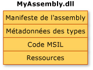
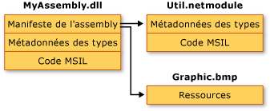

# Contenu d&#39;un assembly
En général, un assembly statique peut comporter les quatre éléments suivants :  
  
-   le [manifeste d'assembly](../../../docs/framework/app-domains/assembly-manifest.md), qui contient les métadonnées de l'assembly ;  
  
-   les métadonnées des types ;  
  
-   le code MSIL \(Microsoft Intermediate Language\) qui implémente les types ;  
  
-   un ensemble de ressources.  
  
 Seul le manifeste d'assembly est requis, mais soit les types, soit les ressources sont nécessaires pour donner à l'assembly des fonctionnalités significatives.  
  
 Il existe plusieurs modes de regroupement de ces éléments dans un assembly.  Vous pouvez regrouper tous les éléments dans un seul fichier physique, comme dans l'illustration ci\-dessous.  
  
   
Assembly monofichier  
  
 Les éléments d'un assembly peuvent également figurer dans plusieurs fichiers.  Ces fichiers peuvent être des modules de code compilé \(.netmodule\), des ressources \(telles que des fichiers .bmp ou .jpg\) ou d'autres fichiers requis par l'application.  Créez un assembly multifichier lorsque vous souhaitez associer des modules écrits dans différents langages et optimiser le téléchargement d'une application en mettant les types rarement utilisés dans un module qui n'est téléchargé qu'en cas de nécessité.  
  
 Dans l'illustration ci\-dessous, le développeur d'une application hypothétique a choisi de placer le code d'utilitaire dans un module distinct et de conserver un fichier de ressources volumineux \(dans ce cas une image .bmp\) dans son fichier d'origine.  Le .NET Framework ne télécharge un fichier que lorsqu'il est référencé ; le maintien du code peu référencé dans un fichier distinct de l'application optimise le téléchargement du code.  
  
   
Assembly multifichier  
  
> [!NOTE]
>  Les fichiers qui composent un assembly multifichier ne sont pas physiquement reliés par le système de fichiers.  Ils sont à la place reliés par le manifeste d'assembly et le Common Language Runtime les manage en tant qu'unité.  
  
 Dans cette illustration, les trois fichiers appartiennent à un assembly, comme décrit dans le manifeste de l'assembly contenu dans MyAssembly.dll.  Pour le système de fichiers, il s'agit de trois fichiers distincts.  Notez que le fichier Util.netmodule a été compilé comme un module car il ne contient pas d'information sur l'assembly.  Lorsque l'assembly a été créé, le manifeste de l'assembly a été ajouté à MyAssembly.dll, en indiquant sa relation avec Util.netmodule et Graphic.bmp.  
  
 Actuellement, à mesure que vous concevez votre code source, vous prenez des décisions explicites concernant le mode de partition des fonctionnalités de votre application dans un ou plusieurs fichiers.  Lors du design de code .NET Framework, vous prendrez des décisions similaires sur le mode de partition des fonctionnalités dans un ou plusieurs assemblys.  
  
## Voir aussi  
 [Assemblys dans le Common Language Runtime](../../../docs/framework/app-domains/assemblies-in-the-common-language-runtime.md)   
 [Manifeste d'assembly](../../../docs/framework/app-domains/assembly-manifest.md)   
 [Aspects de la sécurité des assemblys](../../../docs/framework/app-domains/assembly-security-considerations.md)