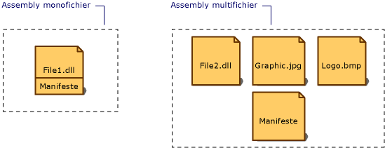

# Manifeste d'assemblyAssembly Manifest
Chaque assembly, qu'il soit statique ou dynamique, comporte une collection de données qui décrit comment les éléments de l'assembly sont reliés les uns aux autres.Every assembly, whether static or dynamic, contains a collection of data that describes how the elements in the assembly relate to each other. Le manifeste d'assembly contient les métadonnées de l'assembly.The assembly manifest contains this assembly metadata. Un manifeste d'assembly comprend toutes les métadonnées nécessaires pour spécifier la version requise et l'identité de sécurité de l'assembly, ainsi que toutes les métadonnées nécessaires pour définir la portée de l'assembly et résoudre les références aux ressources et aux classes.An assembly manifest contains all the metadata needed to specify the assembly's version requirements and security identity, and all metadata needed to define the scope of the assembly and resolve references to resources and classes. Le manifeste d'assembly peut être stocké soit dans un fichier exécutable portable (PE, portable executable) (.exe ou .dll) avec le code MILS (Microsoft Intermediate Language), soit dans un fichier PE autonome qui ne contient que des informations sur le manifeste de l'assembly.The assembly manifest can be stored in either a PE file (an .exe or .dll) with Microsoft intermediate language (MSIL) code or in a standalone PE file that contains only assembly manifest information.  
  
 L'illustration ci-dessous indique les différents modes de stockage du manifeste.The following illustration shows the different ways the manifest can be stored.  
  
   
Types d'assemblysTypes of assemblies  
  
 Pour un assembly avec un fichier associé, le manifeste est incorporé au fichier PE pour former un assembly monofichier.For an assembly with one associated file, the manifest is incorporated into the PE file to form a single-file assembly. Vous pouvez créer un assembly multifichier avec un fichier manifeste autonome ou avec le manifeste incorporé à l'un des fichiers PE de l'assembly.You can create a multifile assembly with a standalone manifest file or with the manifest incorporated into one of the PE files in the assembly.  
  
 Le manifeste de chaque assembly exécute les fonctions suivantes :Each assembly's manifest performs the following functions:  
  
-   Il énumère les fichiers qui composent l'assembly.Enumerates the files that make up the assembly.  
  
-   Il détermine le mode de mappage des références aux types et aux ressources de l'assembly aux fichiers qui contiennent leurs déclarations et leurs implémentations.Governs how references to the assembly's types and resources map to the files that contain their declarations and implementations.  
  
-   Il énumère les autres assemblys dont l'assembly dépend.Enumerates other assemblies on which the assembly depends.  
  
-   Il fournit un niveau d'adressage indirect entre les consommateurs de l'assembly et les détails d'implémentation de l'assembly.Provides a level of indirection between consumers of the assembly and the assembly's implementation details.  
  
-   Il rend l'assembly autodescriptif.Renders the assembly self-describing.  
  
## Contenu du manifeste d'assemblyAssembly Manifest Contents  
 Le tableau suivant indique les informations qui figurent dans le manifeste d'assembly.The following table shows the information contained in the assembly manifest. Les quatre premiers éléments (le nom de l'assembly, le numéro de version, la culture et les informations sur le nom fort) constituent l'identité de l'assembly.The first four items—the assembly name, version number, culture, and strong name information—make up the assembly's identity.  
  
|InformationInformation|DescriptionDescription|  
|-----------------|-----------------|  
|Nom de l'assemblyAssembly name|Chaîne de texte spécifiant le nom de l'assembly.A text string specifying the assembly's name.|  
|Numéro de versionVersion number|Numéro de version principale et secondaire et numéro de révision et de build.A major and minor version number, and a revision and build number. Le Common Language Runtime utilise ces numéros pour appliquer la stratégie de version.The common language runtime uses these numbers to enforce version policy.|  
|cultureCulture|Informations sur la culture ou le langage que l'assembly prend en charge.Information on the culture or language the assembly supports. Ces informations ne doivent être utilisées que pour désigner un assembly en tant qu'assembly satellite contenant des informations spécifiques à la culture ou au langage.This information should be used only to designate an assembly as a satellite assembly containing culture- or language-specific information. Un assembly possédant des informations sur la culture est automatiquement considéré comme étant un assembly satellite.(An assembly with culture information is automatically assumed to be a satellite assembly.)|  
|Informations sur le nom fortStrong name information|Clé publique de l'éditeur si un nom fort a été attribué à l'assembly.The public key from the publisher if the assembly has been given a strong name.|  
|Liste de tous les fichiers figurant dans l'assemblyList of all files in the assembly|Hachage de chaque fichier figurant dans l'assembly et nom de fichier.A hash of each file contained in the assembly and a file name. Notez que tous les fichiers qui composent l'assembly doivent figurer dans le même répertoire que le fichier qui comporte le manifeste d'assembly.Note that all files that make up the assembly must be in the same directory as the file containing the assembly manifest.|  
|Informations sur les références de typeType reference information|Informations utilisées par le runtime pour mapper une référence de type au fichier qui contient sa déclaration et son implémentation.Information used by the runtime to map a type reference to the file that contains its declaration and implementation. Elles sont utilisées pour les types qui sont exportés à partir de l'assembly.This is used for types that are exported from the assembly.|  
|Informations sur les assemblys référencésInformation on referenced assemblies|Liste des autres assemblys statiquement référencés par l'assembly.A list of other assemblies that are statically referenced by the assembly. Chaque référence inclut le nom de l'assembly dépendant, les métadonnées de l'assembly (version, culture, système d'exploitation...) et la clé publique, si l'assembly possède un nom fort.Each reference includes the dependent assembly's name, assembly metadata (version, culture, operating system, and so on), and public key, if the assembly is strong named.|  
  
 Vous pouvez ajouter ou modifier certaines informations dans le manifeste d'assembly en utilisant des attributs d'assembly dans votre code.You can add or change some information in the assembly manifest by using assembly attributes in your code. Vous pouvez modifier les informations sur la version et les attributs d'informations, y compris la Marque, le Copyright, le Produit, la Société et la Version d'informations.You can change version information and informational attributes, including Trademark, Copyright, Product, Company, and Informational Version. Pour obtenir la liste complète des attributs d’assembly, consultez [Définition des attributs d’assembly](../../../docs/framework/app-domains/set-assembly-attributes.md).For a complete list of assembly attributes, see [Setting Assembly Attributes](../../../docs/framework/app-domains/set-assembly-attributes.md).  
  
## Voir aussiSee Also  
 [Contenu d’un assemblyAssembly Contents](../../../docs/framework/app-domains/assembly-contents.md)  
 [Contrôle de version des assemblysAssembly Versioning](../../../docs/framework/app-domains/assembly-versioning.md)  
 [Création d’assemblys satellitesCreating Satellite Assemblies](../../../docs/framework/resources/creating-satellite-assemblies-for-desktop-apps.md)  
 [Assemblys avec nom fortStrong-Named Assemblies](../../../docs/framework/app-domains/strong-named-assemblies.md)
