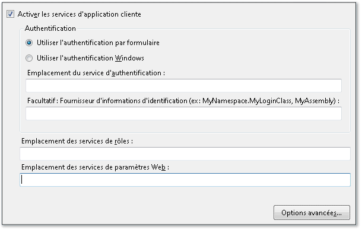
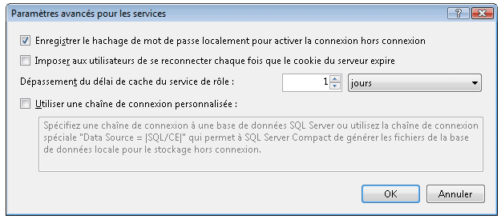

# <a name="how-to-configure-client-application-services"></a>Comment : configurer les services d'application cliente
Cette rubrique décrit comment utiliser le [!INCLUDE[vsprvs](../../../includes/vsprvs-md.md)] **Concepteur de projet** pour activer et configurer les services d’application cliente. Vous pouvez utiliser les services d'application cliente pour valider des utilisateurs et extraire des rôles d'utilisateur ainsi que des paramètres d'un service d'application [!INCLUDE[ajax_current_short](../../../includes/ajax-current-short-md.md)] existant. Une fois la configuration effectuée, vous pouvez accéder aux services actifs dans votre code d’application comme décrit dans [Vue d’ensemble des services d’application cliente](../../../docs/framework/common-client-technologies/client-application-services-overview.md). Pour plus d’informations sur les services d’application [!INCLUDE[ajax_current_short](../../../includes/ajax-current-short-md.md)], consultez [Vue d’ensemble des services d’application ASP.NET](http://msdn.microsoft.com/library/1162e529-0d70-44b2-b3ab-83e60c695013).  
  
 Vous pouvez activer et configurer les services d’application cliente dans la page **Services** du **Concepteur de projet**. La page **Services** met à jour les valeurs dans le fichier App.config de votre projet. Pour accéder au **Concepteur de projet**, utilisez la commande **Propriétés** du menu **Projet**. Pour plus d’informations sur la page **Services**, consultez [Services, page du Concepteur de projet](https://msdn.microsoft.com/library/bb398109).  
  
 La procédure suivante décrit comment effectuer la configuration de base des services d'application cliente. Les options de configuration avancées sont décrites dans les sections suivantes.  
  
### <a name="to-configure-client-application-services"></a>Pour configurer les services d'application cliente  
  
1.  Dans l’**Explorateur de solutions**, sélectionnez un nœud de projet puis, dans le menu **Projet**, cliquez sur **Propriétés**.  
  
     Le **Concepteur de projet** s’affiche.  
  
2.  Cliquez sur l’onglet **Services**. La page **Services** s’affiche, comme dans l’illustration suivante.  
  
       
  
3.  Dans la page **Services**, sélectionnez **Activer les services d’application cliente**.  
  
    > [!NOTE]
    >  Les services d'application cliente nécessitent la version complète du .NET Framework et ne sont pas pris en charge dans le .NET Framework Client Profile. Si la case **Activer les services d’application cliente** est décochée, vérifiez que la liste **Framework cible** a la valeur .NET Framework 3.5 ou version ultérieure. Pour afficher le paramètre **Framework cible** en C#, ouvrez le Concepteur de projets, puis cliquez sur la page **Application**. Pour afficher le paramètre **Framework cible** en Visual Basic, ouvrez le Concepteur de projets, cliquez sur la page **Compiler**, puis sur **Options avancées de compilation**.  
  
4.  Sélectionnez **Utiliser l’authentification par formulaire** si vous prévoyez de fournir vos propres contrôles de connexion ou boîte de dialogue, ou sélectionnez **Utiliser l’authentification Windows** pour utiliser l’identité fournie par le système d’exploitation. Pour plus d’informations, consultez la section [Vue d’ensemble des services d’application cliente](../../../docs/framework/common-client-technologies/client-application-services-overview.md).  
  
    > [!NOTE]
    >  Si vous sélectionnez **Utiliser l’authentification Windows**, les services d’application cliente sont automatiquement configurés pour utiliser une base de données SQL Server Compact. L’indication figure dans la boîte de dialogue **Paramètres avancés pour les services** comme décrit dans la section suivante. Si vous sélectionnez ensuite **Utiliser l’authentification par formulaire**, le paramètre **Utiliser une chaîne de connexion personnalisée** n’est pas automatiquement désactivé. Des erreurs peuvent se produire si la base de données [!INCLUDE[ssEW](../../../includes/ssew-md.md)] a déjà été générée pour être utilisée avec l'authentification Windows. Pour résoudre ces erreurs, désactivez le paramètre **Utiliser une chaîne de connexion personnalisée** dans la boîte de dialogue **Paramètres avancés pour les services**.  
  
5.  Si vous avez sélectionné **Utiliser l’authentification par formulaire**, dans la zone **Emplacement du service d’authentification**, indiquez l’URL de l’hôte de service sans le nom de fichier. Le concepteur ajoute automatiquement le nom de fichier standard (Authentication_JSON_AppService.axd) quand il écrit la valeur dans le fichier de configuration.  
  
6.  Si vous avez sélectionné **Utiliser l’authentification par formulaire**, vous pouvez éventuellement spécifier une valeur dans la zone **Fournisseur d’infos d’identification**. Le fournisseur d'informations d'identification doit implémenter l'interface <xref:System.Web.ClientServices.Providers.IClientFormsAuthenticationCredentialsProvider>. À l'aide d'un fournisseur d'informations d'identification, vous pouvez séparer votre interface utilisateur de connexion de l'autre code d'application. Vous pouvez ainsi créer une boîte de dialogue d'ouverture de session unique à utiliser dans plusieurs applications. Pour plus d’informations, consultez [Comment : implémenter la connexion utilisateur avec les services d’application cliente](../../../docs/framework/common-client-technologies/how-to-implement-user-login-with-client-application-services.md).  
  
     Si vous spécifiez un fournisseur d'informations d'identification, vous devez le spécifier comme un nom de type qualifié d'assembly. Pour plus d’informations, consultez <xref:System.Type.AssemblyQualifiedName%2A?displayProperty=fullName> et [Noms d’assemblys](../../../docs/framework/app-domains/assembly-names.md). Dans sa forme la plus simple, un nom de type qualifié d'assembly ressemble à l'exemple suivant :  
  
    ```  
    MyNamespace.MyLoginClass, MyAssembly  
    ```  
  
7.  Dans les zones de texte **Emplacement des services de rôles** et **Emplacement des services de paramètres web**, spécifiez l’emplacement de chaque service, sans le nom de fichier. Le concepteur ajoute automatiquement le nom de fichier standard (Role_JSON_AppService.axd et Profile_JSON_AppService.axd) quand il écrit la valeur dans le fichier de configuration.  
  
8.  Vous pouvez éventuellement cliquer sur **Avancé** pour modifier les paramètres avancés, tels que le comportement de mise en cache local. Pour plus d'informations, consultez la procédure suivante.  
  
## <a name="advanced-configuration"></a>Configuration avancée  
 Les procédures suivantes décrivent comment configurer les services d'application cliente pour les scénarios moins courants. Par exemple, vous pouvez utiliser ces options de configuration pour les applications déployées dans les emplacements publics ou utiliser une base de données SQL Server Compact comme cache de données local.  
  
#### <a name="to-configure-advanced-settings-for-client-application-services"></a>Pour configurer les paramètres avancés des services d'application cliente  
  
1.  Dans la page **Services** du **Concepteur de projet**, cliquez sur **Avancé**.  
  
     La boîte de dialogue **Paramètres avancés pour les services** s’affiche, comme dans l’illustration suivante. Pour plus d’informations sur cette boîte de dialogue, consultez [Paramètres avancés pour les services, boîte de dialogue](/visualstudio/ide/reference/advanced-settings-for-services-dialog-box).  
  
       
  
2.  Activez ou désactivez l’option **Enregistrer le hachage de mot de passe localement pour activer la connexion hors connexion**. Quand vous sélectionnez cette option, un formulaire chiffré du mot de passe de l'utilisateur est inclus dans un cache local. Cela est utile si vous implémentez le mode hors connexion pour votre application. Quand cette option est sélectionnée, vous pouvez valider des utilisateurs même si la propriété <xref:System.Web.ClientServices.ConnectivityStatus.IsOffline%2A> a la valeur `true`.  
  
3.  Activez ou désactivez **Imposer aux utilisateurs de se reconnecter chaque fois que le cookie du serveur expire**. Le cookie d'authentification est configuré sur le service distant et indique la durée de validité de la connexion d'un utilisateur. Pour plus d’informations sur la configuration du cookie, consultez l’attribut `timeout` dans [forms, élément de authentication (Schéma des paramètres ASP.NET)](http://msdn.microsoft.com/en-us/8163b8b5-ea6c-46c8-b5a9-c4c3de31c0b3).  
  
     Si vous sélectionnez cette option, la tentative d'accès aux services de paramètres web ou de rôles distants après expiration du cookie d'authentification génère une <xref:System.Net.WebException>. Vous pouvez gérer cette exception et afficher une boîte de dialogue d'ouverture de session pour revalider des utilisateurs. Pour obtenir un exemple de ce comportement, consultez [Procédure pas à pas : utilisation des services d’application cliente](../../../docs/framework/common-client-technologies/walkthrough-using-client-application-services.md). Cette option est utile pour les applications déployées dans les emplacements publics, car elle permet de garantir que les utilisateurs quittant l'application en cours d'exécution ne restent pas authentifiés indéfiniment.  
  
     Si vous désactivez cette option et tentez d'accéder aux services distants après expiration du cookie d'authentification, les utilisateurs sont automatiquement revalidés.  
  
4.  Spécifiez une valeur pour **Dépassement du délai de cache du service de rôle**. Choisissez une valeur peu élevée quand les rôles sont fréquemment mis à jour ou une valeur plus élevée quand ils sont rarement mis à jour. Si vous implémentez le mode hors connexion, affectez à l'intervalle de temps une valeur élevée pour empêcher l'expiration des informations de rôle quand l'application est hors connexion.  
  
     Le fournisseur de rôles accède aux valeurs de rôle mises en cache ou au service de rôles quand vous appelez la méthode <xref:System.Web.Security.RolePrincipal.IsInRole%2A>. Pour réinitialiser le cache par programmation et forcer cette méthode afin d'accéder au service distant, appelez la méthode <xref:System.Web.ClientServices.Providers.ClientRoleProvider.ResetCache%2A>.  
  
5.  Activez ou désactivez **Utiliser une chaîne de connexion personnalisée**. Pour plus d'informations, consultez la procédure suivante.  
  
#### <a name="to-configure-client-application-services-to-use-a-database-for-the-local-cache"></a>Pour configurer des services d'application cliente afin d'utiliser une base de données pour le cache local  
  
1.  Dans la page **Services** du **Concepteur de projet**, cliquez sur **Avancé**.  
  
     La boîte de dialogue **Paramètres avancés pour les services** s’affiche.  
  
2.  Sélectionnez **Utiliser une chaîne de connexion personnalisée**.  
  
     La valeur par défaut de `Data Source = |SQL/CE|` apparaît dans la zone de texte.  
  
3.  Pour générer et utiliser une base de données SQL Server Compact, conservez la valeur de chaîne de connexion par défaut. [!INCLUDE[vsprvs](../../../includes/vsprvs-md.md)] génère un fichier de base de données et le place dans le répertoire indiqué par la propriété <xref:System.Windows.Forms.Application.UserAppDataPath%2A?displayProperty=fullName>.  
  
4.  Pour générer et utiliser une base de données [!INCLUDE[ssEW](../../../includes/ssew-md.md)] chiffrée, ajoutez les valeurs `password` et `encrypt database` à la chaîne de connexion comme indiqué dans l'exemple suivant.  
  
    > [!NOTE]
    >  Spécifiez un mot de passe fort. Une fois la base de données générée, vous ne pouvez plus modifier le mot de passe.  
  
    ```  
    Data Source = |SQL/CE|;password=<password>;encrypt database=true  
    ```  
  
5.  Pour utiliser votre propre base de données [!INCLUDE[ssNoVersion](../../../includes/ssnoversion-md.md)], spécifiez votre chaîne de connexion. Pour plus d'informations sur les formats de chaîne de connexion valides, consultez la documentation [!INCLUDE[ssNoVersion](../../../includes/ssnoversion-md.md)]. Cette base de données n'est pas générée automatiquement. La chaîne de connexion doit faire référence à une base de données existante que vous pouvez créer à l'aide des instructions SQL suivantes.  
  
    ```  
    CREATE TABLE ApplicationProperties (PropertyName nvarchar(256),  
        PropertyValue nvarchar(256))  
    CREATE TABLE UserProperties (PropertyName nvarchar(256),  
        PropertyValue nvarchar(256))  
    CREATE TABLE Roles (UserName nvarchar(256),   
        RoleName nvarchar(256))  
    CREATE TABLE Settings (PropertyName nvarchar(256),   
        PropertyStoredAs nvarchar(1), PropertyValue nvarchar(2048))  
    ```  
  
## <a name="using-custom-providers"></a>Utilisation de fournisseurs personnalisés  
 Par défaut, la fonctionnalité des services d'application cliente utilise les fournisseurs dans l'espace de noms <xref:System.Web.ClientServices.Providers?displayProperty=fullName>. Quand vous configurez votre application à l’aide de la page **Services** du **Concepteur de projet**, les références à ces fournisseurs sont ajoutées à votre fichier App.config. Ces fournisseurs par défaut accèdent aux fournisseurs correspondants sur le serveur. Les services web sont souvent configurés pour accéder aux données utilisateur via des fournisseurs comme <xref:System.Web.Security.SqlMembershipProvider> et <xref:System.Web.Security.SqlRoleProvider>.  
  
 Si vous souhaitez utiliser des fournisseurs de services personnalisés, vous devez généralement modifier les fournisseurs côté serveur pour qu'ils affectent toutes les applications clientes accédant au serveur. Toutefois, vous avez la possibilité d'utiliser des fournisseurs non définis par défaut côté client. Vous pouvez spécifier des fournisseurs de rôles ou d'authentification personnalisés dans le fichier App.config de votre projet, comme indiqué dans la procédure suivante. Pour plus d’informations sur la création de fournisseurs de rôles et d’authentification personnalisés, consultez [Implémentation d’un fournisseur d’appartenances](http://msdn.microsoft.com/library/d8658b8e-c962-4f64-95e1-4acce35e4582) et [Implémentation d’un fournisseur de rôles](http://msdn.microsoft.com/library/851671ce-bf9b-43f2-aba4-bc9d28b11c7d). Vous pouvez également utiliser un fournisseur de paramètres personnalisés en modifiant la classe `Settings` de votre projet (accessible en tant que `Properties.Settings.Default` en C# et `My.Settings` en [!INCLUDE[vbprvb](../../../includes/vbprvb-md.md)]). Pour plus d’informations, consultez [Architecture des paramètres d’application](../../../docs/framework/winforms/advanced/application-settings-architecture.md).  
  
#### <a name="to-configure-client-application-services-to-use-non-default-providers"></a>Pour configurer les services d'application cliente afin d'utiliser des fournisseurs non définis par défaut  
  
1.  Pour utiliser un fournisseur de services de rôles ou d’authentification non défini par défaut, commencez par indiquer tous les autres paramètres de configuration dans la page **Services**.  
  
2.  Fermez le **Concepteur de projet**. Cela est nécessaire, car la page **Services** mettra automatiquement à jour votre fichier App.config même si vous ne modifiez aucun paramètre. Si vous modifiez manuellement votre fichier App.config comme décrit dans cette procédure, puis revenez à la page **Services**, vos modifications sont réinitialisées.  
  
3.  Dans l’**Explorateur de solutions**, double-cliquez sur App.config.  
  
     Le fichier de configuration de l'application s'ouvre dans l'éditeur de texte.  
  
4.  Recherchez l'élément `<providers>` dans l'élément `<membership>` ou `<roleManager>`. Ces éléments sont des enfants de l'élément `<system.web>`. L'élément `<membership>` est utilisé pour spécifier des fournisseurs d'authentification et l'élément `<roleManager>` est utilisé pour spécifier des fournisseurs de rôles.  
  
5.  Ajoutez un élément `<add>` en tant qu'enfant de l'élément `<providers>`. Vous devez spécifier les attributs `name` et `type` comme dans l'exemple suivant. La valeur d'attribut `type` doit être le nom de type d'assembly complet. Pour plus d’informations, consultez <xref:System.Type.AssemblyQualifiedName%2A?displayProperty=fullName> et [Noms d’assemblys](../../../docs/framework/app-domains/assembly-names.md).  
  
    ```xml  
    <add name="MyCustomRoleProvider" type="MyNamespace.MyRoleProvider, MyAssembly" />  
    ```  
  
6.  Modifiez l'attribut `defaultProvider` de l'élément `<membership>` ou `<roleManager>` pour spécifier la valeur de nom de l'élément `<add>` que vous avez ajouté dans l'étape précédente.  
  
    ```xml  
    <roleManager enabled="true" defaultProvider="MyCustomRoleProvider">  
    ```  
  
## <a name="see-also"></a>Voir aussi  
 [Services d’application cliente](../../../docs/framework/common-client-technologies/client-application-services.md)   
 [Vue d’ensemble des services d’application cliente](../../../docs/framework/common-client-technologies/client-application-services-overview.md)   
 [Services, page du Concepteur de projet](https://msdn.microsoft.com/library/bb398109)   
 [Paramètres avancés pour les services, boîte de dialogue](/visualstudio/ide/reference/advanced-settings-for-services-dialog-box)   
 [Comment : implémenter la connexion utilisateur avec les services d’application cliente](../../../docs/framework/common-client-technologies/how-to-implement-user-login-with-client-application-services.md)   
 [Procédure pas à pas : utilisation des services d’application cliente](../../../docs/framework/common-client-technologies/walkthrough-using-client-application-services.md)   
 [Implémentation d’un fournisseur d’appartenance](http://msdn.microsoft.com/library/d8658b8e-c962-4f64-95e1-4acce35e4582)   
 [Implémentation d’un fournisseur de rôles](http://msdn.microsoft.com/library/851671ce-bf9b-43f2-aba4-bc9d28b11c7d)   
 [Architecture des paramètres d’application](../../../docs/framework/winforms/advanced/application-settings-architecture.md)   
 [Création et configuration de la base de données des services d’application pour SQL Server](http://msdn.microsoft.com/library/ab894e83-7e2f-4af8-a116-b1bff8f815b2)

