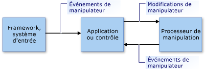

# Vue d'ensemble des manipulations et de l'inertie
Les *manipulations* permettent aux utilisateurs de déplacer, de faire pivoter et de redimensionner des éléments de l’interface utilisateur à l’aide de *manipulateurs*. Un manipulateur représente une souris ou, dans le cas d'un écran tactile, un stylet ou un doigt.  
  
 L’*inertie* émule un comportement réel pour les éléments d’interface utilisateur qui sont en mouvement en simulant des forces de friction sur les éléments. Cela permet aux éléments de ralentir progressivement leurs déplacements (linéaires et angulaires) avant de s'arrêter. Cet article fournit une introduction aux manipulations et à l'inertie pour le .NET Framework.  
  
## Manipulations  
 Une manipulation traite une collection de manipulateurs en tant qu'objet composite. Une application peut suivre les modifications apportées à l'objet composite au lieu des composants individuels.  
  
 Examinez l'image de l'illustration suivante. Un utilisateur peut utiliser deux manipulateurs pour déplacer, faire pivoter et mettre à l'échelle l'image. Les modifications apportées à chaque manipulateur sont interprétées avec les autres manipulateurs.  
  
 Par exemple, si vous avez deux manipulateurs (1 et 2) sur l'image et que vous déplacez le manipulateur 1 dans une direction +Y (vers le bas), l'image sera modifiée en fonction de ce qui arrive au manipulateur 2. Si le manipulateur 2 se déplace également dans la direction +Y (vers le bas), l'image se déplacera simplement dans cette direction. Mais si le manipulateur 2 ne change pas ou qu'il se déplace dans une direction -Y (vers le haut), l'image sera rétrécie ou pivotée.  
  
   
  
 Image manipulée par deux manipulateurs  
  
 La manipulation fournit un framework qui surveille une partie des manipulateurs et les interprète comme s'ils agissaient ensemble, et non indépendamment. Vous pouvez créer plusieurs objets de processeur de manipulation simultanément (un pour chaque élément de l'interface utilisateur devant être manipulé dans une application). Un processeur de manipulation reçoit des informations lui indiquant les périphériques d’entrée à observer et signale les manipulations via des [événements .NET](http://msdn.microsoft.com/library/17sde2xt.aspx).  
  
 Un processeur de manipulation ne reçoit aucune information sur l'élément particulier qui est manipulé. Une application applique séparément les modifications apportées à un élément spécifique de l'application. Par exemple, une application applique des transformations effectuées sur une image ou la redessine pour l'afficher à son nouvel emplacement ou dans sa nouvelle taille ou orientation.  
  
 Les manipulations sont conçues pour des [transformations affines](http://msdn.microsoft.com/library/ms533810\(VS.85\).aspx) en deux dimensions (2D). Ces transformations incluent des translations, des rotations et des mises à l'échelle.  
  
### Parties d'une manipulation  
 Une manipulation est une collection d'objets <xref:System.Windows.Input.Manipulations.Manipulator2D>. Cette manipulation d'agrégation est représentée par un point d'origine et une ellipse. Le point d'origine est la position moyenne de tous les manipulateurs qui manipulent un élément. L'ellipse a un rayon qui est la distance moyenne entre l'origine et chacun des objets <xref:System.Windows.Input.Manipulations.Manipulator2D>.  
  
   
  
 Une manipulation est déterminée par deux manipulateurs (1 et 2), une origine et une ellipse.  
  
 À mesure que des manipulateurs sont ajoutés, déplacés ou supprimés pour un élément d'interface utilisateur, une application met à jour l'objet <xref:System.Windows.Input.Manipulations.ManipulationProcessor2D> en appelant la méthode <xref:System.Windows.Input.Manipulations.ManipulationProcessor2D.ProcessManipulators%2A>. Au début d'une manipulation, l'événement <xref:System.Windows.Input.Manipulations.ManipulationProcessor2D.Started> est déclenché.  
  
> [!NOTE]
>  Le traitement des manipulations est plus efficace quand il est utilisé dans un environnement de mise à jour basé sur des trames. Cela ne pose aucun problème quand le traitement des manipulations est utilisé dans une application Microsoft XNA, étant donné que le framework XNA fournit des mises à jour basées sur des trames à l’aide de la méthode [Game.Update](http://msdn.microsoft.com/library/microsoft.xna.framework.game.update.aspx). Dans un autre environnement (tel que WinForms), vous devrez éventuellement fournir votre propre logique basée sur des trames pour collecter des manipulations et les envoyer périodiquement à la méthode <xref:System.Windows.Input.Manipulations.ManipulationProcessor2D.ProcessManipulators%2A> sous forme de lot.  
  
 À mesure que le nombre de manipulateurs ou leur position change, l'événement <xref:System.Windows.Input.Manipulations.ManipulationProcessor2D.Delta> est déclenché. Les propriétés de l'objet <xref:System.Windows.Input.Manipulations.Manipulation2DDeltaEventArgs> qui est passé au gestionnaire d'événements <xref:System.Windows.Input.Manipulations.ManipulationProcessor2D.Delta> spécifient les modifications de l'origine, de l'échelle, de la rotation et de la translation qui ont eu lieu depuis le dernier événement. L'origine de la manipulation change quand les manipulateurs se déplacent et qu'ils sont ajoutés ou supprimés. Les valeurs de translation spécifient la magnitude du déplacement X ou Y inclus dans la manipulation.  
  
 Une application utilise les nouvelles valeurs pour redessiner l'élément d'interface utilisateur.  
  
   
  
 Le manipulateur 1 se déplace et entraîne une modification de l'origine.  
  
 Quand le dernier manipulateur associé à la manipulation est supprimé de l'objet <xref:System.Windows.Input.Manipulations.ManipulationProcessor2D>, l'événement <xref:System.Windows.Input.Manipulations.ManipulationProcessor2D.Completed> est déclenché.  
  
### Modèle de traitement des manipulations  
 Un processeur de manipulation utilise un modèle d'utilisation directe. Dans ce modèle simple, une application doit passer tous les détails de l'événement d'entrée au processeur de manipulation. Un événement d'entrée peut être déclenché par n'importe quelle primitive d'entrée (telle qu'une souris, un stylet ou un doigt). Comme ce processus fournit un mécanisme de filtrage direct et un modèle d'utilisation simple, l'application peut traiter les événements d'entrée par lots, si nécessaire.  
  
 Pour inclure une primitive d'entrée dans le processus de manipulation, une application crée une structure <xref:System.Windows.Input.Manipulations.Manipulator2D> à partir des détails de la primitive d'entrée et la passe au processeur de manipulation à l'aide de la méthode <xref:System.Windows.Input.Manipulations.ManipulationProcessor2D.ProcessManipulators%2A>. Le processeur de manipulation déclenche ensuite des événements que l'application doit gérer pour mettre correctement à jour le composant visuel.  
  
   
  
 Modèle de traitement des manipulations  
  
## Inertie  
 Le processeur d'inertie permet aux applications d'extrapoler l'emplacement, l'orientation et d'autres propriétés d'un élément d'interface utilisateur en simulant un comportement réel.  
  
 Par exemple, quand un utilisateur agit sur un élément, ce dernier peut continuer à se déplacer, à ralentir, puis à s'arrêter lentement. Le processeur d'inertie implémente ce comportement en entraînant une modification des valeurs 2D affines (origine, échelle, translation et rotation) à un moment et une vitesse de décélération spécifiques.  
  
 Comme dans la manipulation, un processeur d'inertie ne dispose d'aucune information sur les éléments d'interface utilisateur. En réponse aux événements déclenchés sur un objet <xref:System.Windows.Input.Manipulations.InertiaProcessor2D>, une application applique séparément les modifications apportées à un élément spécifique à l'application.  
  
 L'inertie et la manipulation sont souvent traitées conjointement. Leurs interfaces sont semblables, de même que les événements qu'elles déclenchent (dans certains cas). En général, le traitement de l'inertie commence lorsque la manipulation de l'élément d'interface utilisateur est terminée. Pour ce faire, l'événement <xref:System.Windows.Input.Manipulations.ManipulationProcessor2D.Completed> est écouté et le traitement de l'inertie démarre à partir de ce gestionnaire d'événements.  
  
## Voir aussi  
 <xref:System.Windows.Input.Manipulations>
