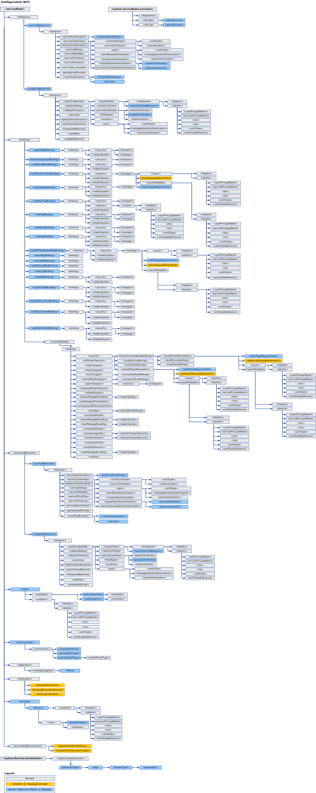

# Schéma de configuration WCFWCF Configuration Schema
Les éléments de configuration de [!INCLUDE[indigo1](../../../../../includes/indigo1-md.md)] permettent de configurer le service [!INCLUDE[indigo2](../../../../../includes/indigo2-md.md)] et les applications clientes.[!INCLUDE[indigo1](../../../../../includes/indigo1-md.md)] configuration elements enable you to configure [!INCLUDE[indigo2](../../../../../includes/indigo2-md.md)] service and client applications. Vous pouvez utiliser l’[outil Éditeur de configuration (SvcConfigEditor.exe)](../../../../../docs/framework/wcf/configuration-editor-tool-svcconfigeditor-exe.md) pour créer et modifier des fichiers de configuration pour les clients et les services.You can use the [Configuration Editor Tool (SvcConfigEditor.exe)](../../../../../docs/framework/wcf/configuration-editor-tool-svcconfigeditor-exe.md) to create and modify configuration files for clients and services. Les fichiers de configuration étant au format XML, il est nécessaire de maîtriser ce format pour pouvoir modifier ces fichiers à l'aide d'un éditeur de texte,Since the configuration files are formatted as XML, you must be familiar with XML if you want to manually edit them using a text editor. sans quoi vous risquez de rencontrer des problèmes tels qu'une balise ou un attribut d'élément XML manquant.Otherwise, you may run into issues such as an unfound XML element tag or attribute. Ce problème a lieu car les balises et les attributs d'éléments XML respectent la casse.This is because XML element tags and attributes are case-sensitive.  
  
 Le système de configuration [!INCLUDE[indigo2](../../../../../includes/indigo2-md.md)] est basé sur l'espace de noms <xref:System.Configuration>.The [!INCLUDE[indigo2](../../../../../includes/indigo2-md.md)] configuration system is based on the <xref:System.Configuration> namespace. Par conséquent, vous pouvez utiliser tous les dispositifs standard fournis par l'espace de noms <xref:System.Configuration>, tel que le verrouillage, le chiffrement et la fusion de la configuration, afin de renforcer la sécurité de votre application et sa configuration.Therefore, you can use all the standard features provided by the <xref:System.Configuration> namespace, such as configuration locking, encryption and merging to increase the security of your application and its configuration. Pour plus d'informations sur ces concepts, consultez les rubriques suivantes :For more information on these concepts, see the following topics.  
  
 [Chiffrement des informations de configurationEncrypting Configuration Information](http://go.microsoft.com/fwlink/?LinkId=95337)  
  
 [Verrouillage des paramètres de configurationLocking Configuration Settings](http://go.microsoft.com/fwlink/?LinkId=95338)  
  
 Cette section décrit toutes les valeurs possibles de chaque élément de configuration et leur interaction avec d'autres éléments de configuration WCF.This section describes all possible values of each configuration item, and how it interacts with other WCF configuration elements. Le plan suivant illustre le schéma de configuration WCF.The following map illustrates the WCF configuration schema.  
  
   
  
> [!CAUTION]
>  Vous devez protéger des sections de configuration de [!INCLUDE[indigo2](../../../../../includes/indigo2-md.md)] dans vos fichiers de configuration d'application (app.config) en utilisant les listes ACL appropriées, afin d'empêcher toute menace potentielle sur la sécurité.You should protect [!INCLUDE[indigo2](../../../../../includes/indigo2-md.md)] configuration sections in your application configuration files (app.config) with appropriate Access Control Lists (ACL) to prevent any potential security threats.  Par exemple, vous devez vous assurer que seules les personnes appropriées peuvent accéder ou modifier les paramètres de sécurité relatifs aux liaisons d’application ou la section relative au modèle de service figurant dans le fichier de configuration d’un service.For example, you should make sure that only the appropriate people can access or modify the security settings on application bindings, or the service model section of the configuration file for a service.  
  
## Dans cette sectionIn This Section  
 [\<system.serviceModel>\<system.serviceModel>](../../../../../docs/framework/configure-apps/file-schema/wcf/system-servicemodel.md)  
 Décrit l'élément `ServiceModel`.Describes the `ServiceModel` element.  
  
 [\<system.serviceModel.activation>\<system.serviceModel.activation>](../../../../../docs/framework/configure-apps/file-schema/wcf/system-servicemodel-activation.md)  
 Configure l'outil SMSvcHost.exe.Configures the SMSvcHost.exe tool.  
  
 [\<system.runtime.serialization>\<system.runtime.serialization>](../../../../../docs/framework/configure-apps/file-schema/wcf/system-runtime-serialization.md)  
 Élément de niveau supérieur permettant de définir les options lors de l'utilisation de sérialiseurs tels que le <xref:System.Runtime.Serialization.DataContractSerializer>.The top-level element for setting options when using serializers such as the <xref:System.Runtime.Serialization.DataContractSerializer>.  
  
## Rubriques connexesRelated Sections  
 [Configuration des applications Windows Communication FoundationConfiguring Windows Communication Foundation Applications](http://msdn.microsoft.com/en-us/13cb368e-88d4-4c61-8eed-2af0361c6d7a)  
 Explique comment configurer des services et des clients [!INCLUDE[indigo2](../../../../../includes/indigo2-md.md)].Describes how to configure [!INCLUDE[indigo2](../../../../../includes/indigo2-md.md)] services and clients.
