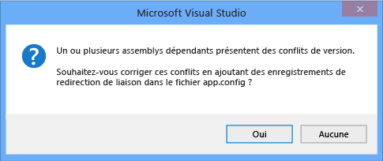

# <a name="how-to-enable-and-disable-automatic-binding-redirection"></a><span data-ttu-id="37549-102">Comment : activer et désactiver la redirection de liaison automatique</span><span class="sxs-lookup"><span data-stu-id="37549-102">How to: Enable and Disable Automatic Binding Redirection</span></span>
<span data-ttu-id="37549-103">Depuis [!INCLUDE[vs_dev12](../../../includes/vs-dev12-md.md)], lorsque vous compilez des applications qui ciblent [!INCLUDE[net_v451](../../../includes/net-v451-md.md)], des redirections de liaison peuvent être ajoutées automatiquement au fichier de configuration d'application pour remplacer l'unification d'assemblys.</span><span class="sxs-lookup"><span data-stu-id="37549-103">Starting with [!INCLUDE[vs_dev12](../../../includes/vs-dev12-md.md)], when you compile apps that target the [!INCLUDE[net_v451](../../../includes/net-v451-md.md)], binding redirects may be automatically added to the app configuration file to override assembly unification.</span></span> <span data-ttu-id="37549-104">Les redirections de liaison sont ajoutées si votre application ou ses composants font référence à plusieurs versions du même assembly, même si vous spécifiez manuellement des redirections de liaison dans le fichier de configuration de votre application.</span><span class="sxs-lookup"><span data-stu-id="37549-104">Binding redirects are added if your app or its components reference more than one version of the same assembly, even if you manually specify binding redirects in the configuration file for your app.</span></span> <span data-ttu-id="37549-105">La fonctionnalité de redirection de liaison automatique affecte les applications de bureau et les applications web traditionnelles qui ciblent [!INCLUDE[net_v451](../../../includes/net-v451-md.md)], bien que le comportement soit légèrement différent pour une application web.</span><span class="sxs-lookup"><span data-stu-id="37549-105">The automatic binding redirection feature affects traditional desktop apps and web apps that target the [!INCLUDE[net_v451](../../../includes/net-v451-md.md)], although the behavior is slightly different for a web app.</span></span> <span data-ttu-id="37549-106">Vous pouvez activer une redirection de liaison automatique si vos applications existantes ciblent des versions antérieures du .NET Framework, ou vous pouvez désactiver cette fonctionnalité si vous souhaitez conserver les redirections de liaison créées manuellement.</span><span class="sxs-lookup"><span data-stu-id="37549-106">You can enable automatic binding redirection if you have existing apps that target previous versions of the .NET Framework, or you can disable this feature if you want to keep manually authored binding redirects.</span></span>  
  
## <a name="disabling-automatic-binding-redirects-in-desktop-apps"></a><span data-ttu-id="37549-107">Désactivation des redirections de liaison automatiques dans les applications de bureau</span><span class="sxs-lookup"><span data-stu-id="37549-107">Disabling automatic binding redirects in desktop apps</span></span>  
 <span data-ttu-id="37549-108">Les redirections de liaison automatiques sont activées par défaut pour les applications de bureau traditionnelles qui ciblent [!INCLUDE[net_v451](../../../includes/net-v451-md.md)] et versions ultérieures.</span><span class="sxs-lookup"><span data-stu-id="37549-108">Automatic binding redirects are enabled by default for traditional desktop apps that target the [!INCLUDE[net_v451](../../../includes/net-v451-md.md)] and later versions.</span></span> <span data-ttu-id="37549-109">Les redirections de liaison sont ajoutées au fichier de configuration de sortie (app.config) lorsque l'application est compilée et remplace l'unification d'assemblys qui pourrait se produire, dans le cas contraire.</span><span class="sxs-lookup"><span data-stu-id="37549-109">The binding redirects are added to the output configuration (app.config) file when the app is compiled and overrides the assembly unification that might otherwise take place.</span></span> <span data-ttu-id="37549-110">Le fichier source app.config n'est pas modifié.</span><span class="sxs-lookup"><span data-stu-id="37549-110">The source app.config file is not modified.</span></span> <span data-ttu-id="37549-111">Vous pouvez désactiver cette fonctionnalité en modifiant le fichier projet pour l'application.</span><span class="sxs-lookup"><span data-stu-id="37549-111">You can disable this feature by modifying the project file for the app.</span></span>  
  
#### <a name="to-disable-automatic-binding-redirects"></a><span data-ttu-id="37549-112">Pour désactiver les redirections de liaison automatiques</span><span class="sxs-lookup"><span data-stu-id="37549-112">To disable automatic binding redirects</span></span>  
  
1.  <span data-ttu-id="37549-113">Dans Visual Studio, sélectionnez le projet dans **l’Explorateur de solutions**, puis choisissez **ouvrir le dossier dans l’Explorateur de fichiers** dans le menu contextuel.</span><span class="sxs-lookup"><span data-stu-id="37549-113">In Visual Studio, select the project in **Solution Explorer**, and then choose **Open Folder in File Explorer** from the shortcut menu.</span></span>  
  
2.  <span data-ttu-id="37549-114">Dans l'Explorateur de fichiers, recherchez le fichier projet (.csproj ou .vbproj) et ouvrez-le dans le Bloc-notes.</span><span class="sxs-lookup"><span data-stu-id="37549-114">In File Explorer, find the project (.csproj or .vbproj) file, and open it in Notepad.</span></span>  
  
3.  <span data-ttu-id="37549-115">Dans le fichier projet, recherchez l'entrée de propriété suivante :</span><span class="sxs-lookup"><span data-stu-id="37549-115">In the project file, find the following property entry:</span></span>  
  
     `<AutoGenerateBindingRedirects>true</AutoGenerateBindingRedirects>`  
  
4.  <span data-ttu-id="37549-116">Remplacez `true` par `false` :</span><span class="sxs-lookup"><span data-stu-id="37549-116">Change `true` to `false`:</span></span>  
  
     `<AutoGenerateBindingRedirects>false</AutoGenerateBindingRedirects>`  
  
## <a name="enabling-automatic-binding-redirects-manually"></a><span data-ttu-id="37549-117">Activation manuelle des redirections de liaison automatiques</span><span class="sxs-lookup"><span data-stu-id="37549-117">Enabling automatic binding redirects manually</span></span>  
 <span data-ttu-id="37549-118">Vous pouvez activer les redirections de liaison automatiques dans les applications existantes qui ciblent des versions plus anciennes de .NET Framework ou quand vous n'êtes pas automatiquement invité à ajouter une redirection.</span><span class="sxs-lookup"><span data-stu-id="37549-118">You can enable automatic binding redirects in existing apps that target older versions of the .NET Framework, or in cases where you are not automatically prompted to add a redirect.</span></span> <span data-ttu-id="37549-119">Si vous ciblez une version plus récente du framework mais que vous n'êtes pas automatiquement invité à ajouter une redirection, une sortie de génération vous suggérera probablement de remapper les assemblys.</span><span class="sxs-lookup"><span data-stu-id="37549-119">If you are targeting a newer version of the framework but do not get automatically prompted to add a redirect, you will likely get   build output that suggests you remap assemblies.</span></span>  
  
#### <a name="to-manually-add-an-automatic-binding-redirect-property"></a><span data-ttu-id="37549-120">Pour ajouter manuellement une propriété de redirection de liaison automatique</span><span class="sxs-lookup"><span data-stu-id="37549-120">To manually add an automatic binding redirect property</span></span>  
  
1.  <span data-ttu-id="37549-121">Dans Visual Studio, sélectionnez le projet dans **l’Explorateur de solutions**, puis choisissez **ouvrir le dossier dans l’Explorateur de fichiers** dans le menu contextuel.</span><span class="sxs-lookup"><span data-stu-id="37549-121">In Visual Studio, select the project in **Solution Explorer**, and then choose **Open Folder in File Explorer** from the shortcut menu.</span></span>  
  
2.  <span data-ttu-id="37549-122">Dans l'Explorateur de fichiers, recherchez le fichier projet (.csproj ou .vbproj) et ouvrez-le dans le Bloc-notes.</span><span class="sxs-lookup"><span data-stu-id="37549-122">In File Explorer, find the project (.csproj or .vbproj) file, and open it in Notepad.</span></span>  
  
3.  <span data-ttu-id="37549-123">Ajoutez l’élément suivant au premier groupe de propriétés de configuration (sous la \<PropertyGroup > balise) :</span><span class="sxs-lookup"><span data-stu-id="37549-123">Add the following element to the first configuration property group (under the \<PropertyGroup> tag):</span></span>  
  
     `<AutoGenerateBindingRedirects>true</AutoGenerateBindingRedirects>`  
  
     <span data-ttu-id="37549-124">Le code suivant illustre un fichier de projet comportant l'élément.</span><span class="sxs-lookup"><span data-stu-id="37549-124">The following shows an example project file with the element inserted.</span></span>  
  
    ```xml  
    <?xml version="1.0" encoding="utf-8"?>  
    <Project ToolsVersion="12.0" DefaultTargets="Build" xmlns="http://schemas.microsoft.com/developer/msbuild/2003">  
      <Import Project="$(MSBuildExtensionsPath)\$(MSBuildToolsVersion)\Microsoft.Common.props" Condition="Exists('$(MSBuildExtensionsPath)\$(MSBuildToolsVersion)\Microsoft.Common.props')" />  
      <PropertyGroup>  
        <Configuration Condition=" '$(Configuration)' == ''     ">Debug</Configuration>  
        <Platform Condition=" '$(Platform)' == '' ">AnyCPU</Platform>  
        <ProjectGuid>{123334}</ProjectGuid>  
        ...  
        <AutoGenerateBindingRedirects>true</AutoGenerateBindingRedirects>  
      </PropertyGroup>  
    ...  
    </Project>  
    ```  
  
4.  <span data-ttu-id="37549-125">Compilez votre application.</span><span class="sxs-lookup"><span data-stu-id="37549-125">Compile your app.</span></span>  
  
## <a name="enabling-automatic-binding-redirects-in-web-apps"></a><span data-ttu-id="37549-126">Activation des redirections de liaison automatiques dans les applications web</span><span class="sxs-lookup"><span data-stu-id="37549-126">Enabling automatic binding redirects in web apps</span></span>  
 <span data-ttu-id="37549-127">Les redirections de liaison automatiques sont implémentées différemment pour les applications web.</span><span class="sxs-lookup"><span data-stu-id="37549-127">Automatic binding redirects are implemented differently for web apps.</span></span> <span data-ttu-id="37549-128">Comme le fichier de configuration source (web.config) doit être modifié pour les applications web, les redirections de liaison ne sont pas automatiquement ajoutées au fichier de configuration.</span><span class="sxs-lookup"><span data-stu-id="37549-128">Because the source configuration (web.config) file must be modified for web apps, binding redirects are not automatically added to the configuration file.</span></span> <span data-ttu-id="37549-129">Toutefois, Visual Studio vous informe des éventuels conflits de liaison et vous pouvez ajouter des redirections de liaison pour résoudre ces conflits.</span><span class="sxs-lookup"><span data-stu-id="37549-129">However, Visual Studio notifies you of binding conflicts, and you can add binding redirects to resolve the conflicts.</span></span> <span data-ttu-id="37549-130">Comme vous êtes toujours invité à approuver ou non l'ajout des redirections de liaison, vous n'avez pas besoin de désactiver explicitement cette fonctionnalité pour une application web.</span><span class="sxs-lookup"><span data-stu-id="37549-130">Because you are always prompted to add binding redirects, you do not need to explicitly disable this feature for a web app.</span></span>  
  
#### <a name="to-add-binding-redirects-to-a-webconfig-file"></a><span data-ttu-id="37549-131">Pour ajouter des redirections de liaison vers un fichier web.config</span><span class="sxs-lookup"><span data-stu-id="37549-131">To add binding redirects to a web.config file</span></span>  
  
1.  <span data-ttu-id="37549-132">Dans Visual Studio, compilez l'application et vérifiez les avertissements sur la génération.</span><span class="sxs-lookup"><span data-stu-id="37549-132">In Visual Studio, compile the app, and check for build warnings.</span></span>  
  
     <span data-ttu-id="37549-133"></span><span class="sxs-lookup"><span data-stu-id="37549-133"></span></span>  
  
2.  <span data-ttu-id="37549-134">En cas de conflit de liaison d’assembly, un avertissement s’affiche.</span><span class="sxs-lookup"><span data-stu-id="37549-134">If there are assembly binding conflicts, a warning appears.</span></span> <span data-ttu-id="37549-135">Double-cliquez sur l'avertissement.</span><span class="sxs-lookup"><span data-stu-id="37549-135">Double-click the warning.</span></span> <span data-ttu-id="37549-136">(Clavier : sélectionnez l’avertissement et appuyez sur **entrée**.)</span><span class="sxs-lookup"><span data-stu-id="37549-136">(Keyboard: Select the warning and press **Enter**.)</span></span>  
  
     <span data-ttu-id="37549-137">Une boîte de dialogue apparaît qui vous permet d’ajouter automatiquement les redirections de liaison nécessaires vers le fichier web.config source.</span><span class="sxs-lookup"><span data-stu-id="37549-137">A dialog box that enables you to automatically add the necessary binding redirects to the source web.config file appears.</span></span>  
  
     <span data-ttu-id="37549-138"></span><span class="sxs-lookup"><span data-stu-id="37549-138"></span></span>  
  
## <a name="see-also"></a><span data-ttu-id="37549-139">Voir aussi</span><span class="sxs-lookup"><span data-stu-id="37549-139">See Also</span></span>  
 [<span data-ttu-id="37549-140">\<bindingRedirect > élément</span><span class="sxs-lookup"><span data-stu-id="37549-140">\<bindingRedirect> Element</span></span>](../../../docs/framework/configure-apps/file-schema/runtime/bindingredirect-element.md)  
 [<span data-ttu-id="37549-141">Redirection des versions d'assemblys</span><span class="sxs-lookup"><span data-stu-id="37549-141">Redirecting Assembly Versions</span></span>](../../../docs/framework/configure-apps/redirect-assembly-versions.md)
