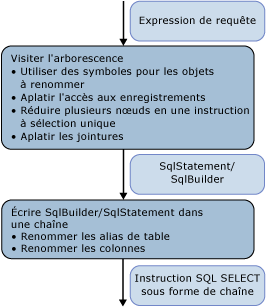

# <a name="architecture-and-design"></a>Architecture et conception
Le module de génération SQL dans le [fournisseur d’exemples](http://go.microsoft.com/fwlink/?LinkId=180616) est implémenté en tant que visiteur de l’arborescence d’expression qui représente l’arborescence de commandes. La génération est effectuée par un unique passage sur l’arborescence de l’expression.  
  
 Les nœuds de l'arborescence sont traités de bas en haut. En premier lieu, une structure intermédiaire est produite : SqlSelectStatement ou SqlBuilder, tous deux implémentant ISqlFragment. Ensuite, l'instruction SQL de chaîne est issue de cette structure. Il y a deux raisons pour la structure intermédiaire :  
  
-   Logiquement, une instruction SQL SELECT est remplie de manière désordonnée. Les nœuds qui participent à la clause FROM sont visités avant les nœuds qui participent aux clauses WHERE, GROUP BY et ORDER BY.  
  
-   Pour renommer des alias, vous devez identifier tous les alias utilisés afin d'éviter des conflits pendant le changement de nom. Pour différer les choix de changement de nom dans SqlBuilder, utilisez des objets Symbol afin de représenter les colonnes candidates pour le changement de nom.  
  
   
  
 Dans la première phase, lors de la visite de l’arborescence de l’expression, les expressions sont groupées dans SqlSelectStatements, les jointures sont aplanies de même que les alias de jointure. Pendant ce passage, les objets Symbol représentent des colonnes ou des alias d'entrée qui peuvent être renommés.  
  
 Dans la deuxième phase, lors de la production de la chaîne réelle, les alias sont renommés.  
  
## <a name="data-structures"></a>Structures de données  
 Cette section décrit les types utilisés dans les [fournisseur d’exemples](http://go.microsoft.com/fwlink/?LinkId=180616) que vous utilisez pour créer une instruction SQL.  
  
### <a name="isqlfragment"></a>ISqlFragment  
 Cette section décrit les classes qui implémentent l'interface ISqlFragment, avec deux objectifs :  
  
-   Type de retour commun à toutes les méthodes de visiteur.  
  
-   Donne une méthode pour écrire la dernière chaîne SQL.  
  
```  
internal interface ISqlFragment {  
   void WriteSql(SqlWriter writer, SqlGenerator sqlGenerator);  
}  
```  
  
#### <a name="sqlbuilder"></a>SqlBuilder  
 SqlBuilder est un périphérique de regroupement pour la dernière chaîne SQL, semblable à StringBuilder. Il est constitué des chaînes qui composent le dernier SQL, avec des ISqlFragments qui peuvent être convertis en chaînes.  
  
```  
internal sealed class SqlBuilder : ISqlFragment {  
   public void Append(object s)  
   public void AppendLine()  
   public bool IsEmpty  
}  
```  
  
#### <a name="sqlselectstatement"></a>SqlSelectStatement  
 SqlSelectStatement représente une instruction SQL SELECT canonique de la forme « SELECT... DE.. WHERE... REGROUPER PAR... ORDER BY ».  
  
 Chacune des clauses SQL est représentée par un StringBuilder. De plus, il vérifie si Distinct a été spécifié et si l'instruction est au premier plan. Si l'instruction n'est pas au premier plan, la clause ORDER BY est omise à moins que l'instruction ait également une clause TOP.  
  
 FromExtents contient la liste des entrées de l'instruction SELECT. Habituellement il contient un seul élément. Les instructions SELECT pour les jointures peuvent temporairement avoir plusieurs éléments.  
  
 Si l'instruction SELECT est créée par un nœud de jointure, SqlSelectStatement maintient une liste de toutes les étendues aplanies dans la jointure dans AllJoinExtents. OuterExtents représente des références externes du SqlSelectStatement et est utilisé pour le changement de nom de l'alias de l'entrée.  
  
```  
internal sealed class SqlSelectStatement : ISqlFragment {  
   internal bool IsDistinct { get, set };  
   internal bool IsTopMost  
  
   internal List<Symbol> AllJoinExtents { get, set };  
   internal List<Symbol> FromExtents { get};  
   internal Dictionary<Symbol, bool> OuterExtents { get};  
  
   internal TopClause Top { get, set };  
  
   internal SqlBuilder Select {get};  
   internal SqlBuilder From  
   internal SqlBuilder Where  
   internal SqlBuilder GroupBy  
   public SqlBuilder OrderBy  
}  
```  
  
#### <a name="topclause"></a>TopClause  
 TopClause représente l'expression TOP dans un SqlSelectStatement. La propriété TopCount indique le nombre de lignes TOP qui doivent être sélectionnées.  Lorsque WithTies a la valeur true, le TopClause a été généré par un DbLimitExpession.  
  
```  
class TopClause : ISqlFragment {  
   internal bool WithTies {get}  
   internal ISqlFragment TopCount {get}  
   internal TopClause(ISqlFragment topCount, bool withTies)  
   internal TopClause(int topCount, bool withTies)  
}  
```  
  
### <a name="symbols"></a>Symboles  
 Les classes associées au symbole et la table de symboles effectuent le changement de nom de l'alias de l'entrée, l'aplanissement de l'alias de jointure et le changement de nom de l'alias de colonne.  
  
 La classe Symbol représente une étendue, une instruction SELECT imbriquée ou une colonne. Elle est utilisée à la place d'un alias réel pour autoriser le changement de nom après son utilisation et elle fournit également des informations supplémentaires pour l'artefact qu'elle représente (par exemple, le type).  
  
```  
class Symbol : ISqlFragment {  
   internal Dictionary<string, Symbol> Columns {get}  
   internal bool NeedsRenaming {get, set}  
   internal bool IsUnnest {get, set}   //not used  
  
   public string Name{get}  
   public string NewName {get,set}  
   internal TypeUsage Type {get, set}  
  
   public Symbol(string name, TypeUsage type)  
}  
```  
  
 Name stocke l'alias d'origine de l'étendue représentée, de l'instruction SELECT imbriquée ou d'une colonne.  
  
 NewName stocke l'alias qui sera utilisé dans l'instruction SQL SELECT. Il est initialement défini sur Name et renommé uniquement si nécessaire lors de la génération de la dernière requête de chaîne.  
  
 Type est utile uniquement pour les symboles qui représentent des étendues et des instructions SELECT imbriquées.  
  
#### <a name="symbolpair"></a>SymbolPair  
 La classe SymbolPair résout un aplanissement d'enregistrement.  
  
 Considérez une expression de propriété D(v, "j3.j2.j1.a.x") où v est un VarRef, j1, j2, j3 sont des jointures, a est une étendue et x est une colonne.  
  
 Cela doit être traduit éventuellement en {j'}.{x'}. Le champ source représente le SqlStatement le plus à l'extérieur, qui représente une expression de jointure (soit j2), c'est toujours un symbole de jointure. Le champ de colonne se déplace d'un symbole de jointure à un autre jusqu'à ce qu'il s'arrête à un symbole de non-jointure. Cela est retourné lors de la visite d'un DbPropertyExpression mais n'est jamais ajouté à un SqlBuilder.  
  
```  
class SymbolPair : ISqlFragment {  
   public Symbol Source;  
   public Symbol Column;  
   public SymbolPair(Symbol source, Symbol column)  
}  
```  
  
#### <a name="joinsymbol"></a>JoinSymbol  
 Un symbole de jointure est un symbole qui représente une instruction SELECT imbriquée avec une jointure ou une entrée de jointure.  
  
```  
internal sealed class JoinSymbol : Symbol {  
   internal List<Symbol> ColumnList {get, set}  
   internal List<Symbol> ExtentList {get}  
   internal List<Symbol> FlattenedExtentList {get, set}  
   internal Dictionary<string, Symbol> NameToExtent {get}  
   internal bool IsNestedJoin {get, set}  
  
   public JoinSymbol(string name, TypeUsage type, List<Symbol> extents)  
}  
```  
  
 ColumnList représente la liste de colonnes dans la clause SELECT si ce symbole représente une instruction SQL SELECT. ExtentList est la liste des étendues dans la clause SELECT. Si la jointure a plusieurs étendues aplanies au niveau supérieur, FlattenedExtentList suit les étendues pour vérifier que les alias d'étendue sont renommés correctement.  
  
 NameToExtent possède toutes les étendues de ExtentList sous forme de dictionnaire. IsNestedJoin est utilisé pour déterminer si un JoinSymbol est un symbole de jointure ordinaire ou s'il possède un SqlSelectStatement correspondant.  
  
 Toutes les listes sont définies exactement une fois puis utilisées pour les recherches ou l'énumération.  
  
#### <a name="symboltable"></a>SymbolTable  
 SymbolTable est utilisé pour résoudre des noms de variable en symboles. SymbolTable est implémenté en tant que pile avec une nouvelle entrée pour chaque étendue. Les recherches s'effectuent du haut de la pile vers le bas jusqu'à ce qu'une entrée soit trouvée.  
  
```  
internal sealed class SymbolTable {  
   internal void EnterScope()  
   internal void ExitScope()  
   internal void Add(string name, Symbol value)  
   internal Symbol Lookup(string name)  
}  
```  
  
 Il y a seulement un SymbolTable par instance du module de génération SQL. Les étendues sont entrées et sorties pour chaque nœud relationnel. Tous les symboles des premières étendues sont visibles aux étendues ultérieures à moins d'être masqués par d'autres symboles avec le même nom.  
  
### <a name="global-state-for-the-visitor"></a>État général du visiteur  
 Pour aider au changement de nom des alias et des colonnes, maintenez une liste de tous les noms de colonne (AllColumnNames) et des alias d'étendue (AllExtentNames) utilisés dans le premier passage sur l'arborescence de requêtes.  La table de symboles résout des noms de variable en des symboles. IsVarRefSingle est utilisé uniquement à des fins de vérification, il n'est pas strictement nécessaire.  
  
 Les deux piles utilisées via CurrentSelectStatement et IsParentAJoin permettent de passer des « paramètres » des nœuds parents aux nœuds enfants, puisque le modèle visiteur ne nous permet pas de passer des paramètres.  
  
```  
internal Dictionary<string, int> AllExtentNames {get}  
internal Dictionary<string, int> AllColumnNames {get}  
SymbolTable symbolTable = new SymbolTable();  
bool isVarRefSingle = false;  
  
Stack<SqlSelectStatement> selectStatementStack;  
private SqlSelectStatement CurrentSelectStatement{get}  
  
Stack<bool> isParentAJoinStack;  
private bool IsParentAJoin{get}  
```  
  
## <a name="common-scenarios"></a>Scénarios courants  
 Cette section décrit des scénarios de fournisseur communs.  
  
### <a name="grouping-expression-nodes-into-sql-statements"></a>Regroupement de nœuds d'expression dans les Instructions SQL  
 Un SqlSelectStatement est créé lorsque le premier nœud relationnel est rencontré (en général une étendue DbScanExpression) lors de la visite de l'arborescence de bas en haut. Pour produire une instruction SQL SELECT avec le moins possible de requêtes imbriquées, regroupez le plus possible de ses nœuds parents dans ce SqlSelectStatement.  
  
 La décision qui permet de savoir si un nœud (relationnel) donné peut être ajouté au SqlSelectStatement actuel (celui qui est retourné lors de la visite de l'entrée) ou si une nouvelle instruction doit être démarrée, est prise par la méthode IsCompatible et dépend de ce qui se trouve déjà dans le SqlSelectStatement, ce qui dépend des nœuds situés sous le nœud donné.  
  
 En général, si les clauses d'instruction SQL sont évaluées après des clauses où les nœuds considérés pour la fusion ne sont pas vides, le nœud ne peut pas être ajouté à l'instruction actuelle. Par exemple, si le nœud suivant est un filtre, ce nœud peut être incorporé dans le SqlSelectStatement actuel seulement si ce qui suit a la valeur true :  
  
-   La liste SELECT est vide. Si la liste SELECT n'est pas vide, la liste de sélection a été produite par un nœud qui précède le filtre et le prédicat peut faire référence aux colonnes produites par cette liste SELECT.  
  
-   Le GROUPBY est vide. Si le GROUPBY n'est pas vide, l'ajout du filtre signifierait filtrer avant de grouper, ce qui n'est pas correct.  
  
-   La clause TOP est vide. Si la clause TOP n'est pas vide, l'ajout du filtre signifierait filtrer avant d'effectuer TOP, ce qui n'est pas correct.  
  
 Cela ne s'applique pas aux nœuds non relationnels comme DbConstantExpression ou des expressions arithmétiques, parce que ceux-ci sont toujours inclus dans le cadre d'un SqlSelectStatement existant.  
  
 De même, lorsque la racine de l'arborescence de jointure est rencontrée (un nœud de jointure qui n'a pas de parent de jointure), un nouveau SqlSelectStatement est démarré. Tous ses enfants de la jointure externe à gauche sont regroupés dans ce SqlSelectStatement.  
  
 Lorsqu'un nouveau SqlSelectStatement est démarré et que l'actuel est ajouté à l'entrée, le SqlSelectStatement actuel peut devoir être complété en ajoutant des colonnes de projection (clause SELECT) s'il n'y en a pas. Cela est effectué avec la méthode AddDefaultColumns qui regarde les FromExtents du SqlSelectStatement et ajoute à la liste des colonnes projetées toutes les colonnes que la liste d'étendues représentée par FromExtents apporte à l'étendue. Cela est effectué parce qu'à ce stade, on ne sait pas quelles colonnes sont référencées par les autres nœuds. Cela peut être optimisé pour projeter uniquement les colonnes qui peuvent être utilisées ultérieurement.  
  
### <a name="join-flattening"></a>Aplanissement de jointure  
 La propriété IsParentAJoin aide à déterminer si une jointure donnée peut être aplanie. En particulier, IsParentAJoin retourne uniquement la valeur `true` pour l'enfant gauche d'une jointure et pour chaque DbScanExpression qui est une entrée immédiate à une jointure, dans ce cas le nœud enfant réutilise le même SqlSelectStatement qui peut être utilisé ultérieurement par le parent. Pour plus d'informations, consultez « Expressions de jointure ».  
  
### <a name="input-alias-redirecting"></a>Redirection d'alias d'entrée  
 La redirection d'alias d'entrée est accomplie avec la table de symboles.  
  
 Pour expliquer la redirection d’alias d’entrée, consultez le premier exemple de [SQL de génération à partir d’arborescences de commandes - meilleures pratiques](../../../../../docs/framework/data/adonet/ef/generating-sql-from-command-trees-best-practices.md).  Dans cet exemple « a » doit être redirigé vers « b » dans la projection.  
  
 Lorsqu'un objet SqlSelectStatement est créé, l'étendue qui est l'entrée du nœud est mise dans la propriété FROM du SqlSelectStatement. Un symbole (<symbol_b>) est créé selon le nom de liaison d'entrée (« b ») pour représenter cette étendue et "AS  " + <symbol_b> est ajouté à la Clause From.  Le symbole est également ajouté à la propriété FromExtents.  
  
 Le symbole est également ajouté à la table de symboles pour lier le nom de liaison d'entrée au symbole (« b », <symbol_b>).  
  
 Si un nœud suivant réutilise ce SqlSelectStatement, il ajoute une entrée à la table de symboles pour lier son nom de liaison d’entrée à ce symbole. Dans notre exemple, le DbProjectExpression avec le nom de la liaison d’entrée de « a » réutiliserait le SqlSelectStatement et ajouterait (« a », \< symbol_b >) à la table.  
  
 Lorsque les expressions référencent le nom de liaison d’entrée du nœud qui réutilise le SqlSelectStatement, cette référence est résolue à l’aide de la table de symboles en symbole correct redirigé. Lorsque « a » de « a.x » est résolu lors de la visite de DbVariableReferenceExpression qui représente « a » il se résoudra en symbole < symbol_b>.  
  
### <a name="join-alias-flattening"></a>Aplanissement d'alias de jointure  
 L'aplanissement d'alias de jointure est accompli lors de la visite d'un DbPropertyExpression comme décrit dans la section intitulée DbPropertyExpression.  
  
### <a name="column-name-and-extent-alias-renaming"></a>Changement du nom de colonne et du nom d'alias d'étendue  
 Le problème du changement du nom de colonne et du nom d'alias d'étendue est résolu à l'aide de symboles qui sont uniquement remplacés par des alias dans la deuxième phase de la génération décrite dans la section intitulée Deuxième phase de la génération SQL : génération de la commande de chaîne.  
  
## <a name="first-phase-of-the-sql-generation-visiting-the-expression-tree"></a>Première phase de la génération SQL : visite de l'arborescence de l'expression  
 Cette section décrit la première phase de génération SQL, lorsque l'expression qui représente la requête est visitée et qu'une structure intermédiaire est produite, telle qu'un SqlSelectStatement ou un SqlBuilder.  
  
 Cette section décrit les principes de la visite de catégories de nœud d'expression différentes et les détails de la visite des types d'expression spécifiques.  
  
### <a name="relational-non-join-nodes"></a>Nœuds relationnels (non-jointure)  
 Les types d'expression suivants prennent en charge les nœuds de non-jointure :  
  
-   DbDistinctExpression  
  
-   DbFilterExpression  
  
-   DbGroupByExpression  
  
-   DbLimitExpession  
  
-   DbProjectExpression  
  
-   DbSkipExpression  
  
-   DbSortExpression  
  
 La visite de ces nœuds suit le modèle suivant :  
  
1.  Visitez l'entrée relationnelle et obtenez le SqlSelectStatement qui en résulte. L'entrée à un nœud relationnel peut être l'un des éléments suivants :  
  
    -   Un nœud relationnel, notamment une étendue (DbScanExpression, par exemple). La visite d'un tel nœud retourne un SqlSelectStatement.  
  
    -   Une expression d'opération Set (UNION ALL, par exemple). Le résultat doit être mis entre parenthèses et placé dans la clause FROM d'un nouveau SqlSelectStatement.  
  
2.  Vérifiez si le nœud actuel peut être ajouté au SqlSelectStatement produit par l'entrée. La section intitulée Regroupement d'expressions dans des instructions SQL décrit ceci. Dans le cas contraire,  
  
    -   Dépilez l'objet SqlSelectStatement actuel.  
  
    -   Créez un objet SqlSelectStatement et ajoutez le SqlSelectStatement dépilé en tant que FROM du nouvel objet SqlSelectStatement.  
  
    -   Mettez le nouvel objet sur la pile.  
  
3.  Redirigez la liaison de l'expression d'entrée vers le symbole correct de l'entrée. Ces informations sont maintenues dans l'objet SqlSelectStatement.  
  
4.  Ajoutez une nouvelle étendue SymbolTable.  
  
5.  Visitez la partie non-entrée de l'expression (par exemple, projection et prédicat).  
  
6.  Dépilez tous les objets ajoutés aux piles globales.  
  
 DbSkipExpression n'a pas d'équivalent direct dans SQL. Logiquement, il est traduit par :  
  
```  
SELECT Y.x1, Y.x2, ..., Y.xn  
FROM (  
   SELECT X.x1, X.x2, ..., X.xn, row_number() OVER (ORDER BY sk1, sk2, ...) AS [row_number]   
   FROM input as X   
   ) as Y  
WHERE Y.[row_number] > count   
ORDER BY sk1, sk2, ...  
```  
  
### <a name="join-expressions"></a>Expressions de jointure  
 Les éléments suivants sont considérés comme des expressions de jointure et sont traités de manière commune par la méthode VisitJoinExpression :  
  
-   DbApplyExpression  
  
-   DbJoinExpression  
  
-   DbCrossJoinExpression  
  
 Voici les étapes de la visite :  
  
 En premier lieu, avant de visiter les enfants, IsParentAJoin est appelé pour vérifier si le nœud de jointure est un enfant d'une jointure le long d'une colonne vertébrale gauche. S'il retourne la valeur false, un nouveau SqlSelectStatement est démarré. Dans ce sens, les jointures sont visitées de manière différente du reste des nœuds, puisque le parent (le nœud de jointure) crée le SqlSelectStatement pour que les enfants puissent l'utiliser.  
  
 Deuxièmement, traitez les entrées une par une. Pour chaque entrée :  
  
1.  Visitez l'entrée.  
  
2.  Post-traitez le résultat de la visite de l'entrée en appelant ProcessJoinInputResult qui doit maintenir la table de symboles après avoir visité un enfant d'une expression de jointure et peut terminer le SqlSelectStatement produit par l'enfant. Le résultat de l'enfant peut être l'un des éléments suivants :  
  
    -   Un SqlSelectStatement différent de celui auquel le parent est ajouté. Dans ce cas, il peut devoir être complété en ajoutant des colonnes par défaut. Si l'entrée est une jointure, vous devez créer un symbole de jointure. Dans le cas contraire, créez un symbole normal.  
  
    -   Une étendue (DbScanExpression, par exemple), auquel cas il est simplement ajouté à la liste d'entrées du SqlSelectStatement du parent.  
  
    -   Différent d'un SqlSelectStatement, auquel cas il est mis entre parenthèses.  
  
    -   Le même SqlSelectStatement auquel le parent est ajouté. Dans ce cas, les symboles de la liste FromExtents doivent être remplacés par un nouveau JoinSymbol unique qui les représente tous.  
  
    -   Dans les trois premiers cas, AddFromSymbol est appelé pour ajouter la clause AS et mettre à jour la table de symboles.  
  
 Troisièmement, la condition de jointure (s'il y en a une) est visitée.  
  
### <a name="set-operations"></a>Opérations ensemblistes  
 Les opérations Set DbUnionAllExpression, DbExceptExpression et DbIntersectExpression sont traitées par la méthode VisitSetOpExpression. Elle crée un SqlBuilder de la forme  
  
```xml  
<leftSqlSelectStatement> <setOp> <rightSqlSelectStatement>  
```  
  
 Où \<leftSqlSelectStatement > et \<rightSqlSelectStatement > sont des SqlSelectStatements obtenus en visitant chacune des entrées, et \<setOp > est l’opération correspondante (UNION ALL par exemple).  
  
### <a name="dbscanexpression"></a>DbScanExpression  
 S'il est visité dans un contexte de jointure (comme une entrée à une jointure qui est un enfant gauche d'une autre jointure), DbScanExpression retourne un SqlBuilder avec le SQL cible pour la cible correspondante, qui peut être une requête de définition, une table ou une vue. Dans le cas contraire, un nouveau SqlSelectStatement est créé avec le champ FROM défini pour correspondre à la cible correspondante.  
  
### <a name="dbvariablereferenceexpression"></a>DbVariableReferenceExpression  
 La visite d'un DbVariableReferenceExpression retourne le symbole qui correspond à cette expression de référence de variable selon une recherche dans la table de symboles.  
  
### <a name="dbpropertyexpression"></a>DbPropertyExpression  
 L'aplanissement d'alias de jointure est identifié et traité lors de la visite d'un DbPropertyExpression.  
  
 La propriété Instance est visitée en premier et le résultat est un symbole, un JoinSymbol ou un SymbolPair. Voici comment ces trois cas sont gérés :  
  
-   Si un JoinSymbol est retourné, alors sa propriété NameToExtent contient un symbole pour la propriété nécessaire. Si le symbole de jointure représente une jointure imbriquée, une nouvelle paire de symboles est retournée avec le symbole de jointure pour suivre le symbole qui sera utilisé comme alias d'instance et le symbole qui représente la propriété réelle pour une résolution ultérieure.  
  
-   Si un SymbolPair est retourné et la partie de la colonne est un symbole de jointure, un symbole de jointure est encore retourné, mais dans ce cas la propriété de colonne est mise à jour pour pointer vers la propriété représentée par l'expression de propriété actuelle. Dans le cas contraire, un SqlBuilder est retourné avec le SymbolPair source en tant qu'alias et le symbole de la propriété actuelle en tant que colonne.  
  
-   Si un symbole est retourné, la méthode Visit retourne une méthode SqlBuilder avec cette instance en tant qu'alias et le nom de propriété en tant que nom de colonne.  
  
### <a name="dbnewinstanceexpression"></a>DbNewInstanceExpression  
 En cas d'utilisation comme propriété de projection de DbProjectExpression, DbNewInstanceExpression produit une liste séparée par des virgules des arguments afin de représenter les colonnes projetées.  
  
 Lorsque DbNewInstanceExpression possède un type de retour de collection et définit une nouvelle collection des expressions fournies en tant qu'arguments, les trois cas suivants sont gérés séparément :  
  
-   Si DbNewInstanceExpression possède DbElementExpression en tant que seul argument, il est traduit comme suit :  
  
    ```  
    NewInstance(Element(X)) =>  SELECT TOP 1 …FROM X  
    ```  
  
 Si DbNewInstanceExpression n'a pas d'argument (représente une table vide), DbNewInstanceExpression est traduit par :  
  
```  
SELECT CAST(NULL AS <primitiveType>) as X  
FROM (SELECT 1) AS Y WHERE 1=0  
```  
  
 Dans le cas contraire, DbNewInstanceExpression génère une échelle union-all des arguments :  
  
```  
SELECT <visit-result-arg1> as X  
UNION ALL SELECT <visit-result-arg2> as X  
UNION ALL …  
UNION ALL SELECT <visit-result-argN> as X  
```  
  
### <a name="dbfunctionexpression"></a>DbFunctionExpression  
 Les fonctions canoniques et intégrées sont traitées de la même façon : si elles nécessitent une gestion particulière (TRIM(string) à LTRIM(RTRIM(string), par exemple), le gestionnaire approprié est appelé. Dans le cas contraire, elles sont traduites en FunctionName(arg1, arg2, ..., argn).  
  
 Les dictionnaires sont utilisés pour effectuer le suivi des fonctions qui nécessitent une gestion particulière et de leurs gestionnaires appropriés.  
  
 Les fonctions définies par l'utilisateur sont traduites en NamespaceName.FunctionName(arg1, arg2, ..., argn).  
  
### <a name="dbelementexpression"></a>DbElementExpression  
 La méthode qui visite DbElementExpression est appelée uniquement pour visiter un DbElementExpression lorsqu'il est utilisé pour représenter une sous-requête scalaire. Par conséquent, DbElementExpression traduit par un SqlSelectStatement complet et le met entre parenthèses.  
  
### <a name="dbquantifierexpression"></a>DbQuantifierExpression  
 Selon le type de l'expression (Any ou All), DbQuantifierExpression est traduit par :  
  
```  
Any(input, x) => Exists(Filter(input,x))  
All(input, x) => Not Exists(Filter(input, not(x))  
```  
  
### <a name="dbnotexpression"></a>DbNotExpression  
 Dans certains cas, il est possible de réduire la traduction de DbNotExpression par son expression d'entrée. Par exemple :  
  
```  
Not(IsNull(a)) =>  "a IS NOT NULL"  
Not(All(input, x) => Not (Not Exists(Filter(input, not(x))) => Exists(Filter(input, not(x))  
```  
  
 La raison pour laquelle la deuxième réduction est effectuée est que des inefficacités ont été introduites par le fournisseur lors de la traduction de DbQuantifierExpression de type All. Donc l'Entity Framework n'a pas pu faire la simplification.  
  
### <a name="dbisemptyexpression"></a>DbIsEmptyExpression  
 DbIsEmptyExpression est traduit par :  
  
```  
IsEmpty(inut) = Not Exists(input)  
```  
  
## <a name="second-phase-of-sql-generation-generating-the-string-command"></a>Deuxième phase de la génération SQL : génération de la commande de chaîne  
 Lors de la génération d'une commande SQL de chaîne, le SqlSelectStatement produit des alias réels pour les symboles, ce qui résout le problème du changement de nom de colonne et d'alias de l'étendue.  
  
 Le changement de nom de l'alias de l'étendue se produit lors de l'écriture de l'objet SqlSelectStatement dans une chaîne. En premier lieu créez une liste de tous les alias utilisés par les étendues externes. Chaque symbole du FromExtents (ou AllJoinExtents si la valeur n'est pas null), est renommé s'il entre en conflit avec l'une des étendues externes. Si le changement de nom est exigé, il n'entrera en conflit avec aucune des étendues collectées dans AllExtentNames.  
  
 Le changement de nom des colonnes se produit lors de l'écriture d'un objet Symbol dans une chaîne. AddDefaultColumns dans la première phase a déterminé si un certain symbole de colonne doit être renommé. Dans la deuxième phase le changement de nom se produit en s'assurant que le nom généré n'entre en conflit avec aucun des noms utilisés dans AllColumnNames  
  
 Pour produire des noms uniques à la fois pour les alias d'étendue et pour les colonnes, utilisez <existing_name_n> où n est le plus petit alias qui n'a pas encore été utilisé. La liste globale de tous les alias augmente le besoin d'un changement de nom en cascade.  
  
## <a name="see-also"></a>Voir aussi  
 [Génération SQL dans l’exemple de fournisseur](../../../../../docs/framework/data/adonet/ef/sql-generation-in-the-sample-provider.md)
