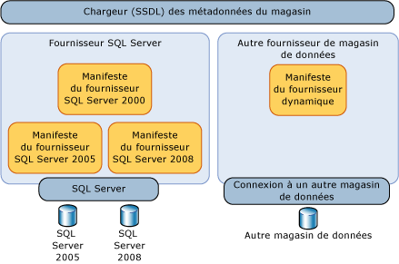
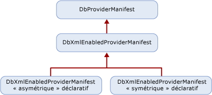

# <a name="provider-manifest-specification"></a><span data-ttu-id="bb5a4-102">Spécification de manifeste du fournisseur</span><span class="sxs-lookup"><span data-stu-id="bb5a4-102">Provider Manifest Specification</span></span>
<span data-ttu-id="bb5a4-103">Cette section explique comment un fournisseur de banques de données peut prendre en charge les types et les fonctions dans la banque de données.</span><span class="sxs-lookup"><span data-stu-id="bb5a4-103">This section discusses how a data store provider can support the types and functions in the data store.</span></span>  
  
 <span data-ttu-id="bb5a4-104">Les Services d'entités fonctionnent indépendamment d'un fournisseur de banques de données spécifique, mais permettent encore à un fournisseur de données de définir explicitement la manière dont les modèles, les mappages et les requêtes interagissent avec une banque de données sous-jacente.</span><span class="sxs-lookup"><span data-stu-id="bb5a4-104">Entity Services operates independently of a specific data store provider yet still allows a data provider to explicitly define how models, mappings, and queries interact with an underlying data store.</span></span> <span data-ttu-id="bb5a4-105">Sans couche d'abstraction, les Services d'entités seraient uniquement destinés à une banque de données ou un fournisseur de données spécifique.</span><span class="sxs-lookup"><span data-stu-id="bb5a4-105">Without a layer of abstraction, Entity Services could only be targeted at a specific data store or data provider.</span></span>  
  
 <span data-ttu-id="bb5a4-106">Les types pris en charge par le fournisseur sont pris en charge directement ou indirectement par la base de données sous-jacente.</span><span class="sxs-lookup"><span data-stu-id="bb5a4-106">Types that the provider supports are directly or indirectly supported by the underlying database.</span></span> <span data-ttu-id="bb5a4-107">Ces types ne sont pas nécessairement des types de banque exacts, mais les types que le fournisseur utilise pour prendre en charge [!INCLUDE[adonet_ef](../../../../../includes/adonet-ef-md.md)].</span><span class="sxs-lookup"><span data-stu-id="bb5a4-107">These types are not necessarily the exact store types, but the types the provider uses to support the [!INCLUDE[adonet_ef](../../../../../includes/adonet-ef-md.md)].</span></span> <span data-ttu-id="bb5a4-108">Les types de fournisseurs/banques sont décrits en termes EDM (Entity Data Model).</span><span class="sxs-lookup"><span data-stu-id="bb5a4-108">Provider/store types are described in the Entity Data Model (EDM) terms.</span></span>  
  
 <span data-ttu-id="bb5a4-109">Les types de paramètres et les types de retour pour les fonctions prises en charge par la banque de données sont spécifiés en termes EDM.</span><span class="sxs-lookup"><span data-stu-id="bb5a4-109">Parameter and return types for the functions supported by the data store are specified in EDM terms.</span></span>  
  
## <a name="requirements"></a><span data-ttu-id="bb5a4-110">Spécifications</span><span class="sxs-lookup"><span data-stu-id="bb5a4-110">Requirements</span></span>  
 <span data-ttu-id="bb5a4-111">[!INCLUDE[adonet_ef](../../../../../includes/adonet-ef-md.md)] et la banque de données doivent être en mesure de se passer des données entre eux dans des types connus sans aucune perte ni troncation de données.</span><span class="sxs-lookup"><span data-stu-id="bb5a4-111">The [!INCLUDE[adonet_ef](../../../../../includes/adonet-ef-md.md)] and the data store need to be able to pass data back and forth in known types without any data loss or truncation.</span></span>  
  
 <span data-ttu-id="bb5a4-112">Le manifeste du fournisseur doit pouvoir être chargé par les outils au moment du design sans devoir ouvrir une connexion à la banque de données.</span><span class="sxs-lookup"><span data-stu-id="bb5a4-112">The provider manifest must be loadable by tools at design time without having to open a connection to the data store.</span></span>  
  
 <span data-ttu-id="bb5a4-113">Le [!INCLUDE[adonet_ef](../../../../../includes/adonet-ef-md.md)] respecte la casse, mais la banque de données sous-jacente ne peut pas être.</span><span class="sxs-lookup"><span data-stu-id="bb5a4-113">The [!INCLUDE[adonet_ef](../../../../../includes/adonet-ef-md.md)] is case sensitive, but the underlying data store may not be.</span></span> <span data-ttu-id="bb5a4-114">Lorsque les artefacts EDM (identificateurs et noms de type, par exemple) sont définis et utilisés dans le manifeste, ils doivent utiliser le respect de la casse d'[!INCLUDE[adonet_ef](../../../../../includes/adonet-ef-md.md)].</span><span class="sxs-lookup"><span data-stu-id="bb5a4-114">When EDM artifacts (identifiers and type names, for example) are defined and used in the manifest, they must use the [!INCLUDE[adonet_ef](../../../../../includes/adonet-ef-md.md)] case sensitivity.</span></span> <span data-ttu-id="bb5a4-115">Si des éléments de la banque de données respectueux de la casse apparaissent dans le manifeste du fournisseur, cette casse doit être conservée dans le manifeste du fournisseur.</span><span class="sxs-lookup"><span data-stu-id="bb5a4-115">If data store elements that may be case sensitive appear in the provider manifest, that casing needs to be maintained in the provider manifest.</span></span>  
  
 <span data-ttu-id="bb5a4-116">[!INCLUDE[adonet_ef](../../../../../includes/adonet-ef-md.md)] requiert un manifeste du fournisseur pour tous les fournisseurs de données.</span><span class="sxs-lookup"><span data-stu-id="bb5a4-116">The [!INCLUDE[adonet_ef](../../../../../includes/adonet-ef-md.md)] requires a provider manifest for all data providers.</span></span> <span data-ttu-id="bb5a4-117">Si vous essayez d’utiliser un fournisseur qui ne dispose pas d’un fournisseur de manifeste avec le [!INCLUDE[adonet_ef](../../../../../includes/adonet-ef-md.md)], vous obtiendrez une erreur.</span><span class="sxs-lookup"><span data-stu-id="bb5a4-117">If you try to use a provider that does not have a provider manifest with the [!INCLUDE[adonet_ef](../../../../../includes/adonet-ef-md.md)], you will get an error.</span></span>  
  
 <span data-ttu-id="bb5a4-118">Le tableau suivant décrit les types d'exceptions levés par [!INCLUDE[adonet_ef](../../../../../includes/adonet-ef-md.md)] si des exceptions sont déclenchées par l'interaction d'un fournisseur :</span><span class="sxs-lookup"><span data-stu-id="bb5a4-118">The following table describes the kinds of exceptions the [!INCLUDE[adonet_ef](../../../../../includes/adonet-ef-md.md)] would throw when exceptions arise through provider interaction:</span></span>  
  
|<span data-ttu-id="bb5a4-119">Problème</span><span class="sxs-lookup"><span data-stu-id="bb5a4-119">Issue</span></span>|<span data-ttu-id="bb5a4-120">Exception</span><span class="sxs-lookup"><span data-stu-id="bb5a4-120">Exception</span></span>|  
|-----------|---------------|  
|<span data-ttu-id="bb5a4-121">Le fournisseur ne prend pas en charge GetProviderManifest dans DbProviderServices.</span><span class="sxs-lookup"><span data-stu-id="bb5a4-121">The Provider does not support GetProviderManifest in DbProviderServices.</span></span>|<span data-ttu-id="bb5a4-122">ProviderIncompatibleException</span><span class="sxs-lookup"><span data-stu-id="bb5a4-122">ProviderIncompatibleException</span></span>|  
|<span data-ttu-id="bb5a4-123">Manifeste du fournisseur manquant : le fournisseur retourne `null` lors de la tentative de récupération du manifeste du fournisseur.</span><span class="sxs-lookup"><span data-stu-id="bb5a4-123">Missing provider manifest: the provider returns `null` when attempting to retrieve the provider manifest.</span></span>|<span data-ttu-id="bb5a4-124">ProviderIncompatibleException</span><span class="sxs-lookup"><span data-stu-id="bb5a4-124">ProviderIncompatibleException</span></span>|  
|<span data-ttu-id="bb5a4-125">Manifeste du fournisseur non valide : le fournisseur retourne un code XML non valide lors de la tentative de récupération du manifeste du fournisseur.</span><span class="sxs-lookup"><span data-stu-id="bb5a4-125">Invalid provider manifest: the provider returns invalid XML when attempting to retrieve the provider manifest.</span></span>|<span data-ttu-id="bb5a4-126">ProviderIncompatibleException</span><span class="sxs-lookup"><span data-stu-id="bb5a4-126">ProviderIncompatibleException</span></span>|  
  
## <a name="scenarios"></a><span data-ttu-id="bb5a4-127">Scénarios</span><span class="sxs-lookup"><span data-stu-id="bb5a4-127">Scenarios</span></span>  
 <span data-ttu-id="bb5a4-128">Un fournisseur doit prendre en charge les scénarios suivants :</span><span class="sxs-lookup"><span data-stu-id="bb5a4-128">A provider should support the following scenarios:</span></span>  
  
### <a name="writing-a-provider-with-symmetric-type-mapping"></a><span data-ttu-id="bb5a4-129">Écriture d'un fournisseur avec mappage de type symétrique</span><span class="sxs-lookup"><span data-stu-id="bb5a4-129">Writing a Provider with Symmetric Type Mapping</span></span>  
 <span data-ttu-id="bb5a4-130">Vous pouvez écrire un fournisseur pour le [!INCLUDE[adonet_ef](../../../../../includes/adonet-ef-md.md)] où chaque type de banque est mappé à un type EDM unique, indépendamment du sens du mappage.</span><span class="sxs-lookup"><span data-stu-id="bb5a4-130">You can write a provider for the [!INCLUDE[adonet_ef](../../../../../includes/adonet-ef-md.md)] where each store type maps to a single EDM type, regardless of the mapping direction.</span></span> <span data-ttu-id="bb5a4-131">Pour un type de fournisseur ayant un mappage très simple correspondant à un type EDM, vous pouvez utiliser une solution symétrique parce que le système de type est simple ou correspond à des types EDM.</span><span class="sxs-lookup"><span data-stu-id="bb5a4-131">For a provider type that has very simple mapping that corresponds with an EDM type, you can use a symmetric solution because the type system is simple or matches EDM types.</span></span>  
  
 <span data-ttu-id="bb5a4-132">Vous pouvez utiliser la simplicité de leur domaine et produire un manifeste du fournisseur déclaratif statique.</span><span class="sxs-lookup"><span data-stu-id="bb5a4-132">You can use the simplicity of their domain and produce a static declarative provider manifest.</span></span>  
  
 <span data-ttu-id="bb5a4-133">Vous écrivez un fichier XML qui a deux sections :</span><span class="sxs-lookup"><span data-stu-id="bb5a4-133">You write an XML file that has two sections:</span></span>  
  
-   <span data-ttu-id="bb5a4-134">Liste de types de fournisseurs exprimés en termes d'« équivalent EDM » d'un type ou d'une fonction de banque.</span><span class="sxs-lookup"><span data-stu-id="bb5a4-134">A list of provider types expressed in terms of the "EDM counterpart" of a store type or function.</span></span> <span data-ttu-id="bb5a4-135">Les types de banque ont des types EDM équivalents.</span><span class="sxs-lookup"><span data-stu-id="bb5a4-135">Store types have counterpart EDM types.</span></span> <span data-ttu-id="bb5a4-136">Les fonctions de banque ont des fonctions EDM correspondantes.</span><span class="sxs-lookup"><span data-stu-id="bb5a4-136">Store functions have corresponding EDM functions.</span></span> <span data-ttu-id="bb5a4-137">Par exemple, varchar est un type SQL Server mais le type EDM correspondant est chaîne.</span><span class="sxs-lookup"><span data-stu-id="bb5a4-137">For example, varchar is a SQL Server type but the corresponding EDM type is string.</span></span>  
  
-   <span data-ttu-id="bb5a4-138">Liste de fonctions prises en charge par le fournisseur dans lesquelles les types de paramètres et les types de retour sont exprimés en termes EDM.</span><span class="sxs-lookup"><span data-stu-id="bb5a4-138">A list of functions supported by the provider where parameter and return types are expressed in EDM terms.</span></span>  
  
### <a name="writing-a-provider-with-asymmetric-type-mapping"></a><span data-ttu-id="bb5a4-139">Écriture d'un fournisseur avec mappage de type asymétrique</span><span class="sxs-lookup"><span data-stu-id="bb5a4-139">Writing a Provider with Asymmetric Type Mapping</span></span>  
 <span data-ttu-id="bb5a4-140">Lors de l'écriture d'un fournisseur de banques de données pour [!INCLUDE[adonet_ef](../../../../../includes/adonet-ef-md.md)], le mappage des types EDM vers les types fournisseur pour certains types peut être différent du mappage des types fournisseur vers les types EDM.</span><span class="sxs-lookup"><span data-stu-id="bb5a4-140">When writing a data store provider for the [!INCLUDE[adonet_ef](../../../../../includes/adonet-ef-md.md)], the EDM-to-provider type mapping for some types may be different from provider-to-EDM type mapping.</span></span> <span data-ttu-id="bb5a4-141">Par exemple, unbounded EDM PrimitiveTypeKind.String peut être mappé à nvarchar (4000) sur le fournisseur, alors que nvarchar (4000) est mappé à EDM PrimitiveTypeKind.String (MaxLength=4000).</span><span class="sxs-lookup"><span data-stu-id="bb5a4-141">For instance, unbounded EDM PrimitiveTypeKind.String may map to nvarchar(4000) on the provider, while nvarchar(4000) maps to the EDM PrimitiveTypeKind.String(MaxLength=4000).</span></span>  
  
 <span data-ttu-id="bb5a4-142">Vous écrivez un fichier XML qui a deux sections :</span><span class="sxs-lookup"><span data-stu-id="bb5a4-142">You write an XML file that has two sections:</span></span>  
  
-   <span data-ttu-id="bb5a4-143">Liste de types de fournisseurs exprimés en termes EDM et qui définissent le mappage dans les deux sens : EDM-à-fournisseur et fournisseur-à-EDM.</span><span class="sxs-lookup"><span data-stu-id="bb5a4-143">A list of provider types expressed in EDM terms and define mapping for both direction: EDM-to-provider and provider-to-EDM.</span></span>  
  
-   <span data-ttu-id="bb5a4-144">Liste de fonctions prises en charge par le fournisseur dans lesquelles les types de paramètres et les types de retour sont exprimés en termes EDM.</span><span class="sxs-lookup"><span data-stu-id="bb5a4-144">A list of functions supported by the provider where parameter and return types are expressed in EDM terms.</span></span>  
  
## <a name="provider-manifest-discoverability"></a><span data-ttu-id="bb5a4-145">Manifeste du fournisseur Discoverability</span><span class="sxs-lookup"><span data-stu-id="bb5a4-145">Provider Manifest Discoverability</span></span>  
 <span data-ttu-id="bb5a4-146">Le manifeste est utilisé de manière indirecte par plusieurs types de composants dans les Services d'entités (par exemple Outils ou Requête), mais il est plus directement exploité par les métadonnées via l'utilisation du chargeur de métadonnées de la banque de données.</span><span class="sxs-lookup"><span data-stu-id="bb5a4-146">The manifest is used indirectly by several component types in Entity Services (for example Tools or Query) but more directly leveraged by metadata through the use of the data store metadata loader.</span></span>  
  
 <span data-ttu-id="bb5a4-147"></span><span class="sxs-lookup"><span data-stu-id="bb5a4-147"></span></span>  
  
 <span data-ttu-id="bb5a4-148">Toutefois, un fournisseur donné peut prendre en charge différentes banques ou différentes versions de la même banque.</span><span class="sxs-lookup"><span data-stu-id="bb5a4-148">However, a given provider may support different stores or different versions of the same store.</span></span> <span data-ttu-id="bb5a4-149">Par conséquent, un fournisseur doit signaler un manifeste différent pour chaque banque de données prise en charge.</span><span class="sxs-lookup"><span data-stu-id="bb5a4-149">Therefore, a provider must report a different manifest for each supported data store.</span></span>  
  
### <a name="provider-manifest-token"></a><span data-ttu-id="bb5a4-150">Jeton du manifeste du fournisseur.</span><span class="sxs-lookup"><span data-stu-id="bb5a4-150">Provider Manifest Token</span></span>  
 <span data-ttu-id="bb5a4-151">Lorsqu'une connexion de banque de données est ouverte, le fournisseur peut demander des informations pour retourner le bon manifeste.</span><span class="sxs-lookup"><span data-stu-id="bb5a4-151">When a data store connection is opened, the provider can query for information to return the right manifest.</span></span> <span data-ttu-id="bb5a4-152">Cela risque de ne pas être possible dans les scénarios hors connexion où les informations de connexion ne sont pas disponibles ou lorsqu'il est impossible de se connecter à la banque.</span><span class="sxs-lookup"><span data-stu-id="bb5a4-152">This may not be possible in offline scenarios where connection information is not available or when it is not possible to connect to the store.</span></span> <span data-ttu-id="bb5a4-153">Identifiez le manifeste en utilisant l'attribut `ProviderManifestToken` de l'élément `Schema` dans le fichier .ssdl.</span><span class="sxs-lookup"><span data-stu-id="bb5a4-153">Identify the manifest by using the `ProviderManifestToken` attribute of the `Schema` element in the .ssdl file.</span></span> <span data-ttu-id="bb5a4-154">Il n'existe aucun format obligatoire pour cet attribut ; le fournisseur choisit les informations minimales nécessaires pour identifier un manifeste sans ouvrir une connexion à la banque.</span><span class="sxs-lookup"><span data-stu-id="bb5a4-154">There is no required format for this attribute; the provider chooses the minimum information needed to identify a manifest without opening a connection to the store.</span></span>  
  
 <span data-ttu-id="bb5a4-155">Par exemple :</span><span class="sxs-lookup"><span data-stu-id="bb5a4-155">For example:</span></span>  
  
```xml  
<Schema Namespace="Northwind" Provider="System.Data.SqlClient" ProviderManifestToken="2005" xmlns:edm="http://schemas.microsoft.com/ado/2006/04/edm/ssdl" xmlns="http://schemas.microsoft.com/ado/2006/04/edm/ssdl">  
```  
  
## <a name="provider-manifest-programming-model"></a><span data-ttu-id="bb5a4-156">Modèle de programmation de manifeste du fournisseur</span><span class="sxs-lookup"><span data-stu-id="bb5a4-156">Provider Manifest Programming Model</span></span>  
 <span data-ttu-id="bb5a4-157">Les fournisseurs dérivent de <xref:System.Data.Common.DbXmlEnabledProviderManifest>, qui leur permet de spécifier leurs manifestes de façon déclarative.</span><span class="sxs-lookup"><span data-stu-id="bb5a4-157">Providers derive from <xref:System.Data.Common.DbXmlEnabledProviderManifest>, which allows them to specify their manifests declaratively.</span></span> <span data-ttu-id="bb5a4-158">L'illustration suivante montre la hiérarchie de classes d'un fournisseur :</span><span class="sxs-lookup"><span data-stu-id="bb5a4-158">The following illustration shows the class hierarchy of a provider:</span></span>  
  
 <span data-ttu-id="bb5a4-159"></span><span class="sxs-lookup"><span data-stu-id="bb5a4-159"></span></span>  
  
### <a name="discoverability-api"></a><span data-ttu-id="bb5a4-160">API Discoverability</span><span class="sxs-lookup"><span data-stu-id="bb5a4-160">Discoverability API</span></span>  
 <span data-ttu-id="bb5a4-161">Le manifeste du fournisseur est chargé par le chargeur de métadonnées de la banque (StoreItemCollection), à l'aide d'une connexion de la banque de données ou d'un jeton du manifeste du fournisseur.</span><span class="sxs-lookup"><span data-stu-id="bb5a4-161">The provider manifest is loaded by the Store Metadata loader (StoreItemCollection), either by using a data store connection or a provider manifest token.</span></span>  
  
#### <a name="using-a-data-store-connection"></a><span data-ttu-id="bb5a4-162">Utilisation d'une connexion de banque de données</span><span class="sxs-lookup"><span data-stu-id="bb5a4-162">Using a Data Store Connection</span></span>  
 <span data-ttu-id="bb5a4-163">Lorsque la connexion de banque de données est disponible, appelez DbProvderServices.GetProviderManifestToken pour retourner le jeton passé à la méthode GetProviderManifest, qui retourne DbProviderManifest.</span><span class="sxs-lookup"><span data-stu-id="bb5a4-163">When the data store connection is available, call DbProvderServices.GetProviderManifestToken to return the token that is passed to the GetProviderManifest method, which returns DbProviderManifest.</span></span> <span data-ttu-id="bb5a4-164">Cette méthode délègue à l'implémentation du fournisseur de GetDbProviderManifestToken.</span><span class="sxs-lookup"><span data-stu-id="bb5a4-164">This method delegates to the provider's implementation of GetDbProviderManifestToken.</span></span>  
  
```  
public string GetProviderManifestToken(DbConnection connection);  
public DbProviderManifest GetProviderManifest(string manifestToken);  
```  
  
#### <a name="using-a-provider-manifest-token"></a><span data-ttu-id="bb5a4-165">Utilisation d'un jeton du manifeste du fournisseur.</span><span class="sxs-lookup"><span data-stu-id="bb5a4-165">Using a Provider Manifest Token</span></span>  
 <span data-ttu-id="bb5a4-166">Pour le scénario hors connexion, le jeton est sélectionné dans une représentation SSDL.</span><span class="sxs-lookup"><span data-stu-id="bb5a4-166">For the offline scenario, the token is picked from SSDL representation.</span></span> <span data-ttu-id="bb5a4-167">Le langage SSDL vous permet de spécifier un ProviderManifestToken (consultez [élément Schema (SSDL)](http://msdn.microsoft.com/en-us/fec75ae4-7f16-4421-9265-9dac61509222) pour plus d’informations).</span><span class="sxs-lookup"><span data-stu-id="bb5a4-167">The SSDL allows you to specify a ProviderManifestToken (see [Schema Element (SSDL)](http://msdn.microsoft.com/en-us/fec75ae4-7f16-4421-9265-9dac61509222) for more information).</span></span> <span data-ttu-id="bb5a4-168">Par exemple, si une connexion ne peut pas être ouverte, le langage SSDL a un jeton du manifeste du fournisseur qui spécifie des informations sur le manifeste.</span><span class="sxs-lookup"><span data-stu-id="bb5a4-168">For example, if a connection cannot be opened, the SSDL has a provider manifest token that specifies information about the manifest.</span></span>  
  
```  
public DbProviderManifest GetProviderManifest(string manifestToken);  
```  
  
### <a name="provider-manifest-schema"></a><span data-ttu-id="bb5a4-169">Schéma de manifeste du fournisseur</span><span class="sxs-lookup"><span data-stu-id="bb5a4-169">Provider Manifest Schema</span></span>  
 <span data-ttu-id="bb5a4-170">Le schéma d'informations défini pour chaque fournisseur contient des informations statiques à consommer par des métadonnées :</span><span class="sxs-lookup"><span data-stu-id="bb5a4-170">The schema of information defined for each provider contains the static information to be consumed by metadata:</span></span>  
  
```xml  
<?xml version="1.0" encoding="utf-8"?>  
<xs:schema elementFormDefault="qualified"  
   xmlns:xs="http://www.w3.org/2001/XMLSchema"  
   targetNamespace="http://schemas.microsoft.com/ado/2006/04/edm/providermanifest"  
   xmlns:pm="http://schemas.microsoft.com/ado/2006/04/edm/providermanifest">  
  
  <xs:element name="ProviderManifest">  
    <xs:complexType>  
      <xs:sequence>  
        <xs:element name="Types" type="pm:TTypes" minOccurs="1" maxOccurs="1" />  
        <xs:element name="Functions" type="pm:TFunctions" minOccurs="0" maxOccurs="1"/>  
      </xs:sequence>  
      <xs:attribute name="Namespace" type="xs:string" use="required"/>  
    </xs:complexType>  
  </xs:element>  
  <xs:complexType name="TVersion">  
    <xs:attribute name="Major" type="xs:int" use="required" />  
    <xs:attribute name="Minor" type="xs:int" use="required" />  
    <xs:attribute name="Build" type="xs:int" use="required" />  
    <xs:attribute name="Revision" type="xs:int" use="required" />  
  </xs:complexType>  
  
  <xs:complexType name="TIntegerFacetDescription">  
    <xs:attribute name="Minimum" type="xs:int" use="optional" />  
    <xs:attribute name="Maximum" type="xs:int" use="optional" />  
    <xs:attribute name="DefaultValue" type="xs:int" use="optional" />  
    <xs:attribute name="Constant" type="xs:boolean" default="false" />  
  </xs:complexType>  
  
  <xs:complexType name="TBooleanFacetDescription">  
    <xs:attribute name="DefaultValue" type="xs:boolean" use="optional" />  
    <xs:attribute name="Constant" type="xs:boolean" default="true" />  
  </xs:complexType>  
  
  <xs:complexType name="TDateTimeFacetDescription">  
    <xs:attribute name="Constant" type="xs:boolean" default="false" />  
  </xs:complexType>  
  
  <xs:complexType name="TFacetDescriptions">  
    <xs:choice maxOccurs="unbounded">  
      <xs:element name="Precision" minOccurs="0" maxOccurs="1" type="pm:TIntegerFacetDescription"/>  
      <xs:element name="Scale" minOccurs="0" maxOccurs="1" type="pm:TIntegerFacetDescription"/>  
      <xs:element name="MaxLength" minOccurs="0" maxOccurs="1" type="pm:TIntegerFacetDescription"/>  
      <xs:element name="Unicode" minOccurs="0" maxOccurs="1" type="pm:TBooleanFacetDescription"/>  
      <xs:element name="FixedLength" minOccurs="0" maxOccurs="1" type="pm:TBooleanFacetDescription"/>  
    </xs:choice>  
  </xs:complexType>  
  
  <xs:complexType name="TType">  
    <xs:sequence>  
      <xs:element name="FacetDescriptions" type="pm:TFacetDescriptions" minOccurs="0" maxOccurs="1"/>  
    </xs:sequence>  
    <xs:attribute name="Name" type="xs:string" use="required"/>  
    <xs:attribute name="PrimitiveTypeKind" type="pm:TPrimitiveTypeKind" use="required" />  
  </xs:complexType>  
  
  <xs:complexType name="TTypes">  
    <xs:sequence>  
      <xs:element name="Type" type="pm:TType" minOccurs="0" maxOccurs="unbounded"/>  
    </xs:sequence>  
  </xs:complexType>  
  
  <xs:attributeGroup name="TFacetAttribute">  
    <xs:attribute name="Precision" type="xs:int" use="optional"/>  
    <xs:attribute name="Scale" type="xs:int" use="optional"/>  
    <xs:attribute name="MaxLength" type="xs:int" use="optional"/>  
    <xs:attribute name="Unicode" type="xs:boolean" use="optional"/>  
    <xs:attribute name="FixedLength" type="xs:boolean" use="optional"/>  
  </xs:attributeGroup>  
  
  <xs:complexType name="TFunctionParameter">  
    <xs:attribute name="Name" type="xs:string" use="required" />  
    <xs:attribute name="Type" type="xs:string" use="required" />  
    <xs:attributeGroup ref="pm:TFacetAttribute" />  
    <xs:attribute name="Mode" type="pm:TParameterDirection" use="required" />  
  </xs:complexType>  
  
  <xs:complexType name="TReturnType">  
    <xs:attribute name="Type" type="xs:string" use="required" />  
    <xs:attributeGroup ref="pm:TFacetAttribute" />  
  </xs:complexType>  
  
  <xs:complexType name="TFunction">  
    <xs:choice minOccurs="0" maxOccurs ="unbounded">  
      <xs:element name ="ReturnType" type="pm:TReturnType" minOccurs="0" maxOccurs="1" />  
      <xs:element name="Parameter" type="pm:TFunctionParameter" minOccurs="0" maxOccurs="unbounded"/>  
    </xs:choice>  
    <xs:attribute name="Name" type="xs:string" use="required" />  
    <xs:attribute name="Aggregate" type="xs:boolean" use="optional" />  
    <xs:attribute name="BuiltIn" type="xs:boolean" use="optional" />  
    <xs:attribute name="StoreFunctionName" type="xs:string" use="optional" />  
    <xs:attribute name="NiladicFunction" type="xs:boolean" use="optional" />  
    <xs:attribute name="ParameterTypeSemantics" type="pm:TParameterTypeSemantics" use="optional" default="AllowImplicitConversion" />  
  </xs:complexType>  
  
  <xs:complexType name="TFunctions">  
    <xs:sequence>  
      <xs:element name="Function" type="pm:TFunction" minOccurs="0" maxOccurs="unbounded"/>  
    </xs:sequence>  
  </xs:complexType>  
  
  <xs:simpleType name="TPrimitiveTypeKind">  
    <xs:restriction base="xs:string">  
      <xs:enumeration value="Binary"/>  
      <xs:enumeration value="Boolean"/>  
      <xs:enumeration value="Byte"/>  
      <xs:enumeration value="Decimal"/>  
      <xs:enumeration value="DateTime"/>  
      <xs:enumeration value="Time"/>  
      <xs:enumeration value="DateTimeOffset"/>          
      <xs:enumeration value="Double"/>  
      <xs:enumeration value="Guid"/>  
      <xs:enumeration value="Single"/>  
      <xs:enumeration value="SByte"/>  
      <xs:enumeration value="Int16"/>  
      <xs:enumeration value="Int32"/>  
      <xs:enumeration value="Int64"/>  
      <xs:enumeration value="String"/>  
    </xs:restriction>  
  </xs:simpleType>  
  
  <xs:simpleType name="TParameterDirection">  
    <xs:restriction base="xs:string">  
      <xs:enumeration value="In"/>  
      <xs:enumeration value="Out"/>  
      <xs:enumeration value="InOut"/>  
    </xs:restriction>  
  </xs:simpleType>  
  
  <xs:simpleType name="TParameterTypeSemantics">  
    <xs:restriction base="xs:string">  
      <xs:enumeration value="ExactMatchOnly" />  
      <xs:enumeration value="AllowImplicitPromotion" />  
      <xs:enumeration value="AllowImplicitConversion" />  
    </xs:restriction>  
  </xs:simpleType>  
</xs:schema>  
```  
  
#### <a name="types-node"></a><span data-ttu-id="bb5a4-171">Nœud de types</span><span class="sxs-lookup"><span data-stu-id="bb5a4-171">Types Node</span></span>  
 <span data-ttu-id="bb5a4-172">Le nœud de types dans le manifeste du fournisseur contient des informations sur les types pris en charge en mode natif par la banque de données ou via le fournisseur.</span><span class="sxs-lookup"><span data-stu-id="bb5a4-172">The Types node in the provider manifest contains information about the Types that are supported natively by the data store or through the provider.</span></span>  
  
##### <a name="type-node"></a><span data-ttu-id="bb5a4-173">Nœud Type</span><span class="sxs-lookup"><span data-stu-id="bb5a4-173">Type Node</span></span>  
 <span data-ttu-id="bb5a4-174">Chaque nœud Type définit un type de fournisseur en termes d'EDM.</span><span class="sxs-lookup"><span data-stu-id="bb5a4-174">Each Type node defines a provider type in terms of EDM.</span></span> <span data-ttu-id="bb5a4-175">Le nœud Type décrit le nom du type de fournisseur, ainsi que les informations liées au type de modèle auquel il est mappé et les facettes pour décrire ce mappage de type.</span><span class="sxs-lookup"><span data-stu-id="bb5a4-175">The Type node describes the name of the provider type, and information related to the model type it maps to and facets to describe that type mapping.</span></span>  
  
 <span data-ttu-id="bb5a4-176">Pour exprimer ces informations de type dans le manifeste du fournisseur, chaque déclaration TypeInformation doit définir plusieurs descriptions de facette pour chaque Type :</span><span class="sxs-lookup"><span data-stu-id="bb5a4-176">In order to express this type information in the provider manifest, each TypeInformation declaration must define several facet descriptions for each Type:</span></span>  
  
|<span data-ttu-id="bb5a4-177">Nom d'attribut</span><span class="sxs-lookup"><span data-stu-id="bb5a4-177">Attribute Name</span></span>|<span data-ttu-id="bb5a4-178">Type de données</span><span class="sxs-lookup"><span data-stu-id="bb5a4-178">Data Type</span></span>|<span data-ttu-id="bb5a4-179">Obligatoire</span><span class="sxs-lookup"><span data-stu-id="bb5a4-179">Required</span></span>|<span data-ttu-id="bb5a4-180">Valeur par défaut</span><span class="sxs-lookup"><span data-stu-id="bb5a4-180">Default Value</span></span>|<span data-ttu-id="bb5a4-181">Description</span><span class="sxs-lookup"><span data-stu-id="bb5a4-181">Description</span></span>|  
|--------------------|---------------|--------------|-------------------|-----------------|  
|<span data-ttu-id="bb5a4-182">Nom</span><span class="sxs-lookup"><span data-stu-id="bb5a4-182">Name</span></span>|<span data-ttu-id="bb5a4-183">Chaîne</span><span class="sxs-lookup"><span data-stu-id="bb5a4-183">String</span></span>|<span data-ttu-id="bb5a4-184">Oui</span><span class="sxs-lookup"><span data-stu-id="bb5a4-184">Yes</span></span>|<span data-ttu-id="bb5a4-185">N/A</span><span class="sxs-lookup"><span data-stu-id="bb5a4-185">n/a</span></span>|<span data-ttu-id="bb5a4-186">Nom de type de données spécifique au fournisseur</span><span class="sxs-lookup"><span data-stu-id="bb5a4-186">Provider-specific data type name</span></span>|  
|<span data-ttu-id="bb5a4-187">PrimitiveTypeKind</span><span class="sxs-lookup"><span data-stu-id="bb5a4-187">PrimitiveTypeKind</span></span>|<span data-ttu-id="bb5a4-188">PrimitiveTypeKind</span><span class="sxs-lookup"><span data-stu-id="bb5a4-188">PrimitiveTypeKind</span></span>|<span data-ttu-id="bb5a4-189">Oui</span><span class="sxs-lookup"><span data-stu-id="bb5a4-189">Yes</span></span>|<span data-ttu-id="bb5a4-190">N/A</span><span class="sxs-lookup"><span data-stu-id="bb5a4-190">n/a</span></span>|<span data-ttu-id="bb5a4-191">Nom du type EDM</span><span class="sxs-lookup"><span data-stu-id="bb5a4-191">EDM type name</span></span>|  
  
###### <a name="function-node"></a><span data-ttu-id="bb5a4-192">Nœud Function</span><span class="sxs-lookup"><span data-stu-id="bb5a4-192">Function Node</span></span>  
 <span data-ttu-id="bb5a4-193">Chaque Function définit une fonction unique disponible via le fournisseur.</span><span class="sxs-lookup"><span data-stu-id="bb5a4-193">Each Function defines a single function available through the provider.</span></span>  
  
|<span data-ttu-id="bb5a4-194">Nom d'attribut</span><span class="sxs-lookup"><span data-stu-id="bb5a4-194">Attribute Name</span></span>|<span data-ttu-id="bb5a4-195">Type de données</span><span class="sxs-lookup"><span data-stu-id="bb5a4-195">Data Type</span></span>|<span data-ttu-id="bb5a4-196">Obligatoire</span><span class="sxs-lookup"><span data-stu-id="bb5a4-196">Required</span></span>|<span data-ttu-id="bb5a4-197">Valeur par défaut</span><span class="sxs-lookup"><span data-stu-id="bb5a4-197">Default Value</span></span>|<span data-ttu-id="bb5a4-198">Description</span><span class="sxs-lookup"><span data-stu-id="bb5a4-198">Description</span></span>|  
|--------------------|---------------|--------------|-------------------|-----------------|  
|<span data-ttu-id="bb5a4-199">Nom</span><span class="sxs-lookup"><span data-stu-id="bb5a4-199">Name</span></span>|<span data-ttu-id="bb5a4-200">Chaîne</span><span class="sxs-lookup"><span data-stu-id="bb5a4-200">String</span></span>|<span data-ttu-id="bb5a4-201">Oui</span><span class="sxs-lookup"><span data-stu-id="bb5a4-201">Yes</span></span>|<span data-ttu-id="bb5a4-202">N/A</span><span class="sxs-lookup"><span data-stu-id="bb5a4-202">n/a</span></span>|<span data-ttu-id="bb5a4-203">Identificateur/nom de la fonction</span><span class="sxs-lookup"><span data-stu-id="bb5a4-203">Identifier/name of the function</span></span>|  
|<span data-ttu-id="bb5a4-204">ReturnType</span><span class="sxs-lookup"><span data-stu-id="bb5a4-204">ReturnType</span></span>|<span data-ttu-id="bb5a4-205">Chaîne</span><span class="sxs-lookup"><span data-stu-id="bb5a4-205">String</span></span>|<span data-ttu-id="bb5a4-206">Non</span><span class="sxs-lookup"><span data-stu-id="bb5a4-206">No</span></span>|<span data-ttu-id="bb5a4-207">Void</span><span class="sxs-lookup"><span data-stu-id="bb5a4-207">Void</span></span>|<span data-ttu-id="bb5a4-208">Type de retour EDM de la fonction</span><span class="sxs-lookup"><span data-stu-id="bb5a4-208">The EDM return type of the function</span></span>|  
|<span data-ttu-id="bb5a4-209">Aggregate</span><span class="sxs-lookup"><span data-stu-id="bb5a4-209">Aggregate</span></span>|<span data-ttu-id="bb5a4-210">Boolean</span><span class="sxs-lookup"><span data-stu-id="bb5a4-210">Boolean</span></span>|<span data-ttu-id="bb5a4-211">Non</span><span class="sxs-lookup"><span data-stu-id="bb5a4-211">No</span></span>|<span data-ttu-id="bb5a4-212">False</span><span class="sxs-lookup"><span data-stu-id="bb5a4-212">False</span></span>|<span data-ttu-id="bb5a4-213">True si la fonction est une fonction d'agrégation</span><span class="sxs-lookup"><span data-stu-id="bb5a4-213">True if the function is an aggregate function</span></span>|  
|<span data-ttu-id="bb5a4-214">BuiltIn</span><span class="sxs-lookup"><span data-stu-id="bb5a4-214">BuiltIn</span></span>|<span data-ttu-id="bb5a4-215">Boolean</span><span class="sxs-lookup"><span data-stu-id="bb5a4-215">Boolean</span></span>|<span data-ttu-id="bb5a4-216">Non</span><span class="sxs-lookup"><span data-stu-id="bb5a4-216">No</span></span>|<span data-ttu-id="bb5a4-217">True</span><span class="sxs-lookup"><span data-stu-id="bb5a4-217">True</span></span>|<span data-ttu-id="bb5a4-218">True si la fonction est intégrée à la banque de données</span><span class="sxs-lookup"><span data-stu-id="bb5a4-218">True if the function is built into the data store</span></span>|  
|<span data-ttu-id="bb5a4-219">StoreFunctionName</span><span class="sxs-lookup"><span data-stu-id="bb5a4-219">StoreFunctionName</span></span>|<span data-ttu-id="bb5a4-220">Chaîne</span><span class="sxs-lookup"><span data-stu-id="bb5a4-220">String</span></span>|<span data-ttu-id="bb5a4-221">Non</span><span class="sxs-lookup"><span data-stu-id="bb5a4-221">No</span></span>|<span data-ttu-id="bb5a4-222">\<Nom ></span><span class="sxs-lookup"><span data-stu-id="bb5a4-222">\<Name></span></span>|<span data-ttu-id="bb5a4-223">Nom de fonction dans la banque de données.</span><span class="sxs-lookup"><span data-stu-id="bb5a4-223">Function Name in the data store.</span></span>  <span data-ttu-id="bb5a4-224">Permet un niveau de redirection de noms de fonction.</span><span class="sxs-lookup"><span data-stu-id="bb5a4-224">Allows for a level of redirection of function names.</span></span>|  
|<span data-ttu-id="bb5a4-225">NiladicFunction</span><span class="sxs-lookup"><span data-stu-id="bb5a4-225">NiladicFunction</span></span>|<span data-ttu-id="bb5a4-226">Boolean</span><span class="sxs-lookup"><span data-stu-id="bb5a4-226">Boolean</span></span>|<span data-ttu-id="bb5a4-227">Non</span><span class="sxs-lookup"><span data-stu-id="bb5a4-227">No</span></span>|<span data-ttu-id="bb5a4-228">False</span><span class="sxs-lookup"><span data-stu-id="bb5a4-228">False</span></span>|<span data-ttu-id="bb5a4-229">True si la fonction ne requiert pas de paramètres et est appelée sans paramètre</span><span class="sxs-lookup"><span data-stu-id="bb5a4-229">True if the function does not require parameters and is called without any parameters</span></span>|  
|<span data-ttu-id="bb5a4-230">ParameterType</span><span class="sxs-lookup"><span data-stu-id="bb5a4-230">ParameterType</span></span><br /><br /> <span data-ttu-id="bb5a4-231">Sémantique</span><span class="sxs-lookup"><span data-stu-id="bb5a4-231">Semantics</span></span>|<span data-ttu-id="bb5a4-232">ParameterSemantics</span><span class="sxs-lookup"><span data-stu-id="bb5a4-232">ParameterSemantics</span></span>|<span data-ttu-id="bb5a4-233">Non</span><span class="sxs-lookup"><span data-stu-id="bb5a4-233">No</span></span>|<span data-ttu-id="bb5a4-234">AllowImplicit</span><span class="sxs-lookup"><span data-stu-id="bb5a4-234">AllowImplicit</span></span><br /><br /> <span data-ttu-id="bb5a4-235">Conversion</span><span class="sxs-lookup"><span data-stu-id="bb5a4-235">Conversion</span></span>|<span data-ttu-id="bb5a4-236">Choix de la façon dont le pipeline de requête doit gérer la substitution de type de paramètre :</span><span class="sxs-lookup"><span data-stu-id="bb5a4-236">Choice of how the query pipeline should deal with parameter type substitution:</span></span><br /><br /> <span data-ttu-id="bb5a4-237">-ExactMatchOnly</span><span class="sxs-lookup"><span data-stu-id="bb5a4-237">-   ExactMatchOnly</span></span><br /><span data-ttu-id="bb5a4-238">-AllowImplicitPromotion</span><span class="sxs-lookup"><span data-stu-id="bb5a4-238">-   AllowImplicitPromotion</span></span><br /><span data-ttu-id="bb5a4-239">-AllowImplicitConversion</span><span class="sxs-lookup"><span data-stu-id="bb5a4-239">-   AllowImplicitConversion</span></span>|  
  
 <span data-ttu-id="bb5a4-240">**Nœud Paramètres**</span><span class="sxs-lookup"><span data-stu-id="bb5a4-240">**Parameters Node**</span></span>  
  
 <span data-ttu-id="bb5a4-241">Chaque fonction a une collection d’un ou plusieurs nœuds de paramètre.</span><span class="sxs-lookup"><span data-stu-id="bb5a4-241">Each function has a collection of one or more Parameter nodes.</span></span>  
  
|<span data-ttu-id="bb5a4-242">Nom d'attribut</span><span class="sxs-lookup"><span data-stu-id="bb5a4-242">Attribute Name</span></span>|<span data-ttu-id="bb5a4-243">Type de données</span><span class="sxs-lookup"><span data-stu-id="bb5a4-243">Data Type</span></span>|<span data-ttu-id="bb5a4-244">Obligatoire</span><span class="sxs-lookup"><span data-stu-id="bb5a4-244">Required</span></span>|<span data-ttu-id="bb5a4-245">Valeur par défaut</span><span class="sxs-lookup"><span data-stu-id="bb5a4-245">Default Value</span></span>|<span data-ttu-id="bb5a4-246">Description</span><span class="sxs-lookup"><span data-stu-id="bb5a4-246">Description</span></span>|  
|--------------------|---------------|--------------|-------------------|-----------------|  
|<span data-ttu-id="bb5a4-247">Nom</span><span class="sxs-lookup"><span data-stu-id="bb5a4-247">Name</span></span>|<span data-ttu-id="bb5a4-248">Chaîne</span><span class="sxs-lookup"><span data-stu-id="bb5a4-248">String</span></span>|<span data-ttu-id="bb5a4-249">Oui</span><span class="sxs-lookup"><span data-stu-id="bb5a4-249">Yes</span></span>|<span data-ttu-id="bb5a4-250">N/A</span><span class="sxs-lookup"><span data-stu-id="bb5a4-250">n/a</span></span>|<span data-ttu-id="bb5a4-251">Identificateur/nom du paramètre.</span><span class="sxs-lookup"><span data-stu-id="bb5a4-251">Identifier/name of the parameter.</span></span>|  
|<span data-ttu-id="bb5a4-252">Type</span><span class="sxs-lookup"><span data-stu-id="bb5a4-252">Type</span></span>|<span data-ttu-id="bb5a4-253">Chaîne</span><span class="sxs-lookup"><span data-stu-id="bb5a4-253">String</span></span>|<span data-ttu-id="bb5a4-254">Oui</span><span class="sxs-lookup"><span data-stu-id="bb5a4-254">Yes</span></span>|<span data-ttu-id="bb5a4-255">N/A</span><span class="sxs-lookup"><span data-stu-id="bb5a4-255">n/a</span></span>|<span data-ttu-id="bb5a4-256">Type EDM du paramètre.</span><span class="sxs-lookup"><span data-stu-id="bb5a4-256">The EDM type of the parameter.</span></span>|  
|<span data-ttu-id="bb5a4-257">Mode</span><span class="sxs-lookup"><span data-stu-id="bb5a4-257">Mode</span></span>|<span data-ttu-id="bb5a4-258">Paramètre</span><span class="sxs-lookup"><span data-stu-id="bb5a4-258">Parameter</span></span><br /><br /> <span data-ttu-id="bb5a4-259">Direction</span><span class="sxs-lookup"><span data-stu-id="bb5a4-259">Direction</span></span>|<span data-ttu-id="bb5a4-260">Oui</span><span class="sxs-lookup"><span data-stu-id="bb5a4-260">Yes</span></span>|<span data-ttu-id="bb5a4-261">N/A</span><span class="sxs-lookup"><span data-stu-id="bb5a4-261">n/a</span></span>|<span data-ttu-id="bb5a4-262">Direction de paramètre :</span><span class="sxs-lookup"><span data-stu-id="bb5a4-262">Direction of parameter:</span></span><br /><br /> <span data-ttu-id="bb5a4-263">-dans</span><span class="sxs-lookup"><span data-stu-id="bb5a4-263">-   in</span></span><br /><span data-ttu-id="bb5a4-264">-out</span><span class="sxs-lookup"><span data-stu-id="bb5a4-264">-   out</span></span><br /><span data-ttu-id="bb5a4-265">-inout</span><span class="sxs-lookup"><span data-stu-id="bb5a4-265">-   inout</span></span>|  
  
##### <a name="namespace-attribute"></a><span data-ttu-id="bb5a4-266">Attribut Namespace</span><span class="sxs-lookup"><span data-stu-id="bb5a4-266">Namespace Attribute</span></span>  
 <span data-ttu-id="bb5a4-267">Chaque fournisseur de banque de données doit définir un espace de noms ou un groupe d'espaces de noms pour les informations définies dans le manifeste.</span><span class="sxs-lookup"><span data-stu-id="bb5a4-267">Each data store provider must define a namespace or group of namespaces for information defined in the manifest.</span></span> <span data-ttu-id="bb5a4-268">Cet espace de noms peut être utilisé dans les requêtes Entity SQL pour résoudre des noms de fonctions et de types.</span><span class="sxs-lookup"><span data-stu-id="bb5a4-268">This namespace can be used in Entity SQL queries to resolve names of functions and types.</span></span> <span data-ttu-id="bb5a4-269">Par exemple : SqlServer.</span><span class="sxs-lookup"><span data-stu-id="bb5a4-269">For instance: SqlServer.</span></span> <span data-ttu-id="bb5a4-270">Cet espace de noms doit être différent de l'espace de noms canonique, EDM, défini par les Services d'entités pour les fonctions standard à prendre en charge par les requêtes Entity SQL.</span><span class="sxs-lookup"><span data-stu-id="bb5a4-270">That namespace must be different from the canonical namespace, EDM, defined by Entity Services for standard functions to be supported by Entity SQL queries.</span></span>  
  
## <a name="see-also"></a><span data-ttu-id="bb5a4-271">Voir aussi</span><span class="sxs-lookup"><span data-stu-id="bb5a4-271">See Also</span></span>  
 [<span data-ttu-id="bb5a4-272">L’écriture d’un fournisseur de données Entity Framework</span><span class="sxs-lookup"><span data-stu-id="bb5a4-272">Writing an Entity Framework Data Provider</span></span>](../../../../../docs/framework/data/adonet/ef/writing-an-ef-data-provider.md)
