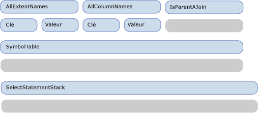
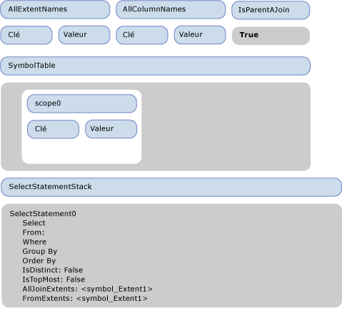
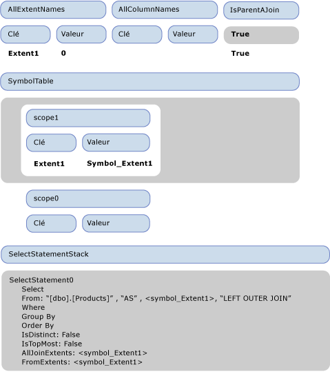
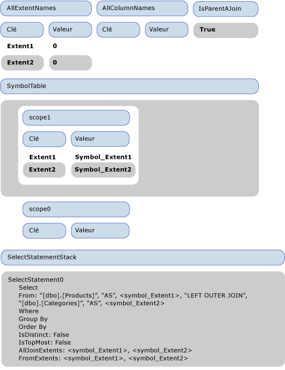
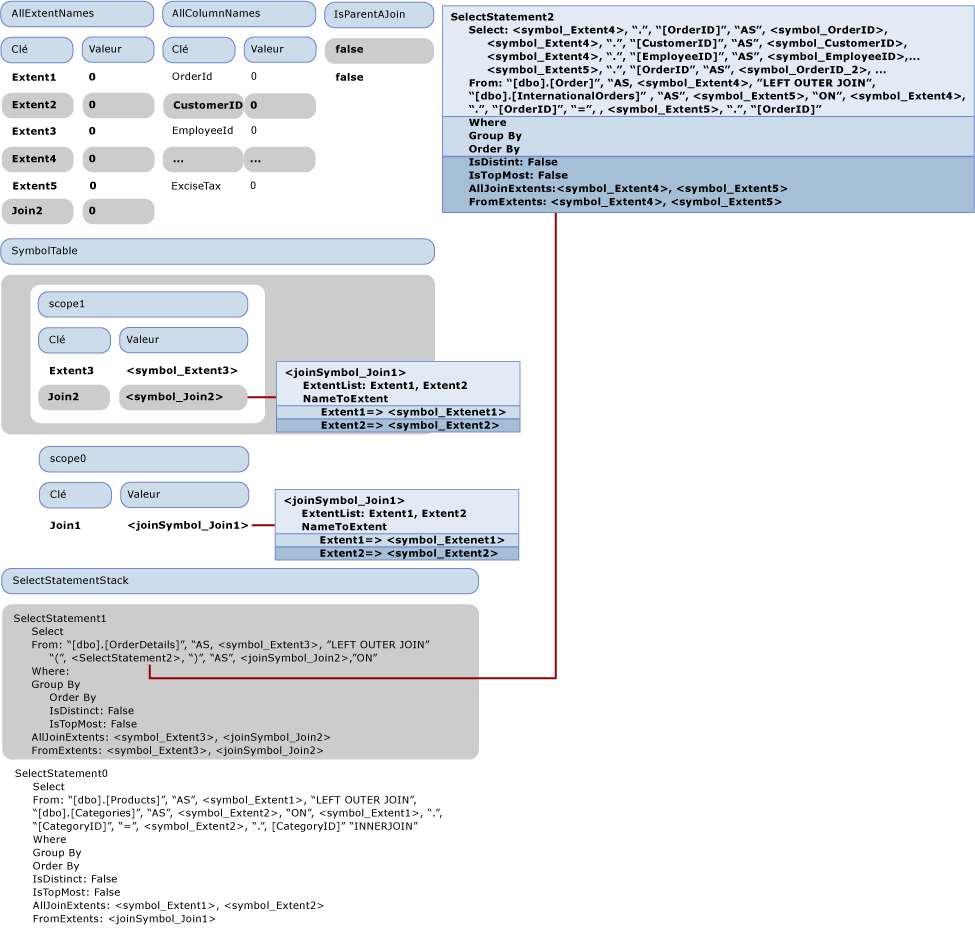

# Proc&#233;dure pas &#224; pas&#160;: g&#233;n&#233;ration SQL
Cette rubrique explique comment la génération SQL se déroule dans l'[exemple fournisseur](http://go.microsoft.com/fwlink/?LinkId=180616).  La requête Entity SQL suivante utilise le modèle inclus dans le fournisseur d'exemples :  
  
```  
SELECT  j1.ProductId, j1.ProductName, j1.CategoryName, j2.ShipCountry, j2.ProductId  
FROM (  SELECT P.ProductName, P.ProductId, P.Category.CategoryName  
        FROM NorthwindEntities.Products AS P) as j1  
INNER JOIN (SELECT OD.ProductId, OD.Order.ShipCountry as ShipCountry  
            FROM NorthwindEntities.OrderDetails AS OD) as j2  
            ON j1.ProductId == j2.ProductId   
```  
  
 La requête produit l'arborescence de commandes de sortie suivante passée au fournisseur :  
  
```  
DbQueryCommandTree  
|_Parameters  
|_Query : Collection{Record['C1'=Edm.Int32, 'ProductID'=Edm.Int32, 'ProductName'=Edm.String, 'CategoryName'=Edm.String, 'ShipCountry'=Edm.String, 'ProductID1'=Edm.Int32]}  
  |_Project  
    |_Input : 'Join4'  
    | |_InnerJoin  
    |   |_Left : 'Join1'  
    |   | |_LeftOuterJoin  
    |   |   |_Left : 'Extent1'  
    |   |   | |_Scan : dbo.Products  
    |   |   |_Right : 'Extent2'  
    |   |   | |_Scan : dbo.Categories  
    |   |   |_JoinCondition  
    |   |     |_  
    |   |       |_Var(Extent1).CategoryID  
    |   |       |_=  
    |   |       |_Var(Extent2).CategoryID  
    |   |_Right : 'Join3'  
    |   | |_LeftOuterJoin  
    |   |   |_Left : 'Extent3'  
    |   |   | |_Scan : dbo.OrderDetails  
    |   |   |_Right : 'Join2'  
    |   |   | |_LeftOuterJoin  
    |   |   |   |_Left : 'Extent4'  
    |   |   |   | |_Scan : dbo.Orders  
    |   |   |   |_Right : 'Extent5'  
    |   |   |   | |_Scan : dbo.InternationalOrders  
    |   |   |   |_JoinCondition  
    |   |   |     |_  
    |   |   |       |_Var(Extent4).OrderID  
    |   |   |       |_=  
    |   |   |       |_Var(Extent5).OrderID  
    |   |   |_JoinCondition  
    |   |     |_  
    |   |       |_Var(Extent3).OrderID  
    |   |       |_=  
    |   |       |_Var(Join2).Extent4.OrderID  
    |   |_JoinCondition  
    |     |_  
    |       |_Var(Join1).Extent1.ProductID  
    |       |_=  
    |       |_Var(Join3).Extent3.ProductID  
    |_Projection  
      |_NewInstance : Record['C1'=Edm.Int32, 'ProductID'=Edm.Int32, 'ProductName'=Edm.String, 'CategoryName'=Edm.String, 'ShipCountry'=Edm.String, 'ProductID1'=Edm.Int32]  
        |_Column : 'C1'  
        | |_1  
        |_Column : 'ProductID'  
        | |_Var(Join4).Join1.Extent1.ProductID  
        |_Column : 'ProductName'  
        | |_Var(Join4).Join1.Extent1.ProductName  
        |_Column : 'CategoryName'  
        | |_Var(Join4).Join1.Extent2.CategoryName  
        |_Column : 'ShipCountry'  
        | |_Var(Join4).Join3.Join2.Extent4.ShipCountry  
        |_Column : 'ProductID1'  
          |_Var(Join4).Join3.Extent3.ProductID  
```  
  
 Cette rubrique décrit la manière dont cette arborescence de commandes de sortie est traduite en instructions SQL suivantes.  
  
```  
SELECT   
1 AS [C1],   
[Extent1].[ProductID] AS [ProductID],   
[Extent1].[ProductName] AS [ProductName],   
[Extent2].[CategoryName] AS [CategoryName],   
[Join3].[ShipCountry] AS [ShipCountry],   
[Join3].[ProductID] AS [ProductID1]  
FROM   [dbo].[Products] AS [Extent1]  
LEFT OUTER JOIN [dbo].[Categories] AS [Extent2] ON [Extent1].[CategoryID] = [Extent2].[CategoryID]  
INNER JOIN    
(SELECT [Extent3].[OrderID] AS [OrderID1], [Extent3].[ProductID] AS [ProductID], [Extent3].[UnitPrice] AS [UnitPrice], [Extent3].[Quantity] AS [Quantity], [Extent3].[Discount] AS [Discount], [Join2].[OrderID2], [Join2].[CustomerID], [Join2].[EmployeeID], [Join2].[OrderDate], [Join2].[RequiredDate], [Join2].[ShippedDate], [Join2].[Freight], [Join2].[ShipName], [Join2].[ShipAddress], [Join2].[ShipCity], [Join2].[ShipRegion], [Join2].[ShipPostalCode], [Join2].[ShipCountry], [Join2].[OrderID3], [Join2].[CustomsDescription], [Join2].[ExciseTax]  
FROM  [dbo].[OrderDetails] AS [Extent3]  
LEFT OUTER JOIN    
      (SELECT [Extent4].[OrderID] AS [OrderID2], [Extent4].[CustomerID] AS [CustomerID], [Extent4].[EmployeeID] AS [EmployeeID], [Extent4].[OrderDate] AS [OrderDate], [Extent4].[RequiredDate] AS [RequiredDate], [Extent4].[ShippedDate] AS [ShippedDate], [Extent4].[Freight] AS [Freight], [Extent4].[ShipName] AS [ShipName], [Extent4].[ShipAddress] AS [ShipAddress], [Extent4].[ShipCity] AS [ShipCity], [Extent4].[ShipRegion] AS [ShipRegion], [Extent4].[ShipPostalCode] AS [ShipPostalCode], [Extent4].[ShipCountry] AS [ShipCountry], [Extent5].[OrderID] AS [OrderID3], [Extent5].[CustomsDescription] AS [CustomsDescription], [Extent5].[ExciseTax] AS [ExciseTax]  
FROM  [dbo].[Orders] AS [Extent4]  
LEFT OUTER JOIN [dbo].[InternationalOrders] AS [Extent5] ON [Extent4].[OrderID] = [Extent5].[OrderID]   
      ) AS [Join2] ON [Extent3].[OrderID] = [Join2].[OrderID2]   
   ) AS [Join3] ON [Extent1].[ProductID] = [Join3].[ProductID]  
```  
  
## Première phase de la génération SQL : visite de l'arborescence de l'expression  
 La figure suivante illustre l'état vide initial du visiteur.  Dans l'ensemble de cette rubrique, seules les propriétés pertinentes pour l'explication de la procédure pas à pas sont présentées.  
  
   
  
 Lorsque le nœud Projet est visité, VisitInputExpression est appelé sur son entrée \(Join4\), qui déclenche la visite de Join4 par la méthode VisitJoinExpression.  En sa qualité de jointure supérieure, IsParentAJoin retourne la valeur false et un nouveau SqlSelectStatement \(SelectStatement0\) est créé et ajouté à la pile d'instructions SELECT.  De même, une nouvelle étendue \(scope0\) est entrée dans la table de symboles.  Avant que la première entrée \(gauche\) de la jointure soit visitée, la valeur 'true' est ajoutée à la pile IsParentAJoin.  Juste avant que Join1, qui est l'entrée gauche de Join4, soit visitée, l'état du visiteur est celui illustré dans la figure suivante.  
  
   
  
 Lorsque la méthode de visite de jointure est appelée sur Join4, IsParentAJoin a la valeur true et réutilise donc l'instruction SELECT SelectStatement0 actuelle.  Une nouvelle étendue est entrée \(scope1\).  Avant de visiter son enfant gauche, Extent1, une autre valeur true est ajoutée à la pile IsParentAJoin.  
  
 Lorsque IsParentAJoin retourne la valeur true et que Extent1 est visité, un SqlBuilder contenant « \[dbo\].\[Products\] » est retourné.  Le contrôle retourne à la méthode qui visite Join4.  Une entrée est dépilée de IsParentAJoin et ProcessJoinInputResult est appelé, ce qui ajoute le résultat de la visite de Extent1 à la clause From de SelectStatement0.  Un nouveau symbole FROM, symbol\_Extent1, est créé pour le nom de liaison d'entrée « Extent1 » et ajouté aux FromExtents de SelectStatement0, de même que « As » et symbol\_Extent1 sont ajoutés à la clause FROM.  Une nouvelle entrée est ajoutée à AllExtentNames pour « Extent1 » avec la valeur 0.  Une nouvelle entrée est ajoutée à l'étendue actuelle dans la table de symboles pour associer « Extent1 » à son symbole symbol\_Extent1.  Symbol\_Extent1 est également ajouté aux AllJoinExtents de SqlSelectStatement.  
  
 Avant que l'entrée droite de Join1 soit visitée, « LEFT OUTER JOIN » est ajouté à la clause FROM de SelectStatement0.  L'entrée droite étant une expression SCAN, la valeur true est à nouveau ajoutée à la pile IsParentAJoin.  L'état avant la visite de l'entrée droite est illustré dans la figure suivante.  
  
   
  
 L'entrée droite est traitée de la même façon que l'entrée gauche.  L'état après la visite de l'entrée droite est illustré dans la figure suivante.  
  
   
  
 La valeur « false » suivante est ajoutée à la pile IsParentAJoin et la condition de jointure Var\(Extent1\).CategoryID \=\= Var\(Extent2\).CategoryID est traitée.  Var\(Extent1\) est résolue en \<symbol\_Extent1\> après une recherche dans la table de symboles.  L'instance étant résolue en un symbole simple, en tant que résultat du traitement de Var\(Extent1\).CategoryID, un SqlBuilder avec \<symbol1\>."CategoryID" est retourné.  De la même façon, l'autre partie de la comparaison est traitée et le résultat de la visite de la condition de jointure est ajouté à la clause FROM de SelectStatement1 et la valeur « false » est retirée de la pile IsParentAJoin.  
  
 Avec ceci, Join1 a été traité complètement et une étendue est dépilée de la table de symboles.  
  
 Le contrôle retourne au traitement de Join4, le parent de Join1.  L'enfant ayant réutilisé l'instruction SELECT, les étendues Join1 sont remplacées par un symbole de jointure \<joinSymbol\_Join1\> unique.  De même, une nouvelle entrée est ajoutée à la table de symboles pour associer Join1 à \<joinSymbol\_Join1\>.  
  
 Le nœud suivant à traiter est Join3, le deuxième enfant de Join4.  En tant qu'enfant droit, la valeur « false » est ajoutée à la pile IsParentAJoin.  L'état du visiteur à ce stade est illustré dans la figure suivante.  
  
   
  
 Pour Join3, IsParentAJoin retourne la valeur false et doit démarrer un nouveau SqlSelectStatement \(SelectStatement1\) et l'ajouter à la pile.  Le traitement continue comme pour les jointures précédentes, une nouvelle étendue est ajoutée à la pile et les enfants sont traités.  L'enfant gauche est une étendue \(Extent3\) et l'enfant droit est une jointure \(Join2\) qui doit également démarrer un nouveau SqlSelectStatement : SelectStatement2.  Les enfants sur Join2 sont également des étendues et sont regroupés dans SelectStatement2.  
  
 L'état du visiteur une fois Join2 visité, mais avant que son post\-traitement \(ProcessJoinInputResult\) soit effectué, est illustré dans la figure suivante :  
  
   
  
 Dans la figure précédente, SelectStatement2 est flottant parce qu'il a été retiré de la pile, mais pas encore post\-traité par le parent.  Il doit être ajouté à la partie FROM du parent, mais sans cause SELECT, ce n'est pas une instruction SQL complète.  Ainsi, à ce stade, les colonnes par défaut \(toutes les colonnes produites par ses entrées\) sont ajoutées à la liste de sélection par la méthode AddDefaultColumns.  AddDefaultColumns effectue une itération sur les symboles dans FromExtents et pour chaque symbole ajoute toutes les colonnes de l'étendue.  Pour un symbole simple, il regarde le type de symbole afin de récupérer toutes ses propriétés à ajouter.  Il remplit également le dictionnaire AllColumnNames avec les noms des colonnes.  Le SelectStatement2 complété est ajouté à la clause FROM de SelectStatement1.  
  
 Un symbole de jointure est ensuite créé pour représenter Join2, il est marqué comme une jointure imbriquée et ajouté aux AllJoinExtents de SelectStatement1 et à la table de symboles.  Maintenant la condition de jointure de Join3, Var\(Extent3\).OrderID \= Var\(Join2\).Extent4.OrderID, doit être traitée.  Le traitement de la partie gauche est semblable à la condition de jointure de Join1.  Toutefois, le traitement de la partie droite « Var\(Join2\).Extent4.OrderID » est différent parce que l'aplanissement de jointure est obligatoire.  
  
 La figure suivante illustre l'état du visiteur juste avant que le DbPropertyExpression « Var\(Join2\).Extent4.OrderID » soit traité.  
  
 Considérez la façon dont « Var\(Join2\).Extent4.OrderID » est visité.  Tout d'abord, la propriété d'instance « Var\(Join2\).Extent4 » qui est un autre DbPropertyExpression est visitée, et visite pour la première fois son instance « Var\(Join2\) ».  Dans l'étendue supérieure de la table de symboles, « Join2 » correspond à \<joinSymbol\_join2\>.  Dans la méthode de visite utilisée par DbPropertyExpression pour traiter « Var\(Join2\).Extent4 », notez qu'un symbole de jointure a été retourné lors de la visite de l'instance et que l'aplanissement est obligatoire.  
  
 S'agissant d'une jointure imbriquée, nous recherchons la propriété « Extent4 » dans le dictionnaire NameToExtent du symbole de jointure, le résolvons en \<symbol\_Extent4\> et retournons un nouveau SymbolPair\(\<joinSymbol\_join2\>, \<symbol\_Extent4\>\).  Puisqu'une paire de symboles est retournée par le traitement de l'instance de « Var\(Join2\).Extent4.OrderID », la propriété « OrderID » est résolue à partir du ColumnPart de cette paire de symboles \(\<symbol\_Extent4\>\), qui contient une liste des colonnes de l'étendue qu'il représente.  Ainsi, « Var\(Join2\).Extent4.OrderID » est résolu en { \<joinSymbol\_Join2\>, ".", \<symbol\_OrderID\>}.  
  
 La condition de jointure de Join4 est traitée de la même façon.  Le contrôle retourne à la méthode VisitInputExpression qui a traité le projet supérieur.  En observant les FromExtents du SelectStatement0 retourné, l'entrée est identifiée en tant que jointure et supprime les étendues d'origine en les remplaçant par une nouvelle étendue avec seulement le symbole de jointure.  La table de symboles est également mise à jour puis la partie de projection du projet est traitée.  La résolution des propriétés et l'aplanissement des étendues de jointure s'effectuent comme décrit précédemment.  
  
   
  
 Enfin, le SqlSelectStatement suivant est produit :  
  
```  
SELECT:   
  "1", " AS ", "[C1]",  
  <symbol_Extent1>, ".", "[ProductID]", " AS ", "[ProductID]",   
  <symbol_Extent1>, ".", "[ProductName]", " AS ", "[ProductName]",  
  <symbol_Extent2>, ".", "[CategoryName]", " AS ", "[CategoryName]",  
  <joinSymbol_Join3>, ".", <symbol_ShipCountry>, " AS ", "[ShipCountry]",   
  <joinSymbol_Join3>, ".", <symbol_ProductID>, " AS ", "[ProductID1]"  
FROM: "[dbo].[Products]", " AS ", <symbol_Extent1>,   
        "LEFT OUTER JOIN ""[dbo].[Categories]", " AS ", <symbol_Extent2>, " ON ", <symbol_Extent1>, ".", "[CategoryID]", " = ", <symbol_Extent2>, ".", "[CategoryID]",   
        "INNER JOIN ",   
        " (", SELECT:   
           <symbol_Extent3>, ".", "[OrderID]", " AS ", <symbol_OrderID>, ",   
              <symbol_Extent3>, ".", "[ProductID]", " AS ", <symbol_ProductID>, ...,  
         <joinSymbol_Join2>, ".", <symbol_OrderID_2>, ", ",   
           <joinSymbol_Join2>, ".", <symbol_CustomerID>, ....,    
        <joinSymbol_Join2>, ".", <symbol_OrderID_3>,   
<joinSymbol_Join2>, ".", <symbol_CustomsDescription>,   
<joinSymbol_Join2>, ".", <symbol_ExciseTax>  
FROM: "[dbo].[OrderDetails]", " AS ", <symbol_Extent3>,   
"LEFT OUTER JOIN ",   
" (", SELECT:   
<symbol_Extent4>, ".", "[OrderID]", " AS ", <symbol_OrderID_2>,   
<symbol_Extent4>, ".", "[CustomerID]", " AS ", <symbol_CustomerID>, ...  
<symbol_Extent5>, ".", "[OrderID]", " AS ", <symbol_OrderID_3>,  
<symbol_Extent5>, ".", "[CustomsDescription]", " AS ", <symbol_CustomsDescription>,  
<symbol_Extent5>, ".", "[ExciseTax]", " AS ", <symbol_ExciseTax>  
FROM: "[dbo].[Orders]", " AS ", <symbol_Extent4>,  
"LEFT OUTER JOIN ", , "[dbo].[InternationalOrders]", " AS ", <symbol_Extent5>,   
" ON ", <symbol_Extent4>, ".", "[OrderID]", " = ", , <symbol_Extent5>, ".", "[OrderID]"  
" )", " AS ", <joinSymbol_Join2>, " ON ", , , <symbol_Extent3>, ".", "[OrderID]", " = ", , <joinSymbol_Join2>, ".", <symbol_OrderID_2>  
" )", " AS ", <joinSymbol_Join3>, " ON ", , , <symbol_Extent1>, ".", "[ProductID]", " = ", , <joinSymbol_Join3>, ".", <symbol_ProductID>  
```  
  
### Deuxième phase de la génération SQL : génération de la commande de chaîne  
 La deuxième phase produit des noms réels pour les symboles et seuls sont considérés les symboles qui représentent des colonnes nommées « OrderID », puisque dans ce cas un conflit doit être résolu.  Ceux\-ci sont mis en surbrillance dans le SqlSelectStatement.  Notez que les suffixes utilisés dans la figure permettent uniquement d'insister sur le fait que ce sont des instances différentes et non de représenter de nouveaux noms, puisque, à ce stade, leurs noms définitifs \(pouvant être différents des noms d'origine\) n'ont pas encore été assignés.  
  
 Le premier symbole trouvé qui doit être renommé est \<symbol\_OrderID\>.  Son nouveau nom est « OrderID1 », 1 est marqué en tant que dernier suffixe utilisé pour « OrderID » et le symbole est marqué comme ne devant pas être renommé.  Ensuite, la première utilisation de \<symbol\_OrderID\_2\> est trouvée.  Il est renommé pour utiliser le suffixe disponible suivant \(« OrderID2 »\) et est encore marqué comme ne devant pas être renommé afin qu'à sa prochaine utilisation il ne soit pas renommé.  C'est également le cas pour \<symbol\_OrderID\_3\>.  
  
 À la fin de la deuxième phase, la dernière instruction SQL est générée.  
  
## Voir aussi  
 [Génération SQL dans le Fournisseur d'exemples](../../../../../docs/framework/data/adonet/ef/sql-generation-in-the-sample-provider.md)