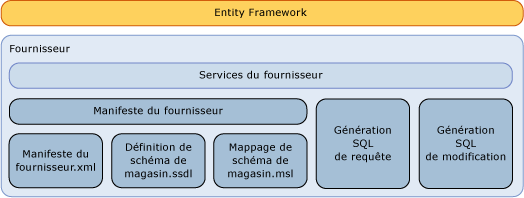

# &#201;criture d&#39;un fournisseur de donn&#233;es Entity Framework
Cette section décrit la manière d'écrire un fournisseur [!INCLUDE[adonet_ef](../../../../../includes/adonet-ef-md.md)] pour prendre en charge une source de données autre que [!INCLUDE[ssNoVersion](../../../../../includes/ssnoversion-md.md)]. [!INCLUDE[adonet_ef](../../../../../includes/adonet-ef-md.md)] inclut un fournisseur qui prend en charge [!INCLUDE[ssNoVersion](../../../../../includes/ssnoversion-md.md)].  
  
## Présentation du modèle de fournisseur Entity Framework  
 [!INCLUDE[adonet_ef](../../../../../includes/adonet-ef-md.md)] est une base de données indépendante et il est possible d'écrire un fournisseur à l'aide du modèle de fournisseur ADO.NET pour se connecter à un jeu divers de sources de données.  
  
 Le fournisseur de données Entity Framework \(construit à l'aide du modèle de fournisseur de données ADO.NET\) effectue les fonctions suivantes :  
  
-   Mappe des types primitifs d'Entity Data Model \(EDM\) aux types de fournisseurs.  
  
-   Expose des fonctions spécifiques au fournisseur.  
  
-   Génère des commandes spécifiques au fournisseur pour un DbQueryCommandTree donné afin de prendre en charge des requêtes [!INCLUDE[adonet_ef](../../../../../includes/adonet-ef-md.md)].  
  
-   Génère des commandes de mise à jour spécifiques au fournisseur pour un DbModificationCommandTree donné pour prendre en charge les mises à jour via [!INCLUDE[adonet_ef](../../../../../includes/adonet-ef-md.md)].  
  
-   Expose des fichiers de mappage pour la définition de schéma du magasin afin de prendre en charge la génération d'un modèle selon une base de données.  
  
-   Expose des métadonnées \(tables et vues, par exemple\) via un modèle conceptuel.  
  
   
  
## Exemple  
 Consultez [Entity Framework Sample Provider](http://go.microsoft.com/fwlink/?LinkId=180616) pour obtenir un exemple de fournisseur [!INCLUDE[adonet_ef](../../../../../includes/adonet-ef-md.md)] prenant en charge une source de données autre que [!INCLUDE[ssNoVersion](../../../../../includes/ssnoversion-md.md)].  
  
## Dans cette section  
 [Génération SQL](../../../../../docs/framework/data/adonet/ef/sql-generation.md)  
  
 [Génération SQL de modification](../../../../../docs/framework/data/adonet/ef/modification-sql-generation.md)  
  
 [Spécification de manifeste du fournisseur](../../../../../docs/framework/data/adonet/ef/provider-manifest-specification.md)  
  
## Voir aussi  
 [Utilisation de fournisseurs de données](../../../../../docs/framework/data/adonet/ef/working-with-data-providers.md)