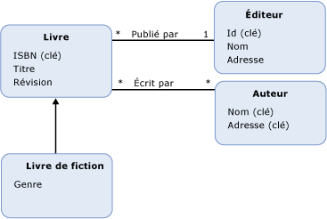

# Entity Data Model : héritage
Le modèle EDM (Entity Data Model) prend en charge l’héritage pour [types d’entités](../../../../docs/framework/data/adonet/entity-type.md). L'héritage dans le modèle EDM est semblable à l'héritage pour les classes dans les langages de programmation orientés objet. Comme avec les classes dans les langages orientés objet, dans un modèle conceptuel vous pouvez définir un type d’entité (un *type dérivé*) qui hérite d’un autre type d’entité (la *type de base*). Toutefois, contrairement aux classes de programmation orientée objet, dans un modèle conceptuel au type dérivé hérite toujours l’ensemble du [propriétés](../../../../docs/framework/data/adonet/property.md) et [propriétés de navigation](../../../../docs/framework/data/adonet/navigation-property.md) du type de base. Vous ne pouvez pas remplacer les propriétés héritées dans un type dérivé.  
  
 Dans un modèle conceptuel, vous pouvez générer des hiérarchies d'héritage dans lesquelles un type dérivé hérite d'un autre type dérivé. Le type en haut de la hiérarchie (un type dans la hiérarchie qui n’est pas un type dérivé) est appelé le *type racine*. Dans une hiérarchie d’héritage, le [clé d’entité](../../../../docs/framework/data/adonet/entity-key.md) doit être défini sur le type racine.  
  
 Vous ne pouvez pas générer de hiérarchies d'héritage dans lesquelles un type dérivé hérite de plusieurs types. Par exemple, dans un modèle conceptuel avec un type d'entité `Book`, vous pouvez définir les types dérivés `FictionBook` et `NonFictionBook` qui héritent de `Book`. Toutefois, vous ne pouvez pas ensuite définir un type qui hérite à la fois du type `FictionBook` et du type `NonFictionBook`.  
  
## Exemple  
 Le diagramme suivant montre un modèle conceptuel avec quatre types d'entité : `Book`, `FictionBook`, `Publisher` et `Author`. Le type d'entité `FictionBook` est un type dérivé qui hérite du type d'entité `Book`. Le type `FictionBook` hérite les propriétés `ISBN (Key)`, `Title` et `Revision`, et définit une propriété supplémentaire appelée `Genre`.  
  
   
  
 Le [ADO.NET Entity Framework](../../../../docs/framework/data/adonet/ef/index.md) utilise un langage spécifique à un domaine (DSL) appelé conceptual schema definition language ([CSDL](../../../../docs/framework/data/adonet/ef/language-reference/csdl-specification.md)) pour définir des modèles conceptuels. Le CSDL suivant définit un type d'entité, `FictionBook`, qui hérite du type `Book` (comme dans le diagramme ci-dessus) :  
  
 [!code-xml[EDM_Example_Model#DerivedType](../../../../samples/snippets/xml/VS_Snippets_Data/edm_example_model/xml/books5.edmx#derivedtype)]  
  
## Voir aussi  
 [Concepts clés d’Entity Data Model](../../../../docs/framework/data/adonet/entity-data-model-key-concepts.md)  
 [Entity Data Model](../../../../docs/framework/data/adonet/entity-data-model.md)
