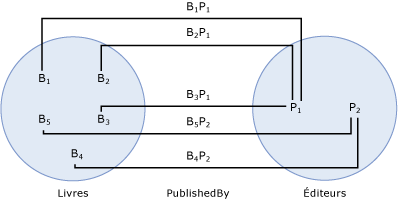

# jeu d'entités
Un *jeu d’entités* est un conteneur logique pour les instances d’un [type d’entité](../../../../docs/framework/data/adonet/entity-type.md) et les instances de n’importe quel type dérivé de ce type d’entité. (Pour plus d’informations sur les types dérivés, consultez [Entity Data Model : héritage](../../../../docs/framework/data/adonet/entity-data-model-inheritance.md).) La relation entre un type d'entité et un jeu d'entités est analogue à la relation entre une ligne et une table dans une base de données relationnelle : comme une ligne, un type d'entité décrit la structure des données, et, comme une table, un jeu d'entités contient des instances d'une structure donnée. Un jeu d'entités n'est pas une construction de modélisation des données ; il ne décrit pas la structure des données. Au lieu de cela, un jeu d'entités fournit une construction pour un environnement d'hébergement ou de stockage (tel que le Common Language Runtime ou une base de données SQL Server) pour regrouper des instances de type d'entité afin qu'elles puissent être mappées à une banque de données.  
  
 Un jeu d’entités est défini dans un [conteneur d’entités](../../../../docs/framework/data/adonet/entity-container.md), qui est un regroupement logique de jeux d’entités et [ensembles d’associations](../../../../docs/framework/data/adonet/association-set.md).  
  
 Pour qu'une instance de type d'entité existe dans un jeu d'entités, les conditions suivantes doivent être remplies :  
  
-   Le type de l'instance est soit le même que le type d'entité sur lequel le jeu d'entités est basé, soit un sous-type du type d'entité.  
  
-   Le [clé d’entité](../../../../docs/framework/data/adonet/entity-key.md) pour l’instance est unique dans le jeu d’entités.  
  
-   L'instance n'existe dans aucun autre jeu d'entités.  
  
    > [!NOTE]
    >  Plusieurs jeux d'entités peuvent être définis à l'aide du même type d'entité, mais une instance d'un type d'entité donné ne peut exister que dans un seul jeu d'entités.  
  
 Il n'est pas nécessaire de définir un jeu d'entités pour chaque type d'entité dans un modèle conceptuel.  
  
## Exemple  
 Le diagramme suivant montre un modèle conceptuel avec trois types d'entités : `Book`, `Publisher` et `Author`.  
  
   
  
 Le diagramme suivant montre deux jeux d'entités (`Books` et `Publishers`) et un ensemble d'associations (`PublishedBy`) selon le modèle conceptuel présenté ci-dessus. BI dans le `Books` jeu d’entités représente une instance de la `Book` type d’entité en cours d’exécution. De même, Pj représentent un `Publisher` d’instance dans le `Publishers` jeu d’entités. BiPj représente une instance de la `PublishedBy` association dans le `PublishedBy` ensemble d’associations.  
  
   
  
 Le [ADO.NET Entity Framework](../../../../docs/framework/data/adonet/ef/index.md) utilise un langage spécifique à un domaine (DSL) appelé conceptual schema definition language ([CSDL](../../../../docs/framework/data/adonet/ef/language-reference/csdl-specification.md)) pour définir des modèles conceptuels. Le CSDL suivant définit un conteneur d'entités avec un jeu d'entités pour chaque type d'entité dans le modèle conceptuel présenté ci-dessus. Notez que le nom et le type d'entité pour chaque jeu d'entités sont définis à l'aide d'attributs XML.  
  
 [!code-xml[EDM_Example_Model#EntityContainerExample](../../../../samples/snippets/xml/VS_Snippets_Data/edm_example_model/xml/books.edmx#entitycontainerexample)]  
  
 Il est possible de définir des jeux d'entités multiples par type (MEST). Le CSDL suivant définit un conteneur d'entités avec deux jeux d'entités pour le type d'entité `Book` :  
  
 [!code-xml[EDM_Example_Model#MESTExample](../../../../samples/snippets/xml/VS_Snippets_Data/edm_example_model/xml/books2.edmx#mestexample)]  
  
## Voir aussi  
 [Concepts clés d’Entity Data Model](../../../../docs/framework/data/adonet/entity-data-model-key-concepts.md)  
 [Entity Data Model](../../../../docs/framework/data/adonet/entity-data-model.md)
