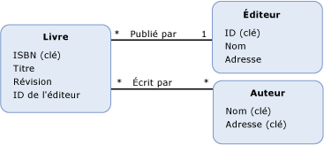

# Propriété de clé étrangèreforeign key property
A *propriété de clé étrangère* dans le modèle EDM (Entity Data Model) est un type primitif [propriété](../../../../docs/framework/data/adonet/property.md) (ou un ensemble de propriétés de type primitif) sur un [type d’entité](../../../../docs/framework/data/adonet/entity-type.md) qui contient le [clé d’entité](../../../../docs/framework/data/adonet/entity-key.md) d’un autre type d’entité.A *foreign key property* in the Entity Data Model (EDM) is a primitive type [property](../../../../docs/framework/data/adonet/property.md) (or a set of primitive type properties) on an [entity type](../../../../docs/framework/data/adonet/entity-type.md) that contains the [entity key](../../../../docs/framework/data/adonet/entity-key.md) of another entity type.  
  
 Une propriété de clé étrangère est analogue à une colonne clé étrangère dans une base de données relationnelle.A foreign key property is analogous to a foreign key column in a relational database. De la même façon que les colonnes clés étrangères sont utilisés dans une base de données relationnelle pour créer des relations entre les lignes des tables, des propriétés de clé étrangère dans un modèle conceptuel sont utilisées pour établir [associations](../../../../docs/framework/data/adonet/association-type.md) entre types d’entité.In the same way that foreign key columns are used in a relational database to create relationships between rows in tables, foreign key properties in a conceptual model are used to establish [associations](../../../../docs/framework/data/adonet/association-type.md) between entity types. A [contrainte d’intégrité référentielle](../../../../docs/framework/data/adonet/referential-integrity-constraint.md) est utilisé pour définir une association entre deux types d’entité lorsqu’un des types possède une propriété de clé étrangère.A [referential integrity constraint](../../../../docs/framework/data/adonet/referential-integrity-constraint.md) is used to define an association between two entity types when one of the types has a foreign key property.  
  
## ExempleExample  
 Le diagramme suivant montre un modèle conceptuel avec trois types d'entités : `Book`, `Publisher` et `Author`.The diagram below shows a conceptual model with three entity types: `Book`, `Publisher`, and `Author`. Le type d'entité `Book` a une propriété, `PublisherId`, qui référence la clé d'entité du type d'entité `Publisher` lorsque vous définissez une contrainte d'intégrité référentielle sur l'association `PublishedBy`.The `Book` entity type has a property, `PublisherId`, that references the entity key of the `Publisher` entity type when you define a referential integrity constraint on the `PublishedBy` association.  
  
   
  
 Le [ADO.NET Entity Framework](../../../../docs/framework/data/adonet/ef/index.md) utilise un langage spécifique à un domaine (DSL) appelé conceptual schema definition language ([CSDL](../../../../docs/framework/data/adonet/ef/language-reference/csdl-specification.md)) pour définir des modèles conceptuels.The [ADO.NET Entity Framework](../../../../docs/framework/data/adonet/ef/index.md) uses a domain-specific language (DSL) called conceptual schema definition language ([CSDL](../../../../docs/framework/data/adonet/ef/language-reference/csdl-specification.md)) to define conceptual models. Le CSDL suivant utilise la propriété de clé étrangère `PublisherId` pour définir une contrainte d'intégrité référentielle sur l'association `PublishedBy` présentée dans le modèle conceptuel ci-dessus.The following CSDL uses the foreign key property `PublisherId` to define a referential integrity constraint on the `PublishedBy` association shown in the conceptual model shown above.  
  
 [!code-xml[EDM_Example_Model#RefConstraint](../../../../samples/snippets/xml/VS_Snippets_Data/edm_example_model/xml/books4.edmx#refconstraint)]  
  
## Voir aussiSee Also  
 [Concepts clés d’Entity Data ModelEntity Data Model Key Concepts](../../../../docs/framework/data/adonet/entity-data-model-key-concepts.md)  
 [Entity Data ModelEntity Data Model](../../../../docs/framework/data/adonet/entity-data-model.md)
