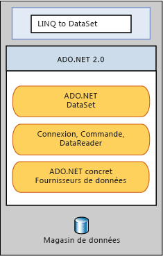

# LINQ to DataSet
[!INCLUDE[linq_dataset](../../../../includes/linq-dataset-md.md)] facilite et accélère l'interrogation de données mises en cache dans un objet <xref:System.Data.DataSet>.  De manière spécifique, [!INCLUDE[linq_dataset](../../../../includes/linq-dataset-md.md)] simplifie l'interrogation en permettant aux développeurs d'écrire des requêtes à partir du langage de programmation proprement dit, plutôt qu'en utilisant un langage de requêtes séparé.  Cela est particulièrement utile pour les développeurs [!INCLUDE[vsprvs](../../../../includes/vsprvs-md.md)] qui peuvent à présent tirer parti de la vérification de la syntaxe au moment de la compilation, des types statiques et de la prise en charge de IntelliSense fournis par le [!INCLUDE[vsprvs](../../../../includes/vsprvs-md.md)] dans leurs requêtes.  
  
 [!INCLUDE[linq_dataset](../../../../includes/linq-dataset-md.md)] peut également être utilisé pour interroger des données qui ont été consolidées à partir d'une ou plusieurs sources de données.  Cela permet plusieurs scénarios qui requièrent de la flexibilité dans la manière dont les données sont représentées et gérées, comme l'interrogation de données agrégées localement et la mise en cache en couche intermédiaire dans les applications Web.  En particulier, les applications génériques de création de rapports, d'analyse et de business intelligence requièrent cette méthode de manipulation.  
  
 La fonctionnalité [!INCLUDE[linq_dataset](../../../../includes/linq-dataset-md.md)] est exposée principalement à travers les méthodes d'extension dans les classes <xref:System.Data.DataRowExtensions> et <xref:System.Data.DataTableExtensions>. [!INCLUDE[linq_dataset](../../../../includes/linq-dataset-md.md)] se base sur l'architecture [!INCLUDE[ado_whidbey_long](../../../../includes/ado-whidbey-long-md.md)] existante et n'est pas censé remplacer [!INCLUDE[ado_whidbey_long](../../../../includes/ado-whidbey-long-md.md)] dans le code d'application.  Le code ADO.NET 2.0 existant continuera à fonctionner dans une application [!INCLUDE[linq_dataset](../../../../includes/linq-dataset-md.md)]. La relation de [!INCLUDE[linq_dataset](../../../../includes/linq-dataset-md.md)] avec [!INCLUDE[ado_whidbey_long](../../../../includes/ado-whidbey-long-md.md)] et le magasin de données est illustrée dans le diagramme suivant.  
  
   
  
## Dans cette section  
 [Mise en route](../../../../docs/framework/data/adonet/getting-started-linq-to-dataset.md)  
  
 [Guide de programmation](../../../../docs/framework/data/adonet/programming-guide-linq-to-dataset.md)  
  
## Référence  
 <xref:System.Data.DataTableExtensions>  
  
 <xref:System.Data.DataRowExtensions>  
  
 <xref:System.Data.DataRowComparer>  
  
## Voir aussi  
 [LINQ \(Language\-Integrated Query\)](../Topic/LINQ%20\(Language-Integrated%20Query\).md)   
 [LINQ et ADO.NET](../../../../docs/framework/data/adonet/linq-and-ado-net.md)   
 [ADO.NET](../../../../docs/framework/data/adonet/index.md)