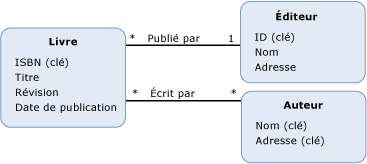

# fonction d&#233;finie par mod&#232;le
Une *fonction définie par modèle* est une fonction qui est définie dans un modèle conceptuel.  Le corps d'une fonction définie par modèle est exprimé en [Entity SQL](../../../../docs/framework/data/adonet/ef/language-reference/entity-sql-language.md), ce qui permet d'exprimer la fonction indépendamment de règles ou des langages pris en charge dans la source de données.  
  
 Une définition pour une fonction définie par modèle contient les informations suivantes :  
  
-   Nom de la fonction.  \(Requis\)  
  
-   Type de la valeur de retour.  \(facultatif\)  
  
    > [!NOTE]
    >  Si aucun type de retour n'est spécifié, la valeur de retour est void.  
  
-   Informations sur les paramètres.  \(facultatif\)  
  
-   Expression [Entity SQL](../../../../docs/framework/data/adonet/ef/language-reference/entity-sql-language.md) qui définit le corps de la fonction.  
  
 Notez que les fonctions définies par modèle ne prennent pas en charge les paramètres de sortie.  Cette restriction est en place de manière à ce que des fonctions définies par modèle puissent être composées.  
  
## Exemple  
 Le diagramme suivant montre un modèle conceptuel avec trois types d'entités : `Book`, `Publisher` et `Author`.  
  
   
  
 [ADO.NET Entity Framework](../../../../docs/framework/data/adonet/ef/index.md) utilise un langage spécifique à un domaine \(DSL\), appelé [CSDL](../../../../docs/framework/data/adonet/ef/language-reference/csdl-specification.md) \(Conceptual Schema Definition Language\), pour définir des modèles conceptuels.  Le CSDL suivant définit une fonction dans le modèle conceptuel qui retourne le nombre d'années écoulées depuis la publication d'une instance de `Book` \(dans le diagramme ci\-dessus\).  
  
 [!code-xml[EDM_Example_Model#ModelDefinedFunction](../../../../samples/snippets/xml/VS_Snippets_Data/edm_example_model/xml/books4.edmx#modeldefinedfunction)]  
  
## Voir aussi  
 [Concepts clés d'Entity Data Model](../../../../docs/framework/data/adonet/entity-data-model-key-concepts.md)   
 [Entity Data Model](../../../../docs/framework/data/adonet/entity-data-model.md)   
 [Entity Data Model : types de données primitifs](../../../../docs/framework/data/adonet/entity-data-model-primitive-data-types.md)