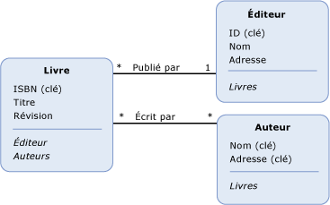

# propriété de navigation
A *propriété de navigation* est une propriété facultative sur un [type d’entité](../../../../docs/framework/data/adonet/entity-type.md) qui permet de naviguer d’une [fin](../../../../docs/framework/data/adonet/association-end.md) d’un [association](../../../../docs/framework/data/adonet/association-type.md) à l’autre extrémité. Contrairement à d’autres [propriétés](../../../../docs/framework/data/adonet/property.md), les propriétés de navigation n’acheminent pas de données.  
  
 Une définition de propriété de navigation comprend les éléments suivants :  
  
-   Nom. (Requis)  
  
-   Association faisant l'objet de la navigation. (Requis)  
  
-   Terminaisons de l'association faisant l'objet de la navigation. (Requis)  
  
 Notez que les propriétés de navigation sont facultatives sur les deux types d'entités au niveau des terminaisons d'une association. Si vous définissez une propriété de navigation sur un type d'entité au niveau de la terminaison d'une association, il n'est pas nécessaire de définir une propriété de navigation sur le type d'entité à l'autre terminaison de l'association.  
  
 Le type de données d’une propriété de navigation est déterminé par le [multiplicité](../../../../docs/framework/data/adonet/association-end-multiplicity.md) de sa distance [end d’association](../../../../docs/framework/data/adonet/association-end.md). Par exemple, considérez une propriété de navigation, `OrdersNavProp`, qui existe sur un type d'entité `Customer` et qui navigue dans une association un-à-plusieurs entre `Customer` et `Order`. Étant donné que la terminaison d'association distante pour la propriété de navigation a une multiplicité égale à plusieurs (*), son type de données est une collection (d'`Order`). De même, si une propriété de navigation, `CustomerNavProp`, existe sur le type d'entité `Order`, son type de données est `Customer`, car la multiplicité de la terminaison distante est un (1).  
  
## Exemple  
 Le diagramme suivant montre un modèle conceptuel avec trois types d'entités : `Book`, `Publisher` et `Author`. Les propriétés de navigation, `Publisher` et `Authors`, sont définies sur le type d'entité Book. La propriété de navigation `Books` est définie sur le type d'entité Publisher et le type d'entité `Author`.  
  
   
  
 Le [ADO.NET Entity Framework](../../../../docs/framework/data/adonet/ef/index.md) utilise un langage spécifique à un domaine (DSL) appelé conceptual schema definition language ([CSDL](../../../../docs/framework/data/adonet/ef/language-reference/csdl-specification.md)) pour définir des modèles conceptuels. Le CSDL suivant définit le type d'entité `Book` présenté dans le diagramme ci-dessus :  
  
 [!code-xml[EDM_Example_Model#EntityExample](../../../../samples/snippets/xml/VS_Snippets_Data/edm_example_model/xml/books.edmx#entityexample)]  
  
 Notez que des attributs XML sont utilisés pour communiquer les informations nécessaires pour définir une propriété de navigation. L'attribut `Name` contient le nom de la propriété, `Relationship` contient le nom de l'association faisant l'objet de la navigation, et `FromRole` et `ToRole` contiennent les terminaisons de l'association.  
  
## Voir aussi  
 [Concepts clés d’Entity Data Model](../../../../docs/framework/data/adonet/entity-data-model-key-concepts.md)  
 [Entity Data Model](../../../../docs/framework/data/adonet/entity-data-model.md)
