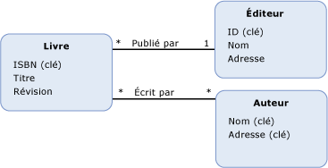

# propriété
*Propriétés* sont la pierre angulaire de [types d’entités](../../../../docs/framework/data/adonet/entity-type.md) et [types complexes](../../../../docs/framework/data/adonet/complex-type.md). Les propriétés définissent la forme et les caractéristiques des données qui sont contenues dans une instance de type d'entité ou une instance de type complexe. Les propriétés dans un modèle conceptuel sont analogues aux propriétés définies sur une classe. De même que les propriétés sur une classe définissent la forme de la classe et acheminent des informations sur les objets, les propriétés dans un modèle conceptuel définissent la forme d'un type d'entité et acheminent des informations sur les instances de type d'entité.  
  
> [!NOTE]
>  Les propriétés, comme décrit dans cette rubrique, sont différentes des propriétés de navigation. Pour plus d’informations, consultez [propriétés de navigation](../../../../docs/framework/data/adonet/navigation-property.md).  
  
 Une définition de propriété contient les informations suivantes :  
  
-   Nom de la propriété. (Requis)  
  
-   Type de propriété. (Requis)  
  
-   Un ensemble de [facettes](../../../../docs/framework/data/adonet/facet.md). (facultatif)  
  
 Une propriété peut contenir des données de type primitif (comme une chaîne, un entier ou une valeur booléenne) ou des données structurées (comme un type complexe). Les propriétés de type primitif sont également appelées des propriétés scalaires. Pour plus d’informations, consultez [Entity Data Model : Types de données primitifs](../../../../docs/framework/data/adonet/entity-data-model-primitive-data-types.md).  
  
> [!NOTE]
>  Un type complexe peut lui-même avoir des propriétés qui sont des types complexes.  
  
## Exemple  
 Le diagramme suivant montre un modèle conceptuel avec trois types d'entités : `Book`, `Publisher` et `Author`. Chaque type d'entité possède plusieurs propriétés, bien que les informations de type pour chaque propriété ne soient pas représentées dans le diagramme. Les propriétés qui sont [clés d’entité](../../../../docs/framework/data/adonet/entity-key.md) sont signalées par (Key).  
  
   
  
 Le [ADO.NET Entity Framework](../../../../docs/framework/data/adonet/ef/index.md) utilise un langage spécifique à un domaine (DSL) appelé conceptual schema definition language ([CSDL](../../../../docs/framework/data/adonet/ef/language-reference/csdl-specification.md)) pour définir des modèles conceptuels. Le CSDL suivant définit le type d'entité `Book` (tel que présenté dans le diagramme ci-dessus) et indique le type et le nom de chaque propriété à l'aide d'attributs XML. Une facette facultative, `Nullable`, est également définie à l'aide d'un attribut XML.  
  
 [!code-xml[EDM_Example_Model#EntityExample](../../../../samples/snippets/xml/VS_Snippets_Data/edm_example_model/xml/books.edmx#entityexample)]  
  
 Il est possible que l'une des propriétés présentées dans le diagramme soit une propriété de type complexe. Par exemple, la propriété `Address` sur le type d'entité `Publisher` peut être une propriété de type complexe composée de plusieurs propriétés scalaires, telles que `StreetAddress`, `City`, `StateOrProvince`, `Country` et `PostalCode`. Voici la représentation CSDL d'un tel type complexe :  
  
 [!code-xml[EDM_Example_Model#ComplexTypeExample](../../../../samples/snippets/xml/VS_Snippets_Data/edm_example_model/xml/books2.edmx#complextypeexample)]  
  
## Voir aussi  
 [Concepts clés d’Entity Data Model](../../../../docs/framework/data/adonet/entity-data-model-key-concepts.md)  
 [Entity Data Model](../../../../docs/framework/data/adonet/entity-data-model.md)
