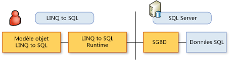

# Modèle objet LINQ to SQL
Dans [!INCLUDE[vbtecdlinq](../../../../../../includes/vbtecdlinq-md.md)], un modèle objet exprimé dans le langage de programmation du développeur est mappé au modèle de données d’une base de données relationnelle. Les opérations sur les données sont ensuite effectuées en fonction du modèle objet.  
  
 Dans ce scénario, vous ne transmettez pas de commandes de base de données (par exemple, `INSERT`) à la base de données. Vous modifiez des valeurs et exécutez des méthodes dans votre modèle objet. Lorsque vous souhaitez interroger la base de données ou lui envoyer des modifications, [!INCLUDE[vbtecdlinq](../../../../../../includes/vbtecdlinq-md.md)] traduit vos demandes en commandes SQL appropriées et envoie ces commandes à la base de données.  
  
   
  
 Les éléments essentiels dans les [!INCLUDE[vbtecdlinq](../../../../../../includes/vbtecdlinq-md.md)] modèle d’objet et la relation entre ces éléments dans le modèle de données relationnelles sont résumées dans le tableau suivant :  
  
|Modèle d'objet LINQ to SQL|Modèle de données relationnel|  
|------------------------------|---------------------------|  
|Classe d'entité|Table|  
|Membre de classe|Colonne|  
|Association|Relation de clé étrangère|  
|Méthode|Procédure stockée ou fonction|  
  
> [!NOTE]
>  Les descriptions suivantes supposent que vous possédez des connaissances de base sur le modèle de données relationnel et ses règles.  
  
## Classes d'entité et tables de base de données LINQ to SQL  
 Dans [!INCLUDE[vbtecdlinq](../../../../../../includes/vbtecdlinq-md.md)], une table de base de données est représentée par une *classe d’entité*. Une classe d’entité est similaire aux autres classes si ce n’est que vous pouvez l’annoter en utilisant des informations spéciales qui l’associent à une table de base de données. Pour procéder à cette annotation, ajoutez un attribut personnalisé (<xref:System.Data.Linq.Mapping.TableAttribute>) à votre déclaration de classe, comme dans l'exemple suivant :  
  
### Exemple  
 [!code-csharp[DLinqObjectModel#1](../../../../../../samples/snippets/csharp/VS_Snippets_Data/DLinqObjectModel/cs/Program.cs#1)]
 [!code-vb[DLinqObjectModel#1](../../../../../../samples/snippets/visualbasic/VS_Snippets_Data/DLinqObjectModel/vb/Module1.vb#1)]  
  
 Seules les instances de classes déclarées comme des tables (classes d'entité) peuvent être enregistrées dans la base de données.  
  
 Pour plus d’informations, consultez la section de l’attribut de la Table de [mappage basé sur l’attribut](../../../../../../docs/framework/data/adonet/sql/linq/attribute-based-mapping.md).  
  
## Membres de classe et colonnes de base de données LINQ to SQL  
 Vous pouvez non seulement associer des classes à des tables, mais également désigner des champs ou des propriétés pour représenter des colonnes de base de données. À cette fin, [!INCLUDE[vbtecdlinq](../../../../../../includes/vbtecdlinq-md.md)] définit l'attribut <xref:System.Data.Linq.Mapping.ColumnAttribute>, comme dans l'exemple suivant :  
  
### Exemple  
 [!code-csharp[DLinqObjectModel#2](../../../../../../samples/snippets/csharp/VS_Snippets_Data/DLinqObjectModel/cs/Program.cs#2)]
 [!code-vb[DLinqObjectModel#2](../../../../../../samples/snippets/visualbasic/VS_Snippets_Data/DLinqObjectModel/vb/Module1.vb#2)]  
  
 Seuls les champs et les propriétés mappés à des colonnes sont rendus persistants ou récupérés dans la base de données. Ceux qui ne sont pas déclarés comme des colonnes sont considérés comme des éléments temporaires de votre logique d'application.  
  
 L'attribut <xref:System.Data.Linq.Mapping.ColumnAttribute> possède diverses propriétés que vous pouvez utiliser pour personnaliser les membres qui représentent des colonnes (par exemple, désigner un membre comme représentant d'une colonne de clé primaire). Pour plus d’informations, consultez la section de l’attribut de colonne de [mappage basé sur l’attribut](../../../../../../docs/framework/data/adonet/sql/linq/attribute-based-mapping.md).  
  
## Associations et relations de clé étrangère de base de données LINQ to SQL  
 Dans [!INCLUDE[vbtecdlinq](../../../../../../includes/vbtecdlinq-md.md)], représentent des associations de base de données (par exemple, la clé étrangère pour les relations de clé primaire) en appliquant la <xref:System.Data.Linq.Mapping.AssociationAttribute> attribut. Dans le segment de code, suivant le `Order` classe contient un `Customer` propriété qui a un <xref:System.Data.Linq.Mapping.AssociationAttribute> attribut. Cette propriété et son attribut fournissent à la classe `Order` une relation avec la classe `Customer`.  
  
 L'exemple de code suivant présente la propriété `Customer` de la classe `Order`.  
  
### Exemple  
 [!code-csharp[DLinqObjectModel#3](../../../../../../samples/snippets/csharp/VS_Snippets_Data/DLinqObjectModel/cs/northwind.cs#3)]
 [!code-vb[DLinqObjectModel#3](../../../../../../samples/snippets/visualbasic/VS_Snippets_Data/DLinqObjectModel/vb/northwind.vb#3)]  
  
 Pour plus d’informations, consultez la section AssociationAttribute de [mappage basé sur l’attribut](../../../../../../docs/framework/data/adonet/sql/linq/attribute-based-mapping.md).  
  
## Méthodes et procédures stockées de base de données LINQ to SQL  
 [!INCLUDE[vbtecdlinq](../../../../../../includes/vbtecdlinq-md.md)] prend en charge des procédures stockées et des fonctions définies par l'utilisateur. Dans [!INCLUDE[vbtecdlinq](../../../../../../includes/vbtecdlinq-md.md)], vous mappez ces abstractions définies par la base de données pour les objets de client afin que vous pouvez y accéder de manière fortement typée à partir du code client. Les signatures de méthode sont aussi semblables que possible aux signatures des procédures et fonctions définies dans la base de données. Vous pouvez utiliser IntelliSense pour découvrir ces méthodes.  
  
 Un jeu de résultats retourné par un appel à une procédure mappée est une collection fortement typée.  
  
 [!INCLUDE[vbtecdlinq](../../../../../../includes/vbtecdlinq-md.md)] mappe des procédures stockées et des fonctions à des méthodes en utilisant les attributs <xref:System.Data.Linq.Mapping.FunctionAttribute> et <xref:System.Data.Linq.Mapping.ParameterAttribute>. Les méthodes qui représentent des procédures stockées se distinguent de celles qui représentent des fonctions définies par l'utilisateur par la propriété <xref:System.Data.Linq.Mapping.FunctionAttribute.IsComposable%2A>. Si cette propriété a la valeur `false` (valeur par défaut), la méthode représente une procédure stockée. Si elle a la valeur `true`, la méthode représente une fonction de base de données.  
  
> [!NOTE]
>  Si vous utilisez [!INCLUDE[vs_current_short](../../../../../../includes/vs-current-short-md.md)], vous pouvez utiliser le [!INCLUDE[vs_ordesigner_long](../../../../../../includes/vs-ordesigner-long-md.md)] pour créer des méthodes mappées à des procédures stockées et des fonctions définies par l'utilisateur.  
  
### Exemple  
 [!code-csharp[DLinqObjectModel#4](../../../../../../samples/snippets/csharp/VS_Snippets_Data/DLinqObjectModel/cs/northwind.cs#4)]
 [!code-vb[DLinqObjectModel#4](../../../../../../samples/snippets/visualbasic/VS_Snippets_Data/DLinqObjectModel/vb/northwind.vb#4)]  
  
 Pour plus d’informations, consultez les sections attribut de fonction, attribut de procédure stockée et l’attribut de paramètre de [mappage basé sur l’attribut](../../../../../../docs/framework/data/adonet/sql/linq/attribute-based-mapping.md) et [de procédures stockées](../../../../../../docs/framework/data/adonet/sql/linq/stored-procedures.md).  
  
## Voir aussi  
 [Mappage basé sur les attributs](../../../../../../docs/framework/data/adonet/sql/linq/attribute-based-mapping.md)  
 [Informations générales](../../../../../../docs/framework/data/adonet/sql/linq/background-information.md)
