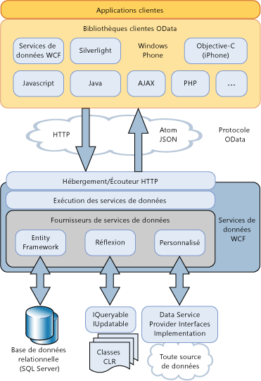

# Vue d'ensemble des services de données WCFWCF Data Services Overview
[!INCLUDE[ssAstoria](../../../../includes/ssastoria-md.md)]permet la création et la consommation des services de données pour le Web ou un intranet à l’aide du [!INCLUDE[ssODataFull](../../../../includes/ssodatafull-md.md)]. enables creation and consumption of data services for the Web or an intranet by using the [!INCLUDE[ssODataFull](../../../../includes/ssodatafull-md.md)]. [!INCLUDE[ssODataShort](../../../../includes/ssodatashort-md.md)]vous permet d’exposer vos données en tant que ressources adressables par URI. enables you to expose your data as resources that are addressable by URIs. Cela vous permet d'accéder et de modifier des données en utilisant la sémantique REST (Representational State Transfer), en particulier les verbes HTTP standard GET, PUT, POST et DELETE.This enables you to access and change data by using the semantics of representational state transfer (REST), specifically the standard HTTP verbs of GET, PUT, POST, and DELETE. Cette rubrique fournit une vue d'ensemble des modèles et des pratiques définies par [!INCLUDE[ssODataShort](../../../../includes/ssodatashort-md.md)], ainsi que des outils fournis par [!INCLUDE[ssAstoria](../../../../includes/ssastoria-md.md)] pour tirer parti d'[!INCLUDE[ssODataShort](../../../../includes/ssodatashort-md.md)] dans les applications basées sur .NET Framework.This topic provides an overview of both the patterns and practices defined by [!INCLUDE[ssODataShort](../../../../includes/ssodatashort-md.md)] and also the facilities provided by [!INCLUDE[ssAstoria](../../../../includes/ssastoria-md.md)] to take advantage of [!INCLUDE[ssODataShort](../../../../includes/ssodatashort-md.md)] in .NET Framework-based applications.  
  
## Adresser des données comme ressourcesAddress Data as Resources  
 [!INCLUDE[ssODataShort](../../../../includes/ssodatashort-md.md)] expose des données comme des ressources adressables par des URI. exposes data as resources that are addressable by URIs. Les chemins d’accès aux ressources sont construits selon les conventions de relation d’entité de l’Entity Data Model.The resource paths are constructed based on the entity-relationship conventions of the Entity Data Model. Dans ce modèle, les entités représentent des unités opérationnelles de données dans un domaine d’application, telles que les clients, les commandes, les éléments et les produits.In this model, entities represent operational units of data in an application domain, such as customers, orders, items, and products. Pour plus d’informations, consultez [Entity Data Model](../../../../docs/framework/data/adonet/entity-data-model.md).For more information, see [Entity Data Model](../../../../docs/framework/data/adonet/entity-data-model.md).  
  
 Dans [!INCLUDE[ssODataShort](../../../../includes/ssodatashort-md.md)], vous adressez des ressources d'entité comme un jeu d'entités qui contient des instances de types d'entité.In [!INCLUDE[ssODataShort](../../../../includes/ssodatashort-md.md)], you address entity resources as an entity set that contains instances of entity types. Par exemple, l’URI `http://services.odata.org/Northwind/Northwind.svc/Customers('ALFKI')/Orders` retourne toutes les commandes à partir de la `Northwind` service de données qui sont associées au client avec un `CustomerID` valeur`ALFKI.`For example, the URI `http://services.odata.org/Northwind/Northwind.svc/Customers('ALFKI')/Orders` returns all of the orders from the `Northwind` data service that are related to the customer with a `CustomerID` value of `ALFKI.`  
  
 Les expressions de requête vous permettent d'effectuer des opérations de requête traditionnelles sur des ressources, telles que filtrer, trier et paginer.Query expressions enable you to perform traditional query operations against resources, such as filtering, sorting, and paging. Par exemple, l'URI `http://services.odata.org/Northwind/Northwind.svc/Customers('ALFKI')/Orders?$filter=Freight gt 50` filtre les ressources de façon à retourner uniquement les commandes dont le coût de fret est supérieur à 50 $.For example, the URI `http://services.odata.org/Northwind/Northwind.svc/Customers('ALFKI')/Orders?$filter=Freight gt 50` filters the resources to return only the orders with a freight cost of more than $50. Pour plus d’informations, consultez [accès aux ressources de Service de données](../../../../docs/framework/data/wcf/accessing-data-service-resources-wcf-data-services.md).For more information, see [Accessing Data Service Resources](../../../../docs/framework/data/wcf/accessing-data-service-resources-wcf-data-services.md).  
  
## Accès aux données interopérablesInteroperable Data Access  
 [!INCLUDE[ssODataShort](../../../../includes/ssodatashort-md.md)]s’appuie sur des protocoles Internet standard pour rendre les services de données interactifs avec les applications qui n’utilisent pas le .NET Framework. builds on standard Internet protocols to make data services interoperable with applications that do not use the .NET Framework. Étant donné que vous pouvez utiliser des URI standard pour adresser des données, votre application peut accéder et les données modifiées à l’aide de la sémantique de representational state transfer (REST), en particulier les verbes HTTP standard GET, PUT, post-déploiement et supprimer.Because you can use standard URIs to address data, your application can access and change data by using the semantics of representational state transfer (REST), specifically the standard HTTP verbs of GET, PUT, POST, and DELETE. De cette manière, vous pouvez accéder à ces services depuis tout client qui peut analyser et accéder aux données transmises sur des protocoles HTTP standard.This enables you to access these services from any client that can parse and access data that is transmitted over standard HTTP protocols.  
  
 [!INCLUDE[ssODataShort](../../../../includes/ssodatashort-md.md)] définit un jeu d'extensions à Atom Publishing Protocol (AtomPub). defines a set of extensions to the Atom Publishing Protocol (AtomPub). Il prend en charge les requêtes et les réponses HTTP sous plusieurs formats de données pour prendre en charge des plateformes et des applications clientes diverses.It supports HTTP requests and responses in more than one data format to accommodate various client applications and platforms. Un flux [!INCLUDE[ssODataShort](../../../../includes/ssodatashort-md.md)] peut représenter des données dans Atom, JSON (JavaScript Object Notation), et sous forme de XML ordinaire.An [!INCLUDE[ssODataShort](../../../../includes/ssodatashort-md.md)] feed can represent data in Atom, JavaScript Object Notation (JSON), and as plain XML. Bien qu'Atom soit le format par défaut, le format du flux est spécifié dans l'en-tête de la requête HTTP.While Atom is the default format, the format of the feed is specified in the header of the HTTP request. Pour plus d’informations, consultez [OData : Format Atom](http://go.microsoft.com/fwlink/?LinkID=185794) et [OData : Format JSON](http://go.microsoft.com/fwlink/?LinkID=185795).For more information, see [OData: Atom Format](http://go.microsoft.com/fwlink/?LinkID=185794) and [OData: JSON Format](http://go.microsoft.com/fwlink/?LinkID=185795).  
  
 Lors de la publication des données comme un [!INCLUDE[ssODataShort](../../../../includes/ssodatashort-md.md)] flux, [!INCLUDE[ssAstoria](../../../../includes/ssastoria-md.md)] s’appuie sur d’autres outils Internet existants pour les opérations telles que la mise en cache et l’authentification.When publishing data as an [!INCLUDE[ssODataShort](../../../../includes/ssodatashort-md.md)] feed, [!INCLUDE[ssAstoria](../../../../includes/ssastoria-md.md)] relies on other existing Internet facilities for such operations as caching and authentication. Pour ce faire, [!INCLUDE[ssAstoria](../../../../includes/ssastoria-md.md)] s’intègre aux applications d’hébergement existantes et des services, tels que ASP.NET, Windows Communication Foundation (WCF) et Internet Information Services (IIS).To accomplish this, [!INCLUDE[ssAstoria](../../../../includes/ssastoria-md.md)] integrates with existing hosting applications and services, such as ASP.NET, Windows Communication Foundation (WCF), and Internet Information Services (IIS).  
  
## Indépendance du stockageStorage Independence  
 Même si les ressources sont adressées selon un modèle relation-entité, [!INCLUDE[ssAstoria](../../../../includes/ssastoria-md.md)] expose les flux [!INCLUDE[ssODataShort](../../../../includes/ssodatashort-md.md)] indépendamment de la source de données sous-jacente.Although resources are addressed based on an entity-relationship model, [!INCLUDE[ssAstoria](../../../../includes/ssastoria-md.md)] expose [!INCLUDE[ssODataShort](../../../../includes/ssodatashort-md.md)] feeds regardless of the underlying data source. Après l'acceptation par [!INCLUDE[ssAstoria](../../../../includes/ssastoria-md.md)] d'une requête HTTP pour une ressource identifiée par un URI, la requête est désérialisée et une représentation de cette requête est passée à un fournisseur [!INCLUDE[ssAstoria](../../../../includes/ssastoria-md.md)].After [!INCLUDE[ssAstoria](../../../../includes/ssastoria-md.md)] accepts an HTTP request for a resource that a URI identifies, the request is deserialized and a representation of that request is passed to an [!INCLUDE[ssAstoria](../../../../includes/ssastoria-md.md)] provider. Ce fournisseur traduit la demande dans un format spécifique à la source de données et exécute la demande sur la source de données sous-jacente.This provider translates the request into a data source-specific format and executes the request on the underlying data source. [!INCLUDE[ssAstoria](../../../../includes/ssastoria-md.md)] effectue l'indépendance de stockage en séparant le modèle conceptuel qui adresse des ressources prescrites par [!INCLUDE[ssODataShort](../../../../includes/ssodatashort-md.md)] du schéma spécifique de la source de données sous-jacente. achieves storage independence by separating the conceptual model that addresses resources prescribed by [!INCLUDE[ssODataShort](../../../../includes/ssodatashort-md.md)] from the specific schema of the underlying data source.  
  
 [!INCLUDE[ssAstoria](../../../../includes/ssastoria-md.md)] s'intègre à ADO.NET Entity Framework pour vous permettre de créer des services de données qui exposent des données relationnelles. integrates with the ADO.NET Entity Framework to enable you to create data services that expose relational data. Vous pouvez utiliser les outils Entity Data Model pour créer un modèle de données qui contient des ressources adressables en tant qu'entités et définir en même temps le mappage entre ce modèle et les tables dans la base de données sous-jacente.You can use the Entity Data Model tools to create a data model that contains addressable resources as entities and at the same time define the mapping between this model and the tables in the underlying database. Pour plus d’informations, consultez [fournisseur Entity Framework](../../../../docs/framework/data/wcf/entity-framework-provider-wcf-data-services.md).For more information, see [Entity Framework Provider](../../../../docs/framework/data/wcf/entity-framework-provider-wcf-data-services.md).  
  
 [!INCLUDE[ssAstoria](../../../../includes/ssastoria-md.md)]vous permet également de créer des services de données qui exposent les structures de données qui retournent une implémentation de la <xref:System.Linq.IQueryable%601> interface. also enables you to create data services that expose any data structures that return an implementation of the <xref:System.Linq.IQueryable%601> interface. De cette manière, vous pouvez créer des services de données qui exposent des données à partir de types .NET Framework.This enables you to create data services that expose data from .NET Framework types. Les opérations de création, de mise à jour et de suppression sont prises en charge lorsque vous implémentez également l'interface <xref:System.Data.Services.IUpdatable>.Create, update, and delete operations are supported when you also implement the <xref:System.Data.Services.IUpdatable> interface. Pour plus d’informations, consultez [fournisseur de réflexion](../../../../docs/framework/data/wcf/reflection-provider-wcf-data-services.md).For more information, see [Reflection Provider](../../../../docs/framework/data/wcf/reflection-provider-wcf-data-services.md).  
  
 Pour obtenir une illustration de la manière [!INCLUDE[ssAstoria](../../../../includes/ssastoria-md.md)] s’intègre avec ces fournisseurs de données, consultez le diagramme architectural plus loin dans cette rubrique.For an illustration of how [!INCLUDE[ssAstoria](../../../../includes/ssastoria-md.md)] integrates with these data providers, see the architectural diagram later in this topic.  
  
## Logique métier personnaliséeCustom Business Logic  
 [!INCLUDE[ssAstoria](../../../../includes/ssastoria-md.md)]rend facile d’ajouter une logique métier personnalisée à un service de données via des opérations de service et des intercepteurs. makes it easy to add custom business logic to a data service through service operations and interceptors. Les opérations de service sont des méthodes définies sur le serveur qui sont adressables par des URI sous la même forme que des ressources de données.Service operations are methods defined on the server that are addressable by URIs in the same form as data resources. Les opérations de service peuvent également utiliser la syntaxe d'expression de requête pour filtrer, classer et paginer des données retournées par une opération.Service operations can also use query expression syntax to filter, order, and page data returned by an operation. Par exemple, l'URI `http://localhost:12345/Northwind.svc/GetOrdersByCity?city='London'&$orderby=OrderDate&$top=10&$skip=10` représente un appel à une opération de service nommée `GetOrdersByCity` sur le service de données Northwind qui retourne des commandes de clients de Londres et des résultats paginés triés par `OrderDate`.For example, the URI `http://localhost:12345/Northwind.svc/GetOrdersByCity?city='London'&$orderby=OrderDate&$top=10&$skip=10` represents a call to a service operation named `GetOrdersByCity` on the Northwind data service that returns orders for customers from London, with paged results sorted by `OrderDate`. Pour plus d’informations, consultez [les opérations de Service](../../../../docs/framework/data/wcf/service-operations-wcf-data-services.md).For more information, see [Service Operations](../../../../docs/framework/data/wcf/service-operations-wcf-data-services.md).  
  
 Les intercepteurs permettent à la logique d'application personnalisée d'être intégrée dans le traitement des messages de réponse ou de demande par un service de données.Interceptors enable custom application logic to be integrated in the processing of request or response messages by a data service. Les intercepteurs sont appelés lorsqu'une action de requête, d'insertion, de mise à jour ou de suppression a lieu dans le jeu d'entités spécifié.Interceptors are called when a query, insert, update, or delete action occurs on the specified entity set. Un intercepteur peut alors modifier les données, appliquer la stratégie d'autorisation ou même mettre fin à l'opération.An interceptor then may alter the data, enforce authorization policy, or even terminate the operation. Les méthodes d'intercepteur doivent être enregistrées explicitement pour un jeu d'entités donné exposé par un service de données.Interceptor methods must be explicitly registered for a given entity set that is exposed by a data service. Pour plus d’informations, consultez [intercepteurs](../../../../docs/framework/data/wcf/interceptors-wcf-data-services.md).For more information, see [Interceptors](../../../../docs/framework/data/wcf/interceptors-wcf-data-services.md).  
  
## Bibliothèque clientesClient Libraries  
 [!INCLUDE[ssODataShort](../../../../includes/ssodatashort-md.md)]définit un ensemble de modèles uniformes pour l’interaction avec les services de données. defines a set of uniform patterns for interacting with data services. Cela permet de créer des composants réutilisables qui reposent sur ces services, tels que les bibliothèques côté client qui facilitent l’utilisation des services de données.This provides an opportunity to create reusable components that are based on these services, such as client-side libraries that make it easier to consume data services.  
  
 [!INCLUDE[ssAstoria](../../../../includes/ssastoria-md.md)] inclut des bibliothèques clientes pour les applications clientes .NET Framework et Silverlight. includes client libraries for both .NET Framework-based and Silverlight-based client applications. Ces bibliothèques clientes vous permettent d'interagir avec les services de données en utilisant des objets .NET Framework.These client libraries enable you to interact with data services by using .NET Framework objects. Elles prennent également en charge des requêtes basées sur des objets et des requêtes LINQ, le chargement des objets connexes, le suivi des modifications et la résolution d'identité.They also support object-based queries and LINQ queries, loading related objects, change tracking, and identity resolution. Pour plus d’informations, consultez [bibliothèque cliente de WCF Data Services](../../../../docs/framework/data/wcf/wcf-data-services-client-library.md).For more information, see [WCF Data Services Client Library](../../../../docs/framework/data/wcf/wcf-data-services-client-library.md).  
  
 En plus de la [!INCLUDE[ssODataShort](../../../../includes/ssodatashort-md.md)] bibliothèques clientes incluses avec le .NET Framework et Silverlight, il existe d’autres bibliothèques de client qui vous permettent de consommer un [!INCLUDE[ssODataShort](../../../../includes/ssodatashort-md.md)] de flux dans les applications clientes, telles que les applications PHP, AJAX et Java.In addition to the [!INCLUDE[ssODataShort](../../../../includes/ssodatashort-md.md)] client libraries included with the .NET Framework and with Silverlight, there are other client libraries that enable you to consume an [!INCLUDE[ssODataShort](../../../../includes/ssodatashort-md.md)] feed in client applications, such as PHP, AJAX, and Java applications. Pour plus d’informations, consultez la [OData SDK](http://go.microsoft.com/fwlink/?LinkID=185796).For more information, see the [OData SDK](http://go.microsoft.com/fwlink/?LinkID=185796).  
  
## Vue d'ensemble de l'architectureArchitecture Overview  
 Le diagramme suivant illustre la [!INCLUDE[ssAstoria](../../../../includes/ssastoria-md.md)] architecture pour l’exposition [!INCLUDE[ssODataShort](../../../../includes/ssodatashort-md.md)] flux et l’utilisation de ces flux dans [!INCLUDE[ssODataShort](../../../../includes/ssodatashort-md.md)]-bibliothèques clientes :The following diagram illustrates the [!INCLUDE[ssAstoria](../../../../includes/ssastoria-md.md)] architecture for exposing [!INCLUDE[ssODataShort](../../../../includes/ssodatashort-md.md)] feeds and using these feeds in [!INCLUDE[ssODataShort](../../../../includes/ssodatashort-md.md)]-enabled client libraries:  
  
   
  
## Voir aussiSee Also  
 [WCF Data Services 4.5WCF Data Services 4.5](../../../../docs/framework/data/wcf/index.md)  
 [Prise en mainGetting Started](../../../../docs/framework/data/wcf/getting-started-with-wcf-data-services.md)  
 [Définition de WCF Data ServicesDefining WCF Data Services](../../../../docs/framework/data/wcf/defining-wcf-data-services.md)  
 [L’accès à un Service de données (WCF Data Services)Accessing a Data Service (WCF Data Services)](http://msdn.microsoft.com/en-us/1e54a2b9-2ec6-4002-b8f8-c1d8df37c350)  
 [Bibliothèque cliente WCF Data ServicesWCF Data Services Client Library](../../../../docs/framework/data/wcf/wcf-data-services-client-library.md)  
 [Representational State Transfer (REST)Representational State Transfer (REST)](http://go.microsoft.com/fwlink/?LinkId=113919)
