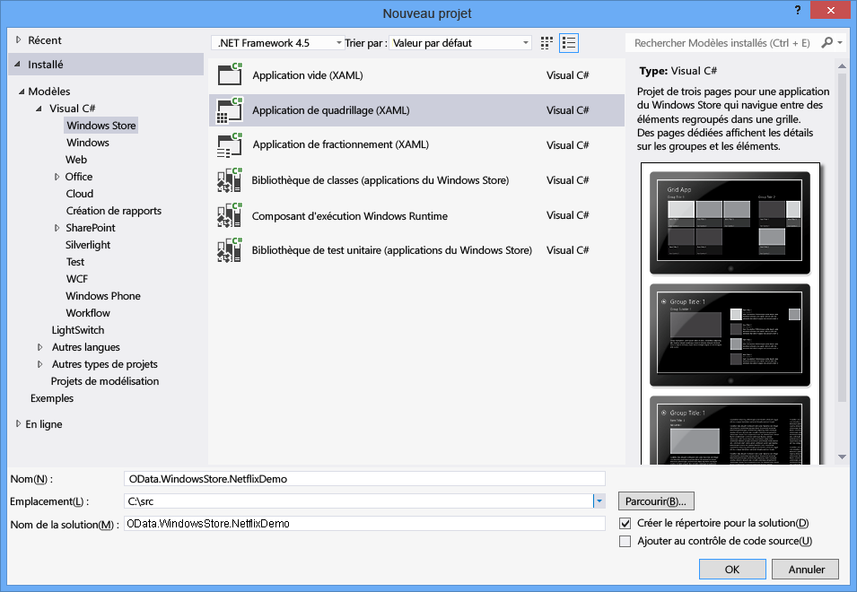
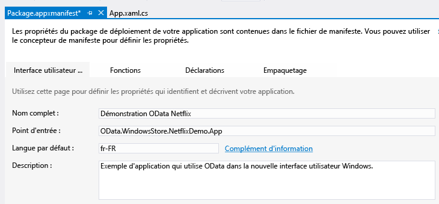
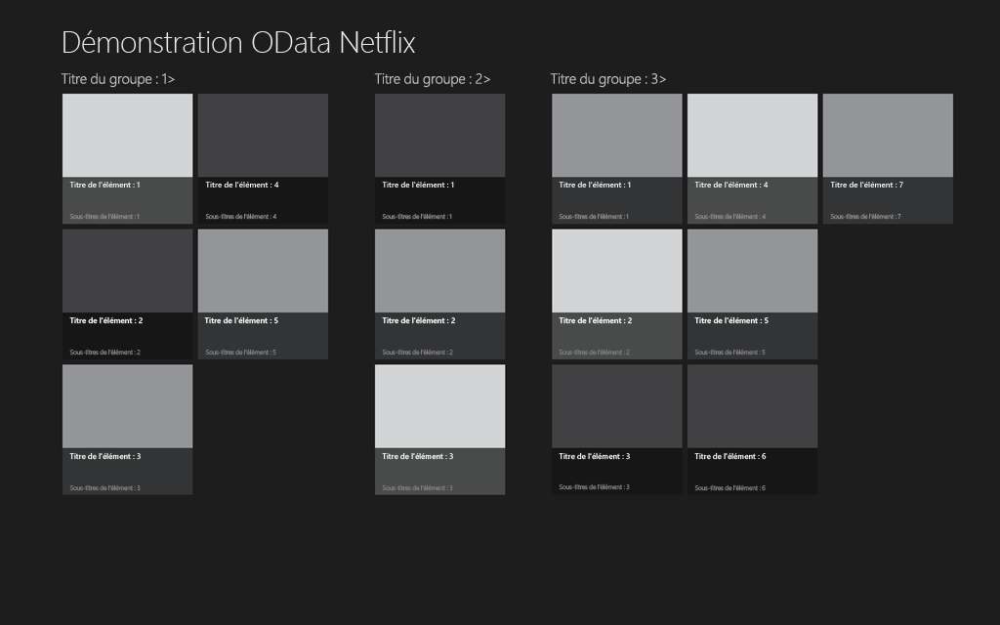
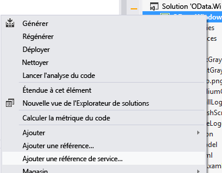
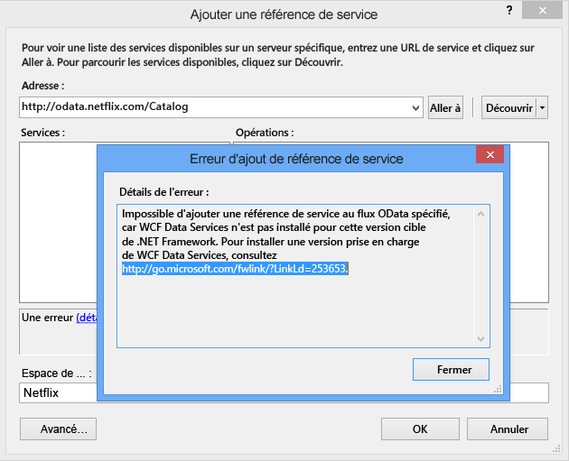
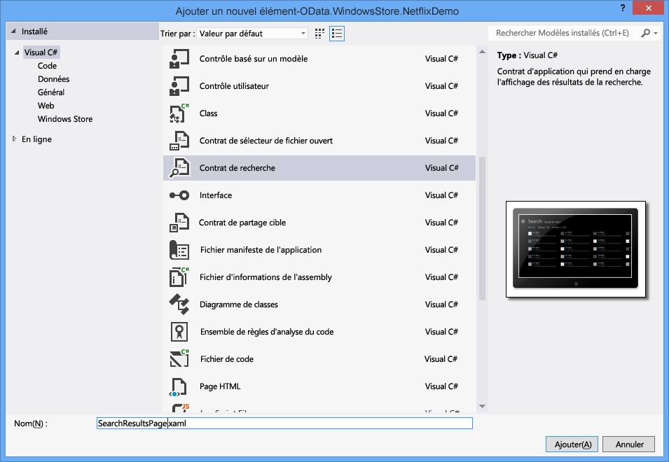

# &#201;criture d&#39;une application du Windows Store qui consomme un service OData
Windows 8 introduit un nouveau type d'application : les applications du Windows Store.  Les applications du Windows Store ont une nouvelle apparence, s'exécutent sur un large éventail de périphériques et sont rendues disponibles dans le Windows Store.  Cette rubrique explique comment écrire une application du Windows Store qui utilise un service OData, spécifiquement le service OData du catalogue NetFlix.  Pour plus d'informations sur les applications du Windows Store, lisez [Prise en main des applications du Windows Store](http://msdn.microsoft.com/library/windows/apps/br211386.aspx).  
  
## Composants requis  
  
1.  [Microsoft Windows 8](http://go.microsoft.com/fwlink/p/?LinkId=266654)  
  
2.  [Microsoft Visual Studio 2012](http://go.microsoft.com/fwlink/p/?LinkId=266655)  
  
3.  [Services de données WCF](http://msdn.microsoft.com/data/bb931106)  
  
#### Création de l'application Grille par défaut du Windows Store  
  
1.  Créez une nouvelle application Grille du Windows Store à l'aide de C\# et XAML.  Nommez l'application OData.WindowsStore.NetflixDemo :  
  
       
  
2.  Ouvrez le Package.appxmanifest et entrez un nom convivial dans la zone de texte Nom complet.  Cela indique le nom de l'application utilisée avec la fonctionnalité de recherche Windows 8.  
  
       
  
3.  Entrez un nom convivial dans l'élément \<AppName\> du fichier App.xaml.  Cela définit le nom de l'application affiché lorsque l'application est lancée :  
  
       
  
4.  Générez et lancez l'application.  L'écran de démarrage de l'application s'affiche en premier.  La capture d'écran ci\-dessous affiche l'écran de démarrage par défaut.  Image utilisée est stockée dans le dossier Assets du projet.  
  
       
  
     L'application est alors affichée.  
  
       
  
     L'application par défaut définit un ensemble de classes dans SampleDataSource.cs : SampleDataGroup et SampleDataItem, qui sont dérivées de SampleDataCommon, qui elle\-même est dérivée de BindableBase.  SampleDataGroup et SampleDataItem sont liés au GridView par défaut.  SampleDataSource.cs se trouve dans le dossier DataModel du projet NetflixDemo.  L'application affiche une collection groupée.  Chaque groupe contient un certain nombre d'éléments, représentés par SampleDataGroup et SampleDataItem, respectivement.  Dans la capture d'écran précédente vous pouvez afficher un groupe appelé Group Title 1 et tous les éléments du groupe affichés ensemble.  
  
     La page principale de l'application est GroupedItemsPage.xaml.  Elle contient un GridView qui affiche les exemples de données créés par la classe SampleDataSource.cs.  Le GroupedItemsPage est chargé par App.xaml.cs dans un appel à rootFrame.Navigate :  
  
    ```csharp  
    if (!rootFrame.Navigate(typeof(GroupedItemsPage), "AllGroups"))  
    {  
        throw new Exception("Failed to create initial page");  
    }  
  
    ```  
  
     Ceci entraîne l'instanciation du GroupedItemsPage et sa méthode LoadState est appelée.  LoadState entraîne la création de l'instance SampleDataSource statique, qui crée une collection d'objets SampleDataGroup.  Chaque objet SampleDataGroup contient une collection d'objets SampleDataItem.  LoadState inscrit la collection d'objets SampleDataGroup dans le DefaultViewModel :  
  
    ```csharp  
    protected override void LoadState(Object navigationParameter, Dictionary<String, Object> pageState)  
    {  
        var sampleDataGroups = SampleDataSource.GetGroups((String)navigationParameter);  
        this.DefaultViewModel["Groups"] = sampleDataGroups;  
    }  
  
    ```  
  
     Le DefaultViewModel est ensuite lié au GridView.  Cela est référencé dans le fichier GroupedItemsPage.xaml lors de la configuration de la liaison de données.  
  
    ```cpp  
    <CollectionViewSource  
                x:Name="groupedItemsViewSource"  
                Source="{Binding Groups}"  
                IsSourceGrouped="true"  
                ItemsPath="TopItems"  
                d:Source="{Binding AllGroups, Source={d:DesignInstance Type=data:SampleDataSource, IsDesignTimeCreatable=True}}"/>  
  
    ```  
  
     CollectionViewSource est utilisé comme proxy pour gérer les collections groupées.  Lorsque la liaison se produit, elle effectue une itération au sein de la collection d'objets SampleDataGroup pour remplir le GridView.  L'attribut ItemsPath indique au CollectionViewSource quelle propriété utiliser sur chaque objet SampleDataGroup pour trouver le SampleDataItems qu'il contient.  Dans ce cas, chaque objet SampleDataGroup contient une collection TopItems d'objets SampleDataItem.  
  
     Pour l'application Netflix, les films sont regroupés par genre.  Ainsi l'application affiche un certain nombre de genres et une liste de films de ce genre.  
  
#### Ajouter une référence de service au service OData Netflix  
  
1.  Avant d'appeler le service OData de Netflix, vous devez ajouter une référence de service.  Cliquez avec le bouton droit sur le projet dans l'Explorateur de solutions et sélectionnez Ajouter une référence de service.  
  
       
  
2.  Entrez l'URL du service OData de Netflix dans la barre d'adresse et cliquez sur OK.  Définir l'espace de noms de la référence de service à Netflix et cliquez sur OK.  
  
       
  
    > [!NOTE]
    >  Si vous n'avez pas encore installé les [outils des services de données WCF pour les applications du Windows Store](http://go.microsoft.com/fwlink/p/?LinkId=266652), vous y serez invité par un message comme ci\-dessus.  Vous devrez télécharger et installer les outils référencés dans le lien pour continuer.  
  
 L'ajout d'une référence de service génère les classes fortement typées que les services de données WCF utiliseront pour analyser l'OData retourné par le service OData de Netflix.  Les classes définies dans SampleDataSource.cs peuvent être liées au GridView ; vous devez donc transférer les données des classes clientes OData générées dans les classes susceptibles d'être liées définies dans SampleDataSource.cs.  Pour cela, vous devez apporter certaines modifications au modèle de données défini dans SampleDataSource.cs.  
  
#### Mettre à jour le modèle de données pour l'application  
  
1.  Remplacez le code existant dans le fichier SampleDataSource.cs par le code de [ce gist](https://gist.github.com/3419288).  Le code mis à jour ajoute une méthode LoadMovies \(à la classe SampleDataSource\) qui effectue une requête sur le service OData de Netflix et remplit une liste de genres \(allGroups\) et dans chaque genre une liste de films.  La classe SampleDataGroup est utilisée pour représenter un genre et la classe SampleDataItem est utilisée pour représenter un film.  
  
    ```csharp  
    public static async void LoadMovies()  
    {  
        IEnumerable<Title> titles = await ((DataServiceQuery<Title>)Context.Titles  
            .Expand("Genres,AudioFormats,AudioFormats/Language,Awards,Cast")  
            .Where(t => t.Rating == "PG")  
            .OrderByDescending(t => t.ReleaseYear)  
            .Take(300)).ExecuteAsync();  
  
        foreach (Title title in titles)  
        {  
            foreach (Genre netflixGenre in title.Genres)  
            {  
                SampleDataGroup genre = GetGroup(netflixGenre.Name);  
                if (genre == null)  
                {  
                    genre = new SampleDataGroup(netflixGenre.Name, netflixGenre.Name, String.Empty, title.BoxArt.LargeUrl, String.Empty);  
                    Instance.AllGroups.Add(genre);  
                }  
                var content = new StringBuilder();  
                // Write additional things to content here if you want them to display in the item detail.  
                genre.Items.Add(new SampleDataItem(title.Id, title.Name, String.Format("{0}rnrn{1} ({2})", title.Synopsis, title.Rating, title.ReleaseYear), title.BoxArt.HighDefinitionUrl ?? title.BoxArt.LargeUrl, "Description", content.ToString()));  
            }  
        }  
    }  
  
    ```  
  
     Le [modèle asynchrone basé sur les tâches](http://go.microsoft.com/fwlink/p/?LinkId=266651) \(TAP\) est utilisé pour obtenir de façon asynchrone 300 films récents évalués dans l'ordre décroissant \(300 \(Take\) recent \(OrderByDescending\) PG\-rated \(Where\)\) de Netflix.  Le reste du code construit SimpleDataItems et SimpleDataGroups à partir des entités retournées dans le flux OData.  
  
     La classe SampleDataSource applique également une méthode simple de recherche.  Dans ce cas, elle effectue une recherche simple des films chargés en mémoire.  
  
    ```csharp  
    public static IEnumerable<SampleDataItem> Search(string searchString)  
    {  
            var regex = new Regex(searchString, RegexOptions.CultureInvariant | RegexOptions.IgnoreCase | RegexOptions.IgnorePatternWhitespace);  
            return Instance.AllGroups  
                .SelectMany(g => g.Items)  
                .Where(m => regex.IsMatch(m.Title) || regex.IsMatch(m.Subtitle))  
                    .Distinct(new SampleDataItemComparer());  
    }  
  
    ```  
  
     En outre, dans SampleDataSource.cs, une classe appelée ExtensionMethods est définie.  Chacune de ces méthodes d'extension utilise le modèle TAP pour permettre au SampleDataSource d'exécuter une requête OData sans se bloquer l'interface utilisateur.  Par exemple, le code suivant utilise la méthode Task.Factory.FromAsync pour implémenter TAP.  
  
    ```csharp  
    public static async Task<IEnumerable<T>> ExecuteAsync<T>(this DataServiceQuery<T> query)  
    {  
        return await Task.Factory.FromAsync<IEnumerable<T>>(query.BeginExecute(null, null), query.EndExecute);  
    }  
  
    ```  
  
     Comme dans l'application par défaut, la page principale de l'application est GroupedItemsPage.  Cette fois, cependant, il affiche les films récupérés auprès de Netflix regroupés par genre.  Lors de l'instanciation du GroupedItemsPage, sa méthode LoadState est appelée.  LoadState entraîne la création de l'instance SampleDataSource statique, en appelant le service OData de Netflix comme décrit précédemment.  LoadState inscrit la collection de genres \(objets SampleDataGroup\) dans le DefaultViewModel :  
  
    ```csharp  
    protected override void LoadState(Object navigationParameter, Dictionary<String, Object> pageState)  
    {  
  
        var sampleDataGroups = SampleDataSource.GetGroups((String)navigationParameter);  
        this.DefaultViewModel["Groups"] = sampleDataGroups;  
    }  
    ```  
  
     Comme décrit précédemment, le DefaultViewModel est ensuite utilisé pour lier les données au GridView.  
  
#### Ajouter un contrat de recherche pour permettre à l'application de participer à la recherche Windows  
  
1.  Ajoutez un contrat de recherche à l'application.  Cela permet à l'application de s'intégrer avec l'expérience de recherche Windows 8.  Nommer le contrat de recherche SearchResultsPage.xaml  
  
       
  
2.  Modifier la ligne 58 de SearchResultsPage.xaml.cs en supprimant les guillemets incorporés qui encadrent queryText.  
  
    ```csharp  
    // Communicate results through the view model  
    this.DefaultViewModel["QueryText"] = queryText;  
    this.DefaultViewModel["Filters"] = filterList;  
    this.DefaultViewModel["ShowFilters"] = filterList.Count > 1;  
  
    ```  
  
3.  Insérez les deux lignes de code suivantes à la ligne 81 dans SearchResultsPage.xaml.cs pour récupérer les résultats de la recherche.  
  
    ```csharp  
    // TODO: Respond to the change in active filter by setting this.DefaultViewModel["Results"]  
                    //       to a collection of items with bindable Image, Title, Subtitle, and Description properties  
                    var searchValue = (string)this.DefaultViewModel["QueryText"];  
                    this.DefaultViewModel["Results"] = new List<SampleDataItem>(SampleDataSource.Search(searchValue));  
  
    ```  
  
 Lorsqu'un utilisateur appelle la fonction de recherche Windows, entre un terme à rechercher et clique sur l'icône de l'application de démonstration Netflix dans la barre de recherche, la méthode LoadState de SearchResultsPage s'exécute.  Le paramètre de navigation envoyé à LoadState contient le texte de la requête.  La méthode Filter\_SelectionChanged est appelée, et appelle à son tour la méthode Search sur la classe SampleDataSource.  Les résultats sont retournés et affichés dans la page SearchResultsPage.xaml.  
  
```csharp  
/// <summary>  
        /// Invoked when a filter is selected using the ComboBox in snapped view state.  
        /// </summary>  
        /// <param name="sender">The ComboBox instance.</param>  
        /// <param name="e">Event data describing how the selected filter was changed.</param>  
        void Filter_SelectionChanged(object sender, SelectionChangedEventArgs e)  
        {  
            // Determine what filter was selected  
            var selectedFilter = e.AddedItems.FirstOrDefault() as Filter;  
            if (selectedFilter != null)  
            {  
                // Mirror the results into the corresponding Filter object to allow the  
                // RadioButton representation used when not snapped to reflect the change  
                selectedFilter.Active = true;  
  
                // TODO: Respond to the change in active filter by setting this.DefaultViewModel["Results"]  
                //       to a collection of items with bindable Image, Title, Subtitle, and Description properties  
                var searchValue = (string)this.DefaultViewModel["QueryText"];  
                this.DefaultViewModel["Results"] = new List<SampleDataItem>(SampleDataSource.Search(searchValue));  
  
                // Ensure results are found  
                object results;  
                ICollection resultsCollection;  
                if (this.DefaultViewModel.TryGetValue("Results", out results) &&  
                    (resultsCollection = results as ICollection) != null &&  
                    resultsCollection.Count != 0)  
                {  
                    VisualStateManager.GoToState(this, "ResultsFound", true);  
                    return;  
                }  
            }  
  
            // Display informational text when there are no search results.  
            VisualStateManager.GoToState(this, "NoResultsFound", true);  
        }  
```  
  
 Pour plus d'informations sur l'intégration de la recherche dans une application, consultez [Recherche : intégration dans la recherche de Windows 8](http://go.microsoft.com/fwlink/p/?LinkId=266650).  
  
## Exécuter l'application  
 Lancez l'application en appuyant sur F5.  Notez que quelques secondes sont nécessaires pour charger les images au démarrage de l'application.  Votre première tentative de recherche ne retourne aucun résultat.  Dans une application réelle, vous souhaiteriez traiter ces deux problèmes.  
  
 L'application appelle le service OData de Netflix, reçoit les données dans les classes clientes OData générées, puis transfère les données aux classes de données susceptibles d'être liées \(SampleDataSource, SampleDataGroup et SampleDataItem\).  Elle utilise ces classes susceptibles d'être liées pour lier les données dans le GridView.  Si vous n'êtes pas familiarisé avec le fonctionnement des liaisons de données XAML, consultez [Comment regrouper des éléments dans une liste ou grille \(applications du Windows Store à l'aide de C\#\/VB\/C\+\+ et XAML\)](http://msdn.microsoft.com/library/windows/apps/xaml/hh780627).