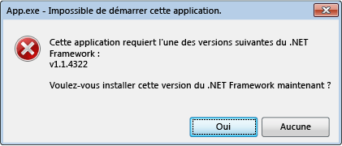

# Erreurs d'initialisation du .NET Framework : gestion de l’expérience utilisateur
Le système d’activation du CLR (Common Langage Runtime) détermine la version du CLR qui sera utilisée pour exécuter du code d’application managé. Dans certains cas, le système d’activation peut ne pas être en mesure de trouver une version du CLR à charger. Cette situation se produit généralement quand une application requiert une version du CLR qui est incorrecte ou non installée sur un ordinateur donné. Si la version demandée est introuvable, le système d’activation du CLR retourne un code d’erreur HRESULT de la fonction ou de l’interface appelée, et peut afficher un message d’erreur destiné à l’utilisateur qui exécute l’application. Cet article fournit une liste de codes HRESULT et montre comment empêcher le message d’erreur de s’afficher.  
  
 Le CLR fournit une infrastructure de journalisation pour vous aider à déboguer des problèmes d’activation du CLR, comme décrit dans [Guide pratique pour déboguer les problèmes d’activation du CLR](../../../docs/framework/deployment/how-to-debug-clr-activation-issues.md). Cette infrastructure ne doit pas être confondue avec les [journaux de liaison d’assembly](../../../docs/framework/tools/fuslogvw-exe-assembly-binding-log-viewer.md), qui sont totalement différents.  
  
## Codes HRESULT d’activation du CLR  
 Les API d’activation du CLR retournent des codes HRESULT pour informer un hôte du résultat d’une opération d’activation. Les hôtes CLR doivent toujours consulter ces valeurs de retour avant de poursuivre d’autres opérations.  
  
-   CLR_E_SHIM_RUNTIMELOAD  
  
-   CLR_E_SHIM_RUNTIMEEXPORT  
  
-   CLR_E_SHIM_INSTALLROOT  
  
-   CLR_E_SHIM_INSTALLCOMP  
  
-   CLR_E_SHIM_LEGACYRUNTIMEALREADYBOUND  
  
-   CLR_E_SHIM_SHUTDOWNINPROGRESS  
  
## Interface utilisateur pour les erreurs d’initialisation  
 Si le système d’activation du CLR ne peut pas charger la version correcte du runtime demandée par une application, il affiche un message d’erreur destiné à informer les utilisateurs que leur ordinateur n’est pas correctement configuré pour exécuter l’application et leur fournit la possibilité de remédier à cette situation. Le message d’erreur suivant s’affiche généralement dans ce cas de figure. L’utilisateur peut choisir **Oui** pour accéder à un site web de Microsoft où il peut télécharger la version du .NET Framework appropriée pour l’application.  
  
   
Message d’erreur standard pour les erreurs d’initialisation  
  
## Résolution de l’erreur d’initialisation  
 En tant que développeur, vous avez plusieurs options pour contrôler le message d’erreur d’initialisation du .NET Framework. Par exemple, vous pouvez utiliser un indicateur d’API pour empêcher l’affichage du message, comme décrit dans la section suivante. Toutefois, vous devez toujours résoudre le problème qui a empêché l’application de charger le runtime demandé. Sinon, votre application peut ne pas s’exécuter, ou certaines fonctionnalités peuvent ne pas être disponibles.  
  
 Pour résoudre les problèmes sous-jacents et fournir une meilleure expérience utilisateur (moins de messages d’erreur), voici nos recommandations :  
  
-   Pour les applications .NET Framework 3.5 (et versions antérieures) : configurez votre application pour prendre en charge .NET Framework 4 ou 4.5 (consultez les [instructions](../../../docs/framework/migration-guide/how-to-configure-an-app-to-support-net-framework-4-or-4-5.md)).  
  
-   Pour les applications .NET Framework 4 : installez le package redistribuable .NET Framework 4 dans le cadre de l’installation de votre application. Consultez [Guide de déploiement du .NET Framework pour les développeurs](../../../docs/framework/deployment/deployment-guide-for-developers.md).  
  
## Contrôle du message d’erreur  
 L’affichage d’un message d’erreur pour communiquer qu’une version du .NET Framework demandée est introuvable peut être considéré comme un service utile ou comme un désagrément mineur pour les utilisateurs. Dans les deux cas, vous pouvez contrôler cette interface utilisateur en passant des indicateurs aux APIs d’activation.  
  
 La méthode [ICLRMetaHostPolicy::GetRequestedRuntime](../../../docs/framework/unmanaged-api/hosting/iclrmetahostpolicy-getrequestedruntime-method.md) reçoit un membre de l’énumération [METAHOST_POLICY_FLAGS](../../../docs/framework/unmanaged-api/hosting/metahost-policy-flags-enumeration.md) comme entrée. Ajoutez l’indicateur METAHOST_POLICY_SHOW_ERROR_DIALOG pour demander un message d’erreur si la version du CLR demandée est introuvable. Par défaut, le message d’erreur n’est pas affiché. (La méthode [ICLRMetaHost::GetRuntime](../../../docs/framework/unmanaged-api/hosting/iclrmetahost-getruntime-method.md) n’accepte pas cet indicateur et ne fournit aucune autre façon d’afficher le message d’erreur.)  
  
 Windows fournit une fonction [SetErrorMode](http://go.microsoft.com/fwlink/p/?LinkID=255242) que vous pouvez utiliser pour déclarer si vous souhaitez ou non afficher les messages d’erreur provoqués par le code qui s’exécute dans votre processus. Spécifiez l’indicateur SEM_FAILCRITICALERRORS pour empêcher l’affichage du message d’erreur.  
  
 Toutefois, dans certains cas, il est important de remplacer le paramètre SEM_FAILCRITICALERRORS défini par un processus d’application. Par exemple, si vous avez un composant COM natif qui héberge le CLR et qui est hébergé dans un processus où SEM_FAILCRITICALERRORS est défini, vous pouvez remplacer l’indicateur, selon l’impact de l’affichage des messages d’erreur dans ce processus d’application spécifique. Dans ce cas, vous pouvez utiliser l’un des indicateurs suivants pour remplacer SEM_FAILCRITICALERRORS :  
  
-   Utilisez METAHOST_POLICY_IGNORE_ERROR_MODE avec la méthode [ICLRMetaHostPolicy::GetRequestedRuntime](../../../docs/framework/unmanaged-api/hosting/iclrmetahostpolicy-getrequestedruntime-method.md).  
  
-   Utilisez RUNTIME_INFO_IGNORE_ERROR_MODE avec la fonction [GetRequestedRuntimeInfo](../../../docs/framework/unmanaged-api/hosting/getrequestedruntimeinfo-function.md).  
  
## Stratégie d’interface utilisateur pour les hôtes fournis par le CLR  
 Le CLR inclut un ensemble d’hôtes pour divers scénarios, qui affichent tous un message d’erreur quand ils rencontrent des problèmes pour charger la version demandée du runtime. Le tableau suivant fournit une liste d’hôtes et leurs stratégies de message d’erreur.  
  
|Hôte CLR|Description|Stratégie de message d’erreur|Le message d’erreur peut-il être désactivé ?|  
|--------------|-----------------|--------------------------|------------------------------------|  
|Hôte EXE managé|Lance des EXE managés.|Affiché en cas de version du .NET Framework manquante|Non|  
|Hôte COM managé|Charge des composants COM managés dans un processus.|Affiché en cas de version du .NET Framework manquante|Oui, en définissant l’indicateur SEM_FAILCRITICALERRORS|  
|Hôte ClickOnce|Lance des applications ClickOnce.|Affiché en cas de version du .NET Framework manquante, depuis [!INCLUDE[net_v45](../../../includes/net-v45-md.md)]|Non|  
|Hôte XBAP|Lance des applications WPF XBAP.|Affiché en cas de version du .NET Framework manquante, depuis [!INCLUDE[net_v45](../../../includes/net-v45-md.md)]|Non|  
  
## Comportement et interface utilisateur de [!INCLUDE[win8](../../../includes/win8-md.md)]  
 Le système d’activation du CLR fournit les mêmes comportement et interface utilisateur sur [!INCLUDE[win8](../../../includes/win8-md.md)] que sur d’autres versions du système d’exploitation Windows, sauf quand il rencontre des problèmes pour charger CLR 2.0. [!INCLUDE[win8](../../../includes/win8-md.md)] inclut [!INCLUDE[net_v45](../../../includes/net-v45-md.md)], qui utilise CLR 4.5. Toutefois, [!INCLUDE[win8](../../../includes/win8-md.md)] n’inclut pas .NET Framework 2.0, 3.0 ni 3.5, qui utilisent tous CLR 2.0. Par conséquent, les applications qui dépendent de CLR 2.0 ne fonctionnent pas sur [!INCLUDE[win8](../../../includes/win8-md.md)] par défaut. À la place, elles affichent la boîte de dialogue suivante pour permettre aux utilisateurs d’installer .NET Framework 3.5. Les utilisateurs peuvent également activer .NET Framework 3.5 dans le Panneau de configuration. Les deux options sont décrites dans l’article [Installer .NET Framework 3.5 sur Windows 10, Windows 8.1 et Windows 8](../../../docs/framework/install/dotnet-35-windows-10.md).  
  
   
Invite à installer le .NET Framework 3.5 à la demande  
  
> [!NOTE]
>  [!INCLUDE[net_v45](../../../includes/net-v45-md.md)] remplace le .NET Framework 4 (CLR 4) sur l’ordinateur de l’utilisateur. Par conséquent, les applications .NET Framework 4 fonctionnent de façon fluide, sans afficher cette boîte de dialogue, sur [!INCLUDE[win8](../../../includes/win8-md.md)].  
  
 Quand le .NET Framework 3.5 est installé, les utilisateurs peuvent exécuter les applications qui dépendent du .NET Framework 2.0, 3.0 ou 3.5 sur leurs ordinateurs [!INCLUDE[win8](../../../includes/win8-md.md)]. Ils peuvent également exécuter des applications .NET Framework 1.0 et 1.1, à condition que ces applications ne soient pas explicitement configurées pour s’exécuter uniquement sur le .NET Framework 1.0 ou 1.1. Consultez [Migration à partir de .NET Framework 1.1](../../../docs/framework/migration-guide/migrating-from-the-net-framework-1-1.md).  
  
 Depuis [!INCLUDE[net_v45](../../../includes/net-v45-md.md)], la journalisation de l’activation du CLR a été améliorée pour inclure les entrées de journal enregistrant quand et pourquoi le message d’erreur d’initialisation est affiché. Pour plus d’informations, consultez [Guide pratique pour déboguer les problèmes d’activation du CLR](../../../docs/framework/deployment/how-to-debug-clr-activation-issues.md).  
  
## Voir aussi  
 [Guide de déploiement pour les développeurs](../../../docs/framework/deployment/deployment-guide-for-developers.md)   
 [Guide pratique pour configurer une application en vue de prendre en charge le .NET Framework 4 ou 4.5](../../../docs/framework/migration-guide/how-to-configure-an-app-to-support-net-framework-4-or-4-5.md)   
 [Guide pratique pour déboguer les problèmes d’activation du CLR](../../../docs/framework/deployment/how-to-debug-clr-activation-issues.md)   
 [Installation du .NET Framework 3.5 sur Windows 10, Windows 8.1 et Windows 8](../../../docs/framework/install/dotnet-35-windows-10.md)
