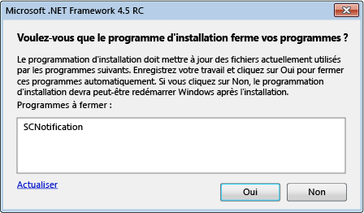

# Réduction des redémarrages système lors des installations de .NET Framework 4.5
Le programme d’installation du [!INCLUDE[net_v45](../../../includes/net-v45-md.md)] utilise le [Gestionnaire de redémarrage](http://go.microsoft.com/fwlink/?LinkId=231425) pour empêcher le redémarrage du système autant que possible pendant l’installation. Si votre programme d’installation de l’application installe .NET Framework, il peut interagir avec le Gestionnaire de redémarrage pour tirer parti de cette fonctionnalité. Pour plus d’informations, consultez [Guide pratique pour obtenir la progression à partir du programme d’installation du .NET Framework 4.5](../../../docs/framework/deployment/how-to-get-progress-from-the-dotnet-installer.md).  
  
## Raisons pour un redémarrage  
 L'installation de [!INCLUDE[net_v45](../../../includes/net-v45-md.md)] requiert un redémarrage du système si une application utilisant .NET Framework 4 est en cours d'utilisation pendant l'installation. En effet, [!INCLUDE[net_v45](../../../includes/net-v45-md.md)] remplace les fichiers .NET Framework 4 et requiert que ces fichiers soient disponibles pendant l'installation. Dans de nombreux cas, le redémarrage peut être évité par la détection préemptive et la fermeture des applications .NET Framework 4 en cours d'utilisation. Toutefois, certaines applications de système ne doivent pas être fermées. Dans ces cas là, un redémarrage ne peut pas être évité.  
  
## Expérience de l'utilisateur final  
 Un utilisateur final qui effectue une installation complète de [!INCLUDE[net_v45](../../../includes/net-v45-md.md)] a la possibilité d'éviter un redémarrage du système si le programme d'installation détecte des applications .NET Framework 4 en cours d'utilisation. Un message répertorie toutes les applications utilisant .NET Framework 4 et fournit la possibilité de fermer les applications avant l'installation. Si l'utilisateur confirme, ces applications sont fermées par le programme d'installation, et un redémarrage du système est évité. Si l'utilisateur ne répond pas au message après un certain temps, l'installation reprend sans fermer aucune application.  
  
 Si le Gestionnaire de redémarrage détecte une situation qui requiert un redémarrage du système même si les applications sont fermées, le message n'est pas affiché.  
  
   
Invite pour fermer les applications .NET Framework en cours d'utilisation  
  
## Utilisation d'un programme d'installation chaîné  
 Si vous voulez redistribuer .NET Framework avec votre application, mais si vous souhaitez utiliser votre propre programme d'installation et votre propre interface utilisateur, vous pouvez inclure (chaîner) le processus d'installation .NET Framework dans votre processus d'installation. Pour plus d’informations sur les installations chaînées, consultez [Guide de déploiement pour les développeurs](../../../docs/framework/deployment/deployment-guide-for-developers.md). Pour réduire le nombre de redémarrages du système dans les installations chaînées, le programme d'installation .NET Framework fournit à votre programme d'installation la liste des applications à fermer. Votre programme d'installation doit fournir ces informations à l'utilisateur via une interface utilisateur telle qu'une boîte de message, obtenir la réponse de l'utilisateur, puis transmettre la réponse au programme d'installation .NET Framework. Pour obtenir un exemple d’un programme d’installation chaîné, consultez l’article [Guide pratique pour obtenir la progression à partir du programme d’installation du .NET Framework 4.5](../../../docs/framework/deployment/how-to-get-progress-from-the-dotnet-installer.md).  
  
 Si vous utilisez un programme d'installation chaîné, mais que vous ne souhaitez pas fournir votre propre boîte de message pour la fermeture des applications, vous pouvez utiliser les options `/showrmui` et `/passive` sur la ligne de commande lorsque vous chaînez le processus d'installation .NET Framework. Lorsque vous utilisez ces options ensemble, le programme d'installation affiche la boîte de message pour fermer les applications qui peuvent l'être pour éviter le redémarrage du système. Cette boîte de message se comporte de la même manière en mode passif que dans l'interface utilisateur. Consultez [Guide de déploiement pour les développeurs](../../../docs/framework/deployment/deployment-guide-for-developers.md) pour les options complètes de la ligne de commande du package redistribuable du .NET Framework.  
  
## Voir aussi  
 [Déploiement](../../../docs/framework/deployment/index.md)  
 [Guide de déploiement pour les développeurs](../../../docs/framework/deployment/deployment-guide-for-developers.md)  
 [How to: Get Progress from the .NET Framework 4.5 Installer](../../../docs/framework/deployment/how-to-get-progress-from-the-dotnet-installer.md)
