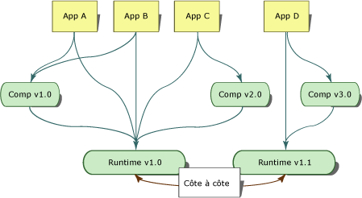
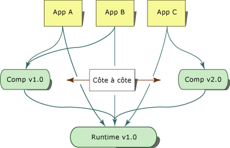

# <a name="side-by-side-execution-in-the-net-framework"></a><span data-ttu-id="d7dc2-102">Exécution côte à côte dans .NET Framework</span><span class="sxs-lookup"><span data-stu-id="d7dc2-102">Side-by-Side Execution in the .NET Framework</span></span>
<span data-ttu-id="d7dc2-103">L'exécution côte à côte désigne la possibilité d'exécuter plusieurs versions d'une application ou d'un composant sur le même ordinateur.</span><span class="sxs-lookup"><span data-stu-id="d7dc2-103">Side-by-side execution is the ability to run multiple versions of an application or component on the same computer.</span></span> <span data-ttu-id="d7dc2-104">Vous pouvez avoir plusieurs versions du Common Language Runtime et plusieurs versions d'applications et de composants qui utilisent une version du runtime sur le même ordinateur simultanément.</span><span class="sxs-lookup"><span data-stu-id="d7dc2-104">You can have multiple versions of the common language runtime, and multiple versions of applications and components that use a version of the runtime, on the same computer at the same time.</span></span>  
  
 <span data-ttu-id="d7dc2-105">L'illustration suivante montre l'utilisation par plusieurs applications de deux versions différentes du runtime sur le même ordinateur.</span><span class="sxs-lookup"><span data-stu-id="d7dc2-105">The following illustration shows several applications using two different versions of the runtime on the same computer.</span></span> <span data-ttu-id="d7dc2-106">Les applications A, B et C utilisent la version 1.0 du runtime, l'application D utilise la version 1.1 du runtime.</span><span class="sxs-lookup"><span data-stu-id="d7dc2-106">Applications A, B, and C use runtime version 1.0, while application D uses runtime version 1.1.</span></span>  
  
 <span data-ttu-id="d7dc2-107"></span><span class="sxs-lookup"><span data-stu-id="d7dc2-107"></span></span>  
<span data-ttu-id="d7dc2-108">Exécution côte à côte de deux versions du runtime</span><span class="sxs-lookup"><span data-stu-id="d7dc2-108">Side-by-side execution of two versions of the runtime</span></span>  
  
 <span data-ttu-id="d7dc2-109">Le .NET Framework se compose du Common Language Runtime et d’une collection d’assemblys qui contiennent les types d’API.</span><span class="sxs-lookup"><span data-stu-id="d7dc2-109">The .NET Framework consists of the common language runtime and a collection of assemblies that contain the API types.</span></span> <span data-ttu-id="d7dc2-110">Le runtime et les assemblys .NET Framework sont gérés séparément.</span><span class="sxs-lookup"><span data-stu-id="d7dc2-110">The runtime and the .NET Framework assemblies are versioned separately.</span></span> <span data-ttu-id="d7dc2-111">Par exemple, la version 4.0 du runtime correspond en fait à la version 4.0.319, tandis que la version 1.0 des assemblys .NET Framework correspond à la version 1.0.3300.0.</span><span class="sxs-lookup"><span data-stu-id="d7dc2-111">For example, version 4.0 of the runtime is actually version 4.0.319, while version 1.0 of the .NET Framework assemblies is version 1.0.3300.0.</span></span>  
  
 <span data-ttu-id="d7dc2-112">L'illustration suivante montre l'utilisation par plusieurs applications de deux versions différentes d'un composant sur le même ordinateur.</span><span class="sxs-lookup"><span data-stu-id="d7dc2-112">The following illustration shows several applications using two different versions of a component on the same computer.</span></span> <span data-ttu-id="d7dc2-113">Les applications A et B utilisent la version 1.0 du composant, l'application C utilise la version 2.0 du même composant.</span><span class="sxs-lookup"><span data-stu-id="d7dc2-113">Application A and B use version 1.0 of the component while Application C uses version 2.0 of the same component.</span></span>  
  
 <span data-ttu-id="d7dc2-114"></span><span class="sxs-lookup"><span data-stu-id="d7dc2-114"></span></span>  
<span data-ttu-id="d7dc2-115">Exécution côte à côte de deux versions d'un composant</span><span class="sxs-lookup"><span data-stu-id="d7dc2-115">Side-by-side execution of two versions of a component</span></span>  
  
 <span data-ttu-id="d7dc2-116">L'exécution côte à côte vous donne davantage de contrôle sur les versions d'un composant auxquelles se lie une application ainsi que sur la version du runtime utilisée par une application.</span><span class="sxs-lookup"><span data-stu-id="d7dc2-116">Side-by-side execution gives you more control over which versions of a component an application binds to, and more control over which version of the runtime an application uses.</span></span>  
  
## <a name="benefits-of-side-by-side-execution"></a><span data-ttu-id="d7dc2-117">Avantages de l'exécution côte à côte</span><span class="sxs-lookup"><span data-stu-id="d7dc2-117">Benefits of Side-by-Side Execution</span></span>  
 <span data-ttu-id="d7dc2-118">Avant Windows XP et le .NET Framework, les conflits de DLL se produisaient, car les applications étaient incapables de faire la distinction entre les versions incompatibles du même code.</span><span class="sxs-lookup"><span data-stu-id="d7dc2-118">Prior to Windows XP and the .NET Framework, DLL conflicts occurred because applications were unable to distinguish between incompatible versions of the same code.</span></span> <span data-ttu-id="d7dc2-119">Les informations de type contenues dans une DLL étaient liées uniquement à un nom de fichier.</span><span class="sxs-lookup"><span data-stu-id="d7dc2-119">Type information contained in a DLL was bound only to a file name.</span></span> <span data-ttu-id="d7dc2-120">Une application ne disposait d'aucun moyen pour déterminer si les types contenus dans une DLL correspondaient aux mêmes types ayant servi à générer l'application.</span><span class="sxs-lookup"><span data-stu-id="d7dc2-120">An application had no way of knowing if the types contained in a DLL were the same types that the application was built with.</span></span> <span data-ttu-id="d7dc2-121">En conséquence, la nouvelle version d'un composant risquait de remplacer l'ancienne version et de provoquer l'interruption des applications.</span><span class="sxs-lookup"><span data-stu-id="d7dc2-121">As a result, a new version of a component could overwrite an older version and break applications.</span></span>  
  
 <span data-ttu-id="d7dc2-122">L'exécution côte à côte et le .NET Framework fournissent les fonctionnalités suivantes permettant d'éliminer les conflits de DLL :</span><span class="sxs-lookup"><span data-stu-id="d7dc2-122">Side-by-side execution and the .NET Framework provide the following features to eliminate DLL conflicts:</span></span>  
  
-   <span data-ttu-id="d7dc2-123">Assemblys avec nom fort.</span><span class="sxs-lookup"><span data-stu-id="d7dc2-123">Strong-named assemblies.</span></span>  
  
     <span data-ttu-id="d7dc2-124">L'exécution côte à côte utilise des assemblys avec nom fort pour lier des informations de type à une version spécifique d'un assembly.</span><span class="sxs-lookup"><span data-stu-id="d7dc2-124">Side-by-side execution uses strong-named assemblies to bind type information to a specific version of an assembly.</span></span> <span data-ttu-id="d7dc2-125">Cela permet d'éviter la liaison d'une application ou d'un composant à une version non valide d'un assembly.</span><span class="sxs-lookup"><span data-stu-id="d7dc2-125">This prevents an application or component from binding to an invalid version of an assembly.</span></span> <span data-ttu-id="d7dc2-126">Les assemblys avec nom fort permettent également à plusieurs versions d'un fichier de se trouver sur le même ordinateur et d'être utilisé par des applications.</span><span class="sxs-lookup"><span data-stu-id="d7dc2-126">Strong-named assemblies also allow multiple versions of a file to exist on the same computer and to be used by applications.</span></span> <span data-ttu-id="d7dc2-127">Pour plus d’informations, consultez [Assemblys avec nom fort](../../../docs/framework/app-domains/strong-named-assemblies.md).</span><span class="sxs-lookup"><span data-stu-id="d7dc2-127">For more information, see [Strong-Named Assemblies](../../../docs/framework/app-domains/strong-named-assemblies.md).</span></span>  
  
-   <span data-ttu-id="d7dc2-128">Stockage de code prenant en compte la version.</span><span class="sxs-lookup"><span data-stu-id="d7dc2-128">Version-aware code storage.</span></span>  
  
     <span data-ttu-id="d7dc2-129">Le .NET Framework permet le stockage de code prenant en compte la version dans le Global Assembly Cache.</span><span class="sxs-lookup"><span data-stu-id="d7dc2-129">The .NET Framework provides version-aware code storage in the global assembly cache.</span></span> <span data-ttu-id="d7dc2-130">Le Global Assembly Cache est un cache de code à l'échelle de l'ordinateur présent sur tous les ordinateurs où est installé le .NET Framework.</span><span class="sxs-lookup"><span data-stu-id="d7dc2-130">The global assembly cache is a computer-wide code cache present on all computers with the .NET Framework installed.</span></span> <span data-ttu-id="d7dc2-131">Il stocke des assemblys basés sur les informations de version, de culture et de l'éditeur et prend en charge plusieurs versions de composants et d'applications.</span><span class="sxs-lookup"><span data-stu-id="d7dc2-131">It stores assemblies based on version, culture, and publisher information, and supports multiple versions of components and applications.</span></span> <span data-ttu-id="d7dc2-132">Pour plus d’informations, consultez [Global Assembly Cache](../../../docs/framework/app-domains/gac.md).</span><span class="sxs-lookup"><span data-stu-id="d7dc2-132">For more information, see [Global Assembly Cache](../../../docs/framework/app-domains/gac.md).</span></span>  
  
-   <span data-ttu-id="d7dc2-133">Isolement.</span><span class="sxs-lookup"><span data-stu-id="d7dc2-133">Isolation.</span></span>  
  
     <span data-ttu-id="d7dc2-134">À l'aide du .NET Framework, vous pouvez créer des applications et des composants qui s'exécutent de manière isolée.</span><span class="sxs-lookup"><span data-stu-id="d7dc2-134">Using the .NET Framework, you can create applications and components that execute in isolation.</span></span> <span data-ttu-id="d7dc2-135">L'isolement est une fonctionnalité essentielle de l'exécution côte à côte.</span><span class="sxs-lookup"><span data-stu-id="d7dc2-135">Isolation is an essential component of side-by-side execution.</span></span> <span data-ttu-id="d7dc2-136">Elle implique la connaissance des ressources que vous utilisez et le partage de celles-ci en toute confiance entre plusieurs versions d'une application ou d'un composant.</span><span class="sxs-lookup"><span data-stu-id="d7dc2-136">It involves being aware of the resources you are using and sharing resources with confidence among multiple versions of an application or component.</span></span> <span data-ttu-id="d7dc2-137">L'isolement comprend également le stockage de fichiers d'une façon spécifique à la version.</span><span class="sxs-lookup"><span data-stu-id="d7dc2-137">Isolation also includes storing files in a version-specific way.</span></span> <span data-ttu-id="d7dc2-138">Pour plus d’informations sur l’isolation, consultez [Recommandations en matière de création de composants pour l’exécution côte à côte](../../../docs/framework/deployment/guidelines-for-creating-components-for-side-by-side-execution.md).</span><span class="sxs-lookup"><span data-stu-id="d7dc2-138">For more information about isolation, see [Guidelines for Creating Components for Side-by-Side Execution](../../../docs/framework/deployment/guidelines-for-creating-components-for-side-by-side-execution.md).</span></span>  
  
## <a name="version-compatibility"></a><span data-ttu-id="d7dc2-139">Compatibilité des versions</span><span class="sxs-lookup"><span data-stu-id="d7dc2-139">Version Compatibility</span></span>  
 <span data-ttu-id="d7dc2-140">Les versions 1.0 et 1.1 du .NET Framework sont conçues pour être compatibles.</span><span class="sxs-lookup"><span data-stu-id="d7dc2-140">Versions 1.0 and 1.1 of the .NET Framework are designed to be compatible with one another.</span></span> <span data-ttu-id="d7dc2-141">Une application générée avec le .NET Framework version 1.0 doit s'exécuter sur la version 1.1 et une application générée avec le .NET Framework version 1.1 doit s'exécuter sur la version 1.0.</span><span class="sxs-lookup"><span data-stu-id="d7dc2-141">An application built with the .NET Framework version 1.0 should run on version 1.1, and an application built with the .NET Framework version 1.1 should run on version 1.0.</span></span> <span data-ttu-id="d7dc2-142">Notez toutefois que les fonctionnalités API ajoutées dans la version 1.1 du .NET Framework ne fonctionnent pas avec la version 1.0 du .NET Framework.</span><span class="sxs-lookup"><span data-stu-id="d7dc2-142">Note, however, that API features added in version 1.1 of the .NET Framework will not work with version 1.0 of the .NET Framework.</span></span> <span data-ttu-id="d7dc2-143">Les applications créées avec la version 2.0 s'exécuteront uniquement sur la version 2.0.</span><span class="sxs-lookup"><span data-stu-id="d7dc2-143">Applications created with version 2.0 will run on version 2.0 only.</span></span> <span data-ttu-id="d7dc2-144">Les applications de la version 2.0 ne pourront pas être utilisées avec la version 1.1 ou avec les versions antérieures.</span><span class="sxs-lookup"><span data-stu-id="d7dc2-144">Version 2.0 applications will not run on version 1.1 or earlier.</span></span>  
  
 <span data-ttu-id="d7dc2-145">Les versions du .NET Framework sont traitées en tant que bloc unique comportant le runtime et les assemblys .NET Framework associés (un concept appelé unification d'assemblys).</span><span class="sxs-lookup"><span data-stu-id="d7dc2-145">Versions of the .NET Framework are treated as a single unit consisting of the runtime and its associated .NET Framework assemblies (a concept referred to as assembly unification).</span></span> <span data-ttu-id="d7dc2-146">Vous pouvez rediriger la liaison d'assembly pour inclure d'autres versions des assemblys .NET Framework. Toutefois, substituer la liaison d'assembly par défaut présente des risques et doit faire l'objet de tests rigoureux avant déploiement.</span><span class="sxs-lookup"><span data-stu-id="d7dc2-146">You can redirect assembly binding to include other versions of the .NET Framework assemblies, but overriding the default assembly binding can be risky and must be rigorously tested before deployment.</span></span>  
  
## <a name="locating-runtime-version-information"></a><span data-ttu-id="d7dc2-147">Localisation des informations de version du runtime</span><span class="sxs-lookup"><span data-stu-id="d7dc2-147">Locating Runtime Version Information</span></span>  
 <span data-ttu-id="d7dc2-148">Les informations de version du runtime utilisées pour la compilation d'une application ou d'un composant ainsi que les versions du runtime nécessaires à l'exécution de l'application sont stockées dans deux emplacements.</span><span class="sxs-lookup"><span data-stu-id="d7dc2-148">Information on which runtime version an application or component was compiled with and which versions of the runtime the application requires to run are stored in two locations.</span></span> <span data-ttu-id="d7dc2-149">Lors de la compilation d'une application ou d'un composant, les informations de version du runtime utilisées pour la compilation sont stockées dans l'exécutable managé.</span><span class="sxs-lookup"><span data-stu-id="d7dc2-149">When an application or component is compiled, information on the runtime version used to compile it is stored in the managed executable.</span></span> <span data-ttu-id="d7dc2-150">Les informations sur les versions du runtime nécessaires à l'application ou au composant sont stockées dans le fichier de configuration de l'application.</span><span class="sxs-lookup"><span data-stu-id="d7dc2-150">Information on the runtime versions the application or component requires is stored in the application configuration file.</span></span>  
  
### <a name="runtime-version-information-in-the-managed-executable"></a><span data-ttu-id="d7dc2-151">Informations de version du runtime dans l'exécutable managé</span><span class="sxs-lookup"><span data-stu-id="d7dc2-151">Runtime Version Information in the Managed Executable</span></span>  
 <span data-ttu-id="d7dc2-152">L'en-tête du fichier exécutable portable (PE) de chaque application et composant managé contient des informations sur la version du runtime utilisée pour sa création.</span><span class="sxs-lookup"><span data-stu-id="d7dc2-152">The portable executable (PE) file header of each managed application and component contains information about the runtime version it was built with.</span></span> <span data-ttu-id="d7dc2-153">Le common language runtime utilise ces informations pour déterminer la version du runtime la plus appropriée à exécuter par l'application.</span><span class="sxs-lookup"><span data-stu-id="d7dc2-153">The common language runtime uses this information to determine the most likely version of the runtime the application needs to run.</span></span>  
  
### <a name="runtime-version-information-in-the-application-configuration-file"></a><span data-ttu-id="d7dc2-154">Informations de version du runtime dans le fichier de configuration de l'application</span><span class="sxs-lookup"><span data-stu-id="d7dc2-154">Runtime Version Information in the Application Configuration File</span></span>  
 <span data-ttu-id="d7dc2-155">En plus des informations fournies dans l'en-tête du fichier PE, une application peut être déployée avec un fichier de configuration qui fournit des informations de version du runtime.</span><span class="sxs-lookup"><span data-stu-id="d7dc2-155">In addition to the information in the PE file header, an application can be deployed with an application configuration file that provides runtime version information.</span></span> <span data-ttu-id="d7dc2-156">Le fichier de configuration d'application est un fichier XML créé par le développeur de l'application et livré avec l'application.</span><span class="sxs-lookup"><span data-stu-id="d7dc2-156">The application configuration file is an XML-based file that is created by the application developer and that ships with an application.</span></span> <span data-ttu-id="d7dc2-157">L’élément [\<requiredRuntime>](../../../docs/framework/configure-apps/file-schema/startup/requiredruntime-element.md) de la section [\<startup>](../../../docs/framework/configure-apps/file-schema/startup/startup-element.md), s’il est présent dans ce fichier, spécifie les versions du runtime et les versions d’un composant que prend en charge l’application.</span><span class="sxs-lookup"><span data-stu-id="d7dc2-157">The [\<requiredRuntime> Element](../../../docs/framework/configure-apps/file-schema/startup/requiredruntime-element.md) of the [\<startup> section](../../../docs/framework/configure-apps/file-schema/startup/startup-element.md), if it is present in this file, specifies which versions of the runtime and which versions of a component the application supports.</span></span> <span data-ttu-id="d7dc2-158">Vous pouvez également utiliser ce fichier à des fins de test pour vérifier la compatibilité de l'application avec différentes versions du runtime.</span><span class="sxs-lookup"><span data-stu-id="d7dc2-158">You can also use this file in testing to test an application's compatibility with different versions of the runtime.</span></span>  
  
 <span data-ttu-id="d7dc2-159">Le runtime peut aussi utiliser un fichier de configuration de l'application pour interagir avec du code non managé, y compris des applications COM et COM+.</span><span class="sxs-lookup"><span data-stu-id="d7dc2-159">Unmanaged code, including COM and COM+ applications, can have application configuration files that the runtime uses for interacting with managed code.</span></span> <span data-ttu-id="d7dc2-160">Le fichier de configuration de l'application s'applique à l'ensemble du code managé que vous activez par l'intermédiaire de COM.</span><span class="sxs-lookup"><span data-stu-id="d7dc2-160">The application configuration file affects any managed code that you activate through COM.</span></span> <span data-ttu-id="d7dc2-161">Il peut spécifier les versions du runtime qu'il prend en charge ainsi que les redirections d'assemblys.</span><span class="sxs-lookup"><span data-stu-id="d7dc2-161">The file can specify which runtime versions it supports, as well as assembly redirects.</span></span> <span data-ttu-id="d7dc2-162">Par défaut, les applications COM Interop qui appellent du code managé utilisent la version du runtime la plus récente installée sur l'ordinateur.</span><span class="sxs-lookup"><span data-stu-id="d7dc2-162">By default, COM interop applications calling to managed code use the latest version of the runtime installed on the computer.</span></span>  
  
 <span data-ttu-id="d7dc2-163">Pour plus d’informations sur les fichiers de configuration de l’application, consultez [Configuration des applications](../../../docs/framework/configure-apps/index.md).</span><span class="sxs-lookup"><span data-stu-id="d7dc2-163">For more information about the application configuration files, see [Configuring Apps](../../../docs/framework/configure-apps/index.md).</span></span>  
  
## <a name="determining-which-version-of-the-runtime-to-load"></a><span data-ttu-id="d7dc2-164">Détermination de la version du runtime à charger</span><span class="sxs-lookup"><span data-stu-id="d7dc2-164">Determining Which Version of the Runtime to Load</span></span>  
 <span data-ttu-id="d7dc2-165">Le common language runtime se sert des informations suivantes pour déterminer la version du runtime à charger pour une application :</span><span class="sxs-lookup"><span data-stu-id="d7dc2-165">The common language runtime uses the following information to determine which version of the runtime to load for an application:</span></span>  
  
-   <span data-ttu-id="d7dc2-166">Les versions du runtime disponibles</span><span class="sxs-lookup"><span data-stu-id="d7dc2-166">The runtime versions that are available.</span></span>  
  
-   <span data-ttu-id="d7dc2-167">Les versions du runtime prises en charge par l'application</span><span class="sxs-lookup"><span data-stu-id="d7dc2-167">The runtime versions that an application supports.</span></span>  
  
### <a name="supported-runtime-versions"></a><span data-ttu-id="d7dc2-168">Versions du runtime prises en charge</span><span class="sxs-lookup"><span data-stu-id="d7dc2-168">Supported Runtime Versions</span></span>  
 <span data-ttu-id="d7dc2-169">Le runtime se base sur le fichier de configuration de l'application et l'en-tête du fichier exécutable portable (PE) pour déterminer la version du runtime prise en charge par l'application.</span><span class="sxs-lookup"><span data-stu-id="d7dc2-169">The runtime uses the application configuration file and the portable executable (PE) file header to determine which version of the runtime an application supports.</span></span> <span data-ttu-id="d7dc2-170">En l'absence de fichier de configuration de l'application, le runtime charge la version du runtime qui est spécifiée dans l'en-tête du fichier PE de l'application (si cette version est disponible).</span><span class="sxs-lookup"><span data-stu-id="d7dc2-170">If no application configuration file is present, the runtime loads the runtime version specified in the application's PE file header, if that version is available.</span></span>  
  
 <span data-ttu-id="d7dc2-171">S'il existe un fichier de configuration de l'application, le runtime détermine la version appropriée du runtime à charger à partir des résultats du processus suivant :</span><span class="sxs-lookup"><span data-stu-id="d7dc2-171">If an application configuration file is present, the runtime determines the appropriate runtime version to load based on the results of the following process:</span></span>  
  
1.  <span data-ttu-id="d7dc2-172">Le runtime examine l’élément [\<supportedRuntime>](../../../docs/framework/configure-apps/file-schema/startup/supportedruntime-element.md) dans le fichier de configuration de l’application.</span><span class="sxs-lookup"><span data-stu-id="d7dc2-172">The runtime examines the [\<supportedRuntime> Element](../../../docs/framework/configure-apps/file-schema/startup/supportedruntime-element.md) element in the application configuration file.</span></span> <span data-ttu-id="d7dc2-173">Si une ou plusieurs des versions du runtime prises en charge spécifiées dans l’élément **\<supportedRuntime>** sont disponibles, le runtime charge la version du runtime indiquée par le premier élément **\<supportedRuntime>**.</span><span class="sxs-lookup"><span data-stu-id="d7dc2-173">If one or more of the supported runtime versions specified in the **\<supportedRuntime>** element are present, the runtime loads the runtime version specified by the first **\<supportedRuntime>** element.</span></span> <span data-ttu-id="d7dc2-174">Si cette version n’est pas disponible, le runtime examine l’élément **\<supportedRuntime>** suivant et tente de charger la version du runtime spécifiée.</span><span class="sxs-lookup"><span data-stu-id="d7dc2-174">If this version is not available, the runtime examines the next **\<supportedRuntime>** element and attempts to load the runtime version specified.</span></span> <span data-ttu-id="d7dc2-175">Si cette version du runtime n’est pas disponible non plus, tous les éléments **\<supportedRuntime>** suivants sont examinés.</span><span class="sxs-lookup"><span data-stu-id="d7dc2-175">If this runtime version is not available, subsequent **\<supportedRuntime>** elements are examined.</span></span> <span data-ttu-id="d7dc2-176">Si aucune des versions du runtime prises en charge n'est disponible, le runtime ne peut pas charger de version du runtime et affiche un message à l'utilisateur (voir l'étape 3).</span><span class="sxs-lookup"><span data-stu-id="d7dc2-176">If none of the supported runtime versions are available, the runtime fails to load a runtime version and displays a message to the user (see step 3).</span></span>  
  
2.  <span data-ttu-id="d7dc2-177">Le runtime lit l'en-tête du fichier PE du fichier exécutable de l'application.</span><span class="sxs-lookup"><span data-stu-id="d7dc2-177">The runtime reads the PE file header of the application's executable file.</span></span> <span data-ttu-id="d7dc2-178">Si la version du runtime spécifiée par l'en-tête du fichier PE est disponible, le runtime la charge.</span><span class="sxs-lookup"><span data-stu-id="d7dc2-178">If the runtime version specified by the PE file header is available, the runtime loads that version.</span></span> <span data-ttu-id="d7dc2-179">Sinon, le runtime recherche une version du runtime que Microsoft a déterminé comme compatible avec la version du runtime spécifiée dans l'en-tête du fichier PE.</span><span class="sxs-lookup"><span data-stu-id="d7dc2-179">If the runtime version specified is not available, the runtime searches for a runtime version determined by Microsoft to be compatible with the runtime version in the PE header.</span></span> <span data-ttu-id="d7dc2-180">Si cette version est introuvable, le processus continue jusqu'à l'étape 3.</span><span class="sxs-lookup"><span data-stu-id="d7dc2-180">If that version is not found, the process continues to step 3.</span></span>  
  
3.  <span data-ttu-id="d7dc2-181">Le runtime affiche un message indiquant que la version du runtime prise en charge par l'application n'est pas disponible.</span><span class="sxs-lookup"><span data-stu-id="d7dc2-181">The runtime displays a message stating that the runtime version supported by the application is unavailable.</span></span> <span data-ttu-id="d7dc2-182">Le runtime n'est pas chargé.</span><span class="sxs-lookup"><span data-stu-id="d7dc2-182">The runtime is not loaded.</span></span>  
  
    > [!NOTE]
    >  <span data-ttu-id="d7dc2-183">Vous pouvez désactiver l’affichage de ce message en définissant la valeur NoGuiFromShim sous la clé de Registre HKLM\Software\Microsoft\\.NETFramework ou en utilisant la variable d’environnement COMPLUS_NoGuiFromShim.</span><span class="sxs-lookup"><span data-stu-id="d7dc2-183">You can suppress the display of this message by using the NoGuiFromShim value under the registry key HKLM\Software\Microsoft\\.NETFramework or using the environment variable COMPLUS_NoGuiFromShim.</span></span> <span data-ttu-id="d7dc2-184">Par exemple, vous pouvez désactiver le message pour des applications qui n'interagissent généralement pas avec l'utilisateur, telles que des installations sans assistance ou des services Windows.</span><span class="sxs-lookup"><span data-stu-id="d7dc2-184">For example, you can suppress the message for applications that do not typically interact with the user, such as unattended installations or Windows services.</span></span> <span data-ttu-id="d7dc2-185">Si l'affichage de ce message est désactivé, le runtime écrit un message dans le journal des événements.</span><span class="sxs-lookup"><span data-stu-id="d7dc2-185">When this message display is suppressed, the runtime writes a message to the event log.</span></span>  <span data-ttu-id="d7dc2-186">Définissez la valeur de Registre NoGuiFromShim à 1 si vous voulez désactiver ce message pour toutes les applications d'un ordinateur.</span><span class="sxs-lookup"><span data-stu-id="d7dc2-186">Set the registry value NoGuiFromShim to 1 to suppress this message for all applications on a computer.</span></span> <span data-ttu-id="d7dc2-187">Vous pouvez aussi définir la variable d'environnement COMPLUS_NoGuiFromShim à la valeur 1 pour désactiver le message pour des applications s'exécutant dans un contexte utilisateur particulier.</span><span class="sxs-lookup"><span data-stu-id="d7dc2-187">Alternately, set the COMPLUS_NoGuiFromShim environment variable to 1 to suppress the message for applications running in a particular user context.</span></span>  
  
> [!NOTE]
>  <span data-ttu-id="d7dc2-188">Après le chargement d'une version du runtime, les redirections de liaison d'assembly peuvent spécifier qu'une version différente d'un assembly .NET Framework donné soit chargée.</span><span class="sxs-lookup"><span data-stu-id="d7dc2-188">After a runtime version is loaded, assembly binding redirects can specify that a different version of an individual .NET Framework assembly be loaded.</span></span> <span data-ttu-id="d7dc2-189">Ces redirections de liaison s'appliquent uniquement à l'assembly spécifique qui fait l'objet de la redirection.</span><span class="sxs-lookup"><span data-stu-id="d7dc2-189">These binding redirects affect only the specific assembly that is redirected.</span></span>  
  
## <a name="partially-qualified-assembly-names-and-side-by-side-execution"></a><span data-ttu-id="d7dc2-190">Exécution côte à côte et noms d'assembly partiellement qualifiés</span><span class="sxs-lookup"><span data-stu-id="d7dc2-190">Partially Qualified Assembly Names and Side-by-Side Execution</span></span>  
 <span data-ttu-id="d7dc2-191">Du fait qu'elles représentent une source potentielle de problèmes pour l'exécution côte à côte, les références d'assembly partiellement qualifiées ne peuvent s'utiliser que pour les liaisons à des assemblys au sein du répertoire d'une application.</span><span class="sxs-lookup"><span data-stu-id="d7dc2-191">Because they are a potential source of side-by-side problems, partially qualified assembly references can be used only to bind to assemblies within an application directory.</span></span> <span data-ttu-id="d7dc2-192">Dans la mesure du possible, n'utilisez pas de références d'assembly partiellement qualifiées dans votre code.</span><span class="sxs-lookup"><span data-stu-id="d7dc2-192">Avoid partially qualified assembly references in your code.</span></span>  
  
 <span data-ttu-id="d7dc2-193">Pour réduire les références d’assembly partiellement qualifiées dans le code, vous pouvez utiliser l’élément [\<qualifyAssembly>](../../../docs/framework/configure-apps/file-schema/runtime/qualifyassembly-element.md) dans un fichier de configuration de l’application pour attribuer un nom complet aux références d’assembly partiellement qualifiées qui se trouvent dans le code.</span><span class="sxs-lookup"><span data-stu-id="d7dc2-193">To mitigate partially qualified assembly references in code, you can use the [\<qualifyAssembly>](../../../docs/framework/configure-apps/file-schema/runtime/qualifyassembly-element.md) element in an application configuration file to fully qualify partially qualified assembly references that occur in code.</span></span> <span data-ttu-id="d7dc2-194">Utilisez l’élément **\<qualifyAssembly>** pour spécifier uniquement des champs qui n’ont pas été définis dans la référence partielle.</span><span class="sxs-lookup"><span data-stu-id="d7dc2-194">Use the **\<qualifyAssembly>** element to specify only fields that were not set in the partial reference.</span></span> <span data-ttu-id="d7dc2-195">L’identité de l’assembly indiquée dans l’attribut **fullName** doit contenir toutes les informations nécessaires pour qualifier l’assembly avec un nom complet : le nom de l’assembly, la clé publique, la culture et la version.</span><span class="sxs-lookup"><span data-stu-id="d7dc2-195">The assembly identity listed in the **fullName** attribute must contain all the information needed to fully qualify the assembly name: assembly name, public key, culture, and version.</span></span>  
  
 <span data-ttu-id="d7dc2-196">L'exemple suivant illustre l'entrée du fichier de configuration de l'application qui permet de qualifier un assembly nommé `myAssembly` avec un nom complet.</span><span class="sxs-lookup"><span data-stu-id="d7dc2-196">The following example shows the application configuration file entry to fully qualify an assembly called `myAssembly`.</span></span>  
  
```xml  
<assemblyBinding xmlns="urn:schemas-microsoft-com:asm.v1">   
<qualifyAssembly partialName="myAssembly"   
fullName="myAssembly,  
      version=1.0.0.0,   
publicKeyToken=...,   
      culture=neutral"/>   
</assemblyBinding>   
```  
  
 <span data-ttu-id="d7dc2-197">Chaque fois qu'une instruction de chargement d'un assembly fait référence à `myAssembly`, les paramètres du fichier de configuration entraînent la conversion automatique par le runtime de la référence partiellement qualifiée `myAssembly` en une référence qualifiée complète.</span><span class="sxs-lookup"><span data-stu-id="d7dc2-197">Whenever an assembly load statement references `myAssembly`, these configuration file settings cause the runtime to automatically translate the partially qualified `myAssembly` reference to a fully qualified reference.</span></span> <span data-ttu-id="d7dc2-198">Par exemple, Assembly.Load("myAssembly") devient Assembly.Load("myAssembly, version=1.0.0.0, publicKeyToken=..., culture=neutral").</span><span class="sxs-lookup"><span data-stu-id="d7dc2-198">For example, Assembly.Load("myAssembly") becomes Assembly.Load("myAssembly, version=1.0.0.0, publicKeyToken=..., culture=neutral").</span></span>  
  
> [!NOTE]
>  <span data-ttu-id="d7dc2-199">Vous pouvez utiliser la méthode **LoadWithPartialName** pour ignorer la restriction du common language runtime qui n’autorise pas le chargement des assemblys partiellement référencés à partir du Global Assembly Cache.</span><span class="sxs-lookup"><span data-stu-id="d7dc2-199">You can use the **LoadWithPartialName** method to bypass the common language runtime restriction that prohibits partially referenced assemblies from being loaded from the global assembly cache.</span></span> <span data-ttu-id="d7dc2-200">Cette méthode est réservée aux scénarios de communication à distance, car elle génère souvent des problèmes dans l'exécution côte à côte.</span><span class="sxs-lookup"><span data-stu-id="d7dc2-200">This method should be used only in remoting scenarios as it can easily cause problems in side-by-side execution.</span></span>  
  
## <a name="related-topics"></a><span data-ttu-id="d7dc2-201">Rubriques connexes</span><span class="sxs-lookup"><span data-stu-id="d7dc2-201">Related Topics</span></span>  
  
|<span data-ttu-id="d7dc2-202">Titre</span><span class="sxs-lookup"><span data-stu-id="d7dc2-202">Title</span></span>|<span data-ttu-id="d7dc2-203">Description</span><span class="sxs-lookup"><span data-stu-id="d7dc2-203">Description</span></span>|  
|-----------|-----------------|  
|[<span data-ttu-id="d7dc2-204">Comment : activer et désactiver la redirection de liaison automatique</span><span class="sxs-lookup"><span data-stu-id="d7dc2-204">How to: Enable and Disable Automatic Binding Redirection</span></span>](../../../docs/framework/configure-apps/how-to-enable-and-disable-automatic-binding-redirection.md)|<span data-ttu-id="d7dc2-205">Explique comment lier une application à une version spécifique d'un assembly.</span><span class="sxs-lookup"><span data-stu-id="d7dc2-205">Describes how to bind an application to a specific version of an assembly.</span></span>|  
|[<span data-ttu-id="d7dc2-206">Configuration de la redirection de liaison d’assembly</span><span class="sxs-lookup"><span data-stu-id="d7dc2-206">Configuring Assembly Binding Redirection</span></span>](../../../docs/framework/deployment/configuring-assembly-binding-redirection.md)|<span data-ttu-id="d7dc2-207">Explique comment rediriger les références de liaison d’assembly vers une version spécifique des assemblys du .NET Framework.</span><span class="sxs-lookup"><span data-stu-id="d7dc2-207">Explains how to redirect assembly binding references to a specific version of the .NET Framework assemblies.</span></span>|  
|[<span data-ttu-id="d7dc2-208">Exécution côte à côte in-process</span><span class="sxs-lookup"><span data-stu-id="d7dc2-208">In-Process Side-by-Side Execution</span></span>](../../../docs/framework/deployment/in-process-side-by-side-execution.md)|<span data-ttu-id="d7dc2-209">Explique comment utiliser l'activation d'hôte du runtime côte à côte in-process pour exécuter plusieurs versions du CLR dans un même processus.</span><span class="sxs-lookup"><span data-stu-id="d7dc2-209">Discusses how you can use in-process side-by-side runtime host activation to run multiple versions of the CLR in a single process.</span></span>|  
|[<span data-ttu-id="d7dc2-210">Assemblys dans le Common Language Runtime</span><span class="sxs-lookup"><span data-stu-id="d7dc2-210">Assemblies in the Common Language Runtime</span></span>](../../../docs/framework/app-domains/assemblies-in-the-common-language-runtime.md)|<span data-ttu-id="d7dc2-211">Fournit une vue d'ensemble conceptuelle des assemblys.</span><span class="sxs-lookup"><span data-stu-id="d7dc2-211">Provides a conceptual overview of assemblies.</span></span>|  
|[<span data-ttu-id="d7dc2-212">Domaines d’application</span><span class="sxs-lookup"><span data-stu-id="d7dc2-212">Application Domains</span></span>](../../../docs/framework/app-domains/application-domains.md)|<span data-ttu-id="d7dc2-213">Fournit une vue d'ensemble conceptuelle des domaines d'application.</span><span class="sxs-lookup"><span data-stu-id="d7dc2-213">Provides a conceptual overview of application domains.</span></span>|  
  
## <a name="reference"></a><span data-ttu-id="d7dc2-214">Référence</span><span class="sxs-lookup"><span data-stu-id="d7dc2-214">Reference</span></span>  
 [<span data-ttu-id="d7dc2-215">\<supportedRuntime>, élément</span><span class="sxs-lookup"><span data-stu-id="d7dc2-215">\<supportedRuntime> Element</span></span>](../../../docs/framework/configure-apps/file-schema/startup/supportedruntime-element.md)
