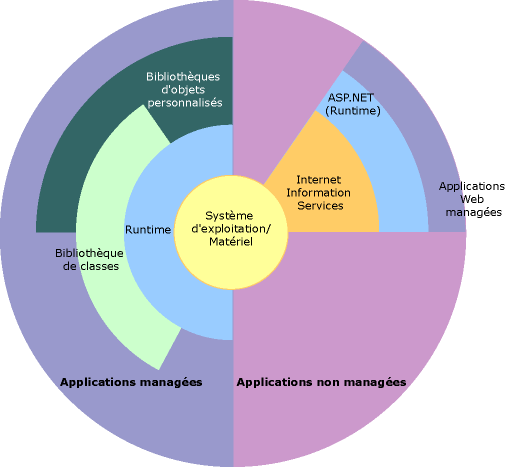

# Vue d’ensemble du .NET FrameworkOverview of the .NET Framework

Le .NET Framework est une technologie qui prend en charge la création et l’exécution de la nouvelle génération d’applications et de services web XML.The .NET Framework is a technology that supports building and running the next generation of apps and XML Web services. Le .NET Framework est conçu pour remplir les objectifs suivants :The .NET Framework is designed to fulfill the following objectives:

- Fournir un environnement cohérent de programmation orientée objet que le code objet soit stocké et exécuté localement, exécuté localement mais distribué sur Internet ou exécuté à distance.To provide a consistent object-oriented programming environment whether object code is stored and executed locally, executed locally but Internet-distributed, or executed remotely.

- Fournir un environnement d'exécution de code qui minimise le déploiement de logiciel et de conflits de versions.To provide a code-execution environment that minimizes software deployment and versioning conflicts.

- Fournir un environnement d'exécution de code qui promeut l'exécution sécurisée de code y compris le code créé par un tiers d'un niveau de confiance moyen ou un tiers inconnu.To provide a code-execution environment that promotes safe execution of code, including code created by an unknown or semi-trusted third party.

- Fournir un environnement d'exécution de code qui élimine les problèmes de performance des environnements interprétés ou écrits en scripts.To provide a code-execution environment that eliminates the performance problems of scripted or interpreted environments.

- Fournir au développeur un environnement cohérent entre une grande variété de types d’applications comme les applications Windows et les applications web.To make the developer experience consistent across widely varying types of apps, such as Windows-based apps and Web-based apps.

- Générer toutes les communications à partir des normes du secteur pour s’assurer que le code basé sur le .NET Framework s’intègre à n’importe quel autre code.To build all communication on industry standards to ensure that code based on the .NET Framework integrates with any other code.

> [!NOTE]
> Pour une présentation générale du .NET Framework à destination des utilisateurs et des développeurs, consultez [Bien démarrer](../../../docs/framework/get-started/index.md).For a general introduction to the .NET Framework for both users and developers, see [Getting Started](../../../docs/framework/get-started/index.md).

Le .NET Framework se compose du Common Language Runtime (CLR) et de la bibliothèque de classes .NET Framework.The .NET Framework consists of the common language runtime (CLR) and the .NET Framework class library. Le Common Language Runtime est la base du .NET Framework.The common language runtime is the foundation of the .NET Framework. Le runtime est un agent qui manage le code au moment de l’exécution, fournit des services essentiels comme la gestion de la mémoire, la gestion des threads et la communication à distance. Il applique également une cohérence stricte des types et d’autres formes de précision qui favorisent un code sécurisé et robuste.Think of the runtime as an agent that manages code at execution time, providing core services such as memory management, thread management, and remoting, while also enforcing strict type safety and other forms of code accuracy that promote security and robustness. En fait, le concept de gestion de code est un principe fondamental du runtime.In fact, the concept of code management is a fundamental principle of the runtime. Pour le code qui cible le runtime, on parle de code managé, tandis que pour le code qui ne cible pas le runtime, on parle de code non managé.Code that targets the runtime is known as managed code, while code that doesn't target the runtime is known as unmanaged code. La bibliothèque de classes est une collection complète orientée objet de types réutilisables que vous pouvez utiliser pour développer des applications, qu’il s’agisse d’applications en ligne de commande ou à interface graphique utilisateur traditionnelles ou d’applications basées sur les dernières innovations fournies par ASP.NET, comme les services web XML et Web Forms.The class library is a comprehensive, object-oriented collection of reusable types that you use to develop apps ranging from traditional command-line or graphical user interface (GUI) apps to apps based on the latest innovations provided by ASP.NET, such as Web Forms and XML Web services.

Le .NET Framework peut être hébergé par des composants non managés qui chargent le Common Language Runtime dans leurs processus et lancent l’exécution du code managé, créant ainsi un environnement logiciel qui exploite à la fois les fonctionnalités managées et non managées.The .NET Framework can be hosted by unmanaged components that load the common language runtime into their processes and initiate the execution of managed code, thereby creating a software environment that exploits both managed and unmanaged features. Le .NET Framework fournit non seulement plusieurs hôtes de runtime, mais il prend également en charge le développement d’hôtes de runtime tiers.The .NET Framework not only provides several runtime hosts but also supports the development of third-party runtime hosts.

Par exemple, ASP.NET héberge le runtime pour fournir un environnement côté serveur, évolutif pour le code managé.For example, ASP.NET hosts the runtime to provide a scalable, server-side environment for managed code. ASP.NET fonctionne directement avec le runtime pour activer des applications ASP.NET et des services web XML, deux sujets qui sont évoqués plus loin dans cette rubrique.ASP.NET works directly with the runtime to enable ASP.NET apps and XML Web services, both of which are discussed later in this topic.

Internet Explorer est un exemple d’application non managée qui héberge le runtime (sous la forme d’une extension de type MIME).Internet Explorer is an example of an unmanaged app that hosts the runtime (in the form of a MIME type extension). L'utilisation d'Internet Explorer pour héberger le runtime vous permet d'incorporer des composants managés ou des contrôles Windows Forms dans des documents HTML.Using Internet Explorer to host the runtime enables you to embed managed components or Windows Forms controls in HTML documents. Ainsi hébergé, le runtime rend possible le code mobile managé, avec toutefois des améliorations significatives que seul le code managé permet, telles que l’exécution d’un niveau de confiance partielle et le stockage de fichiers isolés.Hosting the runtime in this way makes managed mobile code possible, but with significant improvements that only managed code offers, such as semi-trusted execution and isolated file storage.

L’illustration suivante montre les relations du Common Language Runtime et de la bibliothèque de classes avec vos applications et l’ensemble du système.The following illustration shows the relationship of the common language runtime and the class library to your apps and to the overall system. L'illustration montre également comment le code managé opère au sein d'une architecture plus grande.The illustration also shows how managed code operates within a larger architecture.

 .NET Framework en contexte .NET Framework in context

Les sections suivantes décrivent les principales fonctionnalités du .NET Framework.The following sections describe the main features of the .NET Framework in greater detail.

## Fonctionnalités du Common Language RuntimeFeatures of the common language runtime

Le Common Language Runtime gère la mémoire, l'exécution des threads, l'exécution du code, la vérification de la sécurité du code, la compilation et d'autres services du système.The common language runtime manages memory, thread execution, code execution, code safety verification, compilation, and other system services. Ces fonctionnalités font partie intégrante du code managé qui s'exécute sous le Common Language Runtime.These features are intrinsic to the managed code that runs on the common language runtime.

Concernant la sécurité, les composants managés se voient attribuer divers niveaux de confiance en fonction d’un nombre de facteurs qui comprennent leur origine (comme Internet, un réseau d’entreprise ou un ordinateur local).Regarding security, managed components are awarded varying degrees of trust, depending on a number of factors that include their origin (such as the Internet, enterprise network, or local computer). Cela signifie qu’un composant managé peut ou ne peut pas effectuer des opérations d’accès au fichier, des opérations d’accès au Registre ou d’autres fonctions délicates, même si ce composant est utilisé dans la même application active.This means that a managed component might or might not be able to perform file-access operations, registry-access operations, or other sensitive functions, even if it's used in the same active app.

Le runtime garantit également un code robuste en implémentant une infrastructure de vérification de code et de type stricte portant le nom de système de type commun (CTS, Common Type System).The runtime also enforces code robustness by implementing a strict type-and-code-verification infrastructure called the common type system (CTS). Le CTS garantit que le tout le code managé soit autodescriptif.The CTS ensures that all managed code is self-describing. Les différents compilateurs de langage Microsoft et tiers génèrent du code managé conforme au système de type commun (CTS, Common Type System).The various Microsoft and third-party language compilers generate managed code that conforms to the CTS. Cela signifie que le code managé peut consommer d'autres instances et types managés, tout en appliquant strictement le respect et la sécurité des types.This means that managed code can consume other managed types and instances, while strictly enforcing type fidelity and type safety.

En outre, l'environnement managé du runtime élimine un grand nombre de problèmes logiciels courants.In addition, the managed environment of the runtime eliminates many common software issues. Par exemple, le runtime traite automatiquement la disposition des objets et gère les références aux objets, les libérant lorsqu'ils ne sont plus utilisés.For example, the runtime automatically handles object layout and manages references to objects, releasing them when they are no longer being used. Cette gestion automatique de la mémoire résout les deux erreurs d’application les plus courantes, le manque de mémoire et les références mémoire non valides.This automatic memory management resolves the two most common app errors, memory leaks and invalid memory references.

Le runtime accélère également la productivité du développeur.The runtime also accelerates developer productivity. Par exemple, les programmeurs peuvent écrire des applications dans le langage de développement de leur choix, tout en tirant pleinement parti du runtime, de la bibliothèque de classes, et de composants écrits dans d’autres langages par d’autres développeurs.For example, programmers write apps in their development language of choice yet take full advantage of the runtime, the class library, and components written in other languages by other developers. Tout fournisseur de compilateur qui choisit de cibler le runtime peut en faire de même.Any compiler vendor who chooses to target the runtime can do so. Les compilateurs de langage qui ciblent le .NET Framework rendent les fonctionnalités du .NET Framework disponibles au code existant écrit dans ce langage, ce qui simplifie considérablement le processus de migration pour les applications existantes.Language compilers that target the .NET Framework make the features of the .NET Framework available to existing code written in that language, greatly easing the migration process for existing apps.

Si le runtime est conçu pour les logiciels du futur, il prend également en charge les logiciels d'aujourd'hui et d'hier.While the runtime is designed for the software of the future, it also supports software of today and yesterday. L'interopérabilité entre les codes managés et non managés permet aux développeurs de continuer à utiliser des composants COM et des DLL nécessaires.Interoperability between managed and unmanaged code enables developers to continue to use necessary COM components and DLLs.

Le runtime est conçu pour améliorer les performances.The runtime is designed to enhance performance. Bien que le Common Language Runtime fournisse de nombreux services de runtime standard, le code managé n'est jamais interprété.Although the common language runtime provides many standard runtime services, managed code is never interpreted. Une fonctionnalité connue sous le nom de compilation juste-à-temps (JIT, Just-In-Time) permet à tout le code managé de s’exécuter dans le langage machine natif du système sur lequel il s’exécute.A feature called just-in-time (JIT) compiling enables all managed code to run in the native machine language of the system on which it's executing. De son côté, le gestionnaire de mémoire élimine les risques de mémoire fragmentée et augmente la localité de référence mémoire afin de décupler les performances.Meanwhile, the memory manager removes the possibilities of fragmented memory and increases memory locality-of-reference to further increase performance.

Enfin, le runtime peut être hébergé par des applications côté serveur hautement performantes, comme Microsoft SQL Server et les Internet Information Services (IIS).Finally, the runtime can be hosted by high-performance, server-side apps, such as Microsoft SQL Server and Internet Information Services (IIS). Cette infrastructure vous permet d'utiliser du code managé pour écrire votre logique métier tout en profitant des performances supérieures du meilleur des serveurs d'entreprise prenant en charge l'hébergement runtime.This infrastructure enables you to use managed code to write your business logic, while still enjoying the superior performance of the industry's best enterprise servers that support runtime hosting.

## Bibliothèque de classes .NET Framework.NET Framework class library

La bibliothèque de classes .NET Framework est une collection de types réutilisables qui s'intègrent parfaitement au Common Language Runtime.The .NET Framework class library is a collection of reusable types that tightly integrate with the common language runtime. La bibliothèque de classes est orientée objet et fournit des types à partir desquels votre propre code managé dérive des fonctionnalités.The class library is object oriented, providing types from which your own managed code derives functionality. Les types .NET Framework n’en sont que plus faciles à utiliser et vous pouvez apprendre les nouvelles fonctionnalités du .NET Framework plus rapidement.This not only makes the .NET Framework types easy to use but also reduces the time associated with learning new features of the .NET Framework. Par ailleurs, les composants tiers s’intègrent parfaitement aux classes du .NET Framework.In addition, third-party components integrate seamlessly with classes in the .NET Framework.

Par exemple, les classes de collection du .NET Framework implémentent un jeu d’interfaces pour développer vos propres classes de collection.For example, the .NET Framework collection classes implement a set of interfaces for developing your own collection classes. Vos classes de collection s’intègrent parfaitement aux classes du .NET Framework.Your collection classes blend seamlessly with the classes in the .NET Framework.

Comme pour toute bibliothèque de classes orientée objet, les types .NET Framework vous permettent d'accomplir un éventail de tâches courantes de programmation y compris des tâches comme la gestion de chaînes, la collection de données, la connectivité de bases de données, et l'accès aux fichiers.As you would expect from an object-oriented class library, the .NET Framework types enable you to accomplish a range of common programming tasks, including tasks such as string management, data collection, database connectivity, and file access. En plus de ces tâches courantes, la bibliothèque de classes comprend des types qui prennent en charge une variété de scénarios de développement spécialisé.In addition to these common tasks, the class library includes types that support a variety of specialized development scenarios. Utilisez le .NET Framework pour développer les types d’applications et de services suivants :Use the .NET Framework to develop the following types of apps and services:

- Applications de console.Console apps. Consultez [Génération d'applications console](../../../docs/standard/building-console-apps.md).See [Building Console Applications](../../../docs/standard/building-console-apps.md).

- Applications GUI Windows (Windows Forms).Windows GUI apps (Windows Forms). Consultez [Windows Forms](../../../docs/framework/winforms/index.md).See [Windows Forms](../../../docs/framework/winforms/index.md).

- Applications Windows Presentation Foundation (WPF).Windows Presentation Foundation (WPF) apps. Consultez [Windows Presentation Foundation](../../../docs/framework/wpf/index.md).See [Windows Presentation Foundation](../../../docs/framework/wpf/index.md).

- Applications ASP.NET.ASP.NET apps. Consultez [Applications web avec ASP.NET](../../../docs/framework/develop-web-apps-with-aspnet.md).See [Web Applications with ASP.NET](../../../docs/framework/develop-web-apps-with-aspnet.md).

- Les services Windows.Windows services. Consultez [Introduction aux applications de service Windows](../../../docs/framework/windows-services/introduction-to-windows-service-applications.md).See [Introduction to Windows Service Applications](../../../docs/framework/windows-services/introduction-to-windows-service-applications.md).

- Applications orientées service qui utilisent Windows Communication Foundation (WCF).Service-oriented apps using Windows Communication Foundation (WCF). Consultez [Applications orientées service avec WCF](../../../docs/framework/wcf/index.md).See [Service-Oriented Applications with WCF](../../../docs/framework/wcf/index.md).

- Applications prenant en charge les flux de travail et qui utilisent Windows Workflow Foundation (WF).Workflow-enabled apps using Windows Workflow Foundation (WF). Consultez [Génération de flux de travail dans le .NET Framework](http://msdn.microsoft.com/en-us/cbf3880f-dc7b-466d-b808-1109b1223f4a).See [Building Workflows in the .NET Framework](http://msdn.microsoft.com/en-us/cbf3880f-dc7b-466d-b808-1109b1223f4a).

Les classes Windows Forms sont un ensemble complet de types réutilisables qui simplifient grandement le développement GUI Windows.The Windows Forms classes are a comprehensive set of reusable types that vastly simplify Windows GUI development. Si vous écrivez une application Web Form ASP.NET, vous pouvez utiliser les classes Web Forms.If you write an ASP.NET Web Form app, you can use the Web Forms classes.

## Voir aussiSee also

[Configuration requise](../../../docs/framework/get-started/system-requirements.md) [System Requirements](../../../docs/framework/get-started/system-requirements.md)   
[Guide d’installation](../../../docs/framework/install/index.md) [Installation guide](../../../docs/framework/install/index.md)   
[Guide de développement](../../../docs/framework/development-guide.md) [Development Guide](../../../docs/framework/development-guide.md)   
[Outils](../../../docs/framework/tools/index.md) [Tools](../../../docs/framework/tools/index.md)   
[Exemples .NET Framework](http://msdn.microsoft.com/en-us/177055f8-4a1f-43e7-aee6-995c196079b1) [.NET Framework Samples](http://msdn.microsoft.com/en-us/177055f8-4a1f-43e7-aee6-995c196079b1)   
[Bibliothèque de classes .NET Framework.NET Framework Class Library](http://go.microsoft.com/fwlink/?LinkID=227195)

