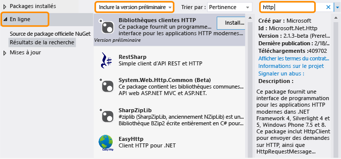

# Versions finales hors plage de .NET FrameworkThe .NET Framework and Out-of-Band Releases
.NET Framework évolue pour s'adapter aux différentes plateformes telles que les applications Windows Phone et Windows Store, ainsi qu'aux applications bureautiques et web traditionnelles, et pour optimiser la réutilisation du code.The .NET Framework is evolving to accommodate different platforms such as Windows Phone and Windows Store apps as well as traditional desktop and web apps, and to maximize code reuse. En plus de nos versions .NET Framework classiques, nous diffuserons de nouvelles fonctionnalités hors plage (OOB) pour améliorer le développement multiplateforme ou pour introduire une nouvelle fonctionnalité.In addition to our regular .NET Framework releases, we release new features out of band (OOB) to improve cross-platform development or to introduce new functionality. Cette rubrique décrit l'orientation future de .NET Framework et de ses versions OOB.This topic discusses the future direction of the .NET Framework and its OOB releases.  
  
## Avantages des versions OOBAdvantages of OOB releases  
 La livraison de nouveaux composants ou mises à jour de composants hors plage permet à Microsoft de fournir des mises à jour plus fréquentes de .NET Framework.Shipping new components or updates to components out of band enables Microsoft to provide more frequent updates to the .NET Framework. De plus, nous pouvons nous réunir et répondre aux commentaires des clients plus rapidement.In addition, we can gather and respond to customer feedback more quickly.  
  
 Lorsque vous utilisez une fonctionnalité OOB dans votre application, il n'est pas nécessaire que les utilisateurs installent la version la plus récente de .NET Framework pour exécuter votre application, car les assemblys OOB se déploient avec votre package d'application.When you use an OOB feature in your app, your users do not have to install the latest version of the .NET Framework to run your app, because the OOB assemblies deploy with your app package.  
  
## Mode de distribution des packages OOBHow OOB packages are distributed  
Les versions OOB des principaux composants du Common Langage Runtime (CLR) sont fournies via le [NuGet](https://www.nuget.org/), qui est un gestionnaire de package pour .NET.OOB releases for core common language runtime (CLR) components are delivered through the [NuGet](https://www.nuget.org/), which is a package manager for .NET. NuGet vous permet de parcourir et d’ajouter facilement des bibliothèques à vos projets .NET Framework à partir de l’Explorateur de solutions de Visual Studio.NuGet enables you to browse and add libraries to your .NET Framework projects easily from the Solution Explorer in Visual Studio. NuGet est inclus avec toutes les éditions Visual Studio à partir de Visual Studio 2012.NuGet is included with all editions of Visual Studio starting with Visual Studio 2012. Pour savoir si NuGet est installé, recherchez **Gestionnaire de package de bibliothèques** dans le menu **Outils** de Visual Studio.To see if NuGet is installed, look for **Library Package Manager** on the Visual Studio **Tools** menu. S'il n'est pas installé :If it’s not installed:  
  
1.  Dans la barre de menus de Visual Studio, choisissez **Outils**, **Extensions et mises à jour** (dans Visual Studio 2010, choisissez **Gestionnaire d’extensions**).On the Visual Studio menu bar, choose **Tools**, **Extensions and Updates** (in Visual Studio 2010, choose **Extension Manager**).  
  
     La boîte de dialogue **Extensions et mises à jour** s’ouvre.The **Extensions and Updates** dialog box opens.  
  
2.  Sélectionnez **En ligne**, **Gestionnaire de package NuGet**, puis choisissez **Télécharger**.Choose **Online**, **NuGet Package Manager**, and then choose **Download**.  
  
3.  Une fois le téléchargement terminé, redémarrez Visual Studio.After the download completes, restart Visual Studio.  
  
 Pour obtenir des instructions d'installation complètes, consultez [Installation NuGet](http://docs.nuget.org/docs/start-here/installing-nuget) sur le site Web de la documentation NuGet.For detailed installation instructions, see [Installing NuGet](http://docs.nuget.org/docs/start-here/installing-nuget) on the NuGet Docs website. Pour plus d'informations sur NuGet, consultez la [documentation NuGet](http://docs.nuget.org/).For more information about NuGet, see the [NuGet documentation](http://docs.nuget.org/).  
  
## Utilisation d’un package OOB NuGetUsing a NuGet OOB package  
 Après avoir installé NuGet, vous pouvez parcourir et ajouter des références aux packages de NuGet à l’aide de l’Explorateur de solutions dans Visual Studio :After you install NuGet, you can browse and add references to NuGet packages by using Solution Explorer in Visual Studio:  
  
1.  Ouvrez le menu contextuel de votre projet dans Visual Studio, puis choisissez **Gérer les packages NuGet**.Open the shortcut menu for your project in Visual Studio, and then choose **Manage NuGet Packages**. (Cette option est également disponible dans le menu **Projet**.)(This option is also available from the **Project** menu.)  
  
2.  Dans le volet gauche, cliquez sur **En ligne**.In the left pane, choose **Online**.  
  
3.  Si vous souhaitez utiliser des packages de version préliminaire, dans la zone de liste déroulante du volet central, sélectionnez l’option **Inclure la version préliminaire** au lieu de **Stable uniquement**.If you want to use prerelease packages, in the drop-down list box in the middle pane, choose **Include Prerelease** instead of **Stable Only**.  
  
4.  Dans le volet droit, utilisez la zone **Rechercher** pour localiser le package que vous souhaitez utiliser.In the right pane, use the **Search** box to locate the package you would like to use. Certains packages Microsoft sont identifiés par le logo Microsoft .NET Framework, et tous identifient Microsoft en tant qu'éditeur.Some Microsoft packages are identified by the Microsoft .NET Framework logo, and all identify Microsoft as the publisher.  
  
   
  
 Comme mentionné précédemment, lorsque vous déployez une application qui utilise un package OOB, les assemblys OOB sont fournis avec votre package d'application.As mentioned previously, when you deploy an app that uses an OOB package, the OOB assemblies will ship with your app package.  
  
## Types de versions OOBTypes of OOB releases  
 En général, un package OOB a une ou plusieurs versions préliminaires et une version stable.Typically, an OOB package has one or more prerelease versions and a stable version. La licence qui accompagne une version préliminaire n'autorise généralement pas la redistribution, mais vous permet de tester un package et de fournir des commentaires.The license that accompanies a prerelease doesn't typically allow redistribution, but enables you to try out a package and provide feedback. Les commentaires sont incorporés dans toutes les mises à jour apportées au package.Feedback is incorporated in any updates made to the package. Une version finale est distribuée comme package stable avec NuGet et inclut une licence qui vous permet de redistribuer le package NuGet avec votre application.A final release is distributed as a stable package with NuGet and includes a license that lets you redistribute the NuGet package with your app. Les packages stables sont pris en charge par Microsoft.Stable packages are supported by Microsoft. Microsoft fournit la prise en charge IntelliSense, ainsi que d'autres types de documentation tels que les publications de blog et les réponses de forum pour tous les packages.Microsoft provides IntelliSense support as well as other types of documentation such as blog posts and forum answers for all packages. De plus, le code source peut ne pas être disponible avec tous les packages.In addition, source code may be available with some, but not all, packages. Pour être tenu informé sur les packages nouveaux et mis à jour, inscrivez-vous sur le [blog du .NET Framework](http://blogs.msdn.com/b/dotnet/).For announcements regarding new and updated packages, you can subscribe to [the .NET Framework Blog](http://blogs.msdn.com/b/dotnet/).  
  
 Pour rechercher à la fois les versions préliminaires et les packages stables, choisissez **Include Prerelease (Inclure les versions préliminaires)** dans le Gestionnaire de package NuGet.To find both prerelease and stable packages, choose **Include Prerelease** in the NuGet Package Manager.  
  
 Si vous voulez être averti de la mise en production des packages stables, abonnez-vous au [flux .NET Framework](https://nuget.org/api/v2/curated-feeds/dotnetframework/Packages/).If you want to be notified of stable package releases, subscribe to the [the .NET Framework feed](https://nuget.org/api/v2/curated-feeds/dotnetframework/Packages/).  
  
## Voir aussiSee Also  
 [Prise en mainGetting Started](../../../docs/framework/get-started/index.md)
