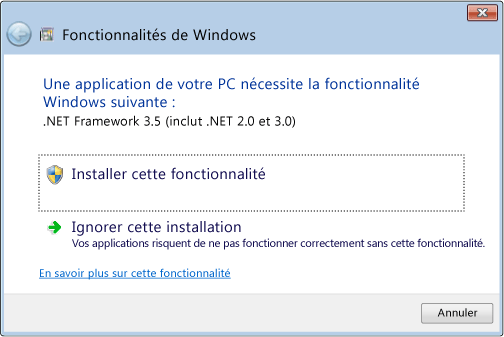
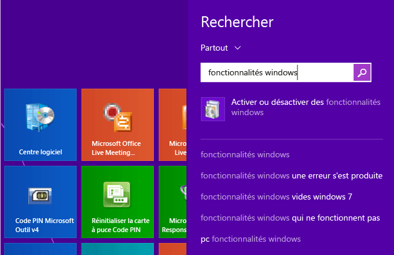

# Installing the .NET Framework 3.5 on Windows 8, Windows 8.1 and Windows 10
.NET Framework fait partie intégrante de nombreuses applications s'exécutant sous Windows et fournit des fonctionnalités communes permettant l'exécution de ces applications. .NET Framework propose aux développeurs un modèle de programmation cohérent pour la création d'applications. Si vous utilisez le système d'exploitation Windows, .NET Framework est peut\-être déjà installé sur votre ordinateur. Plus précisément, [!INCLUDE[net_v45](../../../includes/net-v45-md.md)] est fourni avec [!INCLUDE[win8](../../../includes/win8-md.md)], [!INCLUDE[net_v451](../../../includes/net-v451-md.md)] est fourni avec [!INCLUDE[win81](../../../includes/win81-md.md)] et [!INCLUDE[net_v46](../../../includes/net-v46-md.md)] est fourni avec Windows 10.  
  
 Cependant, .NET Framework 3.5 n'est pas automatiquement installé avec [!INCLUDE[win8](../../../includes/win8-md.md)], [!INCLUDE[win81](../../../includes/win81-md.md)] ou Windows 10, et doit être activé séparément pour exécuter des applications qui dépendent de lui. Cela doit s'effectuer Windows Update, qui est appelé de trois façons différentes. Elles requièrent toutes une connexion Internet :  
  
-   [Installer .NET Framework 3.5 à la demande](#OnDemand)  
  
-   [Activer .NET Framework 3.5 dans le Panneau de configuration](#ControlPanel)  
  
-   [Télécharger le programme d’installation du .NET Framework 3.5](http://www.microsoft.com/en-us/download/details.aspx?id=21) \(Remarque : Cette opération ne télécharge pas directement .NET Framework ; il s’agit d’un programme d’installation qui appelle lWindows Update.\)  
  
 Pendant l’installation, si vous rencontrez l’erreur 0x800f0906, 0x800f0907 ou 0x800f081f, consultez [Erreur d’installation de .NET Framework 3.5 : 0x800f0906, 0x800f0907 ou 0x800f081f](https://support.microsoft.com/en-us/kb/2734782). Notez qu’elles peuvent être résolues en installant la [mise à jour de sécurité 3005628](https://support.microsoft.com/kb/3005628).  
  
 Si l'une des méthodes ci\-dessus échoue, ou si vous ne disposez pas d'une connexion Internet, vous devez utiliser votre support d'installation Windows. Pour plus d’informations, consultez la méthode 3 mentionnée pour l’erreur 0x800f0906 dans l’[article relatif aux erreurs d’installation de .NET Framework 3.5](https://support.microsoft.com/en-us/kb/2734782). Si vous n’avez pas le support d’installation, consultez [Créer un support d’installation pour Windows 8.1](http://windows.microsoft.com/en-US/windows-8/create-reset-refresh-media?woldogcb=0).  
  
 Remarques importantes :  
  
-   En règle générale, ne désinstallez pas les versions de .NET Framework de votre ordinateur. Différentes applications dépendent de différentes versions du framework et plusieurs versions de .NET Framework peuvent être chargées sur un seul ordinateur en même temps.  
  
-   .NET Framework 3.5 est également utilisé par les applications conçues pour les versions 2.0 et 3.0.  
  
-   Si vous installez un module linguistique Windows avant d'installer .NET Framework 3.5, l'installation de .NET Framework 3.5 risque d'échouer. Installez .NET Framework 3.5 avant d'installer tous les modules linguistiques Windows.  
  
-   Windows CardSpace n'est pas disponible avec .NET Framework 3.5 sur [!INCLUDE[win8](../../../includes/win8-md.md)].  
  
-   En raison de complications liées à la façon dont .NET Framework 3.5 doit être installé, il n'est malheureusement pas possible de fournir un programme d'installation autonome distinct pouvant s'exécuter indépendamment de Windows Update. Là encore, si toutes les autres méthodes échouent, vous devez recourir au support d'installation, comme décrit précédemment.  
  
   
## Installer .NET Framework 3.5 à la demande  
 Si une application requiert .NET Framework 3.5, mais ne trouve pas cette version sur votre ordinateur, elle affiche la zone de message suivant, soit pendant l'installation, soit lorsque vous exécutez l'application pour la première fois. Dans la zone de message, choisissez **Installer cette fonctionnalité** pour activer .NET Framework 3.5. Cette option requiert une connexion Internet.  
  
   
  
   
## Activer .NET Framework 3.5 dans le Panneau de configuration  
 Vous pouvez activer .NET Framework 3.5 vous\-même dans le Panneau de configuration. Cette option requiert une connexion Internet.  
  
1.  Appuyez sur la touche Windows  de votre clavier, tapez « Fonctionnalités Windows », puis appuyez sur la touche Entrée. La boîte de dialogue **Activer ou désactiver des fonctionnalités Windows** apparaît. Vous pouvez également ouvrir le Panneau de configuration, cliquer sur les éléments de Programmes, puis cliquer sur « Activer ou désactiver des fonctionnalités Windows » sous Programmes et fonctionnalités.  
  
2.  Cochez la case **.NET Framework 3.5 \(inclut .NET 2.0 et 3.0\)**, cliquez sur OK et redémarrez l'ordinateur si vous y êtes invité.  
  
 Vous n'avez pas besoin de sélectionner des éléments enfants pour l'activation HTTP WCF \(Windows Communication Foundation\), sauf si vous êtes un développeur qui a besoin des fonctionnalités de script WCF et de mappage de gestionnaire.  
  
 La vidéo suivante montre comment procéder :  
  
   
  
## Voir aussi  
 [Guide d'installation](../../../docs/framework/install/guide-for-developers.md)