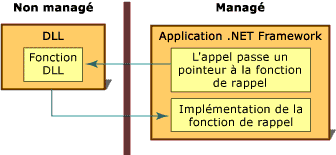

# Fonctions de rappel
Une fonction de rappel désigne du code figurant dans une application managée qui permet à une fonction DLL non managée d’effectuer une tâche. Les appels à une fonction de rappel sont indirectement passés depuis une application managée via une fonction DLL avant de revenir à l’implémentation managée. Certaines des nombreuses fonctions DLL appelées à l’aide de l’appel de code non managé nécessitent une fonction de rappel dans du code managé pour fonctionner correctement.  
  
 Pour appeler la plupart des fonctions DLL à partir d’un code managé, il vous suffit de créer une définition managée de la fonction, puis de l’appeler. La procédure est simple.  
  
 L’utilisation d’une fonction DLL nécessitant une fonction de rappel implique des étapes supplémentaires. Vous devez d’abord déterminer si la fonction nécessite un rappel en consultant la documentation sur la fonction. Vous devez ensuite créer la fonction de rappel dans votre application managée. Vous devez enfin appeler la fonction DLL, en passant un pointeur vers la fonction de rappel sous la forme d’un argument. L’illustration ci-dessous récapitule ces étapes.  
  
   
Fonction de rappel et implémentation  
  
 Les fonctions de rappel sont idéales dans les cas où une tâche est effectuée à maintes reprises. Elles sont aussi fréquemment utilisées avec des fonctions d’énumération, comme **EnumFontFamilies**, **EnumPrinters** et **EnumWindows**, dans l’interface API Win32. La fonction **EnumWindows** se décline dans toutes les fenêtres existantes de votre ordinateur ; dans chacune, elle appelle la fonction de rappel pour exécuter une tâche. Pour obtenir des instructions et un exemple, consultez [Guide pratique pour implémenter des fonctions de rappel](../../../docs/framework/interop/how-to-implement-callback-functions.md).  
  
## Voir aussi  
 [Comment : implémenter des fonctions de rappel](../../../docs/framework/interop/how-to-implement-callback-functions.md)  
 [Appel à une fonction DLL](../../../docs/framework/interop/calling-a-dll-function.md)
