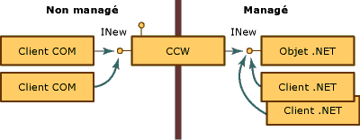
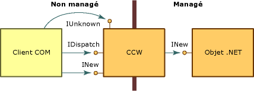

# <a name="com-callable-wrapper"></a><span data-ttu-id="5cc21-102">Wrapper pouvant être appelé par COM</span><span class="sxs-lookup"><span data-stu-id="5cc21-102">COM Callable Wrapper</span></span>
<span data-ttu-id="5cc21-103">Quand un client COM appelle un objet .NET, le common language runtime crée l'objet managé et un wrapper CCW pour cet objet.</span><span class="sxs-lookup"><span data-stu-id="5cc21-103">When a COM client calls a .NET object, the common language runtime creates the managed object and a COM callable wrapper (CCW) for the object.</span></span> <span data-ttu-id="5cc21-104">Parce qu'ils ne peuvent pas référencer directement un objet .NET, les clients COM utilisent le wrapper CCW en tant que proxy pour l'objet managé.</span><span class="sxs-lookup"><span data-stu-id="5cc21-104">Unable to reference a .NET object directly, COM clients use the CCW as a proxy for the managed object.</span></span>  
  
 <span data-ttu-id="5cc21-105">Le runtime crée un unique wrapper CCW pour un objet managé, indépendamment du nombre de clients COM demandant ses services.</span><span class="sxs-lookup"><span data-stu-id="5cc21-105">The runtime creates exactly one CCW for a managed object, regardless of the number of COM clients requesting its services.</span></span> <span data-ttu-id="5cc21-106">Comme le montre l'illustration suivante, plusieurs clients COM peuvent contenir une référence au wrapper CCW qui expose l'interface INew.</span><span class="sxs-lookup"><span data-stu-id="5cc21-106">As the following illustration shows, multiple COM clients can hold a reference to the CCW that exposes the INew interface.</span></span> <span data-ttu-id="5cc21-107">Le wrapper CCW contient quant à lui une référence à l'objet managé qui implémente l'interface et fait l'objet d'un garbage collection.</span><span class="sxs-lookup"><span data-stu-id="5cc21-107">The CCW, in turn, holds a single reference to the managed object that implements the interface and is garbage collected.</span></span> <span data-ttu-id="5cc21-108">Les clients COM et .NET peuvent envoyer simultanément des requêtes au même objet managé.</span><span class="sxs-lookup"><span data-stu-id="5cc21-108">Both COM and .NET clients can make requests on the same managed object simultaneously.</span></span>  
  
 <span data-ttu-id="5cc21-109"></span><span class="sxs-lookup"><span data-stu-id="5cc21-109"></span></span>  
<span data-ttu-id="5cc21-110">Accès aux objets .NET via un wrapper CCW</span><span class="sxs-lookup"><span data-stu-id="5cc21-110">Accessing .NET objects through COM callable wrapper</span></span>  
  
 <span data-ttu-id="5cc21-111">Les wrappers CCW ne sont pas visibles par les autres classes qui s'exécutent dans .NET Framework.</span><span class="sxs-lookup"><span data-stu-id="5cc21-111">COM callable wrappers are invisible to other classes running within the .NET Framework.</span></span> <span data-ttu-id="5cc21-112">Leur objectif principal est de marshaler les appels entre code managé et code non managé. Cependant, les wrappers CCW gèrent également l'identité et la durée de vie des objets managés qu'ils encapsulent.</span><span class="sxs-lookup"><span data-stu-id="5cc21-112">Their primary purpose is to marshal calls between managed and unmanaged code; however, CCWs also manage the object identity and object lifetime of the managed objects they wrap.</span></span>  
  
## <a name="object-identity"></a><span data-ttu-id="5cc21-113">Identité d'un objet</span><span class="sxs-lookup"><span data-stu-id="5cc21-113">Object Identity</span></span>  
 <span data-ttu-id="5cc21-114">Le runtime alloue de la mémoire pour l'objet .NET depuis son tas collecté, ce qui permet au runtime de déplacer l'objet au sein de la mémoire selon les besoins.</span><span class="sxs-lookup"><span data-stu-id="5cc21-114">The runtime allocates memory for the .NET object from its garbage-collected heap, which enables the runtime to move the object around in memory as necessary.</span></span> <span data-ttu-id="5cc21-115">En revanche, le runtime alloue de la mémoire pour le wrapper CCW depuis un tas non collecté, permettant ainsi aux clients COM de faire directement référence au wrapper.</span><span class="sxs-lookup"><span data-stu-id="5cc21-115">In contrast, the runtime allocates memory for the CCW from a noncollected heap, making it possible for COM clients to reference the wrapper directly.</span></span>  
  
## <a name="object-lifetime"></a><span data-ttu-id="5cc21-116">Durée de vie des objets</span><span class="sxs-lookup"><span data-stu-id="5cc21-116">Object Lifetime</span></span>  
 <span data-ttu-id="5cc21-117">Contrairement au client .NET qu'il encapsule, le wrapper CCW fait l'objet d'un comptage de références comme dans COM.</span><span class="sxs-lookup"><span data-stu-id="5cc21-117">Unlike the .NET client it wraps, the CCW is reference-counted in traditional COM fashion.</span></span> <span data-ttu-id="5cc21-118">Quand le nombre de références du wrapper CCW atteint zéro, le wrapper libère sa référence à l'objet managé.</span><span class="sxs-lookup"><span data-stu-id="5cc21-118">When the reference count on the CCW reaches zero, the wrapper releases its reference on the managed object.</span></span> <span data-ttu-id="5cc21-119">Un objet managé sans aucune référence restante sera collecté lors du prochain cycle de garbage collection.</span><span class="sxs-lookup"><span data-stu-id="5cc21-119">A managed object with no remaining references is collected during the next garbage-collection cycle.</span></span>  
  
## <a name="simulating-com-interfaces"></a><span data-ttu-id="5cc21-120">Simulation d'interfaces COM</span><span class="sxs-lookup"><span data-stu-id="5cc21-120">Simulating COM interfaces</span></span>  
 <span data-ttu-id="5cc21-121">Le [wrapper CCW (COM Callable Wrapper)](../../../docs/framework/interop/com-callable-wrapper.md) expose aux clients COM l’ensemble des interfaces, types de données et valeurs de retour publics et visibles par COM d’une manière qui est cohérente avec l’application de COM de l’interaction reposant sur l’interface.</span><span class="sxs-lookup"><span data-stu-id="5cc21-121">The [COM callable wrapper](../../../docs/framework/interop/com-callable-wrapper.md) (CCW) exposes all public, COM-visible interfaces, data types, and return values to COM clients in a manner that is consistent with COM's enforcement of interface-based interaction.</span></span> <span data-ttu-id="5cc21-122">Pour un client COM, l'appel de méthodes sur un objet .NET Framework est identique à l'appel de méthodes sur un objet COM</span><span class="sxs-lookup"><span data-stu-id="5cc21-122">For a COM client, invoking methods on a .NET Framework object is identical to invoking methods on a COM object.</span></span>  
  
 <span data-ttu-id="5cc21-123">Pour adopter cette approche transparente, le wrapper CCW fabrique des interfaces COM classiques, comme **IUnknown** et **IDispatch**.</span><span class="sxs-lookup"><span data-stu-id="5cc21-123">To create this seamless approach, the CCW manufactures traditional COM interfaces, such as **IUnknown** and **IDispatch**.</span></span> <span data-ttu-id="5cc21-124">Comme le montre l'illustration suivante, le wrapper CCW contient une référence unique sur l'objet .NET qu'il encapsule.</span><span class="sxs-lookup"><span data-stu-id="5cc21-124">As the following illustration shows, the CCW maintains a single reference on the .NET object that it wraps.</span></span> <span data-ttu-id="5cc21-125">Le client COM et l'objet .NET interagissent via le proxy et le stub du wrapper CCW.</span><span class="sxs-lookup"><span data-stu-id="5cc21-125">Both the COM client and .NET object interact with each other through the proxy and stub construction of the CCW.</span></span>  
  
 <span data-ttu-id="5cc21-126"></span><span class="sxs-lookup"><span data-stu-id="5cc21-126"></span></span>  
<span data-ttu-id="5cc21-127">Les interfaces COM et le wrapper CCW</span><span class="sxs-lookup"><span data-stu-id="5cc21-127">Com interfaces and the COM callable wrapper</span></span>  
  
 <span data-ttu-id="5cc21-128">Outre l'exposition des interfaces qui sont implémentées explicitement par une classe dans l'environnement managé, .NET Framework fournit également des implémentations des interfaces COM répertoriées dans le tableau suivant, pour le compte de l'objet.</span><span class="sxs-lookup"><span data-stu-id="5cc21-128">In addition to exposing the interfaces that are explicitly implemented by a class in the managed environment, the .NET Framework supplies implementations of the COM interfaces listed in the following table on behalf of the object.</span></span> <span data-ttu-id="5cc21-129">Une classe .NET peut substituer le comportement par défaut par sa propre implémentation de ces interfaces.</span><span class="sxs-lookup"><span data-stu-id="5cc21-129">A .NET class can override the default behavior by providing its own implementation of these interfaces.</span></span> <span data-ttu-id="5cc21-130">Toutefois, le runtime fournit toujours l’implémentation pour les interfaces **IUnknown** et **IDispatch**.</span><span class="sxs-lookup"><span data-stu-id="5cc21-130">However, the runtime always provides the implementation for the **IUnknown** and **IDispatch** interfaces.</span></span>  
  
|<span data-ttu-id="5cc21-131">Interface</span><span class="sxs-lookup"><span data-stu-id="5cc21-131">Interface</span></span>|<span data-ttu-id="5cc21-132">Description</span><span class="sxs-lookup"><span data-stu-id="5cc21-132">Description</span></span>|  
|---------------|-----------------|  
|<span data-ttu-id="5cc21-133">**IDispatch**</span><span class="sxs-lookup"><span data-stu-id="5cc21-133">**Idispatch**</span></span>|<span data-ttu-id="5cc21-134">Fournit un mécanisme de liaison tardive au type.</span><span class="sxs-lookup"><span data-stu-id="5cc21-134">Provides a mechanism for late binding to type.</span></span>|  
|<span data-ttu-id="5cc21-135">**IErrorInfo**</span><span class="sxs-lookup"><span data-stu-id="5cc21-135">**IerrorInfo**</span></span>|<span data-ttu-id="5cc21-136">Fournit une description textuelle de l’erreur, sa source, un fichier d’aide, un contexte d’aide et le GUID de l’interface ayant défini l’erreur (toujours **GUID_NULL** pour les classes .NET).</span><span class="sxs-lookup"><span data-stu-id="5cc21-136">Provides a textual description of the error, its source, a Help file, Help context, and the GUID of the interface that defined the error (always **GUID_NULL** for .NET classes).</span></span>|  
|<span data-ttu-id="5cc21-137">**IProvideClassInfo**</span><span class="sxs-lookup"><span data-stu-id="5cc21-137">**IprovideClassInfo**</span></span>|<span data-ttu-id="5cc21-138">Permet aux clients COM d’accéder à l’interface **ITypeInfo** implémentée par une classe managée.</span><span class="sxs-lookup"><span data-stu-id="5cc21-138">Enables COM clients to gain access to the **ITypeInfo** interface implemented by a managed class.</span></span>|  
|<span data-ttu-id="5cc21-139">**ISupportErrorInfo**</span><span class="sxs-lookup"><span data-stu-id="5cc21-139">**IsupportErrorInfo**</span></span>|<span data-ttu-id="5cc21-140">Permet à un client COM de déterminer si l’objet managé prend en charge l’interface **IErrorInfo**.</span><span class="sxs-lookup"><span data-stu-id="5cc21-140">Enables a COM client to determine whether the managed object supports the **IErrorInfo** interface.</span></span> <span data-ttu-id="5cc21-141">Dans ce cas, il permet au client d'obtenir un pointeur vers le dernier objet exception.</span><span class="sxs-lookup"><span data-stu-id="5cc21-141">If so, enables the client to obtain a pointer to the latest exception object.</span></span> <span data-ttu-id="5cc21-142">Tous les types managés prennent en charge l’interface **IErrorInfo**.</span><span class="sxs-lookup"><span data-stu-id="5cc21-142">All managed types support the **IErrorInfo** interface.</span></span>|  
|<span data-ttu-id="5cc21-143">**ITypeInfo**</span><span class="sxs-lookup"><span data-stu-id="5cc21-143">**ItypeInfo**</span></span>|<span data-ttu-id="5cc21-144">Fournit des informations de type pour une classe qui sont les mêmes que celles fournies par Tlbexp.exe.</span><span class="sxs-lookup"><span data-stu-id="5cc21-144">Provides type information for a class that is exactly the same as the type information produced by Tlbexp.exe.</span></span>|  
|<span data-ttu-id="5cc21-145">**IUnknown**</span><span class="sxs-lookup"><span data-stu-id="5cc21-145">**Iunknown**</span></span>|<span data-ttu-id="5cc21-146">Fournit l’implémentation standard de l’interface **IUnknown** avec laquelle le client COM gère la durée de vie du wrapper CCW et fournit le forçage de type.</span><span class="sxs-lookup"><span data-stu-id="5cc21-146">Provides the standard implementation of the **IUnknown** interface with which the COM client manages the lifetime of the CCW and provides type coercion.</span></span>|  
  
 <span data-ttu-id="5cc21-147">Une classe managée peut également fournir les interfaces COM décrites dans le tableau suivant.</span><span class="sxs-lookup"><span data-stu-id="5cc21-147">A managed class can also provide the COM interfaces described in the following table.</span></span>  
  
|<span data-ttu-id="5cc21-148">Interface</span><span class="sxs-lookup"><span data-stu-id="5cc21-148">Interface</span></span>|<span data-ttu-id="5cc21-149">Description</span><span class="sxs-lookup"><span data-stu-id="5cc21-149">Description</span></span>|  
|---------------|-----------------|  
|<span data-ttu-id="5cc21-150">Interface de la classe (_*nomclasse*)</span><span class="sxs-lookup"><span data-stu-id="5cc21-150">The (_*classname*) class interface</span></span>|<span data-ttu-id="5cc21-151">Interface, exposée par le runtime et non définie explicitement, qui expose l'ensemble des interfaces, méthodes, propriétés et champs publics qui sont exposés explicitement sur un objet managé.</span><span class="sxs-lookup"><span data-stu-id="5cc21-151">Interface, exposed by the runtime and not explicitly defined, that exposes all public interfaces, methods, properties, and fields that are explicitly exposed on a managed object.</span></span>|  
|<span data-ttu-id="5cc21-152">**IConnectionPoint** et **IConnectionPointContainer**</span><span class="sxs-lookup"><span data-stu-id="5cc21-152">**IConnectionPoint** and **IconnectionPointContainer**</span></span>|<span data-ttu-id="5cc21-153">Interface pour les objets qui émettent des événements basés sur les délégués (interface pour l'inscription des abonnés d'événements).</span><span class="sxs-lookup"><span data-stu-id="5cc21-153">Interface for objects that source delegate-based events (an interface for registering event subscribers).</span></span>|  
|<span data-ttu-id="5cc21-154">**IDispatchEx**</span><span class="sxs-lookup"><span data-stu-id="5cc21-154">**IdispatchEx**</span></span>|<span data-ttu-id="5cc21-155">Interface fournie par le runtime si la classe implémente **IExpando**.</span><span class="sxs-lookup"><span data-stu-id="5cc21-155">Interface supplied by the runtime if the class implements **IExpando**.</span></span> <span data-ttu-id="5cc21-156">L’interface **IDispatchEx** est une extension de l’interface **IDispatch** qui, contrairement à l’interface **IDispatch**, permet l’énumération, l’ajout, la suppression et l’appel de la casse des membres.</span><span class="sxs-lookup"><span data-stu-id="5cc21-156">The **IDispatchEx** interface is an extension of the **IDispatch** interface that, unlike **IDispatch**, enables enumeration, addition, deletion, and case-sensitive calling of members.</span></span>|  
|<span data-ttu-id="5cc21-157">**IEnumVARIANT**</span><span class="sxs-lookup"><span data-stu-id="5cc21-157">**IEnumVARIANT**</span></span>|<span data-ttu-id="5cc21-158">Interface pour les classes de type collection, qui énumère les objets d’une collection si la classe implémente **IEnumerable**.</span><span class="sxs-lookup"><span data-stu-id="5cc21-158">Interface for collection-type classes, which enumerates the objects in the collection if the class implements **IEnumerable**.</span></span>|  
  
## <a name="introducing-the-class-interface"></a><span data-ttu-id="5cc21-159">Présentation de l'interface de classe</span><span class="sxs-lookup"><span data-stu-id="5cc21-159">Introducing the class interface</span></span>  
 <span data-ttu-id="5cc21-160">L'interface de classe, qui n'est pas explicitement définie dans le code managé, est une interface qui expose l'ensemble des méthodes, propriétés, champs et événements publics qui sont exposés explicitement sur l'objet .NET.</span><span class="sxs-lookup"><span data-stu-id="5cc21-160">The class interface, which is not explicitly defined in managed code, is an interface that exposes all public methods, properties, fields, and events that are explicitly exposed on the .NET object.</span></span> <span data-ttu-id="5cc21-161">Cette interface peut être double ou dispatch uniquement.</span><span class="sxs-lookup"><span data-stu-id="5cc21-161">This interface can be a dual or dispatch-only interface.</span></span> <span data-ttu-id="5cc21-162">L'interface de classe reçoit le nom de la classe .NET, précédé d'un trait de soulignement.</span><span class="sxs-lookup"><span data-stu-id="5cc21-162">The class interface receives the name of the .NET class itself, preceded by an underscore.</span></span> <span data-ttu-id="5cc21-163">Par exemple, pour la classe Mammal, l'interface de classe est _Mammal.</span><span class="sxs-lookup"><span data-stu-id="5cc21-163">For example, for class Mammal, the class interface is _Mammal.</span></span>  
  
 <span data-ttu-id="5cc21-164">Pour les classes dérivées, l'interface de classe expose l'ensemble des méthodes, propriétés et champs publics de la classe de base.</span><span class="sxs-lookup"><span data-stu-id="5cc21-164">For derived classes, the class interface also exposes all public methods, properties, and fields of the base class.</span></span> <span data-ttu-id="5cc21-165">La classe dérivée expose également une interface de classe pour chaque classe de base.</span><span class="sxs-lookup"><span data-stu-id="5cc21-165">The derived class also exposes a class interface for each base class.</span></span> <span data-ttu-id="5cc21-166">Par exemple, si la classe Mammal étend la classe MammalSuperclass, qui elle-même étend System.Object, l'objet .NET expose aux clients COM trois interfaces de classe nommées _Mammal, _MammalSuperclass et _Object.</span><span class="sxs-lookup"><span data-stu-id="5cc21-166">For example, if class Mammal extends class MammalSuperclass, which itself extends System.Object, the .NET object exposes to COM clients three class interfaces named _Mammal, _MammalSuperclass, and _Object.</span></span>  
  
 <span data-ttu-id="5cc21-167">Regardons, par exemple, la classe .NET suivante :</span><span class="sxs-lookup"><span data-stu-id="5cc21-167">For example, consider the following .NET class:</span></span>  
  
```vb  
' Applies the ClassInterfaceAttribute to set the interface to dual.  
<ClassInterface(ClassInterfaceType.AutoDual)> _  
' Implicitly extends System.Object.  
Public Class Mammal  
    Sub Eat()  
    Sub Breathe()  
    Sub Sleep()  
End Class  
```  
  
```csharp  
// Applies the ClassInterfaceAttribute to set the interface to dual.  
[ClassInterface(ClassInterfaceType.AutoDual)]  
// Implicitly extends System.Object.  
public class Mammal  
{  
    void  Eat();  
    void  Breathe():  
    void  Sleep();  
}  
```  
  
 <span data-ttu-id="5cc21-168">Le client COM peut obtenir un pointeur vers une interface de classe nommée `_Mammal`, qui est décrite dans la bibliothèque de types générée par l’outil [Tlbexp.exe (exportateur de bibliothèques de types)](../../../docs/framework/tools/tlbexp-exe-type-library-exporter.md).</span><span class="sxs-lookup"><span data-stu-id="5cc21-168">The COM client can obtain a pointer to a class interface named `_Mammal`, which is described in the type library that the [Type Library Exporter (Tlbexp.exe)](../../../docs/framework/tools/tlbexp-exe-type-library-exporter.md) tool generates.</span></span> <span data-ttu-id="5cc21-169">Si la classe `Mammal` implémentait une ou plusieurs interfaces, les interfaces apparaîtraient sous la coclasse.</span><span class="sxs-lookup"><span data-stu-id="5cc21-169">If the `Mammal` class implemented one or more interfaces, the interfaces would appear under the coclass.</span></span>  
  
```  
[odl, uuid(…), hidden, dual, nonextensible, oleautomation]  
interface _Mammal : IDispatch  
{  
    [id(0x00000000), propget] HRESULT ToString([out, retval] BSTR*  
        pRetVal);  
    [id(0x60020001)] HRESULT Equals([in] VARIANT obj, [out, retval]  
        VARIANT_BOOL* pRetVal);  
    [id(0x60020002)] HRESULT GetHashCode([out, retval] short* pRetVal);  
    [id(0x60020003)] HRESULT GetType([out, retval] _Type** pRetVal);  
    [id(0x6002000d)] HRESULT Eat();  
    [id(0x6002000e)] HRESULT Breathe();  
    [id(0x6002000f)] HRESULT Sleep();  
}  
[uuid(…)]  
coclass Mammal   
{  
    [default] interface _Mammal;  
}  
```  
  
 <span data-ttu-id="5cc21-170">La génération de l'interface de classe est facultative.</span><span class="sxs-lookup"><span data-stu-id="5cc21-170">Generating the class interface is optional.</span></span> <span data-ttu-id="5cc21-171">Par défaut, COM Interop génère une interface de dispatch pour chaque classe que vous exportez vers une bibliothèque de types.</span><span class="sxs-lookup"><span data-stu-id="5cc21-171">By default, COM interop generates a dispatch-only interface for each class you export to a type library.</span></span> <span data-ttu-id="5cc21-172">Vous pouvez empêcher ou modifier la création automatique de cette interface en appliquant <xref:System.Runtime.InteropServices.ClassInterfaceAttribute> à votre classe.</span><span class="sxs-lookup"><span data-stu-id="5cc21-172">You can prevent or modify the automatic creation of this interface by applying the <xref:System.Runtime.InteropServices.ClassInterfaceAttribute> to your class.</span></span> <span data-ttu-id="5cc21-173">Même si l'interface de classe simplifie l'exposition des classes managées à COM, ses utilisations sont limitées.</span><span class="sxs-lookup"><span data-stu-id="5cc21-173">Although the class interface can ease the task of exposing managed classes to COM, its uses are limited.</span></span>  
  
> [!CAUTION]
>  <span data-ttu-id="5cc21-174">L'utilisation de l'interface de classe, au lieu de définir explicitement la vôtre, peut compliquer le contrôle de version de votre classe managée.</span><span class="sxs-lookup"><span data-stu-id="5cc21-174">Using the class interface, instead of explicitly defining your own, can complicate the future versioning of your managed class.</span></span> <span data-ttu-id="5cc21-175">Lisez les instructions suivantes avant d'utiliser l'interface de classe.</span><span class="sxs-lookup"><span data-stu-id="5cc21-175">Please read the following guidelines before using the class interface.</span></span>  
  
### <a name="define-an-explicit-interface-for-com-clients-to-use-rather-than-generating-the-class-interface"></a><span data-ttu-id="5cc21-176">Définissez une interface explicite pour les clients COM plutôt que de générer l'interface de classe.</span><span class="sxs-lookup"><span data-stu-id="5cc21-176">Define an explicit interface for COM clients to use rather than generating the class interface.</span></span>  
 <span data-ttu-id="5cc21-177">Étant donné que COM Interop génère automatiquement une interface de classe, les modifications après version apportées à votre classe peuvent modifier la disposition de l'interface de classe exposée par le common language runtime.</span><span class="sxs-lookup"><span data-stu-id="5cc21-177">Because COM interop generates a class interface automatically, post-version changes to your class can alter the layout of the class interface exposed by the common language runtime.</span></span> <span data-ttu-id="5cc21-178">Étant donné que les clients COM ne sont généralement pas préparés à gérer les modifications apportées à la disposition d'une interface, ils s'arrêtent si vous modifiez la disposition des membres de la classe.</span><span class="sxs-lookup"><span data-stu-id="5cc21-178">Since COM clients are typically unprepared to handle changes in the layout of an interface, they break if you change the member layout of the class.</span></span>  
  
 <span data-ttu-id="5cc21-179">Cette règle renforce l'idée que les interfaces exposées aux clients COM doivent rester intactes.</span><span class="sxs-lookup"><span data-stu-id="5cc21-179">This guideline reinforces the notion that interfaces exposed to COM clients must remain unchangeable.</span></span> <span data-ttu-id="5cc21-180">Pour réduire le risque d'arrêt des clients COM en réorganisant par inadvertance la disposition de l'interface, isolez toutes les modifications apportées à la classe à partir de la disposition de l'interface en définissant explicitement les interfaces.</span><span class="sxs-lookup"><span data-stu-id="5cc21-180">To reduce the risk of breaking COM clients by inadvertently reordering the interface layout, isolate all changes to the class from the interface layout by explicitly defining interfaces.</span></span>  
  
 <span data-ttu-id="5cc21-181">Utilisez **ClassInterfaceAttribute** pour désactiver la génération automatique de l’interface de classe et implémenter une interface explicite de la classe, comme dans le fragment de code suivant :</span><span class="sxs-lookup"><span data-stu-id="5cc21-181">Use the **ClassInterfaceAttribute** to disengage the automatic generation of the class interface and implement an explicit interface for the class, as the following code fragment shows:</span></span>  
  
```vb  
<ClassInterface(ClassInterfaceType.None)>Public Class LoanApp  
    Implements IExplicit  
    Sub M() Implements IExplicit.M  
…  
End Class  
```  
  
```csharp  
[ClassInterface(ClassInterfaceType.None)]  
public class LoanApp : IExplicit {  
    void M();  
}  
```  
  
 <span data-ttu-id="5cc21-182">La valeur **ClassInterfaceType.None** empêche l’interface de classe d’être générée quand les métadonnées de classe sont exportées vers une bibliothèque de types.</span><span class="sxs-lookup"><span data-stu-id="5cc21-182">The **ClassInterfaceType.None** value prevents the class interface from being generated when the class metadata is exported to a type library.</span></span> <span data-ttu-id="5cc21-183">Dans l'exemple précédent, les clients COM peuvent accéder à la classe `LoanApp` uniquement via l'interface `IExplicit`.</span><span class="sxs-lookup"><span data-stu-id="5cc21-183">In the preceding example, COM clients can access the `LoanApp` class only through the `IExplicit` interface.</span></span>  
  
### <a name="avoid-caching-dispatch-identifiers-dispids"></a><span data-ttu-id="5cc21-184">Évitez de mettre en cache des identificateurs de dispatch (DISPID).</span><span class="sxs-lookup"><span data-stu-id="5cc21-184">Avoid caching dispatch identifiers (DispIds).</span></span>  
 <span data-ttu-id="5cc21-185">L'utilisation de l'interface de classe est une option acceptable pour les clients par script, les clients Microsoft Visual Basic 6.0 ou tout client à liaison tardive qui ne met pas en cache les DISPID des membres d'interface.</span><span class="sxs-lookup"><span data-stu-id="5cc21-185">Using the class interface is an acceptable option for scripted clients, Microsoft Visual Basic 6.0 clients, or any late-bound client that does not cache the DispIds of interface members.</span></span> <span data-ttu-id="5cc21-186">Les DISPID identifient les membres d'interface pour permettre la liaison tardive.</span><span class="sxs-lookup"><span data-stu-id="5cc21-186">DispIds identify interface members to enable late binding.</span></span>  
  
 <span data-ttu-id="5cc21-187">Pour l'interface de classe, la génération de DISPID repose sur la position du membre de l'interface.</span><span class="sxs-lookup"><span data-stu-id="5cc21-187">For the class interface, generation of DispIds is based on the position of the member in the interface.</span></span> <span data-ttu-id="5cc21-188">Si vous modifiez l'ordre du membre et exportez la classe vers une bibliothèque de types, vous modifierez les DISPID générés dans l'interface de classe.</span><span class="sxs-lookup"><span data-stu-id="5cc21-188">If you change the order of the member and export the class to a type library, you will alter the DispIds generated in the class interface.</span></span>  
  
 <span data-ttu-id="5cc21-189">Pour éviter l’arrêt des clients COM à liaison tardive lors de l’utilisation de l’interface de classe, appliquez **ClassInterfaceAttribute** avec la valeur **ClassInterfaceType.AutoDispatch**.</span><span class="sxs-lookup"><span data-stu-id="5cc21-189">To avoid breaking late-bound COM clients when using the class interface, apply the **ClassInterfaceAttribute** with the **ClassInterfaceType.AutoDispatch** value.</span></span> <span data-ttu-id="5cc21-190">Cette valeur implémente une interface de classe de dispatch, mais omet la description de l'interface de la bibliothèque de types.</span><span class="sxs-lookup"><span data-stu-id="5cc21-190">This value implements a dispatch-only class interface, but omits the interface description from the type library.</span></span> <span data-ttu-id="5cc21-191">Sans description d'interface, les clients sont incapables de mettre en cache les DISPID au moment de la compilation.</span><span class="sxs-lookup"><span data-stu-id="5cc21-191">Without an interface description, clients are unable to cache DispIds at compile time.</span></span> <span data-ttu-id="5cc21-192">Même s'il s'agit du type d'interface par défaut pour l'interface de classe, vous pouvez appliquer explicitement la valeur d'attribut.</span><span class="sxs-lookup"><span data-stu-id="5cc21-192">Although this is the default interface type for the class interface, you can apply the attribute value explicitly.</span></span>  
  
```vb  
<ClassInterface(ClassInterfaceType.AutoDispatch)> Public Class LoanApp  
    Implements IAnother  
    Sub M() Implements IAnother.M  
…  
End Class  
```  
  
```csharp  
[ClassInterface(ClassInterfaceType.AutoDispatch]  
public class LoanApp : IAnother {  
    void M();  
}  
```  
  
 <span data-ttu-id="5cc21-193">Pour obtenir le DISPID d’un membre d’interface au moment de l’exécution, les clients COM peuvent appeler **IDispatch.GetIdsOfNames**.</span><span class="sxs-lookup"><span data-stu-id="5cc21-193">To get the DispId of an interface member at run time, COM clients can call **IDispatch.GetIdsOfNames**.</span></span> <span data-ttu-id="5cc21-194">Pour appeler une méthode sur l’interface, passez le DISPID retourné comme argument à **IDispatch.Invoke**.</span><span class="sxs-lookup"><span data-stu-id="5cc21-194">To invoke a method on the interface, pass the returned DispId as an argument to **IDispatch.Invoke**.</span></span>  
  
### <a name="restrict-using-the-dual-interface-option-for-the-class-interface"></a><span data-ttu-id="5cc21-195">Limitez l'utilisation de l'option d'interface double pour l'interface de classe.</span><span class="sxs-lookup"><span data-stu-id="5cc21-195">Restrict using the dual interface option for the class interface.</span></span>  
 <span data-ttu-id="5cc21-196">Les interfaces doubles permettent une liaison anticipée et tardive aux membres d'interface par les clients COM.</span><span class="sxs-lookup"><span data-stu-id="5cc21-196">Dual interfaces enable early and late binding to interface members by COM clients.</span></span> <span data-ttu-id="5cc21-197">Au moment du design et au cours des tests, il peut s'avérer utile de faire de l'interface de classe une interface double.</span><span class="sxs-lookup"><span data-stu-id="5cc21-197">At design time and during testing, you might find it useful to set the class interface to dual.</span></span> <span data-ttu-id="5cc21-198">Pour une classe managée (et ses classes de base) qui ne sera jamais modifiée, cette option est également acceptable.</span><span class="sxs-lookup"><span data-stu-id="5cc21-198">For a managed class (and its base classes) that will never be modified, this option is also acceptable.</span></span> <span data-ttu-id="5cc21-199">Dans tous les autres cas, évitez d'utiliser l'interface double.</span><span class="sxs-lookup"><span data-stu-id="5cc21-199">In all other cases, avoid setting the class interface to dual.</span></span>  
  
 <span data-ttu-id="5cc21-200">Une interface double générée automatiquement peut être appropriée dans de rares cas. Toutefois, cela rend souvent le contrôle de version plus complexe.</span><span class="sxs-lookup"><span data-stu-id="5cc21-200">An automatically generated dual interface might be appropriate in rare cases; however, more often it creates version-related complexity.</span></span> <span data-ttu-id="5cc21-201">Par exemple, les clients COM qui utilisent l'interface de classe d'une classe dérivée peuvent facilement s'arrêter en raison des modifications apportées à la classe de base.</span><span class="sxs-lookup"><span data-stu-id="5cc21-201">For example, COM clients using the class interface of a derived class can easily break with changes to the base class.</span></span> <span data-ttu-id="5cc21-202">Quand une tierce partie fournit la classe de base, la disposition de l'interface de classe est hors de votre contrôle.</span><span class="sxs-lookup"><span data-stu-id="5cc21-202">When a third party provides the base class, the layout of the class interface is out of your control.</span></span> <span data-ttu-id="5cc21-203">De plus, contrairement à une interface IDispatch uniquement, une interface Dual (**ClassInterface.AutoDual**) fournit une description de l’interface de classe dans la bibliothèque de types exportée.</span><span class="sxs-lookup"><span data-stu-id="5cc21-203">Further, unlike a dispatch-only interface, a dual interface (**ClassInterface.AutoDual**) provides a description of the class interface in the exported type library.</span></span> <span data-ttu-id="5cc21-204">Une telle description encourage les clients à liaison tardive à mettre en cache les DISPID au moment de l'exécution.</span><span class="sxs-lookup"><span data-stu-id="5cc21-204">Such a description encourages late-bound clients to cache DispIds at run time.</span></span>  
  
## <a name="see-also"></a><span data-ttu-id="5cc21-205">Voir aussi</span><span class="sxs-lookup"><span data-stu-id="5cc21-205">See Also</span></span>  
 <xref:System.Runtime.InteropServices.ClassInterfaceAttribute>  
 [<span data-ttu-id="5cc21-206">Wrapper CCW (COM Callable Wrapper)</span><span class="sxs-lookup"><span data-stu-id="5cc21-206">COM Callable Wrapper</span></span>](../../../docs/framework/interop/com-callable-wrapper.md)  
 [<span data-ttu-id="5cc21-207">Wrappers COM</span><span class="sxs-lookup"><span data-stu-id="5cc21-207">COM Wrappers</span></span>](../../../docs/framework/interop/com-wrappers.md)  
 [<span data-ttu-id="5cc21-208">Exposition de composants .NET Framework à COM</span><span class="sxs-lookup"><span data-stu-id="5cc21-208">Exposing .NET Framework Components to COM</span></span>](../../../docs/framework/interop/exposing-dotnet-components-to-com.md)  
 [<span data-ttu-id="5cc21-209">Simulation d’Interfaces COM</span><span class="sxs-lookup"><span data-stu-id="5cc21-209">Simulating COM Interfaces</span></span>](http://msdn.microsoft.com/en-us/ad2ab959-e2be-411b-aaff-275c3fba606c)  
 [<span data-ttu-id="5cc21-210">Qualifier des types .NET pour l'interopérabilité</span><span class="sxs-lookup"><span data-stu-id="5cc21-210">Qualifying .NET Types for Interoperation</span></span>](../../../docs/framework/interop/qualifying-net-types-for-interoperation.md)  
 [<span data-ttu-id="5cc21-211">Wrapper pouvant être appelé par le runtime</span><span class="sxs-lookup"><span data-stu-id="5cc21-211">Runtime Callable Wrapper</span></span>](../../../docs/framework/interop/runtime-callable-wrapper.md)
