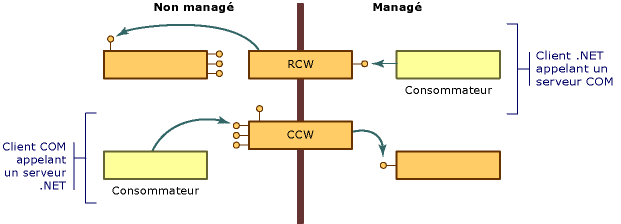

# Wrappers COM
COM diffère du modèle objet .NET Framework sur plusieurs points importants :  
  
-   Les clients des objets COM doivent gérer la durée de vie de ces objets ; le common language runtime gère la durée de vie des objets dans son environnement.  
  
-   Les clients des objets COM déterminent si un service est disponible en demandant une interface qui fournit ce service et en récupérant le cas échéant un pointeur d’interface en retour. Les clients des objets .NET peuvent obtenir une description de la fonctionnalité d’un objet par l’intermédiaire de la réflexion.  
  
-   Les objets NET résident dans la mémoire managée par l’environnement d’exécution .NET Framework. Celui-ci peut déplacer des objets dans la mémoire en vue d’améliorer les performances et mettre à jour toutes les références aux objets qu’il déplace. Les clients non managés, ayant obtenu un pointeur désignant un objet, s’attendent à ce que cet objet reste au même emplacement. Ces clients ne disposent d’aucun mécanisme leur permettant d’utiliser un objet dont l’emplacement n’est pas fixe.  
  
 Pour surmonter ces différences, le runtime fournit des classes wrapper pour faire croire aux clients à la fois managés et non managés qu’ils appellent des objets dans leur environnement respectif. Chaque fois que votre client managé appelle une méthode sur un objet COM, le runtime crée un [wrapper RCW (Runtime Callable Wrapper)](../../../docs/framework/interop/runtime-callable-wrapper.md). Les wrappers RCW permettent, entre autres, de gommer les différences entre les mécanismes de référence managé et non managé. Le runtime crée également un [wrapper CCW (COM Callable Wrapper)](../../../docs/framework/interop/com-callable-wrapper.md) pour inverser le processus, permettant ainsi à un client COM d’appeler de façon transparente une méthode sur un objet .NET. Ainsi que le montre l’illustration suivante, la perspective du code appelant détermine la classe wrapper créée par le runtime.  
  
   
Vue d'ensemble du wrapper COM  
  
 Dans la plupart des cas, les wrappers RCW ou CCW standard générés par le runtime assurent un marshaling adéquat pour les appels qui franchissent la limite séparant COM du .NET Framework. En utilisant des attributs personnalisés, vous pouvez facultativement définir la façon dont le runtime représente le code managé et non managé.  
  
## Voir aussi  
 [Interopérabilité COM avancée](http://msdn.microsoft.com/en-us/3ada36e5-2390-4d70-b490-6ad8de92f2fb)   
 [Wrapper RCW (Runtime Callable Wrapper)](../../../docs/framework/interop/runtime-callable-wrapper.md)   
 [Wrapper CCW (COM Callable Wrapper)](../../../docs/framework/interop/com-callable-wrapper.md)   
 [Personnalisation de wrappers standard](http://msdn.microsoft.com/en-us/c40d089b-6a3c-41b5-a20d-d760c215e49d)   
 [Guide pratique pour personnaliser les wrappers RCW (Runtime Callable Wrapper)](http://msdn.microsoft.com/en-us/4a4bb3da-4d60-4517-99f2-78d46a681732)

