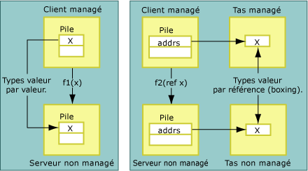
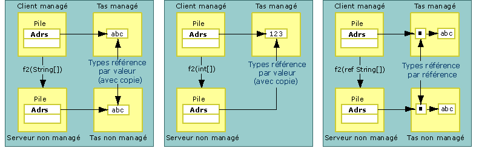

# copie et épinglage
Lors du marshaling des données, le marshaleur d’interopérabilité peut copier ou épingler les données qui sont marshalées. La copie des données déplace une copie des données d’un emplacement de mémoire vers un autre emplacement de mémoire. L’illustration suivante montre les différences entre la copie d’un type valeur et la copie d’un type passé par référence à partir de la mémoire managée vers la mémoire non managée.  
  
   
Types valeur passés par valeur et par référence  
  
 Des arguments de méthode passés par valeur sont marshalés vers le code non managé en tant que valeurs sur la pile. Le processus de copie est direct. Les arguments passés par référence sont passés comme pointeurs sur la pile. Les types référence sont également passés par valeur et par référence. Comme le montre l’illustration suivante, les types référence passés par valeur sont soit copiés, soit épinglés.  
  
   
Types référence passés par valeur et par référence  
  
 L’épinglage verrouille temporairement les données dans leur emplacement de mémoire actuel, évitant ainsi qu’elles ne soient déplacées par le garbage collector du common language runtime. Le marshaleur épingle des données pour réduire la charge mémoire imposée par la copie et pour améliorer les performances. Le type des données détermine si celles-ci sont copiées ou épinglées lors du processus de marshaling.  L’épinglage se fait automatiquement pendant le marshaling pour les objets tels que <xref:System.String>. Cependant, vous pouvez également épingler manuellement la mémoire à l’aide de la classe <xref:System.Runtime.InteropServices.GCHandle>.  
  
## Classes blittables mises en forme  
 Les classes [blittables](../../../docs/framework/interop/blittable-and-non-blittable-types.md) mises en forme ont une disposition fixe (mise en forme) et une représentation commune des données en mémoire managée et non managée. Quand ces types nécessitent d’être marshalés, un pointeur vers l’objet dans le tas est passé directement à l’appelé. L’appelé peut changer le contenu de l’emplacement de mémoire référencé par le pointeur.  
  
> [!NOTE]
>  L’appelé peut changer le contenu de la mémoire si le paramètre est marqué en sortie ou en entrée/sortie. En revanche, l’appelé doit éviter de changer le contenu quand le paramètre est défini pour marshaler en entrée, qui est le paramètre par défaut pour les types blittables mis en forme. La modification d’un objet en entrée génère des problèmes quand la même classe est exportée vers une bibliothèque de types et utilisée pour effectuer des appels entre cloisonnements.  
  
## Classes non blittables mises en forme  
 Les classes [non blittables](../../../docs/framework/interop/blittable-and-non-blittable-types.md) mises en forme ont une disposition fixe (mise en forme), mais la représentation des données est différente en mémoire managée et non managée. Les données peuvent nécessiter des transformations dans les situations suivantes :  
  
-   Si une classe non blittable est marshalée par valeur, l’appelé reçoit un pointeur vers une copie de la structure de données.  
  
-   Si une classe non blittable est marshalée par référence, l’appelé reçoit un pointeur vers un pointeur vers une copie de la structure de données.  
  
-   Si l’attribut <xref:System.Runtime.InteropServices.InAttribute> est défini, cette copie est toujours initialisée avec l’état de l’instance, en marshalant si nécessaire.  
  
-   Si l’attribut <xref:System.Runtime.InteropServices.OutAttribute> est défini, l’état est toujours recopié dans l’instance au retour, en marshalant si nécessaire.  
  
-   Si les deux attributs **InAttribute** et **OutAttribute** sont définis, les deux copies sont requises. Si l’un des attributs est omis, le marshaleur peut optimiser en éliminant l’une des copies.  
  
## Types référence  
 Les types référence peuvent être passés par valeur ou par référence. Quand ils sont passés par valeur, un pointeur vers le type est passé sur la pile. Quand ils sont passés par référence, un pointeur vers un pointeur vers le type est passé sur la pile.  
  
 Les types référence possèdent le comportement conditionnel suivant :  
  
-   Si un type référence est passé par valeur et possède des membres de types non blittables, les types sont convertis deux fois :  
  
    -   Quand un argument est passé vers le côté non managé.  
  
    -   Lors du retour de l’appel.  
  
     Pour éviter copie et conversion inutiles, ces types sont marshalés en tant que paramètres en entrée. Vous devez appliquer explicitement les attributs **InAttribute** et **OutAttribute** à un argument pour que l’appelant voie les changements effectués par l’appelé.  
  
-   Si un type référence est passé par valeur et ne possède que des membres de types blittables, ce type peut être épinglé lors du marshaling et tout changement apporté par l’appelé aux membres du type est vu par l’appelant. Appliquez les attributs **InAttribute** et **OutAttribute** explicitement si vous voulez ce comportement. Sans ces attributs directionnels, le marshaleur d’interopérabilité n’exporte pas d’informations directionnelles vers la bibliothèque de types (il exporte en entrée, ce qui est le paramètre par défaut). Cela peut poser des problèmes lors du marshaling entre cloisonnements COM.  
  
-   Si un type référence est passé par référence, il est marshalé en entrée/sortie par défaut.  
  
## System.String et System.Text.StringBuilder  
 Quand des données sont marshalées vers du code non managé par valeur ou par référence, le marshaleur copie généralement les données vers une mémoire tampon secondaire (en convertissant éventuellement des jeux de caractères lors de la copie) et passe une référence à la mémoire tampon à l’appelé. Sauf si la référence est un **BSTR** alloué avec **SysAllocString**, la référence est toujours allouée avec **CoTaskMemAlloc**.  
  
 Par souci d’optimisation quand l’un ou l’autre type de chaîne est marshalé par valeur (notamment comme chaîne de caractères Unicode), le marshaleur passe à l’appelé un pointeur direct vers des chaînes managées dans la mémoire tampon Unicode interne au lieu de le copier dans une nouvelle mémoire tampon.  
  
> [!CAUTION]
>  Quand une chaîne est passée par valeur, l’appelé ne doit jamais changer la référence passée par le marshaleur. Sinon, il risque d’endommager le tas managé.  
  
 Quand <xref:System.String?displayProperty=nameWithType> est passé par référence, le marshaleur copie le contenu de la chaîne dans une mémoire tampon secondaire avant d’effectuer l’appel. Il copie ensuite le contenu de la mémoire tampon dans une nouvelle chaîne au retour de l’appel. Cette technique garantit que la chaîne managée non modifiable demeure inchangée.  
  
 Quand <xref:System.Text.StringBuilder?displayProperty=nameWithType> est passé par valeur, le marshaleur passe une référence à la mémoire tampon interne de **StringBuilder** directement à l’appelant. L’appelant et l’appelé doivent s’entendre sur la taille de la mémoire tampon. L’appelant est chargé de créer un **StringBuilder** de longueur adéquate. L’appelé doit prendre les précautions nécessaires pour garantir le non-débordement de la mémoire tampon. **StringBuilder** fait exception à la règle qui veut que les types référence passés par valeur sont passés comme paramètres en entrée par défaut. Il est toujours passé comme paramètre en entrée/sortie.  
  
## Voir aussi  
 [Comportement de marshaling par défaut](../../../docs/framework/interop/default-marshaling-behavior.md)  
 [Gestion de la mémoire avec le marshaleur d’interopérabilité](http://msdn.microsoft.com/en-us/417206ce-ee3e-4619-9529-0c0b686c7bee)  
 [Attributs directionnels](http://msdn.microsoft.com/en-us/241ac5b5-928e-4969-8f58-1dbc048f9ea2)  
 [Marshaling d'interopérabilité](../../../docs/framework/interop/interop-marshaling.md)
