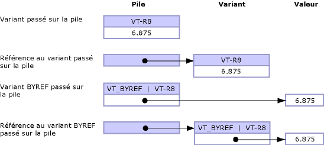

# <a name="default-marshaling-for-objects"></a>Marshaling par défaut pour les objets
Les paramètres et les champs de type <xref:System.Object?displayProperty=nameWithType> peuvent être exposés à un code non managé sous la forme de l’un des types suivants :  
  
-   Un variant quand l’objet est un paramètre.  
  
-   Une interface quand l’objet est un champ de structure.  
  
 Seul COM interop prend en charge le marshaling des types d’objets. Le comportement par défaut est de marshaler des objets vers des variants COM. Ces règles s’appliquent uniquement au type **Object** et ne s’appliquent pas aux objets fortement typés issus de la classe **Object**.  
  
 Cette rubrique fournit les informations supplémentaires suivantes sur le marshaling des types d’objets :  
  
-   [Options de marshaling](#cpcondefaultmarshalingforobjectsanchor7)  
  
-   [Marshaling d’un objet vers une interface](#cpcondefaultmarshalingforobjectsanchor2)  
  
-   [Marshaling d’un objet vers un variant](#cpcondefaultmarshalingforobjectsanchor3)  
  
-   [Marshaling d’un variant vers un objet](#cpcondefaultmarshalingforobjectsanchor4)  
  
-   [Marshaling des variants ByRef](#cpcondefaultmarshalingforobjectsanchor6)  
  
<a name="cpcondefaultmarshalingforobjectsanchor7"></a>   
## <a name="marshaling-options"></a>Options de marshaling  
 Le tableau suivant montre les options de marshaling pour le type de données **Object**. L’attribut <xref:System.Runtime.InteropServices.MarshalAsAttribute> fournit plusieurs valeurs d’énumération <xref:System.Runtime.InteropServices.UnmanagedType> pour marshaler des objets.  
  
|Type d'énumération|Description du format non managé|  
|----------------------|-------------------------------------|  
|**UnmanagedType.Struct**<br /><br /> (valeur par défaut des paramètres)|Variant de style COM.|  
|**UnmanagedType.Interface**|Interface **IDispatch**, si possible ; sinon, interface **IUnknown**.|  
|**UnmanagedType.IUnknown**<br /><br /> (valeur par défaut des champs)|Interface **IUnknown**.|  
|**UnmanagedType.IDispatch**|Interface **IDispatch**.|  
  
 L’exemple suivant montre la définition d’interface managée de `MarshalObject`.  
  
```vb  
Interface MarshalObject  
   Sub SetVariant(o As Object)  
   Sub SetVariantRef(ByRef o As Object)  
   Function GetVariant() As Object  
  
   Sub SetIDispatch( <MarshalAs(UnmanagedType.IDispatch)> o As Object)  
   Sub SetIDispatchRef(ByRef <MarshalAs(UnmanagedType.IDispatch)> o _  
      As Object)  
   Function GetIDispatch() As <MarshalAs(UnmanagedType.IDispatch)> Object  
   Sub SetIUnknown( <MarshalAs(UnmanagedType.IUnknown)> o As Object)  
   Sub SetIUnknownRef(ByRef <MarshalAs(UnmanagedType.IUnknown)> o _  
      As Object)  
   Function GetIUnknown() As <MarshalAs(UnmanagedType.IUnknown)> Object  
End Interface  
```  
  
```csharp  
interface MarshalObject {  
   void SetVariant(Object o);  
   void SetVariantRef(ref Object o);  
   Object GetVariant();  
  
   void SetIDispatch ([MarshalAs(UnmanagedType.IDispatch)]Object o);  
   void SetIDispatchRef([MarshalAs(UnmanagedType.IDispatch)]ref Object o);  
   [MarshalAs(UnmanagedType.IDispatch)] Object GetIDispatch();  
   void SetIUnknown ([MarshalAs(UnmanagedType.IUnknown)]Object o);  
   void SetIUnknownRef([MarshalAs(UnmanagedType.IUnknown)]ref Object o);  
   [MarshalAs(UnmanagedType.IUnknown)] Object GetIUnknown();  
}  
```  
  
 Le code suivant exporte l’interface `MarshalObject` vers une bibliothèque de types.  
  
```  
interface MarshalObject {  
   HRESULT SetVariant([in] VARIANT o);  
   HRESULT SetVariantRef([in,out] VARIANT *o);  
   HRESULT GetVariant([out,retval] VARIANT *o)   
   HRESULT SetIDispatch([in] IDispatch *o);  
   HRESULT SetIDispatchRef([in,out] IDispatch **o);  
   HRESULT GetIDispatch([out,retval] IDispatch **o)   
   HRESULT SetIUnknown([in] IUnknown *o);  
   HRESULT SetIUnknownRef([in,out] IUnknown **o);  
   HRESULT GetIUnknown([out,retval] IUnknown **o)   
}  
```  
  
> [!NOTE]
>  Le marshaleur d’interopérabilité libère automatiquement tout objet alloué à l’intérieur du variant après l’appel.  
  
 L’exemple suivant illustre un type valeur mis en forme.  
  
```vb  
Public Structure ObjectHolder  
   Dim o1 As Object  
   <MarshalAs(UnmanagedType.IDispatch)> Public o2 As Object  
End Structure  
```  
  
```csharp  
public struct ObjectHolder {  
   Object o1;  
   [MarshalAs(UnmanagedType.IDispatch)]public Object o2;  
}  
```  
  
 Le code suivant exporte le type mis en forme vers une bibliothèque de types.  
  
```  
struct ObjectHolder {  
   VARIANT o1;  
   IDispatch *o2;  
}  
```  
  
<a name="cpcondefaultmarshalingforobjectsanchor2"></a>   
## <a name="marshaling-object-to-interface"></a>Marshaling d’un objet vers une interface  
 Quand un objet est exposé à COM en tant qu’interface, cette interface est l’interface de classe pour le type managé <xref:System.Object> (l’interface **_Object**). Cette interface est de type **IDispatch** (<xref:System.Runtime.InteropServices.UnmanagedType>) ou **IUnknown** (**UnmanagedType.IUnknown**) dans la bibliothèque de types résultante. Les clients COM peuvent appeler dynamiquement les membres de la classe managée ou tout membre implémenté par ses classes dérivées via l’interface **_Object**. Le client peut également appeler **QueryInterface** pour obtenir toute autre interface explicitement implémentée par le type managé.  
  
<a name="cpcondefaultmarshalingforobjectsanchor3"></a>   
## <a name="marshaling-object-to-variant"></a>Marshaling d’un objet vers un variant  
 Quand un objet est marshalé en variant, le type variant interne est déterminé au moment de l’exécution en fonction des règles suivantes :  
  
-   Si la référence d’objet est null (**Nothing** en Visual Basic), l’objet est marshalé en variant de type **VT_EMPTY**.  
  
-   Si l’objet est une instance d’un type énuméré dans le tableau suivant, le type variant résultant est déterminé par les règles du marshaleur et illustré dans le tableau.  
  
-   Les autres objets qui nécessitent de contrôler explicitement le comportement de marshaling peuvent implémenter l’interface <xref:System.IConvertible>. Dans ce cas, le type variant est déterminé par le code de type retourné à partir de la méthode <xref:System.IConvertible.GetTypeCode%2A?displayProperty=nameWithType>. Sinon, l’objet est marshalé en tant que variant de type **VT_UNKNOWN**.  
  
### <a name="marshaling-system-types-to-variant"></a>Marshaling de types système vers des variants  
 Le tableau suivant montre les types d’objets managés et leurs types variant COM correspondants. Ces types sont convertis uniquement quand la signature de la méthode appelée est de type <xref:System.Object?displayProperty=nameWithType>.  
  
|Type d'objet|Type variant COM|  
|-----------------|----------------------|  
|Référence d’objet null (**Nothing** en Visual Basic).|**VT_EMPTY**|  
|<xref:System.DBNull?displayProperty=nameWithType>|**VT_NULL**|  
|<xref:System.Runtime.InteropServices.ErrorWrapper?displayProperty=nameWithType>|**VT_ERROR**|  
|<xref:System.Reflection.Missing?displayProperty=nameWithType>|**VT_ERROR** avec **E_PARAMNOTFOUND**|  
|<xref:System.Runtime.InteropServices.DispatchWrapper?displayProperty=nameWithType>|**VT_DISPATCH**|  
|<xref:System.Runtime.InteropServices.UnknownWrapper?displayProperty=nameWithType>|**VT_UNKNOWN**|  
|<xref:System.Runtime.InteropServices.CurrencyWrapper?displayProperty=nameWithType>|**VT_CY**|  
|<xref:System.Boolean?displayProperty=nameWithType>|**VT_BOOL**|  
|<xref:System.SByte?displayProperty=nameWithType>|**VT_I1**|  
|<xref:System.Byte?displayProperty=nameWithType>|**VT_UI1**|  
|<xref:System.Int16?displayProperty=nameWithType>|**VT_I2**|  
|<xref:System.UInt16?displayProperty=nameWithType>|**VT_UI2**|  
|<xref:System.Int32?displayProperty=nameWithType>|**VT_I4**|  
|<xref:System.UInt32?displayProperty=nameWithType>|**VT_UI4**|  
|<xref:System.Int64?displayProperty=nameWithType>|**VT_I8**|  
|<xref:System.UInt64?displayProperty=nameWithType>|**VT_UI8**|  
|<xref:System.Single?displayProperty=nameWithType>|**VT_R4**|  
|<xref:System.Double?displayProperty=nameWithType>|**VT_R8**|  
|<xref:System.Decimal?displayProperty=nameWithType>|**VT_DECIMAL**|  
|<xref:System.DateTime?displayProperty=nameWithType>|**VT_DATE**|  
|<xref:System.String?displayProperty=nameWithType>|**VT_BSTR**|  
|<xref:System.IntPtr?displayProperty=nameWithType>|**VT_INT**|  
|<xref:System.UIntPtr?displayProperty=nameWithType>|**VT_UINT**|  
|<xref:System.Array?displayProperty=nameWithType>|**VT_ARRAY**|  
  
 En utilisant l’interface `MarshalObject` définie dans l’exemple précédent, l’exemple de code suivant démontre comment passer plusieurs types de variants à un serveur COM.  
  
```vb  
Dim mo As New MarshalObject()  
mo.SetVariant(Nothing)         ' Marshal as variant of type VT_EMPTY.  
mo.SetVariant(System.DBNull.Value) ' Marshal as variant of type VT_NULL.  
mo.SetVariant(CInt(27))        ' Marshal as variant of type VT_I2.  
mo.SetVariant(CLng(27))        ' Marshal as variant of type VT_I4.  
mo.SetVariant(CSng(27.0))      ' Marshal as variant of type VT_R4.  
mo.SetVariant(CDbl(27.0))      ' Marshal as variant of type VT_R8.  
```  
  
```csharp  
MarshalObject mo = new MarshalObject();  
mo.SetVariant(null);            // Marshal as variant of type VT_EMPTY.  
mo.SetVariant(System.DBNull.Value); // Marshal as variant of type VT_NULL.  
mo.SetVariant((int)27);          // Marshal as variant of type VT_I2.  
mo.SetVariant((long)27);          // Marshal as variant of type VT_I4.  
mo.SetVariant((single)27.0);   // Marshal as variant of type VT_R4.  
mo.SetVariant((double)27.0);   // Marshal as variant of type VT_R8.  
```  
  
 Les types COM qui n’ont pas de types managés correspondants peuvent être marshalés à l’aide des classes wrapper comme <xref:System.Runtime.InteropServices.ErrorWrapper>, <xref:System.Runtime.InteropServices.DispatchWrapper>, <xref:System.Runtime.InteropServices.UnknownWrapper> et <xref:System.Runtime.InteropServices.CurrencyWrapper>. L’exemple de code suivant démontre comment utiliser ces wrappers pour passer différents types de variants à un serveur COM.  
  
```vb  
Imports System.Runtime.InteropServices  
' Pass inew as a variant of type VT_UNKNOWN interface.  
mo.SetVariant(New UnknownWrapper(inew))  
' Pass inew as a variant of type VT_DISPATCH interface.  
mo.SetVariant(New DispatchWrapper(inew))  
' Pass a value as a variant of type VT_ERROR interface.  
mo.SetVariant(New ErrorWrapper(&H80054002))  
' Pass a value as a variant of type VT_CURRENCY interface.  
mo.SetVariant(New CurrencyWrapper(New Decimal(5.25)))  
```  
  
```csharp  
using System.Runtime.InteropServices;  
// Pass inew as a variant of type VT_UNKNOWN interface.  
mo.SetVariant(new UnknownWrapper(inew));  
// Pass inew as a variant of type VT_DISPATCH interface.  
mo.SetVariant(new DispatchWrapper(inew));  
// Pass a value as a variant of type VT_ERROR interface.  
mo.SetVariant(new ErrorWrapper(0x80054002));  
// Pass a value as a variant of type VT_CURRENCY interface.  
mo.SetVariant(new CurrencyWrapper(new Decimal(5.25)));  
```  
  
 Les classes wrapper sont définies dans l’espace de noms <xref:System.Runtime.InteropServices>.  
  
### <a name="marshaling-the-iconvertible-interface-to-variant"></a>Marshaling de l’interface IConvertible vers un variant  
 D’autres types que ceux répertoriés dans la section précédente peuvent contrôler la manière dont ils sont marshalés en implémentant l’interface <xref:System.IConvertible>. Si l’objet implémente l’interface **IConvertible**, le type variant COM est déterminé au moment de l’exécution par la valeur de l’énumération <xref:System.TypeCode> retournée à partir de la méthode <xref:System.IConvertible.GetTypeCode%2A?displayProperty=nameWithType>.  
  
 Le tableau suivant montre les valeurs possibles pour l’énumération **TypeCode** et le type variant COM correspondant pour chaque valeur.  
  
|TypeCode|Type variant COM|  
|--------------|----------------------|  
|**TypeCode.Empty**|**VT_EMPTY**|  
|**TypeCode.Object**|**VT_UNKNOWN**|  
|**TypeCode.DBNull**|**VT_NULL**|  
|**TypeCode.Boolean**|**VT_BOOL**|  
|**TypeCode.Char**|**VT_UI2**|  
|**TypeCode.Sbyte**|**VT_I1**|  
|**TypeCode.Byte**|**VT_UI1**|  
|**TypeCode.Int16**|**VT_I2**|  
|**TypeCode.UInt16**|**VT_UI2**|  
|**TypeCode.Int32**|**VT_I4**|  
|**TypeCode.UInt32**|**VT_UI4**|  
|**TypeCode.Int64**|**VT_I8**|  
|**TypeCode.UInt64**|**VT_UI8**|  
|**TypeCode.Single**|**VT_R4**|  
|**TypeCode.Double**|**VT_R8**|  
|**TypeCode.Decimal**|**VT_DECIMAL**|  
|**TypeCode.DateTime**|**VT_DATE**|  
|**TypeCode.String**|**VT_BSTR**|  
|Non pris en charge.|**VT_INT**|  
|Non pris en charge.|**VT_UINT**|  
|Non pris en charge.|**VT_ARRAY**|  
|Non pris en charge.|**VT_RECORD**|  
|Non pris en charge.|**VT_CY**|  
|Non pris en charge.|**VT_VARIANT**|  
  
 La valeur du variant COM est déterminée en appelant l’interface **IConvertible.To** *Type*, où **To** *Type* est la routine de conversion qui correspond au type retourné par **IConvertible.GetTypeCode**. Par exemple, un objet qui retourne **TypeCode.Double** depuis **IConvertible.GetTypeCode** est marshalé en tant que variant COM de type **VT_R8**. Vous pouvez obtenir la valeur du variant (stockée dans le champ **dblVal** du variant COM) en effectuant un cast en une interface **IConvertible** et en appelant la méthode <xref:System.IConvertible.ToDouble%2A>.  
  
<a name="cpcondefaultmarshalingforobjectsanchor4"></a>   
## <a name="marshaling-variant-to-object"></a>Marshaling d’un variant vers un objet  
 Lors du marshaling d’un variant vers un objet, le type, et parfois la valeur, du variant marshalé détermine le type d’objet produit. Le tableau suivant identifie chaque type variant et le type d’objet correspondant que le marshaleur crée quand un variant est passé de COM au .NET Framework.  
  
|Type variant COM|Type d'objet|  
|----------------------|-----------------|  
|**VT_EMPTY**|Référence d’objet null (**Nothing** en Visual Basic).|  
|**VT_NULL**|<xref:System.DBNull?displayProperty=nameWithType>|  
|**VT_DISPATCH**|**System.__ComObject** ou null si (pdispVal == null)|  
|**VT_UNKNOWN**|**System.__ComObject** ou null si (punkVal == null)|  
|**VT_ERROR**|<xref:System.UInt32?displayProperty=nameWithType>|  
|**VT_BOOL**|<xref:System.Boolean?displayProperty=nameWithType>|  
|**VT_I1**|<xref:System.SByte?displayProperty=nameWithType>|  
|**VT_UI1**|<xref:System.Byte?displayProperty=nameWithType>|  
|**VT_I2**|<xref:System.Int16?displayProperty=nameWithType>|  
|**VT_UI2**|<xref:System.UInt16?displayProperty=nameWithType>|  
|**VT_I4**|<xref:System.Int32?displayProperty=nameWithType>|  
|**VT_UI4**|<xref:System.UInt32?displayProperty=nameWithType>|  
|**VT_I8**|<xref:System.Int64?displayProperty=nameWithType>|  
|**VT_UI8**|<xref:System.UInt64?displayProperty=nameWithType>|  
|**VT_R4**|<xref:System.Single?displayProperty=nameWithType>|  
|**VT_R8**|<xref:System.Double?displayProperty=nameWithType>|  
|**VT_DECIMAL**|<xref:System.Decimal?displayProperty=nameWithType>|  
|**VT_DATE**|<xref:System.DateTime?displayProperty=nameWithType>|  
|**VT_BSTR**|<xref:System.String?displayProperty=nameWithType>|  
|**VT_INT**|<xref:System.Int32?displayProperty=nameWithType>|  
|**VT_UINT**|<xref:System.UInt32?displayProperty=nameWithType>|  
|**VT_ARRAY** &#124; **VT_\***|<xref:System.Array?displayProperty=nameWithType>|  
|**VT_CY**|<xref:System.Decimal?displayProperty=nameWithType>|  
|**VT_RECORD**|Type valeur boxed correspondant.|  
|**VT_VARIANT**|Non pris en charge.|  
  
 Les types variant passés à partir de COM vers le code managé, puis repassés à COM peuvent ne pas conserver le même type variant durant la durée de l’appel. Envisagez ce qui se passe quand un variant de type **VT_DISPATCH** est passé à partir de COM vers le .NET Framework. Lors du marshaling, le variant est converti en <xref:System.Object?displayProperty=nameWithType>. Si **Object** est ensuite repassé à COM, il est remarshalé vers un variant de type **VT_UNKNOWN**. Rien ne garantit que le variant produit quand un objet est marshalé à partir de code managé vers COM sera du même type que le variant utilisé à l’origine pour produire l’objet.  
  
<a name="cpcondefaultmarshalingforobjectsanchor6"></a>   
## <a name="marshaling-byref-variants"></a>Marshaling des variants ByRef  
 Bien que les variants puissent eux-mêmes être passés par valeur ou par référence, l’indicateur **VT_BYREF** peut être également utilisé avec n’importe quel type de variant pour indiquer que le contenu du variant est passé par référence plutôt que par valeur. La différence entre le marshaling de variants par référence et le marshaling d’un variant dont l’indicateur **VT_BYREF** est défini peut prêter à confusion. L’illustration suivante clarifie ces différences.  
  
   
Variants passés par valeur et par référence  
  
 **Comportement par défaut pour le marshaling d’objets et de variants par valeur**  
  
-   Lors du passage d’objets à partir de code managé vers COM, le contenu de l’objet est copié dans un nouveau variant créé par le marshaleur à l’aide des règles définies dans [Marshaling d’un objet vers un variant](#cpcondefaultmarshalingforobjectsanchor3). Les changements apportés au variant côté non managé ne sont pas retournés vers l’objet d’origine au retour de l’appel.  
  
-   Lors du passage de variants à partir de COM vers du code managé, le contenu du variant est copié dans un objet nouvellement créé à l’aide des règles définies dans [Marshaling d’un variant vers un objet](#cpcondefaultmarshalingforobjectsanchor4). Les changements apportés à l’objet côté managé ne sont pas retournés vers le variant d’origine au retour de l’appel.  
  
 **Comportement par défaut pour le marshaling d’objets et de variants par référence**  
  
 Pour retourner des changements à l’appelant, les paramètres doivent être passés par référence. Par exemple, vous pouvez utiliser le mot clé **ref** en C# (ou **ByRef** en code managé Visual Basic) pour passer des paramètres par référence. Dans COM, les paramètres de référence sont passés à l’aide d’un pointeur tel que **variant \***.  
  
-   Lors du passage d’un objet à COM par référence, le marshaleur crée un variant et copie le contenu de la référence d’objet dans le variant avant que l’appel ne soit effectué. Le variant est passé à la fonction non managée où l’utilisateur est libre de changer le contenu du variant. Au retour de l’appel, tout changement apporté au variant côté non managé est retourné vers l’objet d’origine. Si le type de variant est différent du type du variant passé à l’appel, les changements sont retournés à un objet d’un type différent. Cela signifie que le type de l’objet passé dans l’appel peut être différent du type de l’objet retourné à partir de l’appel.  
  
-   Lors du passage d’un variant au code managé par référence, le marshaleur crée un objet et copie le contenu du variant dans l’objet avant que l’appel ne soit effectué. Une référence à l’objet est passée à la fonction managée, où l’utilisateur est libre de changer l’objet. Au retour de l’appel, tout changement apporté à l’objet référencé est retourné vers le variant d’origine. Si le type de l’objet est différent du type de l’objet passé dans l’appel, le type du variant d’origine est changé et la valeur est retournée dans le variant. Là encore, le type du variant passé dans l’appel peut être différent du type du variant retourné à partir de l’appel.  
  
 **Comportement par défaut pour le marshaling d’un variant où l’indicateur VT_BYREF a été défini**  
  
-   Un variant passé à du code managé par valeur peut avoir l’indicateur **VT_BYREF** défini pour indiquer que le variant contient une référence plutôt qu’une valeur. Dans ce cas, le variant est toujours marshalé vers un objet, car le variant est passé par valeur. Le marshaleur déréférence automatiquement le contenu du variant et le copie dans un objet nouvellement créé avant d’effectuer l’appel. L’objet est ensuite passé à la fonction managée ; cependant, au retour de l’appel, l’objet n’est pas retourné dans le variant d’origine. Les changements apportés à l’objet managé sont perdus.  
  
    > [!CAUTION]
    >  Il est impossible de changer la valeur d’un variant passé par valeur, même si l’indicateur **VT_BYREF** de ce variant est défini.  
  
-   Un variant passé à du code managé par référence peut aussi avoir l’indicateur **VT_BYREF** défini pour indiquer que le variant contient une autre référence. Si c’est le cas, le variant est marshalé vers un objet **ref** parce qu’il est passé par référence. Le marshaleur déréférence automatiquement le contenu du variant et le copie dans un objet nouvellement créé avant d’effectuer l’appel. Au retour de l’appel, la valeur de l’objet est retournée vers la référence située dans le variant d’origine uniquement si l’objet est du même type que l’objet passé. Autrement dit, la propagation ne change pas le type d’un variant avec l’indicateur **VT_BYREF** défini. Si le type de l’objet est modifié durant l’appel, une exception <xref:System.InvalidCastException> se produit au retour de l’appel.  
  
 Le tableau suivant résume les règles de propagation pour les variants et les objets.  
  
|From|À|Changements retournés|  
|----------|--------|-----------------------------|  
|**Variant**  *v*|**Object**  *o*|Never|  
|**Object**  *o*|**Variant**  *v*|Never|  
|**Variant**   ***\****  *pv*|**Ref Object**  *o*|Toujours|  
|**Ref object**  *o*|**Variant**   ***\****  *pv*|Toujours|  
|**Variant**  *v* **(VT_BYREF** *&#124;* **VT_\*)**|**Object**  *o*|Never|  
|**Variant**  *v* **(VT_BYREF** *&#124;* **VT_)**|**Ref Object**  *o*|Uniquement si le type n’a pas changé.|  
  
## <a name="see-also"></a>Voir aussi  
 [Comportement de marshaling par défaut](../../../docs/framework/interop/default-marshaling-behavior.md)  
 [Types blittable et non blittable](../../../docs/framework/interop/blittable-and-non-blittable-types.md)  
 [Attributs directionnels](http://msdn.microsoft.com/en-us/241ac5b5-928e-4969-8f58-1dbc048f9ea2)  
 [Copie et épinglage](../../../docs/framework/interop/copying-and-pinning.md)
