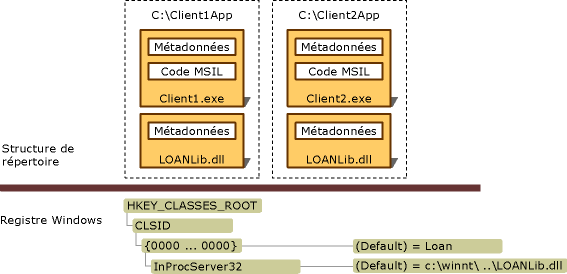

# Deploying an Interop Application
Une application d'interopérabilité comprend généralement un assembly client .NET, un ou plusieurs assemblys d'interopérabilité représentant différentes bibliothèques de types COM et un ou plusieurs composants COM inscrits.  Visual Studio et le [!INCLUDE[winsdklong](../../../includes/winsdklong-md.md)] fournissent des outils pour importer et convertir une bibliothèque de types en un assembly d'interopérabilité, comme abordé dans [Importing a Type Library as an Assembly](../../../docs/framework/interop/importing-a-type-library-as-an-assembly.md).  Il existe deux façons de déployer une application d'interopérabilité :  
  
-   En utilisant des types interop incorporés : en commençant par le [!INCLUDE[net_v40_long](../../../includes/net-v40-long-md.md)], vous pouvez instruire le compilateur pour incorporer les informations de type d'un assembly d'interopérabilité dans votre fichier exécutable.  Le compilateur incorpore uniquement les informations de type utilisées par votre application.  Vous n'avez pas à déployer l'assembly d'interopérabilité avec votre application.  Il s'agit de la technique recommandée.  
  
-   En déployant des assemblys d'interopérabilité : vous pouvez créer une référence standard à un assembly d'interopérabilité.  Dans ce cas, l'assembly d'interopérabilité doit être déployé avec votre application.  Si vous utilisez cette technique et que vous n'utilisez pas un composant COM privé, référencez toujours l'assembly PIA publié par l'auteur du composant COM que vous prévoyez d'incorporer dans votre code managé.  Pour plus d'informations sur la production et l'utilisation d'assemblys d'interopérabilité, consultez [Assemblys PIA \(Primary Interop Assembly\)](http://msdn.microsoft.com/fr-fr/b977a8be-59a0-40a0-a806-b11ffba5c080).  
  
 Si vous utilisez des types interop incorporés, le déploiement est simple et ne présente pas de complication.  Vous n'avez rien de particulier à faire.  Le reste de cet article décrit les scénarios pour le déploiement d'assemblys d'interopérabilité avec votre application.  
  
## Déploiement d'assemblys d'interopérabilité  
 Les assemblys peuvent posséder des noms forts.  Un assembly avec nom fort comporte la clé publique de l'éditeur, qui lui confère une identité unique.  Les assemblys qui sont produits par l'[importateur de bibliothèques de types \(Tlbimp.exe\)](../../../docs/framework/tools/tlbimp-exe-type-library-importer.md) peuvent être signés par l'éditeur à l'aide de l'option **\/keyfile**.  Vous pouvez installer des assemblys signés dans le Global Assembly Cache.  Les assemblys non signés doivent être installés sur l'ordinateur de l'utilisateur en tant qu'assemblys privés.  
  
### Assemblys privés  
 Pour installer un assembly afin de l'utiliser en mode privé, le fichier exécutable de l'application et l'assembly d'interopérabilité qui contient les types COM doivent être installés dans la même structure de répertoire.  L'illustration suivante montre un assembly d'interopérabilité non signé devant être utilisé en privé par Client1.exe et Client2.exe qui résident dans des répertoires distincts de l'application.  L'assembly d'interopérabilité, qui s'appelle LOANLib.dll dans cet exemple, est installé à deux reprises.  
  
   
Structure de répertoire et entrées du Registre en vue d'un déploiement privé  
  
 Tous les composants COM associés à l'application doivent être installés dans la base de registres Windows.  Si Client1.exe et Client2.exe figurant dans l'illustration sont installés sur des ordinateurs différents, vous devez alors inscrire les composants COM sur les deux ordinateurs.  
  
### Assemblys partagés  
 Les assemblys qui sont partagés entre plusieurs applications doivent être installés dans un référentiel centralisé appelé le Global Assembly Cache.  Les clients .NET peuvent accéder à la même copie de l'assembly d'interopérabilité, signé et installé dans le Global Assembly Cache.  Pour plus d'informations sur la production et l'utilisation d'assemblys d'interopérabilité, consultez [Assemblys PIA \(Primary Interop Assembly\)](http://msdn.microsoft.com/fr-fr/b977a8be-59a0-40a0-a806-b11ffba5c080).  
  
## Voir aussi  
 [Exposing COM Components to the .NET Framework](../../../docs/framework/interop/exposing-com-components.md)   
 [Importing a Type Library as an Assembly](../../../docs/framework/interop/importing-a-type-library-as-an-assembly.md)   
 [Using COM Types in Managed Code](http://msdn.microsoft.com/fr-fr/1a95a8ca-c8b8-4464-90b0-5ee1a1135b66)   
 [Compiling an Interop Project](../../../docs/framework/interop/compiling-an-interop-project.md)