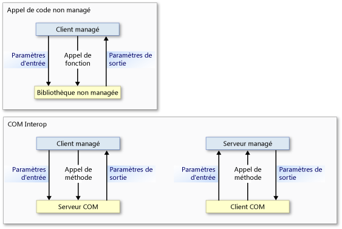
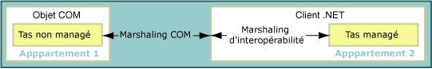
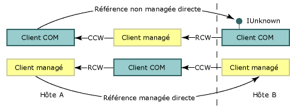

# Marshaling d’interopérabilité
 Le marshaling d’interopérabilité détermine la façon dont les données sont transmises dans les arguments de méthode et les valeurs de retour entre la mémoire managée et non managée lors des appels. Le marshaling d’interopérabilité est une activité d’exécution effectuée par le service de marshaling du common language runtime.  
  
 La plupart des types de données ont des représentations communes dans la mémoire managée et la mémoire non managée. Le marshaleur d'interopérabilité gère ces types à votre place. D'autres types peuvent être ambigus ou non représentés dans la mémoire managée.  
  
 Un type ambigu peut avoir plusieurs représentations non managées qui correspondent à un seul type managé ou bien ne pas avoir d'informations de type (par exemple, la taille d'un tableau). Pour les types ambigus, le marshaleur fournit une représentation par défaut et des représentations alternatives où plusieurs représentations existent. Vous pouvez fournir des instructions explicites au marshaleur sur la façon de marshaler un type ambigu.  
  
 Cette vue d'ensemble contient les sections suivantes :  
  
-   [Appel de code non managé et modèles d’interopérabilité COM](#platform_invoke_and_com_interop_models)  
  
-   [Marshaling et cloisonnements COM](#marshaling_and_com_apartments)  
  
-   [Marshaling des appels distants](#marshaling_remote_calls)  
  
-   [Rubriques connexes](#related_topics)  
  
-   [Référence](#reference)  
  
   
## Appel de code non managé et modèles d'interopérabilité COM  
 Le common language runtime fournit deux mécanismes d'interopérabilité avec le code non managé :  
  
-   L'appel de code non managé, qui permet au code managé d'appeler des fonctions exportées à partir d'une bibliothèque non managée.  
  
-   COM Interop, qui permet au code managé d'interagir avec les objets COM via des interfaces.  
  
 L’appel de code non managé et COM Interop utilisent tous deux le marshaling d’interopérabilité pour faire passer les arguments de méthode de l’appelant à l’appelé, puis dans l’autre sens, si nécessaire. Comme le montre l’illustration suivante, un appel de méthode d’appel de code non managé passe du code managé au code non managé et jamais dans l’autre sens, sauf quand des [fonctions de rappel](../../../docs/framework/interop/callback-functions.md) sont impliquées. Même si les appels de code non managé peuvent uniquement passer du code managé au code non managé, les données peuvent circuler dans les deux sens en tant que paramètres d'entrée ou de sortie. Les appels de méthode COM Interop peuvent circuler dans les deux sens.  
  
   
Flux des appels de code non managé et des appels COM Interop  
  
 Au niveau le plus bas, ces deux mécanismes utilisent le même service de marshaling d’interopérabilité. Toutefois, certains types de données sont pris en charge exclusivement par COM Interop ou par l’appel de code non managé. Pour plus d’informations, consultez [Comportement de marshaling par défaut](../../../docs/framework/interop/default-marshaling-behavior.md).  
  
 [Retour au début](#top)  
  
   
## Marshaling et cloisonnements COM  
 Le marshaleur d'interopérabilité marshale les données entre le tas du common langage runtime et le tas non managé. Le marshaling se produit chaque fois que l'appelant et l'appelé ne peuvent pas agir sur une même instance de données. Le marshaleur d'interopérabilité permet à l'appelant et à l'appelé d'utiliser les mêmes données, même s'ils possèdent chacun leur propre copie des données.  
  
 COM possède également un marshaleur qui marshale les données entre des cloisonnements COM ou différents processus COM. Lors d'un appel entre du code managé et du code non managé au sein d'un même cloisonnement COM, le marshaleur d'interopérabilité est le seul marshaleur impliqué. Lors d'un appel entre du code managé et du code non managé au sein de cloisonnements COM (ou autres processus) différents, le marshaleur d'interopérabilité et le marshaleur COM sont tous les deux impliqués.  
  
### Clients COM et serveurs managés  
 L’entrée de Registre `ThreadingModel` d’un serveur managé exporté avec une bibliothèque de types inscrite par l’outil [Regasm.exe (outil d’inscription d’assemblys)](../../../docs/framework/tools/regasm-exe-assembly-registration-tool.md) a la valeur `Both`. Cette valeur indique que le serveur peut être activé dans un thread unique cloisonné (STA) ou dans un multithread cloisonné (MTA). L'objet serveur est créé dans le même cloisonnement que son appelant, comme indiqué dans le tableau suivant.  
  
|Client COM|Serveur .NET|Configuration requise|  
|----------------|-----------------|-----------------------------|  
|STA|`Both` deviennent un STA.|Marshaling dans un même cloisonnement.|  
|MTA|`Both` deviennent un MTA.|Marshaling dans un même cloisonnement.|  
  
 Étant donné que le client et le serveur se trouvent dans le même cloisonnement, le service de marshaling d'interopérabilité gère automatiquement tout le marshaling de données. L’illustration suivante montre le service de marshaling d’interopérabilité agissant entre les tas managés et non managés au sein du même cloisonnement de style COM.  
  
   
Processus de marshaling dans un même cloisonnement.  
  
 Si vous prévoyez d'exporter un serveur managé, n'oubliez pas que le client COM détermine le cloisonnement du serveur. Un serveur managé appelé par un client COM initialisé dans un MTA doit garantir la cohérence des threads.  
  
### Clients managés et serveurs COM  
 Le paramètre par défaut des cloisonnements de clients managés est MTA. Toutefois, le type d'application du client .NET peut modifier le paramètre par défaut. Par exemple, le paramètre de cloisonnement d'un client [!INCLUDE[vbprvblong](../../../includes/vbprvblong-md.md)] est STA. Vous pouvez utiliser l'attribut <xref:System.STAThreadAttribute?displayProperty=nameWithType>, l'attribut <xref:System.MTAThreadAttribute?displayProperty=nameWithType>, la propriété <xref:System.Threading.Thread.ApartmentState%2A?displayProperty=nameWithType> ou la propriété <xref:System.Web.UI.Page.AspCompatMode%2A?displayProperty=nameWithType> pour examiner et modifier le paramètre de cloisonnement d'un client managé.  
  
 L'auteur du composant définit l'affinité de thread d'un serveur COM. Le tableau suivant montre les combinaisons de paramètres de cloisonnement pour les serveurs COM et les clients .NET. Il montre également la configuration de marshaling requise qui en résulte pour les combinaisons.  
  
|Client .NET|Serveur COM|Configuration requise|  
|-----------------|----------------|-----------------------------|  
|MTA (par défaut)|MTA   STA|Marshaling d'interopérabilité.   Marshaling COM et marshaling d'interopérabilité.|  
|STA|MTA   STA|Marshaling COM et marshaling d'interopérabilité.   Marshaling d'interopérabilité.|  
  
 Quand un client managé et un serveur non managé se trouvent dans un même cloisonnement, le service de marshaling d'interopérabilité gère tout le marshaling de données. Toutefois, quand le client et le serveur sont initialisés dans des cloisonnements différents, le marshaling COM est également requis. L'illustration suivante montre les éléments d'un appel intercloisonnements.  
  
   
Appel intercloisonnements entre un client .NET et un objet COM  
  
 Pour le marshaling intercloisonnements, vous pouvez procéder comme suit :  
  
-   Acceptez la surcharge du marshaling intercloisonnements, qui se remarque uniquement quand de nombreux appels dépassent la limite. Vous devez inscrire la bibliothèque de types du composant COM pour que les appels puissent franchir les limites des cloisonnements.  
  
-   Modifiez le thread principal en définissant le thread client sur STA ou MTA. Par exemple, si votre client C# appelle plusieurs composants COM STA, vous pouvez éviter le marshaling intercloisonnements en définissant le thread principal sur STA.  
  
    > [!NOTE]
    >  Une fois le thread d’un client C# défini sur STA, les appels aux composants COM MTA nécessiteront un marshaling intercloisonnements.  
  
 Pour obtenir des instructions sur la sélection explicite d’un modèle de cloisonnement, consultez [Threading managé et non managé](http://msdn.microsoft.com/en-us/db425c20-4b2f-4433-bf96-76071c7881e5).  
  
 [Retour au début](#top)  
  
   
## Marshaling des appels distants  
 Comme pour le marshaling intercloisonnements, le marshaling COM est impliqué dans chaque appel effectué entre du code managé et du code non managé chaque fois que les objets résident dans des processus distincts. Par exemple :  
  
-   Un client COM qui appelle un serveur managé sur un hôte distant utilise le modèle DCOM (Distributed COM).  
  
-   Un client managé qui appelle un serveur COM sur un hôte distant utilise le modèle DCOM.  
  
 L’illustration suivante montre comment le marshaling d’interopérabilité et le marshaling COM fournissent des canaux de communication entre les limites des hôtes et des processus.  
  
   
Marshaling interprocessus  
  
### Conservation d'identité  
 Le common language runtime préserve l'identité des références managées et non managées. L'illustration suivante montre le flux des références non managées directes (ligne du haut) et des références managées directes (ligne du bas) entre plusieurs hôtes et processus.  
  
   
Références franchissant les limites d'hôtes et de processus  
  
 Dans cette illustration :  
  
-   Un client non managé obtient une référence à un objet COM provenant d'un objet managé qui reçoit cette référence d'un hôte distant. Le mécanisme de communication à distance est DCOM.  
  
-   Un client managé obtient une référence à un objet managé provenant d'un objet COM qui reçoit cette référence d'un hôte distant. Le mécanisme de communication à distance est DCOM.  
  
    > [!NOTE]
    >  La bibliothèque de types exportée du serveur managée doit être inscrite.  
  
 Le nombre de limites de processus entre l'appelant et l'appelé est sans importance. Le même référencement direct se produit pour les appels de type in-process et out-of-process.  
  
### Communication à distance managée  
 Le runtime fournit également une communication à distance managée que vous pouvez utiliser pour établir un canal de communication entre des objets managés de plusieurs hôtes et processus. La communication à distance managée peut prendre en charge un pare-feu entre des composants qui communiquent, comme le montre l'illustration suivante.  
  
   
Appels distants traversant des pare-feu à l'aide de SOAP ou de la classe TcpChannel  
  
 Certains appels non managés peuvent être transmis via SOAP, tels que les appels entre [composants pris en charge](http://msdn.microsoft.com/en-us/f109ee24-81ad-4d99-9892-51ac6f34978c) et COM.  
  
 [Retour au début](#top)  
  
   
## Rubriques connexes  
  
|Titre|Description|  
|-----------|-----------------|  
|[Comportement de marshaling par défaut](../../../docs/framework/interop/default-marshaling-behavior.md)|Décrit les règles utilisées par le service de marshaling d’interopérabilité pour marshaler des données.|  
|[Marshaling de données à l’aide de l’appel de code managé](../../../docs/framework/interop/marshaling-data-with-platform-invoke.md)|Décrit comment déclarer des paramètres de méthode et passer des arguments à des fonctions exportées par des bibliothèques non managées.|  
|[Marshaler des données avec COM Interop](../../../docs/framework/interop/marshaling-data-with-com-interop.md)|Décrit comment personnaliser des wrappers COM pour modifier le comportement de marshaling.|  
|[Guide pratique pour migrer le modèle DCOM de code managé vers WCF](../../../docs/framework/interop/how-to-migrate-managed-code-dcom-to-wcf.md)|Décrit comment effectuer une migration de DCOM à WCF.|  
|[Guide pratique pour mapper des HRESULT et des exceptions](../../../docs/framework/interop/how-to-map-hresults-and-exceptions.md)|Décrit comment mapper des exceptions personnalisées aux HRESULT et fournit le mappage complet de chaque HRESULT à sa classe d'exception comparable dans .NET Framework.|  
|[Interopérabilité à l’aide de types génériques](http://msdn.microsoft.com/en-us/26b88e03-085b-4b53-94ba-a5a9c709ce58)|Décrit les actions prises en charge lors de l'utilisation de types génériques pour l'interopérabilité COM.|  
|[Interopération avec du code non managé](../../../docs/framework/interop/index.md)|Décrit les services d'interopérabilité fournis par le common language runtime.|  
|[Interopérabilité COM avancée](http://msdn.microsoft.com/en-us/3ada36e5-2390-4d70-b490-6ad8de92f2fb)|Fournit des liens vers des informations sur l'incorporation de composants COM dans une application .NET Framework.|  
|[Considérations de design pour l’interopérabilité](http://msdn.microsoft.com/en-us/b59637f6-fe35-40d6-ae72-901e7a707689)|Fournit des conseils pour l'écriture de composants COM intégrés.|  
  
 [Retour au début](#top)  
  
   
## Référence  
 <xref:System.Runtime.InteropServices?displayProperty=nameWithType>  
  
 [Retour au début](#top)
