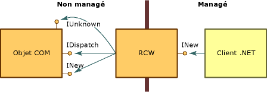

# Wrapper pouvant être appelé par le runtimeRuntime Callable Wrapper
Le common language runtime expose les objets COM via un proxy appelé wrapper RCW.The common language runtime exposes COM objects through a proxy called the runtime callable wrapper (RCW). Même si le wrapper RCW est un objet ordinaire pour les clients .NET, sa fonction principale est de marshaler les appels entre un client .NET et un objet COM.Although the RCW appears to be an ordinary object to .NET clients, its primary function is to marshal calls between a .NET client and a COM object.  
  
 Le runtime crée un wrapper RCW pour chaque objet COM, quel que soit le nombre de références qui existent sur cet objet.The runtime creates exactly one RCW for each COM object, regardless of the number of references that exist on that object. Le runtime gère un seul wrapper RCW par processus pour chaque objet.The runtime maintains a single RCW per process for each object.  Si vous créez un wrapper RCW dans un domaine d'application ou cloisonnement, puis passez une référence à un autre domaine d'application ou cloisonnement, un proxy du premier objet sera utilisé.If you create an RCW in one application domain or apartment, and then pass a reference to another application domain or apartment, a proxy to the first object will be used.  Comme le montre l'illustration suivante, il n'existe pas de limite au nombre de clients managés pouvant contenir une référence aux objets COM qui exposent les interfaces INew et INewer.As the following illustration shows, any number of managed clients can hold a reference to the COM objects that expose INew and INewer interfaces.  
  
   
Accès aux objets COM via le wrapper RCWAccessing COM objects through the runtime callable wrapper  
  
 À l'aide de métadonnées dérivées d'une bibliothèque de types, le runtime crée l'objet COM appelé, ainsi qu'un wrapper pour celui-ci.Using metadata derived from a type library, the runtime creates both the COM object being called and a wrapper for that object. Chaque wrapper RCW gère un cache de pointeurs d'interface sur l'objet COM qu'il encapsule et libère sa référence à l'objet COM quand le wrapper RCW n'est plus utile.Each RCW maintains a cache of interface pointers on the COM object it wraps and releases its reference on the COM object when the RCW is no longer needed. Le runtime exécute le garbage collection du wrapper RCW.The runtime performs garbage collection on the RCW.  
  
 Entre autres activités, le wrapper RCW marshale les données entre code managé et non managé, pour le compte de l'objet encapsulé.Among other activities, the RCW marshals data between managed and unmanaged code, on behalf of the wrapped object. Plus précisément, le wrapper RCW fournit le marshaling pour les arguments de méthode et les valeurs de retour de méthode chaque fois que le client et le serveur ont des représentations différentes des données circulant entre eux.Specifically, the RCW provides marshaling for method arguments and method return values whenever the client and server have different representations of the data passed between them.  
  
 Le wrapper standard applique les règles de marshaling intégrées.The standard wrapper enforces built-in marshaling rules. Par exemple, quand un client .NET passe un type String dans le cadre d'un argument à un objet non managé, le wrapper convertit la chaîne en un type BSTR.For example, when a .NET client passes a String type as part of an argument to an unmanaged object, the wrapper converts the string to a BSTR type. Si l'objet COM retourne un BSTR à son appelant managé, l'appelant reçoit une chaîne (String).Should the COM object return a BSTR to its managed caller, the caller receives a String. Le client et le serveur envoient et reçoivent des données qui leur sont familières.Both the client and the server send and receive data that is familiar to them. Les autres types ne nécessitent pas de conversion.Other types require no conversion. Par exemple, un wrapper standard passera toujours un entier de 4 octets d'un code managé à un code non managé sans convertir le type.For instance, a standard wrapper will always pass a 4-byte integer between managed and unmanaged code without converting the type.  
  
## Marshaling d’interfaces sélectionnéesMarshaling selected interfaces  
 L’objectif principal du [wrapper RCW](../../../docs/framework/interop/runtime-callable-wrapper.md) est de masquer les différences entre les modèles de programmation managé et non managé.The primary goal of the [runtime callable wrapper](../../../docs/framework/interop/runtime-callable-wrapper.md) (RCW) is to hide the differences between the managed and unmanaged programming models. Pour créer une transition transparente, le wrapper RCW consomme les interfaces COM sélectionnées sans les exposer au client .NET, comme indiqué dans l'illustration suivante.To create a seamless transition, the RCW consumes selected COM interfaces without exposing them to the .NET client, as shown in the following illustration.  
  
   
Les interfaces COM et le wrapper RCWCOM interfaces and the runtime callable wrapper  
  
 Quand il est créé comme un objet à liaison anticipée, le wrapper RCW est un type spécifique.When created as an early-bound object, the RCW is a specific type. Il implémente les interfaces que l'objet COM implémente et expose les méthodes, les propriétés et les événements des interfaces de l'objet.It implements the interfaces that the COM object implements and exposes the methods, properties, and events from the object's interfaces. Dans l’illustration, le wrapper RCW expose l’interface INew, mais consomme les interfaces **IUnknown** et **IDispatch**.In the illustration, the RCW exposes the INew interface but consumes the **IUnknown** and **IDispatch** interfaces. De plus, le wrapper RCW expose tous les membres de l'interface INew au client .NET.Further, the RCW exposes all members of the INew interface to the .NET client.  
  
 Le wrapper RCW consomme les interfaces répertoriées dans le tableau suivant, qui sont exposées par l'objet qu'il encapsule.The RCW consumes the interfaces listed in the following table, which are exposed by the object it wraps.  
  
|InterfaceInterface|DescriptionDescription|  
|---------------|-----------------|  
|**IDispatch****IDispatch**|Pour la liaison tardive aux objets COM via la réflexion.For late binding to COM objects through reflection.|  
|**IErrorInfo****IErrorInfo**|Fournit une description textuelle de l’erreur, sa source, un fichier d’aide, un contexte d’aide et le GUID de l’interface ayant défini l’erreur (toujours **GUID_NULL** pour les classes .NET).Provides a textual description of the error, its source, a Help file, Help context, and the GUID of the interface that defined the error (always **GUID_NULL** for .NET classes).|  
|**IProvideClassInfo****IProvideClassInfo**|Si l’objet COM qui est encapsulé implémente **IProvideClassInfo**, le wrapper RCW extrait les informations de type à partir de cette interface pour fournir une meilleure identité de type.If the COM object being wrapped implements **IProvideClassInfo**, the RCW extracts the type information from this interface to provide better type identity.|  
|**IUnknown****IUnknown**|Pour l'identité de l'objet, le forçage de type et la gestion de la durée de vie :For object identity, type coercion, and lifetime management:   - Identité d’un objet-   Object identity      Le runtime fait la distinction entre les objets COM en comparant la valeur d’interface **IUnknown** pour chaque objet.The runtime distinguishes between COM objects by comparing the value of the **IUnknown** interface for each object. - Forçage de type-   Type coercion      Le wrapper RCW reconnaît la découverte de type dynamique exécutée par la méthode **QueryInterface**.The RCW recognizes the dynamic type discovery performed by the **QueryInterface** method. - Gestion de la durée de vie-   Lifetime management      À l’aide de la méthode **QueryInterface**, le wrapper RCW obtient et conserve une référence à un objet non managé jusqu’à ce que le runtime exécute le garbage collection sur le wrapper, qui libère l’objet non managé.Using the **QueryInterface** method, the RCW gets and holds a reference to an unmanaged object until the runtime performs garbage collection on the wrapper, which releases the unmanaged object.|  
  
 Le wrapper RCW peut éventuellement consommer les interfaces répertoriées dans le tableau suivant, qui sont exposées par l'objet qu'il encapsule.The RCW optionally consumes the interfaces listed in the following table, which are exposed by the object it wraps.  
  
|InterfaceInterface|DescriptionDescription|  
|---------------|-----------------|  
|**IConnectionPoint** et **IConnectionPointContainer****IConnectionPoint** and **IConnectionPointContainer**|Le wrapper RCW convertit les objets qui exposent le style d'événement point de connexion en événements basés sur le délégué.The RCW converts objects that expose the connection-point event style to delegate-based events.|  
|**IDispatchEx****IDispatchEx**|Si la classe implémente **IDispatchEx**, le wrapper RCW implémente **IExpando**.If the class implements **IDispatchEx**, the RCW implements **IExpando**. L’interface **IDispatchEx** est une extension de l’interface **IDispatch** qui, contrairement à l’interface **IDispatch**, permet l’énumération, l’ajout, la suppression et l’appel sensible à la casse des membres.The **IDispatchEx** interface is an extension of the **IDispatch** interface that, unlike **IDispatch**, enables enumeration, addition, deletion, and case-sensitive calling of members.|  
|**IEnumVARIANT****IEnumVARIANT**|Permet aux types COM qui prennent en charge les énumérations d’être traités comme des collections.Enables COM types that support enumerations to be treated as collections.|  
  
## Voir aussiSee Also  
 [Wrappers COMCOM Wrappers](../../../docs/framework/interop/com-wrappers.md)  
 [Marshaling d’Interfaces sélectionnéesMarshaling Selected Interfaces](http://msdn.microsoft.com/library/fdb97fd0-f694-4832-bf15-a4e7cf413840)  
 [Wrapper CCW (COM Callable Wrapper)COM Callable Wrapper](../../../docs/framework/interop/com-callable-wrapper.md)  
 [Récapitulatif de la conversion d’une bibliothèque de types en assemblyType Library to Assembly Conversion Summary](http://msdn.microsoft.com/library/bf3f90c5-4770-4ab8-895c-3ba1055cc958)  
 [Importation d'une bibliothèque de types sous la forme d'un assemblyImporting a Type Library as an Assembly](../../../docs/framework/interop/importing-a-type-library-as-an-assembly.md)
