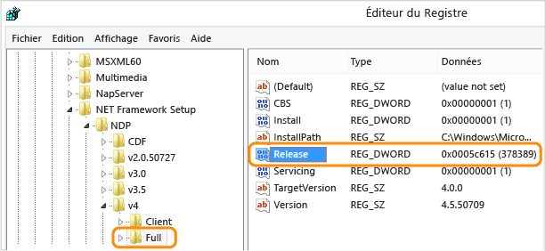

# <a name="how-to-determine-which-net-framework-versions-are-installed"></a>Guide pratique pour déterminer les versions .NET Framework installées
Les utilisateurs peuvent installer et exécuter plusieurs versions de .NET Framework sur leurs ordinateurs. Quand vous développez ou déployez votre application, vous pouvez avoir besoin de savoir quelles versions de .NET Framework sont installées sur l'ordinateur de l'utilisateur. Notez que .NET Framework comporte deux principaux composants, dont les versions sont définies séparément :  
  
-   Un jeu d'assemblys, qui correspondent aux collections de types et de ressources qui fournissent les fonctionnalités de vos applications. .NET Framework et les assemblys partagent le même numéro de version.  
  
-   Le Common Language Runtime (CLR), qui gère et exécute le code de votre application. Le CLR est identifié par son propre numéro de version (consultez [Versions et dépendances](~/docs/framework/migration-guide/versions-and-dependencies.md)).  
  
 Pour obtenir la liste précise des versions de .NET Framework installées sur un ordinateur, vous pouvez consulter le Registre ou l'interroger en utilisant du code :  
  
 [Affichage du Registre (versions 1-4)](#net_a)  
 [Affichage du Registre (version 4.5 et ultérieure)](#net_b)  
 [Utilisation de code pour interroger le Registre (versions 1-4)](#net_c)  
 [Utilisation de code pour interroger le Registre (version 4.5 et ultérieure)](#net_d)  
 [Utilisation de PowerShell pour interroger le Registre (version 4.5 et ultérieure)](#ps_a)  
  
 Pour rechercher la version CLR, vous pouvez utiliser un outil ou du code :  
  
 [Utilisation de l’outil Clrver](#clr_a)  
 [Utilisation de code pour interroger la classe System.Environment](#clr_b)  
  
 Pour plus d’informations sur la détection des mises à jour installées pour chaque version du .NET Framework, consultez [Guide pratique pour déterminer les mises à jour .NET Framework installées](~/docs/framework/migration-guide/how-to-determine-which-net-framework-updates-are-installed.md). Pour plus d’informations sur l’installation du .NET Framework, consultez [Installer le .NET Framework pour les développeurs](../../../docs/framework/install/guide-for-developers.md).  
  
<a name="net_a"></a>   
#### <a name="to-find-net-framework-versions-by-viewing-the-registry-net-framework-1-4"></a>Pour déterminer les versions du .NET Framework en affichant le Registre (.NET Framework 1-4)  
  
1.  Dans le menu **Démarrer**, choisissez **Exécuter**.  
  
2.  Dans la zone **Ouvrir**, entrez **regedit.exe**.  
  
     Vous devez disposer d'informations d'identification d'administration pour exécuter regedit.exe.  
  
3.  Dans l'Éditeur du Registre, ouvrez la sous-clé suivante :  
  
     `HKEY_LOCAL_MACHINE\SOFTWARE\Microsoft\NET Framework Setup\NDP`  
  
     Les versions installées sont répertoriées sous la sous-clé NDP. Le numéro de version est stocké dans l’entrée **Version**. Pour [!INCLUDE[net_v40_long](../../../includes/net-v40-long-md.md)], l’entrée **Version** se trouve sous la sous-clé Client ou Full (sous NDP), ou sous les deux sous-clés.  
  

    > [!NOTE]
    > Le dossier d’installation « NET Framework Setup » dans le Registre ne commence pas par un point.

<a name="net_b"></a> 
#### <a name="to-find-net-framework-versions-by-viewing-the-registry-net-framework-45-and-later"></a>Pour déterminer les versions de .NET Framework en affichant le Registre (.NET Framework 4.5 et ultérieur)

1. Dans le menu **Démarrer**, choisissez **Exécuter**.

2. Dans la zone **Ouvrir**, entrez **regedit.exe**.

     Vous devez disposer d'informations d'identification d'administration pour exécuter regedit.exe.

3. Dans l'Éditeur du Registre, ouvrez la sous-clé suivante :

     `HKEY_LOCAL_MACHINE\SOFTWARE\Microsoft\NET Framework Setup\NDP\v4\Full`

     Notez que le chemin d'accès à la sous-clé `Full` inclut le `Net Framework` de la sous-clé plutôt que `.NET Framework`.

    > [!NOTE]
    > Si la sous-clé `Full` n'est pas disponible, le .NET Framework 4.5 ou version ultérieure n'est pas installé.

     Recherchez une valeur DWORD nommée `Release`. L'existence de la valeur DWORD `Release` indique que [!INCLUDE[net_v45](../../../includes/net-v45-md.md)] ou une version plus récente a été installé sur cet ordinateur.

     

     La valeur du paramètre DWORD `Release` indique quelle version du .NET Framework est installée.

    |Valeur du paramètre DWORD Release|Version|
    |--------------------------------|-------------|
    |378389|.NET Framework 4.5|
    |378675|.NET Framework 4.5.1 installé avec Windows 8.1 ou Windows Server 2012 R2|
    |378758|.NET Framework 4.5.1 installé sur Windows 8, Windows 7 SP1, ou Windows Vista SP2|
    |379893|.NET Framework 4.5.2|
    |Sur les systèmes Windows 10 : 393295<br /><br /> Sur toutes les autres versions de système d'exploitation : 393297|[!INCLUDE[net_v46](../../../includes/net-v46-md.md)]|
    |Sur les systèmes Windows intégrant la mise à jour du 10 novembre : 394254<br /><br /> Sur toutes les autres versions de système d'exploitation : 394271|[!INCLUDE[net_v461](../../../includes/net-v461-md.md)]|
    |Sur Windows 10 - Mise à jour anniversaire : 394802<br /><br /> Sur toutes les autres versions de système d’exploitation : 394806|[!INCLUDE[net_v462](../../../includes/net-v462-md.md)]| 
    |Sur Windows 10 Creators Update : 460798<br/><br/> Sur toutes les autres versions du système d’exploitation : 460805 | .NET Framework 4.7 |
    |Sur Windows 10 Fall Creators Update : 461308<br/><br/> Sur toutes les autres versions de système d’exploitation : 461310 | .NET Framework 4.7.1 |
<a name="net_c"></a> 
#### <a name="to-find-net-framework-versions-by-querying-the-registry-in-code-net-framework-1-4"></a>Pour déterminer les versions de .NET Framework en interrogeant le Registre à l'aide de code (.NET Framework 1-4)

- Utilisez la classe <xref:Microsoft.Win32.RegistryKey?displayProperty=nameWithType> pour accéder à la sous-clé Software\Microsoft\NET Framework Setup\NDP\ sous HKEY_LOCAL_MACHINE, dans le Registre Windows.

     Le code ci-dessous est un exemple de cette requête.

    > [!NOTE]
    > Ce code ne montre pas comment détecter le [!INCLUDE[net_v45](../../../includes/net-v45-md.md)] ou version ultérieure. Examinez la valeur de DWORD `Release` pour détecter ces versions, comme décrit dans la section précédente. Pour le code qui détecte le [!INCLUDE[net_v45](../../../includes/net-v45-md.md)] et versions ultérieures, consultez la section suivante de cet article.

     [!code-csharp[ListVersions](../../../samples/snippets/csharp/framework/migration-guide/versions-installed1.cs)]
     [!code-vb[ListVersions](../../../samples/snippets/visualbasic/framework/migration-guide/versions-installed1.vb)]

     Cet exemple produit un résultat semblable au suivant :

    ```
    v2.0.50727  2.0.50727.4016  SP2
    v3.0  3.0.30729.4037  SP2
    v3.5  3.5.30729.01  SP1
    v4
      Client  4.0.30319
      Full  4.0.30319
    ```

<a name="net_d"></a> 
#### <a name="to-find-net-framework-versions-by-querying-the-registry-in-code-net-framework-45-and-later"></a>Pour déterminer les versions de .NET Framework en interrogeant le Registre à l'aide de code (.NET Framework 4.5 et ultérieur)

1. L'existence de la valeur DWORD `Release` indique que le .NET Framework 4.5 ou une version ultérieure a été installé sur un ordinateur. La valeur du mot clé indique la version installée. Pour vérifier ce mot clé, utilisez les méthodes <xref:Microsoft.Win32.RegistryKey.OpenBaseKey%2A> et <xref:Microsoft.Win32.RegistryKey.OpenSubKey%2A> de la classe <xref:Microsoft.Win32.RegistryKey?displayProperty=nameWithType> pour accéder à la sous-clé Software\Microsoft\NET Framework Setup\NDP\v4\Full, sous HKEY_LOCAL_MACHINE, dans le Registre Windows.

2. Vérifiez la valeur du mot clé `Release` pour déterminer la version installée. Pour une compatibilité ascendante, vérifiez que votre valeur est supérieure ou égale à celles répertoriées dans le tableau ci-dessous. Voici les versions du .NET Framework et les mots clés `Release` associés.

    |Version|Valeur du paramètre DWORD Release|
    |-------------|--------------------------------|
    |.NET Framework 4.5|378389|
    |.NET Framework 4.5.1 installé avec Windows 8.1|378675|
    |.NET Framework 4.5.1 installé sur Windows 8, Windows 7 SP1, ou Windows Vista SP2|378758|
    |.NET Framework 4.5.2|379893|
    |.NET Framework 4.6 installé avec Windows 10|393295|
    |.NET Framework 4.6 installé sur toutes les autres versions du système d’exploitation Windows|393297|
    |.NET Framework 4.6.1 installé sur Windows 10|394254|
    |.NET Framework 4.6.1 installé sur toutes les autres versions du système d’exploitation Windows|394271|
    |.NET Framework 4.6.2 installé sur la Mise à jour anniversaire Windows 10|394802|
    |.NET Framework 4.6.2 installé sur toutes les autres versions du système d’exploitation Windows|394806|
    |.NET Framework 4.7 est installé sur Windows 10 Creators Update|460798|
    |.NET Framework 4.7 installé sur toutes les autres versions du système d’exploitation Windows|460805|
    |.NET Framework 4.7.1 installé sur Windows 10 Fall Creators Update|461308|
    |.NET Framework 4.7.1 installé sur toutes les autres versions du système d’exploitation Windows|461310|

     L’exemple suivant vérifie la valeur `Release` dans le Registre pour déterminer si le [!INCLUDE[net_v45](../../../includes/net-v45-md.md)] ou version ultérieure du .NET Framework est installée.

     [!code-csharp[ListVersions#5](../../../samples/snippets/csharp/framework/migration-guide/versions-installed3.cs)]
     [!code-vb[ListVersions#5](../../../samples/snippets/visualbasic/framework/migration-guide/versions-installed3.vb)]

     Cet exemple suit la pratique recommandée concernant la vérification de version :

    - Il vérifie si la valeur de l’entrée `Release` est *supérieure ou égale à* la valeur des clés de version connues.

    - Il effectue sa vérification en partant de la version la plus récente vers la version la plus ancienne.

<a name="ps_a"></a> 
#### <a name="to-check-for-a-minimum-required-net-framework-version-by-querying-the-registry-in-powershell-net-framework-45-and-later"></a>Pour rechercher une version minimale requise du .NET Framework en interrogeant le Registre dans PowerShell (.NET Framework 4.5 et versions ultérieures)

- L’exemple suivant vérifie la valeur du mot clé `Release` pour déterminer si .NET Framework 4.6.2 ou version ultérieure est installé, indépendamment de la version du système d’exploitation Windows (retourne `True` si la condition est vérifiée, `False` dans le cas contraire).

    ```PowerShell
    Get-ChildItem "HKLM:SOFTWARE\Microsoft\NET Framework Setup\NDP\v4\Full\" | Get-ItemPropertyValue -Name Release | ForEach-Object { $_ -ge 394802 } 
    ```

    Vous pouvez remplacer `394802` dans l’exemple précédent par une autre valeur du tableau suivant pour rechercher une autre version minimale requise du .NET Framework.
  
    |Version|Valeur minimale du paramètre DWORD Release|
    |-------------|--------------------------------|
    |.NET Framework 4.5|378389|
    |.NET Framework 4.5.1|378675|
    |.NET Framework 4.5.2|379893|
    |[!INCLUDE[net_v46](../../../includes/net-v46-md.md)]|393295|
    |[!INCLUDE[net_v461](../../../includes/net-v461-md.md)]|394254|
    |[!INCLUDE[net_v462](../../../includes/net-v462-md.md)]|394802|
    |.NET Framework 4.7|460798|
    |.NET Framework 4.7.1|461308|
    
<a name="clr_a"></a> 
#### <a name="to-find-the-current-runtime-version-by-using-the-clrver-tool"></a>Pour déterminer la version actuelle du runtime à l'aide de l'outil Clrver

- Utilisez l'outil de version CLR (Clrver.exe) pour déterminer quelles versions du CLR (Common Language Runtime) sont installées sur un ordinateur.

     Dans l’invite de commandes Visual Studio, entrez `clrver`. Cette commande produit un résultat similaire au suivant :

    ```
    Versions installed on the machine:
    v2.0.50727
    v4.0.30319
    ```

     Pour plus d’informations sur l’utilisation de cet outil, consultez [Clrver.exe (CLR Version Tool)](~/docs/framework/tools/clrver-exe-clr-version-tool.md).

<a name="clr_b"></a> 
#### <a name="to-find-the-current-runtime-version-by-querying-the-environment-class-in-code"></a>Pour rechercher la version actuelle du runtime en interrogeant la classe Environment dans le code

- Interrogez la propriété <xref:System.Environment.Version%2A?displayProperty=nameWithType> pour récupérer un objet <xref:System.Version> identifiant la version du runtime qui exécute actuellement le code. Vous pouvez utiliser la propriété <xref:System.Version.Major%2A?displayProperty=nameWithType> pour obtenir l'identificateur de la version principale (par exemple, « 4 » pour la version 4,0), la propriété <xref:System.Version.Minor%2A?displayProperty=nameWithType> pour obtenir l'identificateur de la version secondaire (par exemple, « 0 » pour la version 4,0) ou la méthode <xref:System.Object.ToString%2A?displayProperty=nameWithType> pour obtenir la chaîne de version entière (par exemple, « 4.0.30319.18010 », comme indiqué dans le code suivant). Cette propriété retourne une valeur unique qui reflète la version du runtime exécutant actuellement le code. Elle ne retourne pas les versions d'assembly ou les autres versions du runtime qui ont pu être installées sur l'ordinateur.

     Pour .NET Framework versions 4, 4.5, 4.5.1 et 4.5.2, la propriété <xref:System.Environment.Version%2A?displayProperty=nameWithType> retourne un objet <xref:System.Version> dont la représentation sous forme de chaîne se présente sous la forme `4.0.30319.xxxxx`. Pour .NET Framework 4.6 et versions ultérieures, le format est `4.0.30319.42000`.

    > [!IMPORTANT]
    > Pour [!INCLUDE[net_v45](../../../includes/net-v45-md.md)] et versions ultérieures, nous déconseillons l’utilisation de la propriété <xref:System.Environment.Version%2A?displayProperty=nameWithType> pour détecter la version du runtime. Nous recommandons plutôt d’interroger le Registre, comme décrit dans la section [Pour déterminer les versions de .NET Framework en interrogeant le Registre à l’aide de code (.NET Framework 4.5 et ultérieur)](#net_d), plus haut dans cet article.

     Voici un exemple illustrant l'interrogation de la propriété <xref:System.Environment.Version%2A?displayProperty=nameWithType> pour obtenir les informations de version du runtime :

     [!code-csharp[ListVersions](../../../samples/snippets/csharp/framework/migration-guide/versions-installed2.cs)]
     [!code-vb[ListVersions](../../../samples/snippets/visualbasic/framework/migration-guide/versions-installed2.vb)]

     Cet exemple produit un résultat semblable au suivant :

    ```
    Version: 4.0.30319.18010
    ```

## <a name="see-also"></a>Voir aussi
 [Comment : déterminer les mises à jour .NET Framework installées](~/docs/framework/migration-guide/how-to-determine-which-net-framework-updates-are-installed.md)  
 [Installer le .NET Framework pour les développeurs](../../../docs/framework/install/guide-for-developers.md)  
 [Versions et dépendances](~/docs/framework/migration-guide/versions-and-dependencies.md)
