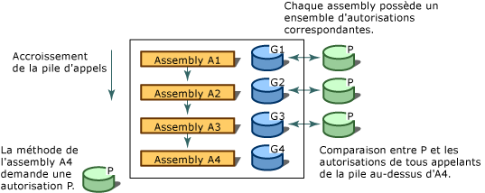

# Sécurité d'accès du codeCode Access Security
[!INCLUDE[net_security_note](../../../includes/net-security-note-md.md)]  
  
 De nos jours, du fait d'une interconnexion extrême, les systèmes informatiques sont fréquemment exposés à du code provenant de diverses sources parfois inconnues.Today's highly connected computer systems are frequently exposed to code originating from various, possibly unknown sources. Du code peut être attaché à un message électronique, contenu dans des documents ou téléchargé via InternetCode can be attached to e-mail, contained in documents, or downloaded over the Internet. Malheureusement, de nombreux utilisateurs d'ordinateurs ont personnellement fait l'expérience de code mobile malveillant, y compris de virus et de vers, qui peuvent endommager ou détruire des données et coûter du temps et de l'argent.Unfortunately, many computer users have experienced firsthand the effects of malicious mobile code, including viruses and worms, which can damage or destroy data and cost time and money.  
  
 La plupart des mécanismes de sécurité courants accordent des droits aux utilisateurs en fonction de leurs informations d'identification de connexion (généralement un mot de passe) et limitent les ressources (souvent des répertoires et fichiers) auxquelles ils peuvent accéder.Most common security mechanisms give rights to users based on their logon credentials (usually a password) and restrict resources (often directories and files) that the user is allowed to access. Cependant, cette approche ne parvient pas à répondre à plusieurs situations : les utilisateurs peuvent obtenir du code provenant de nombreuses sources dont certaines peuvent ne pas être fiables, le code peut contenir des bogues ou des vulnérabilités qui permettent à du code nuisible de l'exploiter et le code fait parfois des choses dont l'utilisateur n'a pas conscience.However, this approach fails to address several issues: users obtain code from many sources, some of which might be unreliable; code can contain bugs or vulnerabilities that enable it to be exploited by malicious code; and code sometimes does things that the user does not know it will do. Les systèmes informatiques peuvent donc être endommagés et des données confidentielles peuvent être divulguées si des utilisateurs prudents et dignes de confiance exécutent un logiciel malveillant ou rempli d'erreurs.As a result, computer systems can be damaged and private data can be leaked when cautious and trustworthy users run malicious or error-filled software. La plupart des mécanismes de sécurité des systèmes d'exploitation nécessitent que chaque partie du code ait un niveau de confiance suffisant afin de s'exécuter, sauf peut-être pour les scripts d'une page web.Most operating system security mechanisms require that every piece of code must be completely trusted in order to run, except perhaps for scripts on a Web page. Un mécanisme de sécurité largement applicable qui permette à du code provenant d'un système informatique de s'exécuter en toute sécurité sur un autre système est donc nécessaire, même s'il n'existe pas de relations de confiance entre les systèmes.Therefore, there is still a need for a widely applicable security mechanism that allows code originating from one computer system to execute with protection on another system, even when there is no trust relationship between the systems.  
  
 Le .NET Framework fournit un mécanisme de sécurité appelé sécurité d'accès du code, qui aide à protéger les systèmes informatiques contre du code mobile malveillant, pour permettre à du code d'origine inconnue de s'exécuter en toute sécurité et pour éviter que du code de confiance ne compromette la sécurité de manière intentionnelle ou accidentelle.The .NET Framework provides a security mechanism called code access security to help protect computer systems from malicious mobile code, to allow code from unknown origins to run with protection, and to help prevent trusted code from intentionally or accidentally compromising security. La sécurité d'accès du code permet au code d'avoir un niveau de confiance à différents degrés, en fonction de son origine et d'autres aspects de son identité.Code access security enables code to be trusted to varying degrees depending on where the code originates and on other aspects of the code's identity. La sécurité d'accès du code applique aussi différents niveaux de confiance au code, ce qui réduit la quantité de code dont le niveau de confiance doit être suffisant pour s'exécuter.Code access security also enforces the varying levels of trust on code, which minimizes the amount of code that must be fully trusted in order to run. L'utilisation de la sécurité d'accès du code peut diminuer la probabilité que votre code soit utilisé de manière abusive par du code malveillant ou rempli d'erreurs.Using code access security can reduce the likelihood that your code will be misused by malicious or error-filled code. Elle peut réduire votre responsabilité, car vous pouvez spécifier l'ensemble des opérations que votre code est autorisé à exécuter.It can reduce your liability, because you can specify the set of operations your code should be allowed to perform. La sécurité d'accès du code peut aussi aider à réduire les dommages qui peuvent résulter de la mise en danger de la sécurité dans votre code.Code access security can also help minimize the damage that can result from security vulnerabilities in your code.  
  
> [!NOTE]
>  Des modifications importantes ont été apportées à la sécurité d'accès du code dans le [!INCLUDE[net_v40_long](../../../includes/net-v40-long-md.md)].Major changes have been made to code access security in the [!INCLUDE[net_v40_long](../../../includes/net-v40-long-md.md)]. La modification la plus notable a été [la transparence de sécurité](../../../docs/framework/misc/security-transparent-code.md), mais il existe d’autres modifications significatives qui affectent la sécurité d’accès du code.The most notable change has been [security transparency](../../../docs/framework/misc/security-transparent-code.md), but there are also other significant changes that affect code access security. Pour plus d’informations sur ces modifications, consultez [modifications de sécurité](../../../docs/framework/security/security-changes.md).For information about these changes, see [Security Changes](../../../docs/framework/security/security-changes.md).  
  
 La sécurité d'accès du code affecte principalement le code de bibliothèque et les applications partiellement fiables.Code access security primarily affects library code and partially trusted applications. Les développeurs de bibliothèques doivent protéger leur code contre l'accès non autorisé d'applications partiellement fiables,Library developers must protect their code from unauthorized access from partially trusted applications. qui sont des applications chargées à partir de sources externes telles qu'Internet.Partially trusted applications are applications that are loaded from external sources such as the Internet. Les applications installées sur votre poste de travail ou sur l'intranet local sont exécutées avec une confiance totale.Applications that are installed on your desktop or on the local intranet run in full trust. Applications de confiance totale ne sont pas affectées par la sécurité d’accès du code, sauf si elles sont marquées comme [transparent de sécurité](../../../docs/framework/misc/security-transparent-code.md), car ils sont entièrement fiables.Full-trust applications are not affected by code access security unless they are marked as [security-transparent](../../../docs/framework/misc/security-transparent-code.md), because they are fully trusted. Leur seule limitation est que les applications marquées avec l'attribut <xref:System.Security.SecurityTransparentAttribute> ne peuvent pas appeler du code marqué avec l'attribut <xref:System.Security.SecurityCriticalAttribute>.The only limitation for full-trust applications is that applications that are marked with the <xref:System.Security.SecurityTransparentAttribute> attribute cannot call code that is marked with the <xref:System.Security.SecurityCriticalAttribute> attribute. Les applications partiellement fiables doivent être exécutées dans un bac à sable (sandbox) (par exemple, dans Internet Explorer) pour que la sécurité d'accès du code puisse être appliquée.Partially trusted applications must be run in a sandbox (for example, in Internet Explorer) so that code access security can be applied. Si vous téléchargez une application à partir d'Internet et essayez de l'exécuter sur votre poste de travail, vous obtiendrez une <xref:System.NotSupportedException> avec le message suivant : «Tentative de chargement d'un assembly à partir d'un emplacement réseau qui aurait entraîné l'utilisation de l'assembly en mode Bac à sable (sandbox) dans les versions antérieures du .NET Framework.If you download an application from the Internet and try to run it from your desktop, you will get a <xref:System.NotSupportedException> with the message: "An attempt was made to load an assembly from a network location which would have caused the assembly to be sandboxed in previous versions of the .NET Framework. Cette mise en production du .NET Framework n’activant pas la stratégie CAS par défaut, ce chargement peut être dangereux. »This release of the .NET Framework does not enable CAS policy by default, so this load may be dangerous." Si vous êtes sûr que l’application peut être approuvée, vous pouvez l’activer être exécuté avec une confiance totale à l’aide de la [ \<loadFromRemoteSources > élément](../../../docs/framework/configure-apps/file-schema/runtime/loadfromremotesources-element.md).If you are sure that the application can be trusted, you can enable it to be run as full trust by using the [\<loadFromRemoteSources> element](../../../docs/framework/configure-apps/file-schema/runtime/loadfromremotesources-element.md). Pour plus d’informations sur l’exécution d’une application dans un bac à sable, consultez [Comment : exécuter Partially Trusted Code dans un bac à sable](../../../docs/framework/misc/how-to-run-partially-trusted-code-in-a-sandbox.md).For information about running an application in a sandbox, see [How to: Run Partially Trusted Code in a Sandbox](../../../docs/framework/misc/how-to-run-partially-trusted-code-in-a-sandbox.md).  
  
 Tout le code managé qui cible le Common Language Runtime bénéficie de la sécurité d'accès du code, même si ce code ne fait aucun appel de sécurité d'accès du code.All managed code that targets the common language runtime receives the benefits of code access security, even if that code does not make a single code access security call. Pour plus d’informations, consultez [Notions fondamentales de la sécurité d’accès du code](../../../docs/framework/misc/code-access-security-basics.md).For more information, see [Code Access Security Basics](../../../docs/framework/misc/code-access-security-basics.md).  
  
   
## Fonctions clés de la sécurité d'accès du codeKey Functions of Code Access Security  
 La sécurité d'accès du code permet de limiter l'accès du code aux ressources et opérations protégées.Code access security helps limit the access that code has to protected resources and operations. Dans le .NET Framework, la sécurité d'accès du code exécute les fonctions suivantes :In the .NET Framework, code access security performs the following functions:  
  
-   Définit les autorisations et les jeux d'autorisations qui représentent le droit d'accéder à diverses ressources système.Defines permissions and permission sets that represent the right to access various system resources.  
  
-   Permet au code de demander que ses appelants possèdent des autorisations spécifiques.Enables code to demand that its callers have specific permissions.  
  
-   Permet au code de demander que ses appelants possèdent une signature numérique, ce qui permet ainsi que l'appel du code protégé soit uniquement effectué par des appelants d'une organisation ou d'un site spécifique.Enables code to demand that its callers possess a digital signature, thus allowing only callers from a particular organization or site to call the protected code.  
  
-   Applique des restrictions sur le code au moment de l'exécution en comparant les autorisations accordées de chaque appelant sur la pile d'appels avec les autorisations que les appelants doivent posséder.Enforces restrictions on code at run time by comparing the granted permissions of every caller on the call stack to the permissions that callers must have.  
  
   
## Parcours de la pile des appelsWalking the Call Stack  
 Pour déterminer si le code est autorisé à accéder à une ressource ou à exécuter une opération, le système de sécurité du runtime parcourt la pile des appels, en comparant les autorisations accordées de chaque appelant à l'autorisation demandée.To determine whether code is authorized to access a resource or perform an operation, the runtime's security system walks the call stack, comparing the granted permissions of each caller to the permission being demanded. Si un appelant dans la pile des appels n'a pas l'autorisation demandée, une exception de sécurité est levée et l'accès est refusé.If any caller in the call stack does not have the demanded permission, a security exception is thrown and access is refused. Le parcours de la pile est conçu pour éviter les attaques malveillantes au cours desquelles du code ayant un niveau de confiance plus faible appelle du code ayant un niveau de confiance élevé et l'utilise pour exécuter des actions non autorisées.The stack walk is designed to help prevent luring attacks, in which less-trusted code calls highly trusted code and uses it to perform unauthorized actions. Demander les autorisations de tous les appelants au moment de l'exécution affecte les performances, mais est essentiel pour protéger le code contre les attaques malveillantes de code ayant un niveau de confiance plus faible.Demanding permissions of all callers at run time affects performance, but it is essential to help protect code from luring attacks by less-trusted code. Pour optimiser les performances, vous pouvez faire en sorte que votre code effectue moins de parcours de pile ; vous devez cependant être sûr que vous ne mettez pas la sécurité en danger quand vous faites cela.To optimize performance, you can have your code perform fewer stack walks; however, you must be sure that you do not expose a security weakness whenever you do this.  
  
 L'illustration suivante présente le parcours de la pile obtenu quand une méthode dans l'assembly A4 réclame que ses appelants bénéficient de l'autorisation P.The following illustration shows the stack walk that results when a method in Assembly A4 demands that its callers have permission P.  
  
   
Parcours de pile de sécuritéSecurity stack walk  
  
   
## Rubriques connexesRelated Topics  
  
|TitreTitle|DescriptionDescription|  
|-----------|-----------------|  
|[Notions fondamentales de la sécurité d’accès du codeCode Access Security Basics](../../../docs/framework/misc/code-access-security-basics.md)|Décrit la sécurité d'accès du code et ses principales utilisations.Describes code access security and its most common uses.|  
|[Code Transparent de sécurité, niveau 2Security-Transparent Code, Level 2](../../../docs/framework/misc/security-transparent-code-level-2.md)|Décrit le modèle de transparence de sécurité dans le [!INCLUDE[net_v40_short](../../../includes/net-v40-short-md.md)].Describes the security transparency model in the [!INCLUDE[net_v40_short](../../../includes/net-v40-short-md.md)].|  
|[L’utilisation de bibliothèques à partir du Code partiellement fiableUsing Libraries from Partially Trusted Code](../../../docs/framework/misc/using-libraries-from-partially-trusted-code.md)|Décrit comment activer des bibliothèques en vue d'une utilisation avec du code non managé et comment utiliser des bibliothèques à partir d'un code non managé.Describes how to enable libraries for use with unmanaged code and how to use libraries from unmanaged code.|  
|[Concepts fondamentaux sur la sécuritéKey Security Concepts](../../../docs/standard/security/key-security-concepts.md)|Offre une vue d'ensemble de nombreux termes et concepts clés utilisés dans le système de sécurité .NET Framework.Provides an overview of many of the key terms and concepts used in the .NET Framework security system.|  
|[Sécurité basée sur les rôlesRole-Based Security](../../../docs/standard/security/role-based-security.md)|Décrit comment incorporer la sécurité basée sur les rôles.Describes how to incorporate security based on roles.|  
|[Cryptographic ServicesCryptographic Services](../../../docs/standard/security/cryptographic-services.md)|Décrit comment incorporer le chiffrement dans vos applications.Describes how to incorporate cryptography into your applications.|
