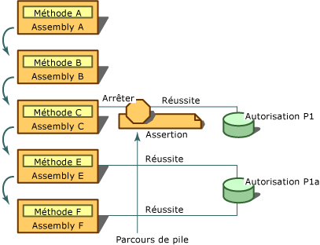

# Utilisation de la m&#233;thode Assert
<xref:System.Security.CodeAccessPermission.Assert%2A> est une méthode qui peut être appelée sur les classes d'autorisation d'accès au code et sur la classe <xref:System.Security.PermissionSet>.  Vous pouvez utiliser **Assert** pour permettre à votre code \(et aux appelants en aval\) d'effectuer des actions que ses appelants peuvent ne pas être autorisés à effectuer.  Une assertion de sécurité modifie le processus normal de vérification de sécurité effectué par le runtime.  Lors de l'assertion d'une autorisation, le système de sécurité reçoit l'ordre de ne pas vérifier que les appelants de votre code disposent de l'autorisation ayant fait l'objet d'une assertion.  
  
> [!CAUTION]
>  Utilisez les assertions avec précaution, car elles peuvent ouvrir des failles de sécurité et perturber le mécanisme d'application des restrictions de sécurité du runtime.  
  
 Les assertions sont utiles quand une bibliothèque appelle du code non managé ou effectue un appel qui nécessite une autorisation qui n'est pas liée de manière évidente à l'utilisation prévue de la bibliothèque.  Par exemple, tout le code managé qui appelle du code non managé doit comporter **SecurityPermission** avec l'indicateur **UnmanagedCode**  spécifié.  Par défaut, le code qui ne provient pas de l'ordinateur local, comme le code téléchargé à partir de l'intranet local, ne recevra pas cette autorisation.  Par conséquent, pour que le code téléchargé à partir de l'intranet local puisse appeler une bibliothèque qui utilise du code non managé, il doit disposer de l'autorisation ayant fait l'objet d'une assertion effectuée par la bibliothèque.  En outre, certaines bibliothèques peuvent effectuer des appels invisibles aux appelants et nécessitent donc des autorisations spéciales.  
  
 Vous pouvez également utiliser des assertions quand votre code accède à une ressource d'une manière totalement invisible pour les appelants.  Supposons, par exemple, que votre bibliothèque obtienne des informations d'une base de données, mais que, pendant le processus, elle lise également les informations du Registre de l'ordinateur.  Étant donné que les développeurs qui utilisent votre bibliothèque n'ont pas accès à votre code source, ils n'ont aucun moyen de savoir que leur code nécessite **RegistryPermission**  pour pouvoir utiliser votre code.  Dans ce cas, si vous décidez qu'il n'est pas raisonnable ni nécessaire d'exiger que les appelants de votre code aient l'autorisation d'accéder au Registre, vous pouvez procéder à l'assertion de l'autorisation pour la lecture du Registre.  Dans ce cas, il est recommandé que la bibliothèque procède à l'assertion de l'autorisation pour que les appelants ne disposant pas de **RegistryPermission**  puissent utiliser la bibliothèque.  
  
 L'assertion n'affecte le parcours de pile que si l'autorisation ayant fait l'objet de l'assertion et une autorisation demandée par un appelant en aval sont de même type, et si l'autorisation demandée est un sous\-ensemble de l'autorisation ayant fait l'objet de l'assertion.  Par exemple, si vous effectuez une assertion pour **FileIOPermission** pour qu'il lise tous les fichiers présents sur le lecteur C, et si une demande est effectuée en aval pour que **FileIOPermission** lise les fichiers présents dans C:\\Temp, l'assertion peut affecter le parcours de pile. Cependant, si la demande est que **FileIOPermission** écrive sur le lecteur C, l'assertion n'aura aucun effet.  
  
 Pour effectuer des assertions, votre code doit disposer de l'autorisation faisant l'objet de l'assertion et de <xref:System.Security.Permissions.SecurityPermission>, qui représente le droit d'effectuer des assertions.  Il est possible d'effectuer une assertion pour une autorisation qui n'a pas été octroyée à votre code. Toutefois, une telle assertion serait inutile puisque la vérification de sécurité échouerait avant même que l'assertion n'ait pu faire en sorte qu'elle réussisse.  
  
 L'illustration suivante montre ce qui se passe quand vous utilisez **Assert**.  Supposons que les instructions suivantes soient vraies concernant les assemblys A, B, C, E et F, et les deux autorisations P1 et P1A :  
  
-   P1A représente le droit de lire les fichiers .txt présents sur le lecteur C.  
  
-   P1 représente le droit de lire tous les fichiers présents sur le lecteur C.  
  
-   P1A et P1 sont tous deux des types **FileIOPermission** , et P1A est un sous\-ensemble de P1.  
  
-   Les assemblys E et F ont reçu l'autorisation P1A.  
  
-   L'assembly C a reçu l'autorisation P1.  
  
-   Les assemblys A et B n'ont reçu ni l'autorisation P1 ni l'autorisation P1A.  
  
-   La méthode A est contenue dans l'assembly A, la méthode B dans l'assembly B, et ainsi de suite.  
  
   
Utilisation de l'instruction Assert  
  
 Dans ce scénario, la méthode A appelle B, B appelle C, C appelle E et E appelle F.  La méthode C effectue une assertion de l'autorisation pour lire des fichiers sur le lecteur C \(autorisation P1\) et la méthode E demande l'autorisation de lire les fichiers .txt sur le lecteur C \(autorisation P1A\).  Quand la demande de F se produit au moment de l'exécution, un parcours de pile est effectué pour vérifier les autorisations de tous les appelants de F, en commençant par E.  E a reçu l'autorisation P1A. Le parcours de pile examine donc les autorisations de C, où l'assertion de C est découverte.  Étant donné que l'autorisation demandée \(P1A\) est un sous\-ensemble de l'autorisation ayant fait l'objet de l'assertion \(P1\), le parcours de pile s'arrête et la vérification de sécurité réussit automatiquement.  Il n'est pas important que les assemblys A et B ne disposent pas de l'autorisation P1A.  En procédant à l'assertion de P1, la méthode C garantit que ses appelants puissent accéder à la ressource protégée par P1, même s'ils n'ont pas reçu l'autorisation d'y accéder.  
  
 Si vous concevez une bibliothèque de classes et si une classe accède à une ressource protégée, vous devez, dans la plupart des cas, effectuer une demande de sécurité exigeant que les appelants de la classe possèdent l'autorisation appropriée.  Si la classe effectue ensuite une opération qui n'est pas autorisée à la plupart de ses appelants, et si vous êtes prêt à prendre la responsabilité de laisser ces appelants appeler votre code, vous pouvez procéder à l'assertion de l'autorisation en appelant la méthode **Assert** sur un objet d'autorisation représentant l'opération exécutée par le code.  Une telle utilisation d'**Assert** permet aux appelants qui n'y seraient normalement pas autorisés à appeler votre code.  Par conséquent, si vous procédez à l'assertion d'une autorisation, soyez sûr d'effectuer au préalable les vérifications de sécurité appropriées pour empêcher une utilisation abusive de votre composant.  
  
 Supposons, par exemple, que votre classe de bibliothèque hautement approuvée possède une méthode qui supprime les fichiers.  Elle accède au fichier en appelant une fonction Win32 non managée.  Un appelant appelle la méthode **Delete** de votre code, en passant le nom du fichier à supprimer : C:\\Test.txt.  Dans la méthode **Delete** , votre code crée un objet <xref:System.Security.Permissions.FileIOPermission> représentant l'accès en écriture au fichier C:\\Test.txt  \(l'accès en écriture est nécessaire pour supprimer un fichier\). Votre code appelle alors une vérification de sécurité impérative en appelant la méthode **Demand** de l'objet **FileIOPermission**.  Si l'un des appelants de la pile des appels n'a pas cette autorisation, une <xref:System.Security.SecurityException> est levée.  Si aucune exception n'est levée, vous savez que tous les appelants ont le droit d'accéder à C:\\Test.txt.  Puisque vous pensez que la plupart de vos appelants n'auront pas l'autorisation d'accéder au code non managé, votre code crée un objet <xref:System.Security.Permissions.SecurityPermission>, qui représente le droit d'appeler du code non managé, puis appelle la méthode **Assert** de cet objet.  Enfin, il appelle la fonction non managée Win32 pour supprimer C:\\Text.txt, puis retourne le contrôle à l'appelant.  
  
> [!CAUTION]
>  Vous devez être sûr que votre code n'utilise pas d'assertions s'il peut être utilisé par un autre code pour accéder à une ressource protégée par l'autorisation faisant l'objet de l'assertion.  Par exemple, dans du code qui écrit dans un fichier dont le nom est spécifié par l'appelant en tant que paramètre, il n'est pas souhaitable de procéder à l'assertion de **FileIOPermission** pour écrire dans les fichiers, car votre code pourrait faire l'objet d'une utilisation abusive par un tiers.  
  
 Quand vous utilisez la syntaxe de sécurité impérative, l'appel de la méthode **Assert** sur plusieurs autorisations de la même méthode provoque la levée d'une exception de sécurité.  Vous devez créer un objet **PermissionSet**, lui passer les autorisations que vous voulez appeler, puis appeler la méthode **Assert** sur l'objet **PermissionSet**.  Vous pouvez appeler la méthode **Assert** plusieurs fois quand vous utilisez la syntaxe de sécurité déclarative.  
  
 L'exemple suivant montre la syntaxe déclarative servant à la substitution des vérifications de sécurité à l'aide de la méthode **Assert**.  Notez que la syntaxe de **FileIOPermissionAttribute** prend deux valeurs : une énumération <xref:System.Security.Permissions.SecurityAction> et l'emplacement du fichier ou du répertoire auquel l'autorisation est accordée.  L'appel à **Assert** entraîne l'aboutissement des demandes d'accès à `C:\Log.txt`, même si l'accès des appelants au fichier n'a pas été vérifié.  
  
```vb  
Option Explicit  
Option Strict  
  
Imports System  
Imports System.IO  
Imports System.Security.Permissions  
  
Namespace LogUtil  
   Public Class Log  
      Public Sub New()  
  
      End Sub  
  
     <FileIOPermission(SecurityAction.Assert, All := "C:\Log.txt")> Public Sub   
      MakeLog()  
         Dim TextStream As New StreamWriter("C:\Log.txt")  
         TextStream.WriteLine("This  Log was created on {0}", DateTime.Now) '  
         TextStream.Close()  
      End Sub  
   End Class  
End Namespace  
  
```  
  
```csharp  
namespace LogUtil  
{  
   using System;  
   using System.IO;  
   using System.Security.Permissions;  
  
   public class Log  
   {  
      public Log()  
      {      
      }     
      [FileIOPermission(SecurityAction.Assert, All = @"C:\Log.txt")]  
      public void MakeLog()  
      {     
         StreamWriter TextStream = new StreamWriter(@"C:\Log.txt");  
         TextStream.WriteLine("This  Log was created on {0}", DateTime.Now);  
         TextStream.Close();  
      }  
   }  
}   
```  
  
 Les fragments de code suivants illustrent la syntaxe impérative servant à la substitution des vérifications de sécurité à l'aide de la méthode **Assert**.  Dans cet exemple, une instance de l'objet **FileIOPermission** est déclarée.  Son constructeur reçoit **FileIOPermissionAccess.AllAccess** pour définir le type d'accès autorisé, suivi d'une chaîne contenant l'emplacement du fichier.  Une fois l'objet **FileIOPermission** défini, vous devez uniquement appeler sa méthode **Assert** pour substituer la vérification de sécurité.  
  
```vb  
Option Explicit  
Option Strict  
Imports System  
Imports System.IO  
Imports System.Security.Permissions  
Namespace LogUtil  
   Public Class Log  
      Public Sub New()  
      End Sub 'New  
  
      Public Sub MakeLog()  
         Dim FilePermission As New FileIOPermission(FileIOPermissionAccess.AllAccess, "C:\Log.txt")  
         FilePermission.Assert()  
         Dim TextStream As New StreamWriter("C:\Log.txt")  
         TextStream.WriteLine("This  Log was created on {0}", DateTime.Now)  
         TextStream.Close()  
      End Sub  
   End Class  
End Namespace  
  
```  
  
```csharp  
namespace LogUtil  
{  
   using System;  
   using System.IO;  
   using System.Security.Permissions;  
  
   public class Log  
   {  
      public Log()  
      {      
      }     
      public void MakeLog()  
      {  
         FileIOPermission FilePermission = new FileIOPermission(FileIOPermissionAccess.AllAccess,@"C:\Log.txt");   
         FilePermission.Assert();  
         StreamWriter TextStream = new StreamWriter(@"C:\Log.txt");  
         TextStream.WriteLine("This  Log was created on {0}", DateTime.Now);  
         TextStream.Close();  
      }  
   }  
}  
```  
  
## Voir aussi  
 <xref:System.Security.PermissionSet>   
 <xref:System.Security.Permissions.SecurityPermission>   
 <xref:System.Security.Permissions.FileIOPermission>   
 <xref:System.Security.Permissions.SecurityAction>   
 [Attributs](../../../docs/standard/attributes/index.md)   
 [Sécurité d'accès du code](../../../docs/framework/misc/code-access-security.md)