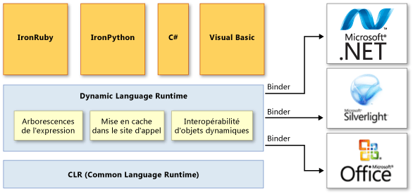

# Vue d&#39;ensemble du Dynamic Language Runtime
Le *Dynamic Language Runtime* \(DLR\) est un environnement d'exécution qui ajoute un ensemble de services pour les langages dynamiques au Common Language Runtime \(CLR\).  Le DLR simplifie le développement de langages dynamiques à exécuter sur le .NET Framework et l'ajout de fonctionnalités dynamiques à des langages typés statiquement.  
  
 Les langages dynamiques peuvent identifier le type d'un objet au moment de l'exécution, alors que dans les langages typés statiquement tels que Visual C\# et Visual Basic \(lorsque vous utilisez `Option Explicit On`\), vous devez spécifier des types d'objet au moment du design.  Lisp, Smalltalk, JavaScript, PHP, Ruby, Python, ColdFusion, Lua, Cobra et Groovy sont autant d'exemples de langages dynamiques.  
  
 La plupart des langages dynamiques fournissent les avantages suivants pour les développeurs :  
  
-   Possibilité d'utiliser une boucle de rétroaction rapide \(REPL, Read\-Evaluate\-Print Loop\).  Cela vous permet d'entrer plusieurs instructions et de les exécuter immédiatement pour consulter les résultats.  
  
-   Prise en charge du développement descendant et du développement ascendant plus classique.  Par exemple, lorsque vous utilisez une approche descendante, vous pouvez appeler des fonctions qui ne sont pas encore implémentées, puis ajouter des implémentations sous\-jacentes selon vos besoins.  
  
-   Refactorisation et modifications de code simplifiées, puisque vous n'avez pas besoin de modifier des déclarations de types statiques dans tout le code.  
  
 Les langages dynamiques sont d'excellents langages de script.  Les clients peuvent facilement étendre des applications créées à l'aide des langages dynamiques avec de nouvelles commandes et fonctionnalités.  Les langages dynamiques sont fréquemment utilisés pour la création de sites Web et d'ateliers de test, la gestion de batteries de serveurs, le développement de différents utilitaires et l'exécution de transformations de données.  
  
 L'objectif du DLR est de permettre à un système de langages dynamiques de s'exécuter sur le .NET Framework et de fournir l'interopérabilité .NET.  Le DLR présente des objets dynamiques à Visual C\# et Visual Basic dans Visual Studio 2010 pour prendre en charge le comportement dynamique dans ces langages et permettre leur interopérabilité avec les langages dynamiques.  
  
 Le DLR vous aide également à créer des bibliothèques qui prennent en charge les opérations dynamiques.  Par exemple, si vous avez une bibliothèque qui utilise des objets XML ou JSON \(JavaScript Object Notation\), vos objets peuvent apparaître comme des objets dynamiques aux langages qui utilisent le DLR.  Cela permet aux utilisateurs de la bibliothèque d'écrire syntaxiquement un code plus simple et plus naturel pour l'utilisation des objets et l'accès aux membres objets.  
  
 Par exemple, vous pouvez utiliser le code suivant pour incrémenter un compteur en XML dans Visual C\#.  
  
 `Scriptobj.SetProperty("Count", ((int)GetProperty("Count")) + 1);`  
  
 Avec le DLR, vous pouvez utiliser à la place le code suivant pour la même utilisation.  
  
 `scriptobj.Count += 1;`  
  
 Comme le CLR, le DLR fait partie du .NET Framework et est fourni avec les packages d'installation de Visual Studio et du .NET Framework.  La version de open\-source du DLR est également [CodePlex](http://go.microsoft.com/fwlink/?LinkId=141028) disponible pour téléchargement sur le site Web.  
  
> [!NOTE]
>  La version en Open Source du DLR fournit toutes les fonctionnalités du DLR inclus dans Visual Studio et dans le .NET Framework.  Elle fournit également une prise en charge supplémentaire pour les implémenteurs de langage.  Pour plus d'informations, consultez la documentation sur [CodePlex](http://go.microsoft.com/fwlink/?LinkId=141028) le site Web.  
  
 Voici des exemples de langages développés à l'aide du DLR :  
  
-   IronPython.  Disponible comme logiciel open source [CodePlex](http://go.microsoft.com/fwlink/?LinkId=141040) du site Web.  
  
-   IronRuby.  Disponible comme logiciel open source [RubyForge](http://go.microsoft.com/fwlink/?LinkId=141044) du site Web.  
  
## Principaux avantages du DLR  
 Le DLR offre les avantages suivants.  
  
### Il simplifie le portage de langages dynamiques vers le .NET Framework.  
 Le DLR évite aux implémenteurs de langage d'avoir à créer des analyseurs lexicaux, des analyseurs, des analyseurs sémantiques, des générateurs de code et d'autres outils qu'ils devaient normalement créer eux\-mêmes.  Pour utiliser le DLR, un langage doit créer des *arborescences de l'expression*, qui représentent le code de niveau langage dans une structure en forme d'arborescence, des routines d'assistance runtime et des objets dynamiques facultatifs qui implémentent l'interface <xref:System.Dynamic.IDynamicMetaObjectProvider>.  Le DLR et le .NET Framework automatisent un grand nombre de tâche d'analyse du code et de génération du code.  Cela permet aux implémenteurs de langage de se concentrer exclusivement sur les fonctionnalités de langage.  
  
### Il active les fonctions dynamiques dans les langages typés statiquement.  
 Les langages .NET Framework existants tels que Visual C\# et Visual Basic peuvent créer des objets dynamiques et les utiliser avec les objets typés statiquement.  Par exemple, Visual C\# et Visual Basic peuvent utiliser des objets dynamiques pour la réflexion .NET, HTML et DOM \(Document Object Model\).  
  
### Il offre les avantages futurs du DLR et du .NET Framework.  
 Les langages implémentés à l'aide du DLR peuvent bénéficier des améliorations futures du DLR et du .NET Framework.  Par exemple, si une nouvelle version du .NET Framework fournit un garbage collector amélioré ou un temps de chargement des assemblys plus court, les langages implémentés à l'aide du DLR bénéficient immédiatement du même avantage.  Si le DLR ajoute des optimisations telles qu'une meilleure compilation, les performances augmentent également pour tous les langages implémentés à l'aide du DLR.  
  
### Il permet le partage des bibliothèques et des objets.  
 Les objets et les bibliothèques implémentés dans un langage peuvent être utilisés par d'autres langages.  Le DLR permet également l'interopérabilité entre les langages typés statiquement et les langages dynamiques.  Par exemple, Visual C\# peut déclarer un objet dynamique qui utilise une bibliothèque écrite dans un langage dynamique.  Parallèlement, les langages dynamiques peuvent utiliser les bibliothèques du .NET Framework.  
  
### Il fournit l'appel et la distribution dynamiques rapides.  
 Le DLR fournit l'exécution rapide des opérations dynamiques en prenant en charge la mise en cache polymorphe avancée.  Le DLR crée des règles pour les opérations de liaison qui utilisent des objets pour les implémentations du runtime nécessaires, puis mettent en cache ces règles afin d'éviter les calculs de liaison gourmands en ressources lors des exécutions consécutives du même code sur les mêmes types d'objets.  
  
## Architecture de DLR  
 L'illustration suivante montre l'architecture du Dynamic Language Runtime.  
  
   
Architecture du DLR  
  
 Le DLR ajoute un ensemble de services au CLR pour une meilleure prise en charge des langages dynamiques.  Ces services sont les suivants :  
  
-   Arborescences de l'expression.  Le DLR utilise des arborescences de l'expression pour représenter la syntaxe de langue.  À cette fin, le DLR a étendu les arborescences de l'expression LINQ pour inclure le flux de contrôle, l'assignation et d'autres nœuds de modélisation de langage.  Pour plus d'informations, consultez [Arborescences d'expression](../Topic/Expression%20Trees%20\(C%23%20and%20Visual%20Basic\).md).  
  
-   Mise en cache dans le site d'appel.  Un *site d'appel dynamique* est un emplacement dans le code où vous exécutez une opération comme `a + b` ou `a.b()` sur les objets dynamiques.  Le DLR met en cache les caractéristiques de `a` et `b` \(en général, les types de ces objets\) et les informations sur l'opération.  Si une opération de ce type a été exécutée précédemment, le DLR extrait toutes les informations nécessaires du cache pour une distribution rapide.  
  
-   Interopérabilité d'objet dynamique.  Le DLR fournit un ensemble de classes et d'interfaces qui représentent des opérations et des objets dynamiques. Elles peuvent être utilisées par les implémenteurs de langage et les auteurs de bibliothèques dynamiques.  Ces classes et ces interfaces sont notamment <xref:System.Dynamic.IDynamicMetaObjectProvider>, <xref:System.Dynamic.DynamicMetaObject>, <xref:System.Dynamic.DynamicObject> et <xref:System.Dynamic.ExpandoObject>.  
  
 Le DLR utilise des classeurs dans les sites d'appel pour communiquer non seulement avec le .NET Framework, mais aussi avec d'autres infrastructures et services, notamment Silverlight et COM.  Les classeurs encapsulent la syntaxe d'une langue et spécifient comment exécuter des opérations dans un site d'appel à l'aide des arborescences de l'expression.  Cela permet aux langages dynamiques et typés statiquement qui utilisent le DLR de partager des bibliothèques et d'accéder à toutes les technologies prises en charge par le DLR.  
  
## Documentation DLR  
 Pour plus d'informations sur l'utilisation de la version en Open Source du DLR afin d'ajouter le comportement dynamique à un langage, ou sur la possibilité d'utiliser un langage dynamique avec le .NET Framework, consultez la documentation sur le site Web [CodePlex](http://go.microsoft.com/fwlink/?LinkId=141028).  
  
## Voir aussi  
 <xref:System.Dynamic.ExpandoObject>   
 <xref:System.Dynamic.DynamicObject>   
 [Common Language Runtime](../../../docs/standard/clr.md)   
 [Arborescences d'expression](../Topic/Expression%20Trees%20\(C%23%20and%20Visual%20Basic\).md)   
 [Procédure pas à pas : création et utilisation d'objets dynamiques](../Topic/Walkthrough:%20Creating%20and%20Using%20Dynamic%20Objects%20\(C%23%20and%20Visual%20Basic\).md)