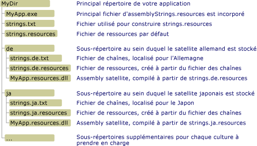

# <a name="creating-satellite-assemblies-for-desktop-apps"></a><span data-ttu-id="dc1e4-102">Création d'assemblys satellites pour les applications bureautiques</span><span class="sxs-lookup"><span data-stu-id="dc1e4-102">Creating Satellite Assemblies for Desktop Apps</span></span>
<span data-ttu-id="dc1e4-103">Les fichiers de ressources jouent un rôle central dans les applications localisées.</span><span class="sxs-lookup"><span data-stu-id="dc1e4-103">Resource files play a central role in localized applications.</span></span> <span data-ttu-id="dc1e4-104">Ils permettent à une application d’afficher des chaînes, des images et d’autres données dans la langue et la culture de l’utilisateur, et de fournir des données de remplacement si les ressources relatives à la langue et la culture de l’utilisateur ne sont pas disponibles.</span><span class="sxs-lookup"><span data-stu-id="dc1e4-104">They enable an application to display strings, images, and other data in the user's own language and culture, and to provide alternate data if resources for the user's own language or culture are unavailable.</span></span> <span data-ttu-id="dc1e4-105">Le .NET Framework utilise un modèle Hub and Spoke pour localiser et récupérer les ressources localisées.</span><span class="sxs-lookup"><span data-stu-id="dc1e4-105">The .NET Framework uses a hub-and-spoke model to locate and retrieve localized resources.</span></span> <span data-ttu-id="dc1e4-106">Le hub est l’assembly principal qui contient le code exécutable non localisable et les ressources pour une culture unique, appelée culture neutre ou par défaut.</span><span class="sxs-lookup"><span data-stu-id="dc1e4-106">The hub is the main assembly that contains the non-localizable executable code and the resources for a single culture, which is called the neutral or default culture.</span></span> <span data-ttu-id="dc1e4-107">La culture par défaut est la culture de secours de l’application ; elle est utilisée quand aucune ressource localisée n’est disponible.</span><span class="sxs-lookup"><span data-stu-id="dc1e4-107">The default culture is the fallback culture for the application; it is used when no localized resources are available.</span></span> <span data-ttu-id="dc1e4-108">Vous utilisez l’attribut <xref:System.Resources.NeutralResourcesLanguageAttribute> pour désigner la culture de la culture par défaut de l’application.</span><span class="sxs-lookup"><span data-stu-id="dc1e4-108">You use the <xref:System.Resources.NeutralResourcesLanguageAttribute> attribute to designate the culture of the application's default culture.</span></span> <span data-ttu-id="dc1e4-109">Chaque spoke se connecte à un assembly satellite qui contient les ressources d’une culture localisée unique, mais ne contient pas de code.</span><span class="sxs-lookup"><span data-stu-id="dc1e4-109">Each spoke connects to a satellite assembly that contains the resources for a single localized culture but does not contain any code.</span></span> <span data-ttu-id="dc1e4-110">Dans la mesure où les assemblys satellites ne font pas partie de l’assembly principal, vous pouvez facilement remplacer ou mettre à jour les ressources correspondant à une culture spécifique sans remplacer l’assembly principal de l’application.</span><span class="sxs-lookup"><span data-stu-id="dc1e4-110">Because the satellite assemblies are not part of the main assembly, you can easily update or replace resources that correspond to a specific culture without replacing the main assembly for the application.</span></span>  
  
> [!NOTE]
>  <span data-ttu-id="dc1e4-111">Les ressources de la culture par défaut d’une application peuvent aussi être stockées dans un assembly satellite.</span><span class="sxs-lookup"><span data-stu-id="dc1e4-111">The resources of an application's default culture can also be stored in a satellite assembly.</span></span> <span data-ttu-id="dc1e4-112">Pour cela, vous affectez à l’attribut <xref:System.Resources.NeutralResourcesLanguageAttribute> la valeur <xref:System.Resources.UltimateResourceFallbackLocation.Satellite?displayProperty=fullName>.</span><span class="sxs-lookup"><span data-stu-id="dc1e4-112">To do this, you assign the <xref:System.Resources.NeutralResourcesLanguageAttribute> attribute a value of <xref:System.Resources.UltimateResourceFallbackLocation.Satellite?displayProperty=fullName>.</span></span>  
  
## <a name="satellite-assembly-name-and-location"></a><span data-ttu-id="dc1e4-113">Nom et emplacement de l’assembly satellite</span><span class="sxs-lookup"><span data-stu-id="dc1e4-113">Satellite Assembly Name and Location</span></span>  
 <span data-ttu-id="dc1e4-114">Le modèle Hub and Spoke nécessite que vous placiez les ressources à des emplacements spécifiques afin qu’elles soient facilement trouvées et utilisées.</span><span class="sxs-lookup"><span data-stu-id="dc1e4-114">The hub-and-spoke model requires that you place resources in specific locations so that they can be easily located and used.</span></span> <span data-ttu-id="dc1e4-115">Si vous ne compilez pas et ne nommez pas les ressources comme prévu ou si vous ne les placez pas aux endroits corrects, le Common Language Runtime ne sera pas en mesure de les trouver et utilisera les ressources de la culture par défaut à la place.</span><span class="sxs-lookup"><span data-stu-id="dc1e4-115">If you do not compile and name resources as expected, or if you do not place them in the correct locations, the common language runtime will not be able to locate them and will use the resources of the default culture instead.</span></span> <span data-ttu-id="dc1e4-116">Le gestionnaire des ressources du .NET Framework, représenté par un objet <xref:System.Resources.ResourceManager>, permet d’accéder automatiquement aux ressources localisées.</span><span class="sxs-lookup"><span data-stu-id="dc1e4-116">The .NET Framework Resource Manager, represented by a <xref:System.Resources.ResourceManager> object, is used to automatically access localized resources.</span></span> <span data-ttu-id="dc1e4-117">Le gestionnaire des ressources nécessite les éléments suivants :</span><span class="sxs-lookup"><span data-stu-id="dc1e4-117">The Resource Manager requires the following:</span></span>  
  
-   <span data-ttu-id="dc1e4-118">Un seul assembly satellite doit inclure toutes les ressources d’une culture particulière.</span><span class="sxs-lookup"><span data-stu-id="dc1e4-118">A single satellite assembly must include all the resources for a particular culture.</span></span> <span data-ttu-id="dc1e4-119">En d’autres termes, vous devez compiler plusieurs fichiers .txt ou .resx en un seul fichier .resources binaire.</span><span class="sxs-lookup"><span data-stu-id="dc1e4-119">In other words, you should compile multiple .txt or .resx files into a single binary .resources file.</span></span>  
  
-   <span data-ttu-id="dc1e4-120">Il doit exister un sous-répertoire distinct dans le répertoire de l’application pour chaque culture localisée qui stocke les ressources de cette culture.</span><span class="sxs-lookup"><span data-stu-id="dc1e4-120">There must be a separate subdirectory in the application directory for each localized culture that stores that culture's resources.</span></span> <span data-ttu-id="dc1e4-121">Le nom du sous-répertoire doit être identique au nom de la culture.</span><span class="sxs-lookup"><span data-stu-id="dc1e4-121">The subdirectory name must be the same as the culture name.</span></span> <span data-ttu-id="dc1e4-122">Vous pouvez aussi stocker vos assemblys satellites dans le Global Assembly Cache.</span><span class="sxs-lookup"><span data-stu-id="dc1e4-122">Alternately, you can store your satellite assemblies in the global assembly cache.</span></span> <span data-ttu-id="dc1e4-123">Dans ce cas, le composant des informations de culture du nom fort de l’assembly doit indiquer sa culture.</span><span class="sxs-lookup"><span data-stu-id="dc1e4-123">In this case, the culture information component of the assembly's strong name must indicate its culture.</span></span> <span data-ttu-id="dc1e4-124">(Consultez la section [Installation d’assemblys satellites dans le Global Assembly Cache](#SN) plus loin dans cette rubrique.)</span><span class="sxs-lookup"><span data-stu-id="dc1e4-124">(See the [Installing Satellite Assemblies in the Global Assembly Cache](#SN) section later in this topic.)</span></span>  
  
    > [!NOTE]
    >  <span data-ttu-id="dc1e4-125">Si votre application comporte des ressources pour les sous-cultures, placez chaque sous-culture dans un sous-répertoire distinct sous le répertoire de l’application.</span><span class="sxs-lookup"><span data-stu-id="dc1e4-125">If your application includes resources for subcultures, place each subculture in a separate subdirectory under the application directory.</span></span> <span data-ttu-id="dc1e4-126">Ne placez pas les sous-cultures dans des sous-répertoires sous le répertoire de leur culture principale.</span><span class="sxs-lookup"><span data-stu-id="dc1e4-126">Do not place subcultures in subdirectories under their main culture's directory.</span></span>  
  
-   <span data-ttu-id="dc1e4-127">L’assembly satellite doit avoir le même nom que l’application et doit utiliser l’extension de nom de fichier « . resources.dll ».</span><span class="sxs-lookup"><span data-stu-id="dc1e4-127">The satellite assembly must have the same name as the application, and must use the file name extension ".resources.dll".</span></span> <span data-ttu-id="dc1e4-128">Par exemple, si une application est nommée Example.exe, le nom de chaque assembly satellite doit être Example.resources.dll.</span><span class="sxs-lookup"><span data-stu-id="dc1e4-128">For example, if an application is named Example.exe, the name of each satellite assembly should be Example.resources.dll.</span></span> <span data-ttu-id="dc1e4-129">Notez que le nom de l’assembly satellite n’indique pas la culture de ses fichiers de ressources.</span><span class="sxs-lookup"><span data-stu-id="dc1e4-129">Note that the satellite assembly name does not indicate the culture of its resource files.</span></span> <span data-ttu-id="dc1e4-130">Toutefois, l’assembly satellite apparaît dans un répertoire qui spécifie la culture.</span><span class="sxs-lookup"><span data-stu-id="dc1e4-130">However, the satellite assembly appears in a directory that does specify the culture.</span></span>  
  
-   <span data-ttu-id="dc1e4-131">Des informations sur la culture de l’assembly satellite doivent être incluses dans les métadonnées de l’assembly.</span><span class="sxs-lookup"><span data-stu-id="dc1e4-131">Information about the culture of the satellite assembly must be included in the assembly's metadata.</span></span> <span data-ttu-id="dc1e4-132">Pour stocker le nom de culture dans les métadonnées de l’assembly satellite, vous spécifiez l’option `/culture` quand vous utilisez [Assembly Linker](../../../docs/framework/tools/al-exe-assembly-linker.md) pour incorporer des ressources dans l’assembly satellite.</span><span class="sxs-lookup"><span data-stu-id="dc1e4-132">To store the culture name in the satellite assembly's metadata, you specify the `/culture` option when you use [Assembly Linker](../../../docs/framework/tools/al-exe-assembly-linker.md) to embed resources in the satellite assembly.</span></span>  
  
 <span data-ttu-id="dc1e4-133">L’illustration suivante propose un exemple de structure de répertoires et de la configuration requise pour les emplacements des applications que vous n’installez pas dans le [Global Assembly Cache](../../../docs/framework/app-domains/gac.md).</span><span class="sxs-lookup"><span data-stu-id="dc1e4-133">The following illustration shows a sample directory structure and location requirements for applications that you are not installing in the [global assembly cache](../../../docs/framework/app-domains/gac.md).</span></span> <span data-ttu-id="dc1e4-134">Les éléments avec les extensions .txt et .resources ne sont pas fournis avec l’application finale.</span><span class="sxs-lookup"><span data-stu-id="dc1e4-134">The items with .txt and .resources extensions will not ship with the final application.</span></span> <span data-ttu-id="dc1e4-135">Il s’agit des fichiers de ressources intermédiaires utilisés pour créer les assemblys de ressources satellites finaux.</span><span class="sxs-lookup"><span data-stu-id="dc1e4-135">These are the intermediate resource files used to create the final satellite resource assemblies.</span></span> <span data-ttu-id="dc1e4-136">Dans cet exemple, vous pouvez remplacer les fichiers .txt par les fichiers .resx.</span><span class="sxs-lookup"><span data-stu-id="dc1e4-136">In this example, you could substitute .resx files for the .txt files.</span></span> <span data-ttu-id="dc1e4-137">Pour plus d’informations, consultez [Empaquetage et déploiement de ressources](../../../docs/framework/resources/packaging-and-deploying-resources-in-desktop-apps.md).</span><span class="sxs-lookup"><span data-stu-id="dc1e4-137">For more information, see [Packaging and Deploying Resources](../../../docs/framework/resources/packaging-and-deploying-resources-in-desktop-apps.md).</span></span>  
  
 <span data-ttu-id="dc1e4-138"></span><span class="sxs-lookup"><span data-stu-id="dc1e4-138"></span></span>  
<span data-ttu-id="dc1e4-139">Répertoire de l’assembly satellite</span><span class="sxs-lookup"><span data-stu-id="dc1e4-139">Satellite assembly directory</span></span>  
  
## <a name="compiling-satellite-assemblies"></a><span data-ttu-id="dc1e4-140">compiler des assemblys satellites</span><span class="sxs-lookup"><span data-stu-id="dc1e4-140">Compiling Satellite Assemblies</span></span>  
 <span data-ttu-id="dc1e4-141">Vous utilisez le [Générateur de fichiers de ressources (Resgen.exe)](../../../docs/framework/tools/resgen-exe-resource-file-generator.md) pour compiler les fichiers texte ou XML (.resx) qui contiennent des ressources en fichiers .resources binaires.</span><span class="sxs-lookup"><span data-stu-id="dc1e4-141">You use [Resource File Generator (Resgen.exe)](../../../docs/framework/tools/resgen-exe-resource-file-generator.md) to compile text files or XML (.resx) files that contain resources to binary .resources files.</span></span> <span data-ttu-id="dc1e4-142">Vous utilisez ensuite [Assembly Linker (Al.exe)](../../../docs/framework/tools/al-exe-assembly-linker.md) pour compiler les fichiers .resources en assemblys satellites.</span><span class="sxs-lookup"><span data-stu-id="dc1e4-142">You then use [Assembly Linker (Al.exe)](../../../docs/framework/tools/al-exe-assembly-linker.md) to compile .resources files into satellite assemblies.</span></span> <span data-ttu-id="dc1e4-143">Al.exe crée un assembly à partir des fichiers .resources que vous spécifiez.</span><span class="sxs-lookup"><span data-stu-id="dc1e4-143">Al.exe creates an assembly from the .resources files that you specify.</span></span> <span data-ttu-id="dc1e4-144">Les assemblys satellites ne peuvent contenir que des ressources ; ils ne peuvent contenir aucun code exécutable.</span><span class="sxs-lookup"><span data-stu-id="dc1e4-144">Satellite assemblies can contain only resources; they cannot contain any executable code.</span></span>  
  
 <span data-ttu-id="dc1e4-145">La commande Al.exe suivante crée un assembly satellite pour l’application `Example` à partir du fichier de ressources en allemand strings.de.resources.</span><span class="sxs-lookup"><span data-stu-id="dc1e4-145">The following Al.exe command creates a satellite assembly for the application `Example` from the German resources file strings.de.resources.</span></span>  
  
```  
al /target:lib /embed:strings.de.resources /culture:de /out:Example.resources.dll  
```  
  
 <span data-ttu-id="dc1e4-146">La commande Al.exe suivante crée également un assembly satellite pour l’application `Example` à partir du fichier strings.de.resources.</span><span class="sxs-lookup"><span data-stu-id="dc1e4-146">The following Al.exe command also creates a satellite assembly for the application `Example` from the file strings.de.resources.</span></span> <span data-ttu-id="dc1e4-147">L’option **/template** permet à l’assembly satellite d’hériter de toutes les métadonnées de l’assembly à l’exception des informations de culture de l’assembly parent (Example.dll).</span><span class="sxs-lookup"><span data-stu-id="dc1e4-147">The **/template** option causes the satellite assembly to inherit all assembly metadata except for its culture information from the parent assembly (Example.dll).</span></span>  
  
```  
al /target:lib /embed:strings.de.resources /culture:de /out:Example.resources.dll /template:Example.dll  
```  
  
 <span data-ttu-id="dc1e4-148">Le tableau suivant décrit plus en détail les options Al.exe utilisées dans ces commandes.</span><span class="sxs-lookup"><span data-stu-id="dc1e4-148">The following table describes the Al.exe options used in these commands in more detail.</span></span>  
  
|<span data-ttu-id="dc1e4-149">Option</span><span class="sxs-lookup"><span data-stu-id="dc1e4-149">Option</span></span>|<span data-ttu-id="dc1e4-150">Description</span><span class="sxs-lookup"><span data-stu-id="dc1e4-150">Description</span></span>|  
|------------|-----------------|  
|<span data-ttu-id="dc1e4-151">**/target:**lib</span><span class="sxs-lookup"><span data-stu-id="dc1e4-151">**/target:**lib</span></span>|<span data-ttu-id="dc1e4-152">Spécifie que votre assembly satellite est compilé dans un fichier de bibliothèque (.dll).</span><span class="sxs-lookup"><span data-stu-id="dc1e4-152">Specifies that your satellite assembly is compiled to a library (.dll) file.</span></span> <span data-ttu-id="dc1e4-153">Comme un assembly satellite ne contient pas de code exécutable et n’est pas l’assembly principal d’une application, vous devez enregistrer les assemblys satellites en tant que DLL.</span><span class="sxs-lookup"><span data-stu-id="dc1e4-153">Because a satellite assembly does not contain executable code and is not an application's main assembly, you must save satellite assemblies as DLLs.</span></span>|  
|<span data-ttu-id="dc1e4-154">**/embed:**strings.de.resources</span><span class="sxs-lookup"><span data-stu-id="dc1e4-154">**/embed:**strings.de.resources</span></span>|<span data-ttu-id="dc1e4-155">Spécifie le nom du fichier de ressources à incorporer quand Al.exe compile l’assembly.</span><span class="sxs-lookup"><span data-stu-id="dc1e4-155">Specifies the name of the resource file to embed when Al.exe compiles the assembly.</span></span> <span data-ttu-id="dc1e4-156">Vous pouvez incorporer plusieurs fichiers .resources dans un assembly satellite mais, si vous suivez le modèle Hub and Spoke, vous devez compiler un assembly satellite pour chaque culture.</span><span class="sxs-lookup"><span data-stu-id="dc1e4-156">You can embed multiple .resources files in a satellite assembly, but if you are following the hub-and-spoke model, you must compile one satellite assembly for each culture.</span></span> <span data-ttu-id="dc1e4-157">Toutefois, vous pouvez créer des fichiers .resources séparés pour les chaînes et les objets.</span><span class="sxs-lookup"><span data-stu-id="dc1e4-157">However, you can create separate .resources files for strings and objects.</span></span>|  
|<span data-ttu-id="dc1e4-158">**/culture:**de</span><span class="sxs-lookup"><span data-stu-id="dc1e4-158">**/culture:**de</span></span>|<span data-ttu-id="dc1e4-159">Spécifie la culture de la ressource à compiler.</span><span class="sxs-lookup"><span data-stu-id="dc1e4-159">Specifies the culture of the resource to compile.</span></span> <span data-ttu-id="dc1e4-160">Le Common Language Runtime utilise ces informations lors de la recherche des ressources pour une culture spécifiée.</span><span class="sxs-lookup"><span data-stu-id="dc1e4-160">The common language runtime uses this information when it searches for the resources for a specified culture.</span></span> <span data-ttu-id="dc1e4-161">Si vous omettez cette option, Al.exe compile quand même la ressource, mais le runtime n’est pas en mesure de la trouver quand un utilisateur la demande.</span><span class="sxs-lookup"><span data-stu-id="dc1e4-161">If you omit this option, Al.exe will still compile the resource, but the runtime will not be able to find it when a user requests it.</span></span>|  
|<span data-ttu-id="dc1e4-162">**/out:**Example.resources.dll</span><span class="sxs-lookup"><span data-stu-id="dc1e4-162">**/out:**Example.resources.dll</span></span>|<span data-ttu-id="dc1e4-163">Spécifie le nom du fichier de sortie.</span><span class="sxs-lookup"><span data-stu-id="dc1e4-163">Specifies the name of the output file.</span></span> <span data-ttu-id="dc1e4-164">Le nom doit respecter la norme d’appellation *baseName*.resources. *extension*, où *baseName* est le nom de l’assembly principal et *extension* est une extension valide (par exemple, .dll).</span><span class="sxs-lookup"><span data-stu-id="dc1e4-164">The name must follow the naming standard *baseName*.resources.*extension*, where *baseName* is the name of the main assembly and *extension* is a valid file name extension (such as .dll).</span></span> <span data-ttu-id="dc1e4-165">Notez que le runtime n’est pas en mesure de déterminer la culture d’un assembly satellite en fonction du nom de son fichier de sortie ; vous devez utiliser l’option **/culture** pour la spécifier.</span><span class="sxs-lookup"><span data-stu-id="dc1e4-165">Note that the runtime is not able to determine the culture of a satellite assembly based on its output file name; you must use the **/culture** option to specify it.</span></span>|  
|<span data-ttu-id="dc1e4-166">**/template:**Example.dll</span><span class="sxs-lookup"><span data-stu-id="dc1e4-166">**/template:**Example.dll</span></span>|<span data-ttu-id="dc1e4-167">Spécifie un assembly à partir duquel l’assembly satellite va hériter de toutes les métadonnées de l’assembly, à l’exception du champ de culture.</span><span class="sxs-lookup"><span data-stu-id="dc1e4-167">Specifies an assembly from which the satellite assembly will inherit all assembly metadata except the culture field.</span></span> <span data-ttu-id="dc1e4-168">Cette option affecte les assemblys satellites uniquement si vous spécifiez un assembly qui a un [nom fort](../../../docs/framework/app-domains/strong-named-assemblies.md).</span><span class="sxs-lookup"><span data-stu-id="dc1e4-168">This option affects satellite assemblies only if you specify an assembly that has a [strong name](../../../docs/framework/app-domains/strong-named-assemblies.md).</span></span>|  
  
 <span data-ttu-id="dc1e4-169">Pour obtenir une liste complète des options disponibles avec Al.exe, consultez [Assembly Linker (Al.exe)](../../../docs/framework/tools/al-exe-assembly-linker.md).</span><span class="sxs-lookup"><span data-stu-id="dc1e4-169">For a complete list of options available with Al.exe, see [Assembly Linker (Al.exe)](../../../docs/framework/tools/al-exe-assembly-linker.md).</span></span>  
  
## <a name="satellite-assemblies-an-example"></a><span data-ttu-id="dc1e4-170">Assemblys satellites : un exemple</span><span class="sxs-lookup"><span data-stu-id="dc1e4-170">Satellite Assemblies: An Example</span></span>  
 <span data-ttu-id="dc1e4-171">Voici un exemple « Hello world » simple qui affiche une boîte de message contenant un message d’accueil localisé.</span><span class="sxs-lookup"><span data-stu-id="dc1e4-171">The following is a simple "Hello world" example that displays a message box containing a localized greeting.</span></span> <span data-ttu-id="dc1e4-172">L’exemple contient des ressources pour les cultures Anglais (États-Unis), Français (France) et Russe (Russie), et sa culture de secours est Anglais.</span><span class="sxs-lookup"><span data-stu-id="dc1e4-172">The example includes resources for the English (United States), French (France), and Russian (Russia) cultures, and its fallback culture is English.</span></span> <span data-ttu-id="dc1e4-173">Pour créer l’exemple, effectuez les étapes suivantes :</span><span class="sxs-lookup"><span data-stu-id="dc1e4-173">To create the example, do the following:</span></span>  
  
1.  <span data-ttu-id="dc1e4-174">Créez un fichier de ressources nommé Greeting.resx ou Greeting.txt pour contenir la ressource de la culture par défaut.</span><span class="sxs-lookup"><span data-stu-id="dc1e4-174">Create a resource file named Greeting.resx or Greeting.txt to contain the resource for the default culture.</span></span> <span data-ttu-id="dc1e4-175">Stockez une chaîne unique nommée `HelloString` dont la valeur est « Hello world! »</span><span class="sxs-lookup"><span data-stu-id="dc1e4-175">Store a single string named `HelloString` whose value is "Hello world!"</span></span> <span data-ttu-id="dc1e4-176">dans ce fichier.</span><span class="sxs-lookup"><span data-stu-id="dc1e4-176">in this file.</span></span>  
  
2.  <span data-ttu-id="dc1e4-177">Pour indiquer que l’anglais (en) est la culture par défaut de l’application, ajoutez l’attribut <xref:System.Resources.NeutralResourcesLanguageAttribute?displayProperty=fullName> suivant au fichier AssemblyInfo de l’application ou au fichier de code source principal qui sera compilé dans l’assembly principal de l’application.</span><span class="sxs-lookup"><span data-stu-id="dc1e4-177">To indicate that English (en) is the application's default culture, add the following <xref:System.Resources.NeutralResourcesLanguageAttribute?displayProperty=fullName> attribute to the application's AssemblyInfo file or to the main source code file that will be compiled into the application's main assembly.</span></span>  
  
     <span data-ttu-id="dc1e4-178">[!code-csharp[Conceptual.Resources.Locating#2](../../../samples/snippets/csharp/VS_Snippets_CLR/conceptual.resources.locating/cs/assemblyinfo.cs#2)]  [!code-vb[Conceptual.Resources.Locating#2](../../../samples/snippets/visualbasic/VS_Snippets_CLR/conceptual.resources.locating/vb/assemblyinfo.vb#2)]</span><span class="sxs-lookup"><span data-stu-id="dc1e4-178">[!code-csharp[Conceptual.Resources.Locating#2](../../../samples/snippets/csharp/VS_Snippets_CLR/conceptual.resources.locating/cs/assemblyinfo.cs#2)]  [!code-vb[Conceptual.Resources.Locating#2](../../../samples/snippets/visualbasic/VS_Snippets_CLR/conceptual.resources.locating/vb/assemblyinfo.vb#2)]</span></span>  
  
3.  <span data-ttu-id="dc1e4-179">Ajoutez la prise en charge de cultures supplémentaires (en-US, fr-FR et ru-RU) à l’application comme suit :</span><span class="sxs-lookup"><span data-stu-id="dc1e4-179">Add support for additional cultures (en-US, fr-FR, and ru-RU) to the application as follows:</span></span>  
  
    -   <span data-ttu-id="dc1e4-180">Pour prendre en charge la culture « en-US » ou Anglais (États-Unis), créez un fichier de ressources nommé Greeting.en-US.resx ou Greeting.en-US.txt et stockez-le dans une chaîne unique nommée `HelloString` dont la valeur est « Hi world! ».</span><span class="sxs-lookup"><span data-stu-id="dc1e4-180">To support the en-US or English (United States) culture, create a resource file named Greeting.en-US.resx or Greeting.en-US.txt, and store in it a single string named `HelloString` whose value is "Hi world!"</span></span>  
  
    -   <span data-ttu-id="dc1e4-181">Pour prendre en charge la culture « fr-FR » ou Français (France), créez un fichier de ressources nommé Greeting.fr-FR.resx ou Greeting.fr-FR.txt et stockez-le dans une chaîne unique nommée `HelloString` dont la valeur est « Salut tout le monde ! ».</span><span class="sxs-lookup"><span data-stu-id="dc1e4-181">To support the fr-FR or French (France) culture, create a resource file named Greeting.fr-FR.resx or Greeting.fr-FR.txt, and store in it a single string named `HelloString` whose value is "Salut tout le monde!"</span></span>  
  
    -   <span data-ttu-id="dc1e4-182">Pour prendre en charge la culture « ru-RU » ou Russe (Russie), créez un fichier de ressources nommé Greeting.ru-RU.resx ou Greeting.ru-RU.txt et stockez-le dans une chaîne unique nommée `HelloString` dont la valeur est « Всем привет! ».</span><span class="sxs-lookup"><span data-stu-id="dc1e4-182">To support the ru-RU or Russian (Russia) culture, create a resource file named Greeting.ru-RU.resx or Greeting.ru-RU.txt, and store in it a single string named `HelloString` whose value is "Всем привет!"</span></span>  
  
4.  <span data-ttu-id="dc1e4-183">Utilisez [Resgen.exe](../../../docs/framework/tools/resgen-exe-resource-file-generator.md) pour compiler chaque fichier de ressources texte ou XML en un fichier .resources binaire.</span><span class="sxs-lookup"><span data-stu-id="dc1e4-183">Use [Resgen.exe](../../../docs/framework/tools/resgen-exe-resource-file-generator.md) to compile each text or XML resource file to a binary .resources file.</span></span> <span data-ttu-id="dc1e4-184">La sortie est un ensemble de fichiers ayant le même nom de fichier racine que les fichiers .resx ou .txt, mais avec l’extension .resources.</span><span class="sxs-lookup"><span data-stu-id="dc1e4-184">The output is a set of files that have the same root file name as the .resx or .txt files, but a .resources extension.</span></span> <span data-ttu-id="dc1e4-185">Si vous créez l’exemple avec Visual Studio, le processus de compilation est géré automatiquement.</span><span class="sxs-lookup"><span data-stu-id="dc1e4-185">If you create the example with Visual Studio, the compilation process is handled automatically.</span></span> <span data-ttu-id="dc1e4-186">Si vous n’utilisez pas Visual Studio, exécutez les commandes suivantes pour compiler les fichiers .resx en fichiers .resources :</span><span class="sxs-lookup"><span data-stu-id="dc1e4-186">If you aren't using Visual Studio, run the following commands to compile the .resx files into .resources files:</span></span>  
  
    ```  
    resgen Greeting.resx  
    resgen Greeting.en-us.resx  
    resgen Greeting.fr-FR.resx  
    resgen Greeting.ru-RU.resx  
    ```  
  
     <span data-ttu-id="dc1e4-187">Si vos ressources se trouvent dans des fichiers texte au lieu de fichiers XML, remplacez l’extension .resx par .txt.</span><span class="sxs-lookup"><span data-stu-id="dc1e4-187">If your resources are in text files instead of XML files, replace the .resx extension with .txt.</span></span>  
  
5.  <span data-ttu-id="dc1e4-188">Compilez le code source suivant avec les ressources de la culture par défaut dans l’assembly principal de l’application :</span><span class="sxs-lookup"><span data-stu-id="dc1e4-188">Compile the following source code along with the resources for the default culture into the application's main assembly:</span></span>  
  
    > [!IMPORTANT]
    >  <span data-ttu-id="dc1e4-189">Si vous utilisez la ligne de commande plutôt que Visual Studio pour créer l’exemple, vous devez modifier l’appel au constructeur de la classe <xref:System.Resources.ResourceManager> comme suit :`ResourceManager rm = new ResourceManager("Greetings",``typeof(Example).Assembly);`</span><span class="sxs-lookup"><span data-stu-id="dc1e4-189">If you are using the command line rather than Visual Studio to create the example, you should modify the call to the <xref:System.Resources.ResourceManager> class constructor to the following: `ResourceManager rm = new ResourceManager("Greetings",``typeof(Example).Assembly);`</span></span>  
  
     <span data-ttu-id="dc1e4-190">[!code-csharp[Conceptual.Resources.Locating#1](../../../samples/snippets/csharp/VS_Snippets_CLR/conceptual.resources.locating/cs/program.cs#1)]  [!code-vb[Conceptual.Resources.Locating#1](../../../samples/snippets/visualbasic/VS_Snippets_CLR/conceptual.resources.locating/vb/module1.vb#1)]</span><span class="sxs-lookup"><span data-stu-id="dc1e4-190">[!code-csharp[Conceptual.Resources.Locating#1](../../../samples/snippets/csharp/VS_Snippets_CLR/conceptual.resources.locating/cs/program.cs#1)]  [!code-vb[Conceptual.Resources.Locating#1](../../../samples/snippets/visualbasic/VS_Snippets_CLR/conceptual.resources.locating/vb/module1.vb#1)]</span></span>  
  
     <span data-ttu-id="dc1e4-191">Si l’application se nomme Example et que vous compilez à partir de la ligne de commande, la commande pour le compilateur C# est :</span><span class="sxs-lookup"><span data-stu-id="dc1e4-191">If the application is named Example and you are compiling from the command line, the command for the C# compiler is:</span></span>  
  
    ```  
    csc Example.cs /res:Greeting.resources  
    ```  
  
     <span data-ttu-id="dc1e4-192">La commande correspondante du compilateur Visual Basic est :</span><span class="sxs-lookup"><span data-stu-id="dc1e4-192">The corresponding Visual Basic compiler command is:</span></span>  
  
    ```  
    vbc Example.vb /res:Greeting.resources  
    ```  
  
6.  <span data-ttu-id="dc1e4-193">Créez un sous-répertoire dans le répertoire principal de l’application pour chaque culture localisée prise en charge par l’application.</span><span class="sxs-lookup"><span data-stu-id="dc1e4-193">Create a subdirectory in the main application directory for each localized culture supported by the application.</span></span> <span data-ttu-id="dc1e4-194">Vous devez créer des sous-répertoires en-US, fr-FR et ru-RU.</span><span class="sxs-lookup"><span data-stu-id="dc1e4-194">You should create an en-US, an fr-FR, and an ru-RU subdirectory.</span></span> <span data-ttu-id="dc1e4-195">Visual Studio crée automatiquement ces sous-répertoires dans le cadre du processus de compilation.</span><span class="sxs-lookup"><span data-stu-id="dc1e4-195">Visual Studio creates these subdirectories automatically as part of the compilation process.</span></span>  
  
7.  <span data-ttu-id="dc1e4-196">Incorporez les fichiers .resources individuels spécifiques à la culture dans des assemblys satellites et enregistrez-les dans le répertoire approprié.</span><span class="sxs-lookup"><span data-stu-id="dc1e4-196">Embed the individual culture-specific .resources files into satellite assemblies and save them to the appropriate directory.</span></span> <span data-ttu-id="dc1e4-197">La commande à exécuter pour chaque fichier .resources est la suivante :</span><span class="sxs-lookup"><span data-stu-id="dc1e4-197">The command to do this for each .resources file is:</span></span>  
  
    ```  
    al /target:lib /embed:Greeting.culture.resources /culture:culture /out:culture\Example.resources.dll  
    ```  
  
     <span data-ttu-id="dc1e4-198">où *culture* est le nom de la culture dont les ressources sont contenues dans l’assembly satellite.</span><span class="sxs-lookup"><span data-stu-id="dc1e4-198">where *culture* is the name of the culture whose resources the satellite assembly contains.</span></span> <span data-ttu-id="dc1e4-199">Visual Studio gère automatiquement ce processus.</span><span class="sxs-lookup"><span data-stu-id="dc1e4-199">Visual Studio handles this process automatically.</span></span>  
  
 <span data-ttu-id="dc1e4-200">Vous pouvez ensuite exécuter l’exemple.</span><span class="sxs-lookup"><span data-stu-id="dc1e4-200">You can then run the example.</span></span> <span data-ttu-id="dc1e4-201">Il choisit au hasard comme culture actuelle l’une des cultures prises en charge et affiche un message d’accueil localisé.</span><span class="sxs-lookup"><span data-stu-id="dc1e4-201">It will randomly make one of the supported cultures the current culture and display a localized greeting.</span></span>  
  
<a name="SN"></a>   
## <a name="installing-satellite-assemblies-in-the-global-assembly-cache"></a><span data-ttu-id="dc1e4-202">Installation d’assemblys satellites dans le Global Assembly Cache</span><span class="sxs-lookup"><span data-stu-id="dc1e4-202">Installing Satellite Assemblies in the Global Assembly Cache</span></span>  
 <span data-ttu-id="dc1e4-203">Au lieu d’installer des assemblys dans un sous-répertoire de l’application locale, vous pouvez les installer dans le Global Assembly Cache.</span><span class="sxs-lookup"><span data-stu-id="dc1e4-203">Instead of installing assemblies in a local application subdirectory, you can install them in the global assembly cache.</span></span> <span data-ttu-id="dc1e4-204">Ceci est particulièrement utile si vous avez des bibliothèques de classes et des assemblys de ressources de bibliothèques de classes qui sont utilisés par plusieurs applications.</span><span class="sxs-lookup"><span data-stu-id="dc1e4-204">This is particularly useful if you have class libraries and class library resource assemblies that are used by multiple applications.</span></span>  
  
 <span data-ttu-id="dc1e4-205">Pour être installés dans le Global Assembly Cache, les assemblys doivent avoir un nom fort.</span><span class="sxs-lookup"><span data-stu-id="dc1e4-205">Installing assemblies in the global assembly cache requires that they have strong names.</span></span> <span data-ttu-id="dc1e4-206">Les assemblys avec nom fort sont signés avec une paire de clés publique/privée valide.</span><span class="sxs-lookup"><span data-stu-id="dc1e4-206">Strong-named assemblies are signed with a valid public/private key pair.</span></span> <span data-ttu-id="dc1e4-207">Ils contiennent des informations de version que le runtime utilise pour déterminer l’assembly à utiliser pour répondre à une demande de liaison.</span><span class="sxs-lookup"><span data-stu-id="dc1e4-207">They contain version information that the runtime uses to determine which assembly to use to satisfy a binding request.</span></span> <span data-ttu-id="dc1e4-208">Pour plus d’informations sur les noms forts et le contrôle de version, consultez [Contrôle de version des assemblys](../../../docs/framework/app-domains/assembly-versioning.md).</span><span class="sxs-lookup"><span data-stu-id="dc1e4-208">For more information about strong names and versioning, see [Assembly Versioning](../../../docs/framework/app-domains/assembly-versioning.md).</span></span> <span data-ttu-id="dc1e4-209">Pour plus d’informations sur les noms forts, consultez [Assemblys avec nom fort](../../../docs/framework/app-domains/strong-named-assemblies.md).</span><span class="sxs-lookup"><span data-stu-id="dc1e4-209">For more information about strong names, see [Strong-Named Assemblies](../../../docs/framework/app-domains/strong-named-assemblies.md).</span></span>  
  
 <span data-ttu-id="dc1e4-210">Quand vous développez une application, il est peu probable que vous puissiez accéder à la paire de clés publique/privée finale.</span><span class="sxs-lookup"><span data-stu-id="dc1e4-210">When you are developing an application, it is unlikely that you will have access to the final public/private key pair.</span></span> <span data-ttu-id="dc1e4-211">Pour installer un assembly satellite dans le Global Assembly Cache et vous assurer qu’il fonctionne comme prévu, vous pouvez utiliser une technique appelée signature différée.</span><span class="sxs-lookup"><span data-stu-id="dc1e4-211">In order to install a satellite assembly in the global assembly cache and ensure that it works as expected, you can use a technique called delayed signing.</span></span> <span data-ttu-id="dc1e4-212">Quand vous différez la signature d’un assembly, vous réservez au moment de la génération un espace dans le fichier pour la signature de nom fort.</span><span class="sxs-lookup"><span data-stu-id="dc1e4-212">When you delay sign an assembly, at build time you reserve space in the file for the strong name signature.</span></span> <span data-ttu-id="dc1e4-213">La signature réelle est différée jusqu’à une date ultérieure, quand la paire de clés publique/privée finale est disponible.</span><span class="sxs-lookup"><span data-stu-id="dc1e4-213">The actual signing is delayed until later, when the final public/private key pair is available.</span></span> <span data-ttu-id="dc1e4-214">Pour plus d’informations sur la signature différée, consultez [Différer la signature d’un assembly](../../../docs/framework/app-domains/delay-sign-assembly.md).</span><span class="sxs-lookup"><span data-stu-id="dc1e4-214">For more information about delayed signing, see [Delay Signing an Assembly](../../../docs/framework/app-domains/delay-sign-assembly.md).</span></span>  
  
### <a name="obtaining-the-public-key"></a><span data-ttu-id="dc1e4-215">Obtention de la clé publique</span><span class="sxs-lookup"><span data-stu-id="dc1e4-215">Obtaining the Public Key</span></span>  
 <span data-ttu-id="dc1e4-216">Pour différer la signature d’un assembly, vous devez avoir accès à la clé publique.</span><span class="sxs-lookup"><span data-stu-id="dc1e4-216">To delay sign an assembly, you must have access to the public key.</span></span> <span data-ttu-id="dc1e4-217">Vous pouvez soit obtenir la clé publique réelle à partir de l’organisation de votre société qui effectuera la signature finale, soit créer une clé publique en utilisant l’outil [Strong Name Tool (Sn.exe)](../../../docs/framework/tools/sn-exe-strong-name-tool.md).</span><span class="sxs-lookup"><span data-stu-id="dc1e4-217">You can either obtain the real public key from the organization in your company that will do the eventual signing, or create a public key by using the [Strong Name Tool (Sn.exe)](../../../docs/framework/tools/sn-exe-strong-name-tool.md).</span></span>  
  
 <span data-ttu-id="dc1e4-218">La commande Sn.exe suivante crée une paire de clés publique/privée de test.</span><span class="sxs-lookup"><span data-stu-id="dc1e4-218">The following Sn.exe command creates a test public/private key pair.</span></span> <span data-ttu-id="dc1e4-219">L’option **–k** spécifie que Sn.exe doit créer une paire de clés et l’enregistrer dans un fichier nommé TestKeyPair.snk.</span><span class="sxs-lookup"><span data-stu-id="dc1e4-219">The **–k** option specifies that Sn.exe should create a new key pair and save it in a file named TestKeyPair.snk.</span></span>  
  
```  
sn –k TestKeyPair.snk   
```  
  
 <span data-ttu-id="dc1e4-220">Vous pouvez extraire la clé publique du fichier contenant la paire de clés de test.</span><span class="sxs-lookup"><span data-stu-id="dc1e4-220">You can extract the public key from the file that contains the test key pair.</span></span> <span data-ttu-id="dc1e4-221">La commande suivante extrait la clé publique de TestKeyPair.snk et l’enregistre dans PublicKey.snk :</span><span class="sxs-lookup"><span data-stu-id="dc1e4-221">The following command extracts the public key from TestKeyPair.snk and saves it in PublicKey.snk:</span></span>  
  
```  
sn –p TestKeyPair.snk PublicKey.snk  
```  
  
### <a name="delay-signing-an-assembly"></a><span data-ttu-id="dc1e4-222">Temporisation de signature d'un assembly</span><span class="sxs-lookup"><span data-stu-id="dc1e4-222">Delay Signing an Assembly</span></span>  
 <span data-ttu-id="dc1e4-223">Après avoir obtenu ou créé la clé publique, utilisez [Assembly Linker (Al.exe)](../../../docs/framework/tools/al-exe-assembly-linker.md) pour compiler l’assembly et spécifier une signature différée.</span><span class="sxs-lookup"><span data-stu-id="dc1e4-223">After you obtain or create the public key, you use the [Assembly Linker (Al.exe)](../../../docs/framework/tools/al-exe-assembly-linker.md) to compile the assembly and specify delayed signing.</span></span>  
  
 <span data-ttu-id="dc1e4-224">La commande Al.exe suivante crée un assembly satellite avec nom fort pour l’application StringLibrary à partir du fichier strings.ja.resources :</span><span class="sxs-lookup"><span data-stu-id="dc1e4-224">The following Al.exe command creates a strong-named satellite assembly for the application StringLibrary from the strings.ja.resources file:</span></span>  
  
```  
al /target:lib /embed:strings.ja.resources /culture:ja /out:StringLibrary.resources.dll /delay+ /keyfile:PublicKey.snk  
```  
  
 <span data-ttu-id="dc1e4-225">L’option **/delay+** indique qu’Assembly Linker doit différer la signature de l’assembly.</span><span class="sxs-lookup"><span data-stu-id="dc1e4-225">The **/delay+** option specifies that the Assembly Linker should delay sign the assembly.</span></span> <span data-ttu-id="dc1e4-226">L’option **/keyfile** spécifie le nom du fichier de clé qui contient la clé publique à utiliser pour différer la signature de l’assembly.</span><span class="sxs-lookup"><span data-stu-id="dc1e4-226">The **/keyfile** option specifies the name of the key file that contains the public key to use to delay sign the assembly.</span></span>  
  
### <a name="re-signing-an-assembly"></a><span data-ttu-id="dc1e4-227">Nouvelle signature d’un assembly</span><span class="sxs-lookup"><span data-stu-id="dc1e4-227">Re-signing an Assembly</span></span>  
 <span data-ttu-id="dc1e4-228">Avant de déployer votre application, vous devez signer à nouveau l’assembly satellite à signature différée avec la vraie valeur de paire de clés.</span><span class="sxs-lookup"><span data-stu-id="dc1e4-228">Before you deploy your application, you must re-sign the delay signed satellite assembly with the real key pair.</span></span> <span data-ttu-id="dc1e4-229">Pour cela, utilisez Sn.exe.</span><span class="sxs-lookup"><span data-stu-id="dc1e4-229">You can do this by using Sn.exe.</span></span>  
  
 <span data-ttu-id="dc1e4-230">La commande Sn.exe suivante signe StringLibrary.resources.dll avec la paire de clés stockée dans le fichier RealKeyPair.snk.</span><span class="sxs-lookup"><span data-stu-id="dc1e4-230">The following Sn.exe command signs StringLibrary.resources.dll with the key pair stored in the file RealKeyPair.snk.</span></span> <span data-ttu-id="dc1e4-231">L’option **–R** spécifie qu’un assembly déjà signé ou à signature différée doit être à nouveau signé.</span><span class="sxs-lookup"><span data-stu-id="dc1e4-231">The **–R** option specifies that a previously signed or delay signed assembly is to be re-signed.</span></span>  
  
```  
sn –R StringLibrary.resources.dll RealKeyPair.snk   
```  
  
### <a name="installing-a-satellite-assembly-in-the-global-assembly-cache"></a><span data-ttu-id="dc1e4-232">Installation d’un assembly satellite dans le Global Assembly Cache</span><span class="sxs-lookup"><span data-stu-id="dc1e4-232">Installing a Satellite Assembly in the Global Assembly Cache</span></span>  
 <span data-ttu-id="dc1e4-233">Quand le runtime recherche des ressources dans le processus de secours pour les ressources, il cherche d’abord dans le [Global Assembly Cache](../../../docs/framework/app-domains/gac.md).</span><span class="sxs-lookup"><span data-stu-id="dc1e4-233">When the runtime searches for resources in the resource fallback process, it looks in the [global assembly cache](../../../docs/framework/app-domains/gac.md) first.</span></span> <span data-ttu-id="dc1e4-234">(Pour plus d’informations, consultez la section « Processus de secours pour les ressources » de la rubrique [Empaquetage et déploiement de ressources](../../../docs/framework/resources/packaging-and-deploying-resources-in-desktop-apps.md).) Dès qu’un assembly satellite est signé avec un nom fort, il peut être installé dans le Global Assembly Cache à l’aide de [Global Assembly Cache Tool (Gacutil.exe)](../../../docs/framework/tools/gacutil-exe-gac-tool.md).</span><span class="sxs-lookup"><span data-stu-id="dc1e4-234">(For more information, see the "Resource Fallback Process" section of the [Packaging and Deploying Resources](../../../docs/framework/resources/packaging-and-deploying-resources-in-desktop-apps.md) topic.) As soon as a satellite assembly is signed with a strong name, it can be installed in the global assembly cache by using the [Global Assembly Cache Tool (Gacutil.exe)](../../../docs/framework/tools/gacutil-exe-gac-tool.md).</span></span>  
  
 <span data-ttu-id="dc1e4-235">La commande Gacutil.exe suivante installe StringLibrary.resources.dll dans le Global Assembly Cache :</span><span class="sxs-lookup"><span data-stu-id="dc1e4-235">The following Gacutil.exe command installs StringLibrary.resources.dll in the global assembly cache:</span></span>  
  
```  
gacutil /i:StringLibrary.resources.dll  
```  
  
 <span data-ttu-id="dc1e4-236">L’option **/i** spécifie que Gacutil.exe doit installer l’assembly spécifié dans le Global Assembly Cache.</span><span class="sxs-lookup"><span data-stu-id="dc1e4-236">The **/i** option specifies that Gacutil.exe should install the specified assembly into the global assembly cache.</span></span> <span data-ttu-id="dc1e4-237">Une fois l’assembly satellite installé dans le cache, les ressources qu’il contient deviennent disponibles pour toutes les applications conçues pour utiliser l’assembly satellite.</span><span class="sxs-lookup"><span data-stu-id="dc1e4-237">After the satellite assembly is installed in the cache, the resources it contains become available to all applications that are designed to use the satellite assembly.</span></span>  
  
### <a name="resources-in-the-global-assembly-cache-an-example"></a><span data-ttu-id="dc1e4-238">Ressources dans le Global Assembly Cache : un exemple</span><span class="sxs-lookup"><span data-stu-id="dc1e4-238">Resources in the Global Assembly Cache: An Example</span></span>  
 <span data-ttu-id="dc1e4-239">L’exemple suivant utilise une méthode dans une bibliothèque de classes .NET Framework pour extraire et retourner un message d’accueil localisé à partir d’un fichier de ressources.</span><span class="sxs-lookup"><span data-stu-id="dc1e4-239">The following example uses a method in a .NET Framework class library to extract and return a localized greeting from a resource file.</span></span> <span data-ttu-id="dc1e4-240">La bibliothèque et ses ressources sont inscrites dans le Global Assembly Cache.</span><span class="sxs-lookup"><span data-stu-id="dc1e4-240">The library and its resources are registered in the global assembly cache.</span></span> <span data-ttu-id="dc1e4-241">L’exemple contient des ressources pour les cultures Anglais (États-Unis), Français (France) et Russe (Russie).</span><span class="sxs-lookup"><span data-stu-id="dc1e4-241">The example includes resources for the English (United States), French (France), Russian (Russia), and English cultures.</span></span> <span data-ttu-id="dc1e4-242">L’anglais est la culture par défaut ; ses ressources sont stockées dans l’assembly principal.</span><span class="sxs-lookup"><span data-stu-id="dc1e4-242">English is the default culture; its resources are stored in the main assembly.</span></span> <span data-ttu-id="dc1e4-243">L’exemple diffère initialement la signature de la bibliothèque et ses assemblys satellites avec une clé publique, puis les signe à nouveau avec une paire de clés publique/privée.</span><span class="sxs-lookup"><span data-stu-id="dc1e4-243">The example initially delay signs the library and its satellite assemblies with a public key, then re-signs them with a public/private key pair.</span></span> <span data-ttu-id="dc1e4-244">Pour créer l’exemple, effectuez les étapes suivantes :</span><span class="sxs-lookup"><span data-stu-id="dc1e4-244">To create the example, do the following:</span></span>  
  
1.  <span data-ttu-id="dc1e4-245">Si vous n’utilisez pas Visual Studio, utilisez la commande [Strong Name Tool (Sn.exe)](../../../docs/framework/tools/sn-exe-strong-name-tool.md) suivante pour créer une paire de clés publique/privée nommée ResKey.snk :</span><span class="sxs-lookup"><span data-stu-id="dc1e4-245">If you are not using Visual Studio, use the following [Strong Name Tool (Sn.exe)](../../../docs/framework/tools/sn-exe-strong-name-tool.md) command to create a public/private key pair named ResKey.snk:</span></span>  
  
    ```  
    sn –k ResKey.snk  
    ```  
  
     <span data-ttu-id="dc1e4-246">Si vous utilisez Visual Studio, utilisez l’onglet **Signature** de la boîte de dialogue **Propriétés** du projet pour générer le fichier de clé.</span><span class="sxs-lookup"><span data-stu-id="dc1e4-246">If you are using Visual Studio, use the **Signing** tab of the project **Properties** dialog box to generate the key file.</span></span>  
  
2.  <span data-ttu-id="dc1e4-247">Utilisez la commande [Strong Name Tool (Sn.exe)](../../../docs/framework/tools/sn-exe-strong-name-tool.md) suivante pour créer un fichier de clé publique nommé PublicKey.snk :</span><span class="sxs-lookup"><span data-stu-id="dc1e4-247">Use the following [Strong Name Tool (Sn.exe)](../../../docs/framework/tools/sn-exe-strong-name-tool.md) command to create a public key file named PublicKey.snk:</span></span>  
  
    ```  
    sn –p ResKey.snk PublicKey.snk  
    ```  
  
3.  <span data-ttu-id="dc1e4-248">Créez un fichier de ressources nommé Strings.resx pour contenir la ressource de la culture par défaut.</span><span class="sxs-lookup"><span data-stu-id="dc1e4-248">Create a resource file named Strings.resx to contain the resource for the default culture.</span></span> <span data-ttu-id="dc1e4-249">Stockez une chaîne unique nommée `Greeting` dont la valeur est « How do you do? »</span><span class="sxs-lookup"><span data-stu-id="dc1e4-249">Store a single string named `Greeting` whose value is "How do you do?"</span></span> <span data-ttu-id="dc1e4-250">dans ce fichier.</span><span class="sxs-lookup"><span data-stu-id="dc1e4-250">in that file.</span></span>  
  
4.  <span data-ttu-id="dc1e4-251">Pour indiquer que l’anglais « en » est la culture par défaut de l’application, ajoutez l’attribut <xref:System.Resources.NeutralResourcesLanguageAttribute?displayProperty=fullName> suivant au fichier AssemblyInfo de l’application ou au fichier de code source principal qui sera compilé dans l’assembly principal de l’application :</span><span class="sxs-lookup"><span data-stu-id="dc1e4-251">To indicate that "en" is the application's default culture, add the following <xref:System.Resources.NeutralResourcesLanguageAttribute?displayProperty=fullName> attribute to the application's AssemblyInfo file or to the main source code file that will be compiled into the application's main assembly:</span></span>  
  
     <span data-ttu-id="dc1e4-252">[!code-csharp[Conceptual.Resources.Satellites#2](../../../samples/snippets/csharp/VS_Snippets_CLR/conceptual.resources.satellites/cs/stringlibrary.cs#2)]  [!code-vb[Conceptual.Resources.Satellites#2](../../../samples/snippets/visualbasic/VS_Snippets_CLR/conceptual.resources.satellites/vb/stringlibrary.vb#2)]</span><span class="sxs-lookup"><span data-stu-id="dc1e4-252">[!code-csharp[Conceptual.Resources.Satellites#2](../../../samples/snippets/csharp/VS_Snippets_CLR/conceptual.resources.satellites/cs/stringlibrary.cs#2)]  [!code-vb[Conceptual.Resources.Satellites#2](../../../samples/snippets/visualbasic/VS_Snippets_CLR/conceptual.resources.satellites/vb/stringlibrary.vb#2)]</span></span>  
  
5.  <span data-ttu-id="dc1e4-253">Ajoutez la prise en charge de cultures supplémentaires (en-US, fr-FR et ru-RU) à l’application comme suit :</span><span class="sxs-lookup"><span data-stu-id="dc1e4-253">Add support for additional cultures (the en-US, fr-FR, and ru-RU cultures) to the application as follows:</span></span>  
  
    -   <span data-ttu-id="dc1e4-254">Pour prendre en charge la culture « en-US » ou Anglais (États-Unis), créez un fichier de ressources nommé Strings.en-US.resx ou Strings.en-US.txt et stockez-le dans une chaîne unique nommée `Greeting` dont la valeur est « Hello! ».</span><span class="sxs-lookup"><span data-stu-id="dc1e4-254">To support the "en-US" or English (United States) culture, create a resource file named Strings.en-US.resx or Strings.en-US.txt, and store in it a single string named `Greeting` whose value is "Hello!".</span></span>  
  
    -   <span data-ttu-id="dc1e4-255">Pour prendre en charge la culture « fr-FR » ou Français (France), créez un fichier de ressources nommé Strings.fr-FR.resx ou Strings.fr-FR.txt et stockez-le dans une chaîne unique nommée `Greeting` dont la valeur est « Bonjour ! ».</span><span class="sxs-lookup"><span data-stu-id="dc1e4-255">To support the "fr-FR" or French (France) culture, create a resource file named Strings.fr-FR.resx or Strings.fr-FR.txt and store in it a single string named `Greeting` whose value is "Bon jour!"</span></span>  
  
    -   <span data-ttu-id="dc1e4-256">Pour prendre en charge la culture « ru-RU » ou Russe (Russie), créez un fichier de ressources nommé Strings.ru-RU.resx ou Strings.ru-RU.txt et stockez-le dans une chaîne unique nommée `Greeting` dont la valeur est « Привет! ».</span><span class="sxs-lookup"><span data-stu-id="dc1e4-256">To support the "ru-RU" or Russian (Russia) culture, create a resource file named Strings.ru-RU.resx or Strings.ru-RU.txt and store in it a single string named `Greeting` whose value is "Привет!"</span></span>  
  
6.  <span data-ttu-id="dc1e4-257">Utilisez [Resgen.exe](../../../docs/framework/tools/resgen-exe-resource-file-generator.md) pour compiler chaque fichier de ressources texte ou XML en un fichier .resources binaire.</span><span class="sxs-lookup"><span data-stu-id="dc1e4-257">Use [Resgen.exe](../../../docs/framework/tools/resgen-exe-resource-file-generator.md) to compile each text or XML resource file to a binary .resources file.</span></span> <span data-ttu-id="dc1e4-258">La sortie est un ensemble de fichiers ayant le même nom de fichier racine que les fichiers .resx ou .txt, mais avec l’extension .resources.</span><span class="sxs-lookup"><span data-stu-id="dc1e4-258">The output is a set of files that have the same root file name as the .resx or .txt files, but a .resources extension.</span></span> <span data-ttu-id="dc1e4-259">Si vous créez l’exemple avec Visual Studio, le processus de compilation est géré automatiquement.</span><span class="sxs-lookup"><span data-stu-id="dc1e4-259">If you create the example with Visual Studio, the compilation process is handled automatically.</span></span> <span data-ttu-id="dc1e4-260">Si vous n’utilisez pas Visual Studio, exécutez la commande suivante pour compiler les fichiers .resx en fichiers .resources :</span><span class="sxs-lookup"><span data-stu-id="dc1e4-260">If you aren't using Visual Studio, run the following command to compile the .resx files into .resources files:</span></span>  
  
    ```  
    resgen filename  
    ```  
  
     <span data-ttu-id="dc1e4-261">où *filename* représente le chemin d’accès facultatif, le nom de fichier et l’extension du fichier .resx ou texte.</span><span class="sxs-lookup"><span data-stu-id="dc1e4-261">where *filename* is the optional path, file name, and extension of the .resx or text file.</span></span>  
  
7.  <span data-ttu-id="dc1e4-262">Compilez le code source suivant pour StringLibrary.vb ou StringLibrary.cs avec les ressources de la culture par défaut dans un assembly de bibliothèque à signature différée nommé StringLibrary.dll :</span><span class="sxs-lookup"><span data-stu-id="dc1e4-262">Compile the following source code for StringLibrary.vb or StringLibrary.cs along with the resources for the default culture into a delay signed library assembly named StringLibrary.dll:</span></span>  
  
    > [!IMPORTANT]
    >  <span data-ttu-id="dc1e4-263">Si vous utilisez la ligne de commande plutôt que Visual Studio pour créer l’exemple, vous devez remplacer l’appel au constructeur de la classe <xref:System.Resources.ResourceManager> par `ResourceManager rm = new ResourceManager("Strings",` `typeof(Example).Assembly);`.</span><span class="sxs-lookup"><span data-stu-id="dc1e4-263">If you are using the command line rather than Visual Studio to create the example, you should modify the call to the <xref:System.Resources.ResourceManager> class constructor to         `ResourceManager rm = new ResourceManager("Strings",` `typeof(Example).Assembly);`.</span></span>  
  
     <span data-ttu-id="dc1e4-264">[!code-csharp[Conceptual.Resources.Satellites#1](../../../samples/snippets/csharp/VS_Snippets_CLR/conceptual.resources.satellites/cs/stringlibrary.cs#1)]  [!code-vb[Conceptual.Resources.Satellites#1](../../../samples/snippets/visualbasic/VS_Snippets_CLR/conceptual.resources.satellites/vb/stringlibrary.vb#1)]</span><span class="sxs-lookup"><span data-stu-id="dc1e4-264">[!code-csharp[Conceptual.Resources.Satellites#1](../../../samples/snippets/csharp/VS_Snippets_CLR/conceptual.resources.satellites/cs/stringlibrary.cs#1)]  [!code-vb[Conceptual.Resources.Satellites#1](../../../samples/snippets/visualbasic/VS_Snippets_CLR/conceptual.resources.satellites/vb/stringlibrary.vb#1)]</span></span>  
  
     <span data-ttu-id="dc1e4-265">La commande pour le compilateur C# est :</span><span class="sxs-lookup"><span data-stu-id="dc1e4-265">The command for the C# compiler is:</span></span>  
  
    ```  
    csc /t:library /resource:Strings.resources /delaysign+ /keyfile:publickey.snk StringLibrary.cs  
    ```  
  
     <span data-ttu-id="dc1e4-266">La commande correspondante du compilateur Visual Basic est :</span><span class="sxs-lookup"><span data-stu-id="dc1e4-266">The corresponding Visual Basic compiler command is:</span></span>  
  
    ```  
    vbc /t:library /resource:Strings.resources /delaysign+ /keyfile:publickey.snk StringLibrary.vb  
    ```  
  
8.  <span data-ttu-id="dc1e4-267">Créez un sous-répertoire dans le répertoire principal de l’application pour chaque culture localisée prise en charge par l’application.</span><span class="sxs-lookup"><span data-stu-id="dc1e4-267">Create a subdirectory in the main application directory for each localized culture supported by the application.</span></span> <span data-ttu-id="dc1e4-268">Vous devez créer des sous-répertoires en-US, fr-FR et ru-RU.</span><span class="sxs-lookup"><span data-stu-id="dc1e4-268">You should create an en-US, an fr-FR, and an ru-RU subdirectory.</span></span> <span data-ttu-id="dc1e4-269">Visual Studio crée automatiquement ces sous-répertoires dans le cadre du processus de compilation.</span><span class="sxs-lookup"><span data-stu-id="dc1e4-269">Visual Studio creates these subdirectories automatically as part of the compilation process.</span></span> <span data-ttu-id="dc1e4-270">Comme tous les assemblys satellites ont le même nom de fichier, les sous-répertoires permettent de stocker des assemblys satellites individuels spécifiques à la culture jusqu’à ce qu’ils soient signés avec une paire de clés publique/privée.</span><span class="sxs-lookup"><span data-stu-id="dc1e4-270">Because all satellite assemblies have the same file name, the subdirectories are used to store individual culture-specific satellite assemblies until they are signed with a public/private key pair.</span></span>  
  
9. <span data-ttu-id="dc1e4-271">Incorporez les fichiers .resources individuels spécifiques à la culture dans des assemblys satellites à signature différée et enregistrez-les dans le répertoire approprié.</span><span class="sxs-lookup"><span data-stu-id="dc1e4-271">Embed the individual culture-specific .resources files into delay signed satellite assemblies and save them to the appropriate directory.</span></span> <span data-ttu-id="dc1e4-272">La commande à exécuter pour chaque fichier .resources est la suivante :</span><span class="sxs-lookup"><span data-stu-id="dc1e4-272">The command to do this for each .resources file is:</span></span>  
  
    ```  
    al /target:lib /embed:Strings.culture.resources /culture:culture /out:culture\StringLibrary.resources.dll /delay+ /keyfile:publickey.snk  
    ```  
  
     <span data-ttu-id="dc1e4-273">où *culture* est le nom d’une culture.</span><span class="sxs-lookup"><span data-stu-id="dc1e4-273">where *culture* is the name of a culture.</span></span> <span data-ttu-id="dc1e4-274">Dans cet exemple, les noms de culture sont en-US, fr-FR et ru-RU.</span><span class="sxs-lookup"><span data-stu-id="dc1e4-274">In this example, the culture names are en-US, fr-FR, and ru-RU.</span></span>  
  
10. <span data-ttu-id="dc1e4-275">Signez à nouveau StringLibrary.dll à l’aide de [Strong Name Tool (Sn.exe)](../../../docs/framework/tools/sn-exe-strong-name-tool.md) comme suit :</span><span class="sxs-lookup"><span data-stu-id="dc1e4-275">Re-sign StringLibrary.dll by using the [Strong Name Tool (Sn.exe)](../../../docs/framework/tools/sn-exe-strong-name-tool.md) as follows:</span></span>  
  
    ```  
    sn –R StringLibrary.dll RealKeyPair.snk  
    ```  
  
11. <span data-ttu-id="dc1e4-276">Signez à nouveau les assemblys satellites individuels.</span><span class="sxs-lookup"><span data-stu-id="dc1e4-276">Re-sign the individual satellite assemblies.</span></span> <span data-ttu-id="dc1e4-277">Pour ce faire, utilisez [Strong Name Tool (Sn.exe)](../../../docs/framework/tools/sn-exe-strong-name-tool.md) comme suit pour chaque assembly satellite :</span><span class="sxs-lookup"><span data-stu-id="dc1e4-277">To do this, use the [Strong Name Tool (Sn.exe)](../../../docs/framework/tools/sn-exe-strong-name-tool.md) as follows for each satellite assembly:</span></span>  
  
    ```  
    sn –R StringLibrary.resources.dll RealKeyPair.snk  
    ```  
  
12. <span data-ttu-id="dc1e4-278">Inscrivez StringLibrary.dll et chacun de ses assemblys satellites dans le Global Assembly Cache à l’aide de la commande suivante :</span><span class="sxs-lookup"><span data-stu-id="dc1e4-278">Register StringLibrary.dll and each of its satellite assemblies in the global assembly cache by using the following command:</span></span>  
  
    ```  
    gacutil /i filename  
    ```  
  
     <span data-ttu-id="dc1e4-279">où *filename* représente le nom du fichier à inscrire.</span><span class="sxs-lookup"><span data-stu-id="dc1e4-279">where *filename* is the name of the file to register.</span></span>  
  
13. <span data-ttu-id="dc1e4-280">Si vous utilisez Visual Studio, créez un projet **Application console** nommé `Example`, ajoutez-lui une référence à StringLibrary.dll et le code source suivant, puis compilez.</span><span class="sxs-lookup"><span data-stu-id="dc1e4-280">If you are using Visual Studio, create a new **Console Application** project named `Example`, add a reference to StringLibrary.dll and the following source code to it, and compile.</span></span>  
  
     <span data-ttu-id="dc1e4-281">[!code-csharp[Conceptual.Resources.Satellites#3](../../../samples/snippets/csharp/VS_Snippets_CLR/conceptual.resources.satellites/cs/example.cs#3)]  [!code-vb[Conceptual.Resources.Satellites#3](../../../samples/snippets/visualbasic/VS_Snippets_CLR/conceptual.resources.satellites/vb/example.vb#3)]</span><span class="sxs-lookup"><span data-stu-id="dc1e4-281">[!code-csharp[Conceptual.Resources.Satellites#3](../../../samples/snippets/csharp/VS_Snippets_CLR/conceptual.resources.satellites/cs/example.cs#3)]  [!code-vb[Conceptual.Resources.Satellites#3](../../../samples/snippets/visualbasic/VS_Snippets_CLR/conceptual.resources.satellites/vb/example.vb#3)]</span></span>  
  
     <span data-ttu-id="dc1e4-282">Pour compiler à partir de la ligne de commande, utilisez la commande suivante pour le compilateur C# :</span><span class="sxs-lookup"><span data-stu-id="dc1e4-282">To compile from the command line, use the following command for the C# compiler:</span></span>  
  
    ```  
    csc Example.cs /r:StringLibrary.dll   
    ```  
  
     <span data-ttu-id="dc1e4-283">La ligne de commande pour le compilateur Visual Basic est :</span><span class="sxs-lookup"><span data-stu-id="dc1e4-283">The command line for the Visual Basic compiler is:</span></span>  
  
    ```  
    vbc Example.vb /r:StringLibrary.dll   
    ```  
  
14. <span data-ttu-id="dc1e4-284">Exécutez Example.exe.</span><span class="sxs-lookup"><span data-stu-id="dc1e4-284">Run Example.exe.</span></span>  
  
## <a name="see-also"></a><span data-ttu-id="dc1e4-285">Voir aussi</span><span class="sxs-lookup"><span data-stu-id="dc1e4-285">See Also</span></span>  
 <span data-ttu-id="dc1e4-286">[Empaquetage et déploiement de ressources](../../../docs/framework/resources/packaging-and-deploying-resources-in-desktop-apps.md) </span><span class="sxs-lookup"><span data-stu-id="dc1e4-286">[Packaging and Deploying Resources](../../../docs/framework/resources/packaging-and-deploying-resources-in-desktop-apps.md) </span></span>  
 <span data-ttu-id="dc1e4-287">[Temporisation de signature d'un assembly](../../../docs/framework/app-domains/delay-sign-assembly.md) </span><span class="sxs-lookup"><span data-stu-id="dc1e4-287">[Delay Signing an Assembly](../../../docs/framework/app-domains/delay-sign-assembly.md) </span></span>  
 <span data-ttu-id="dc1e4-288">[Al.exe (Assembly Linker)](../../../docs/framework/tools/al-exe-assembly-linker.md) </span><span class="sxs-lookup"><span data-stu-id="dc1e4-288">[Al.exe (Assembly Linker)](../../../docs/framework/tools/al-exe-assembly-linker.md) </span></span>  
 <span data-ttu-id="dc1e4-289">[Sn.exe (Outil Strong Name Tool)](../../../docs/framework/tools/sn-exe-strong-name-tool.md) </span><span class="sxs-lookup"><span data-stu-id="dc1e4-289">[Sn.exe (Strong Name Tool)](../../../docs/framework/tools/sn-exe-strong-name-tool.md) </span></span>  
 <span data-ttu-id="dc1e4-290">[Gacutil.exe (Global Assembly Cache Tool)](../../../docs/framework/tools/gacutil-exe-gac-tool.md) </span><span class="sxs-lookup"><span data-stu-id="dc1e4-290">[Gacutil.exe (Global Assembly Cache Tool)](../../../docs/framework/tools/gacutil-exe-gac-tool.md) </span></span>  
 [<span data-ttu-id="dc1e4-291">Ressources dans des applications de bureau</span><span class="sxs-lookup"><span data-stu-id="dc1e4-291">Resources in Desktop Apps</span></span>](../../../docs/framework/resources/index.md)

