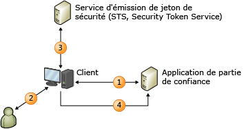

# Modèle d’identité basée sur les revendications
Lorsque vous créez des applications qui prennent en charge les revendications, l'identité de l'utilisateur est représentée dans votre application comme un ensemble de revendications. Une revendication peut être le nom de l'utilisateur, une autre peut être une adresse de messagerie. L'idée est qu'un système d'identité externe soit configuré pour fournir à votre application tout ce qu'elle doit savoir à propos de l'utilisateur avec chaque demande effectuée, ainsi que l'assurance de chiffrement que les données d'identité que vous recevez proviennent d'une source approuvée.  
  
 Dans ce modèle, une authentification unique est beaucoup plus facile à effectuer, et votre application n'est plus responsable des opérations suivantes :  
  
-   Authentification des utilisateurs.  
  
-   Stockage des comptes d'utilisateurs et des mots de passe.  
  
-   Appel aux annuaires d'entreprise pour obtenir des détails sur l'identité d'un utilisateur.  
  
-   Intégration avec des systèmes d'identité à partir d'autres plateformes ou sociétés.  
  
 Dans ce modèle, votre application prend des décisions associées à l'identité basées sur les revendications fournies par le système qui a authentifié l'utilisateur. Il peut très bien s'agir d'une simple personnalisation de l'application avec le prénom de l'utilisateur, ou d'autorisation de l'utilisateur à accéder aux fonctionnalités et aux ressources de valeur dans votre application.  
  
 Cette rubrique fournit les informations suivantes :  
  
-   [Présentation de l’identité basée sur les revendications](../../../docs/framework/security/claims-based-identity-model.md#BKMK_1)  
  
-   [Scénario de base pour un modèle d’identité basé sur des revendications](../../../docs/framework/security/claims-based-identity-model.md#BKMK_2)  
  
   
## Présentation de l'identité basée sur les revendications  
 La terminologie et les concepts suivants peuvent vous aider à comprendre cette nouvelle architecture de l'identité.  
  
### identité  
 Pour les besoins de description du modèle de programmation dans Windows Identity Foundation (WIF), nous utiliserons le terme « identité » pour représenter un jeu d’attributs qui décrit un utilisateur ou une autre entité dans un système à sécuriser.  
  
### Revendication  
 Imaginez une revendication comme une partie des informations d'identité (comme le nom, l'adresse de messagerie, l'âge, l'appartenance au rôle sales). Plus votre application reçoit de revendications, plus vous en savez sur l'utilisateur. Vous vous demandez peut-être pourquoi le terme « revendications » est employé plutôt que « attributs », qui est souvent utilisé pour décrire des annuaires d’entreprise. La raison est liée à la méthode de remise. Dans ce modèle, votre application ne recherche pas les attributs utilisateur dans un répertoire. En revanche, l'utilisateur fournit des revendications à votre application, et que celle-ci les examine. Chaque revendication est faite par un émetteur, et vous devez approuver la revendication autant que vous approuvez l'émetteur. Par exemple, vous devez faire confiance à une revendication faite par le contrôleur de domaine de votre société plus que celle faite par l'utilisateur lui-même. WIF représente les revendications avec un type <xref:System.Security.Claims.Claim>, qui possède une propriété <xref:System.Security.Claims.Claim.Issuer%2A> qui vous permet de savoir qui a publié la revendication.  
  
### Jeton de sécurité  
 L'utilisateur fournit un ensemble de revendications à votre application avec une demande. Dans un service Web, ces revendications sont effectuées dans l'en-tête de sécurité de l'enveloppe SOAP. Dans une application Web basée sur un navigateur, les revendications passent par à une publication HTTP à partir du navigateur de l'utilisateur, et peuvent être mises en cache dans un cookie par la suite si une session est requise. Quelle que soit la façon dont ces revendications arrivent, elles doivent être sérialisées, c'est là que les jetons de sécurité entrent en action. Un jeton de sécurité est un ensemble sérialisé de revendications qui est signé numériquement par l'autorité de publication. La signature est importante : elle vous donne l'assurance que l'utilisateur n'a pas simplement effectué un ensemble de revendications et vous l'a envoyé. Lorsque la sécurité n'est pas une priorité et que le chiffrement n'est pas nécessaire ou souhaité, vous pouvez utiliser des jetons non signés, mais ce scénario n'est pas décrit dans cette rubrique.  
  
 L'une des fonctionnalités principales de WIF est la capacité à créer et à lire les jetons de sécurité. WIF et .NET Framework gèrent tout le travail de chiffrement, et présentent votre application avec un ensemble de revendications que vous pouvez lire.  
  
### Publication de l'autorité  
 Il existe plusieurs types d'autorités de publication (des contrôleurs de domaine qui émettent des tickets Kerberos, aux autorités de certification qui délivrent des certificats X.509), mais le type spécifique d'autorité abordé ici émet des jetons de sécurité qui contiennent des revendications. Cette autorité de publication est une application Web ou un service Web qui sait comment publier des jetons de sécurité. Elle doit savoir suffisamment de choses pour pouvoir émettre les revendications appropriées en fonction de la partie de confiance cible et de l'utilisateur qui effectue la demande, et peut être chargée d'interagir avec l'utilisateur pour rechercher des revendications et authentifier les utilisateurs eux-mêmes.  
  
 Quelle que soit l'autorité de publication choisie, elle joue un rôle central dans votre solution d'identité. Lorsque vous factorisez l'authentification en dehors de votre application en vous appuyant sur les revendications, vous donnez la responsabilité à cette autorité en lui demandant d'authentifier les utilisateurs à votre place.  
  
### Service d'émission de jeton de sécurité (STS, Security Token Service)  
 Un service d'émission de jetons de sécurité (STS) est le composant de service qui crée, signe, puis émet les jetons de sécurité selon les protocoles WS-Trust et WS-Federation. L'implémentation de ces protocoles demande beaucoup de travail, mais WIF effectue tout ce travail pour vous, ce qui permet à un utilisateur qui n'est pas expert en matière de protocoles d'obtenir facilement un STS fonctionnel. Vous pouvez utiliser un STS prégénéré comme [Active Directory® Federation Services (AD FS) 2.0](http://go.microsoft.com/fwlink/?LinkID=247516), un STS Cloud tel que [Microsoft Azure Access Control Service (ACS)](http://go.microsoft.com/fwlink/?LinkID=247517) ou, si vous souhaitez émettre des jetons personnalisés ou fournir une authentification ou une autorisation personnalisée, vous pouvez générer votre propre STS personnalisé à l’aide de WIF. WIF vous permet de créer facilement votre propre STS.  
  
### Application de partie de confiance  
 Lorsque vous créez une application qui se base sur les revendications, vous créez une application de partie de confiance. Parmi les synonymes de partie de confiance on trouve « application prenant en charge les revendications » et « application basée sur les revendications ». Les applications Web et les services Web peuvent être des parties de confiance. Une application de partie de confiance consomme des jetons créés par STS et extrait les revendications des jetons pour les utiliser pour les tâches d'identité associées. WIF offre des fonctionnalités pour vous aider à générer des applications de partie de confiance.  
  
### Normes  
 Afin de rendre tout cela interopérable, plusieurs normes WS-* sont utilisées dans le scénario précédent. La stratégie est récupérée à l'aide de WS-MetadataExchange, et la stratégie elle-même est structurée selon la spécification WS-Policy. STS expose les points de terminaison qui implémentent la spécification WS-Trust, qui décrit comment demander et recevoir des jetons de sécurité. La plupart des STS publient aujourd'hui des jetons mis en forme avec SAML (Security Assertion Markup Language). SAML est une terminologie XML reconnue dans l'industrie qui peut être utilisée pour représenter les revendications de façon interopérable. Ou, dans une situation de multi-plateforme, cela vous permet de communiquer avec STS sur une plateforme entièrement différente et d'obtenir une authentification unique pour toutes vos applications, indépendamment de la plateforme.  
  
### Applications basées sur un navigateur  
 Les clients intelligents ne sont pas les seuls à pouvoir utiliser le modèle d'identité basée sur des revendications. Les applications basées sur un navigateur (également appelées clients passifs) peuvent également l'utiliser. Le scénario suivant décrit comment cela fonctionne.  
  
 D'abord, l'utilisateur désigne un navigateur à une application Web qui prend en charge les revendications (l'application de la partie de confiance). L'application Web redirige le navigateur vers STS afin que l'utilisateur puisse être authentifié. STS est hébergé dans une application Web simple qui lit la requête entrante, authentifie l'utilisateur à l'aide de mécanismes standard HTTP, puis crée un jeton SAML et répond avec une partie du code JavaScript qui entraîne le navigateur à lancer une publication HTTP qui renvoie le jeton SAML à la partie de confiance. Le corps de cette publication contient les revendications que la partie de confiance a demandé. À ce stade, il est courant que la partie de confiance ajoute les revendications dans un cookie afin que l'utilisateur n'ait pas à être redirigé pour chaque requête.  
  
   
## Scénario de base pour un modèle d'identité basé sur des revendications  
 Voici un exemple de système basé sur une revendication.  
  
   
  
 Ce diagramme illustre un site web (l’application de la partie de confiance) configuré pour utiliser WIF pour l’authentification et un client, un navigateur Web, qui veut utiliser ce site.  
  
1.  Lorsqu'un utilisateur non authentifié demande une page, son navigateur est redirigé vers les pages du fournisseur d'identité (IP).  
  
2.  L'adresse IP oblige l'utilisateur à afficher les informations d'identification, par exemple le nom d'utilisateur/mot de passe, Kerberos, etc.  
  
3.  L'adresse IP publie à son tour un jeton qui est retourné au navigateur.  
  
4.  Le navigateur est à présent redirigé vers la page demandée à l'origine où WIF détermine si le jeton répond aux besoins pour accéder à la page. Si c'est le cas, un cookie est publié pour établir une session afin que l'authentification ne se produise qu'une fois et que le contrôle soit transmis à l'application.
