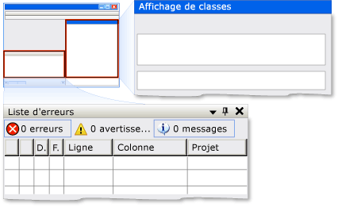

# Implémentation du modèle de contrôle Dock d’UI AutomationImplementing the UI Automation Dock Control Pattern
> [!NOTE]
>  Cette documentation s'adresse aux développeurs .NET Framework qui souhaitent utiliser les classes [!INCLUDE[TLA2#tla_uiautomation](../../../includes/tla2sharptla-uiautomation-md.md)] managées définies dans l'espace de noms <xref:System.Windows.Automation>.This documentation is intended for .NET Framework developers who want to use the managed [!INCLUDE[TLA2#tla_uiautomation](../../../includes/tla2sharptla-uiautomation-md.md)] classes defined in the <xref:System.Windows.Automation> namespace. Pour obtenir les dernières informations sur [!INCLUDE[TLA2#tla_uiautomation](../../../includes/tla2sharptla-uiautomation-md.md)], consultez [API Windows Automation : UI Automation](http://go.microsoft.com/fwlink/?LinkID=156746).For the latest information about [!INCLUDE[TLA2#tla_uiautomation](../../../includes/tla2sharptla-uiautomation-md.md)], see [Windows Automation API: UI Automation](http://go.microsoft.com/fwlink/?LinkID=156746).  
  
 Cette rubrique présente les conventions et recommandations à respecter pour implémenter <xref:System.Windows.Automation.Provider.IDockProvider>, notamment des informations sur les propriétés.This topic introduces guidelines and conventions for implementing <xref:System.Windows.Automation.Provider.IDockProvider>, including information about properties. Des liens vers des références supplémentaires sont répertoriés à la fin de la rubrique.Links to additional references are listed at the end of the topic.  
  
 Le modèle de contrôle <xref:System.Windows.Automation.DockPattern> est utilisé pour exposer les propriétés de l’ancrage d’un contrôle dans un conteneur d’ancrage.The <xref:System.Windows.Automation.DockPattern> control pattern is used to expose the dock properties of a control within a docking container. Un conteneur d’ancrage est un contrôle qui vous permet de réorganiser des éléments enfants horizontalement et verticalement, les uns par rapport aux autres.A docking container is a control that allows you to arrange child elements horizontally and vertically, relative to each other. Pour obtenir des exemples de contrôles qui implémentent ce modèle de contrôle, consultez [Control Pattern Mapping for UI Automation Clients](../../../docs/framework/ui-automation/control-pattern-mapping-for-ui-automation-clients.md).For examples of controls that implement this control pattern, see [Control Pattern Mapping for UI Automation Clients](../../../docs/framework/ui-automation/control-pattern-mapping-for-ui-automation-clients.md).  
  
 ![Conteneur d’ancrage avec deux enfants ancrés. ] (../../../docs/framework/ui-automation/media/uia-dockpattern-dockingexample.PNG "UIA_DockPattern_DockingExample")  
Exemple d’ancrage de Visual Studio où la fenêtre « Affichage de classes » est DockPosition.Right et la fenêtre « Liste d’erreurs » est DockPosition.BottomDocking Example from Visual Studio Where "Class View" Window Is DockPosition.Right and "Error List" Window Is DockPosition.Bottom  
  
   
## Conventions et recommandations en matière d'implémentationImplementation Guidelines and Conventions  
 Lorsque vous implémentez le modèle de contrôle Dock, notez les conventions et recommandations suivantes :When implementing the Dock control pattern, note the following guidelines and conventions:  
  
-   <xref:System.Windows.Automation.Provider.IDockProvider> n’expose aucune propriété du conteneur d’ancrage ni aucune propriété des contrôles qui sont ancrés de façon à être adjacents au contrôle actuel dans le conteneur d’ancrage.<xref:System.Windows.Automation.Provider.IDockProvider> does not expose any properties of the docking container or any properties of controls that are docked adjacent to the current control within the docking container.  
  
-   Les contrôles sont ancrés les uns par rapport aux autres selon leur ordre de plan actuel ; plus leur positionnement dans l’ordre de plan est haut, plus ils sont placés loin du bord spécifié du conteneur d’ancrage.Controls are docked relative to each other based on their current z-order; the higher their z-order placement, the farther they are placed from the specified edge of the docking container.  
  
-   Si le conteneur d’ancrage est redimensionné, tout contrôle ancré dans le conteneur est repositionné sur le même bord que celui auquel il était ancré à l’origine.If the docking container is resized, any docked controls within the container will be repositioned flush to the same edge to which they were originally docked. Les contrôles ancrés sont également redimensionnés pour remplir tout l’espace du conteneur d’après le comportement d’ancrage de leur <xref:System.Windows.Automation.DockPosition>.The docked controls will also resize to fill any space within the container according to the docking behavior of their <xref:System.Windows.Automation.DockPosition>. Par exemple, si <xref:System.Windows.Automation.DockPosition.Top> est spécifié, les côtés gauche et droit du contrôle sont développés pour remplir l’espace disponible.For example, if <xref:System.Windows.Automation.DockPosition.Top> is specified, the left and right sides of the control will expand to fill any available space. Si <xref:System.Windows.Automation.DockPosition.Fill> est spécifié, les quatre côtés du contrôle sont développés pour remplir l’espace disponible.If <xref:System.Windows.Automation.DockPosition.Fill> is specified, all four sides of the control will expand to fill any available space.  
  
-   Sur un système à écrans multiples, les contrôles doivent être ancrés au côté gauche ou droit de l’écran actif.On a multi-monitor system, controls should dock to the left or right side of the current monitor. Si ce n’est pas possible, ils doivent être ancrés au côté gauche de l’écran le plus à gauche ou au côté droit de l’écran le plus à droite.If that is not possible, they should dock to the left side of the leftmost monitor or the right side of the rightmost monitor.  
  
   
## Membres requis pour IDockProviderRequired Members for IDockProvider  
 Les propriétés et méthodes suivantes sont requises pour implémenter l’interface IDockProvider.The following properties and methods are required for implementing the IDockProvider interface.  
  
|Membres requisRequired members|Type de membreMember type|RemarquesNotes|  
|----------------------|-----------------|-----------|  
|<xref:System.Windows.Automation.Provider.IDockProvider.DockPosition%2A>|PropriétéProperty|AucuneNone|  
|<xref:System.Windows.Automation.Provider.IDockProvider.SetDockPosition%2A>|MéthodeMethod|AucuneNone|  
  
 Ce modèle de contrôle n’est associé aucun événement.This control pattern has no associated events.  
  
   
## ExceptionsExceptions  
 Les fournisseurs doivent lever les exceptions suivantes.Providers must throw the following exceptions.  
  
|Type d'exceptionException type|ConditionCondition|  
|--------------------|---------------|  
|<xref:System.InvalidOperationException>|<xref:System.Windows.Automation.Provider.IDockProvider.SetDockPosition%2A>   -Lorsqu’un contrôle n’est pas en mesure d’exécuter le style d’ancrage demandé.-   When a control is not able to execute the requested dock style.|  
  
## Voir aussiSee Also  
 [Vue d’ensemble du modèles contrôle UI AutomationUI Automation Control Patterns Overview](../../../docs/framework/ui-automation/ui-automation-control-patterns-overview.md)  
 [Prise en charge des modèles de contrôle dans un fournisseur UI AutomationSupport Control Patterns in a UI Automation Provider](../../../docs/framework/ui-automation/support-control-patterns-in-a-ui-automation-provider.md)  
 [Modèles de contrôle UI Automation pour les ClientsUI Automation Control Patterns for Clients](../../../docs/framework/ui-automation/ui-automation-control-patterns-for-clients.md)  
 [Vue d’ensemble d’arborescence UI AutomationUI Automation Tree Overview](../../../docs/framework/ui-automation/ui-automation-tree-overview.md)  
 [Utiliser la mise en cache dans UI AutomationUse Caching in UI Automation](../../../docs/framework/ui-automation/use-caching-in-ui-automation.md)
