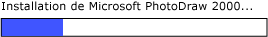

# Implémentation du modèle de contrôle RangeValue d’UI AutomationImplementing the UI Automation RangeValue Control Pattern
> [!NOTE]
>  Cette documentation s'adresse aux développeurs .NET Framework qui souhaitent utiliser les classes [!INCLUDE[TLA2#tla_uiautomation](../../../includes/tla2sharptla-uiautomation-md.md)] managées définies dans l'espace de noms <xref:System.Windows.Automation>.This documentation is intended for .NET Framework developers who want to use the managed [!INCLUDE[TLA2#tla_uiautomation](../../../includes/tla2sharptla-uiautomation-md.md)] classes defined in the <xref:System.Windows.Automation> namespace. Pour obtenir les dernières informations sur [!INCLUDE[TLA2#tla_uiautomation](../../../includes/tla2sharptla-uiautomation-md.md)], consultez [API Windows Automation : UI Automation](http://go.microsoft.com/fwlink/?LinkID=156746).For the latest information about [!INCLUDE[TLA2#tla_uiautomation](../../../includes/tla2sharptla-uiautomation-md.md)], see [Windows Automation API: UI Automation](http://go.microsoft.com/fwlink/?LinkID=156746).  
  
 Cette rubrique présente les conventions et recommandations à respecter pour implémenter <xref:System.Windows.Automation.Provider.IRangeValueProvider>, notamment des informations sur les événements et les propriétés.This topic introduces guidelines and conventions for implementing <xref:System.Windows.Automation.Provider.IRangeValueProvider>, including information about events and properties. Des liens vers des références supplémentaires sont répertoriés à la fin de la rubrique.Links to additional references are listed at the end of the topic.  
  
 Le modèle de contrôle <xref:System.Windows.Automation.RangeValuePattern> est utilisé pour prendre en charge les contrôles auxquels vous pouvez affecter une valeur comprise dans une plage.The <xref:System.Windows.Automation.RangeValuePattern> control pattern is used to support controls that can be set to a value within a range. Pour obtenir des exemples de contrôles implémentant ce modèle de contrôle, consultez [Control Pattern Mapping for UI Automation Clients](../../../docs/framework/ui-automation/control-pattern-mapping-for-ui-automation-clients.md).For examples of controls that implement this control pattern, see [Control Pattern Mapping for UI Automation Clients](../../../docs/framework/ui-automation/control-pattern-mapping-for-ui-automation-clients.md).  
  
   
## Conventions et recommandations en matière d'implémentationImplementation Guidelines and Conventions  
 Quand vous implémentez le modèle de contrôle RangeValue, notez les conventions et recommandations suivantes :When implementing the Range Value control pattern, note the following guidelines and conventions:  
  
-   Les contrôles autorisent le réétalonnage de leurs propriétés prises en charge en fonction des paramètres régionaux ou des préférences de l’utilisateur.Controls allow recalibration of their supported properties based upon locale or user preference. Par exemple, vous pouvez définir un contrôle de thermomètre pour afficher la température en degrés Fahrenheit ou Celsius.An example of this is a thermometer control that can be set to display the temperature in Fahrenheit or Celsius.  
  
-   Les contrôles qui ont des valeurs de plage ambiguës, telles que les barres de progression ou les curseurs, doivent normaliser ces valeurs.Controls that have ambiguous range values, such as progress bars or sliders, should have those values normalized.  
  
 ![Barre de progression. ] (../../../docs/framework/ui-automation/media/uia-rangevaluepattern-progress-bar.PNG "UIA_RangeValuePattern_Progress_Bar")  
Exemple d’une barre de progression où la valeur est de type entier, et où les valeurs de propriété minimale et maximale sont normalisées à 0 et 100, respectivementExample of a Progress Bar Where Value Is of Type Integer and Minimum and Maximum Property Values Are Normalized to 0 and 100, Respectively  
  
   
## Membres obligatoires pour IRangeValueProviderRequired Members for IRangeValueProvider  
  
|Membre obligatoireRequired member|Type de membreMember type|NotesNotes|  
|---------------------|-----------------|-----------|  
|<xref:System.Windows.Automation.RangeValuePattern.IsReadOnlyProperty>|PropriétéProperty|Aucun.None|  
|<xref:System.Windows.Automation.RangeValuePattern.ValueProperty>|PropriétéProperty|Aucun.None|  
|<xref:System.Windows.Automation.RangeValuePattern.LargeChangeProperty>|PropriétéProperty|Aucun.None|  
|<xref:System.Windows.Automation.RangeValuePattern.SmallChangeProperty>|PropriétéProperty|Aucun.None|  
|<xref:System.Windows.Automation.RangeValuePattern.MaximumProperty>|PropriétéProperty|Aucun.None|  
|<xref:System.Windows.Automation.RangeValuePattern.MinimumProperty>|PropriétéProperty|Aucun.None|  
|<xref:System.Windows.Automation.RangeValuePattern.SetValue%2A>|MéthodesMethods|Aucun.None|  
  
 Ce modèle de contrôle n’est associé aucun événement.This control pattern has no associated events.  
  
   
## ExceptionsExceptions  
 Les fournisseurs doivent lever les exceptions suivantes.Providers must throw the following exceptions.  
  
|Type d'exceptionException type|ConditionCondition|  
|--------------------|---------------|  
|<xref:System.ArgumentOutOfRangeException>|<xref:System.Windows.Automation.RangeValuePattern.SetValue%2A> est appelé avec une valeur supérieure à <xref:System.Windows.Automation.RangeValuePattern.MaximumProperty> , ou inférieure à <xref:System.Windows.Automation.RangeValuePattern.MinimumProperty>.<xref:System.Windows.Automation.RangeValuePattern.SetValue%2A> is called with a value that is either greater than <xref:System.Windows.Automation.RangeValuePattern.MaximumProperty> or less than <xref:System.Windows.Automation.RangeValuePattern.MinimumProperty>.|  
  
## Voir aussiSee Also  
 [Vue d’ensemble des modèles de contrôle UI AutomationUI Automation Control Patterns Overview](../../../docs/framework/ui-automation/ui-automation-control-patterns-overview.md)  
 [Prendre en charge des modèles de contrôle dans un fournisseur UI AutomationSupport Control Patterns in a UI Automation Provider](../../../docs/framework/ui-automation/support-control-patterns-in-a-ui-automation-provider.md)  
 [Modèles de contrôle UI Automation pour les clientsUI Automation Control Patterns for Clients](../../../docs/framework/ui-automation/ui-automation-control-patterns-for-clients.md)  
 [Présentation de l’arborescence UI AutomationUI Automation Tree Overview](../../../docs/framework/ui-automation/ui-automation-tree-overview.md)  
 [Utiliser la mise en cache dans UI AutomationUse Caching in UI Automation](../../../docs/framework/ui-automation/use-caching-in-ui-automation.md)
