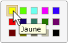

# Implementing the UI Automation Selection Control Pattern
> [!NOTE]
>  Cette documentation s'adresse aux développeurs .NET Framework qui souhaitent utiliser les classes [!INCLUDE[TLA2#tla_uiautomation](../../../includes/tla2sharptla-uiautomation-md.md)] managées définies dans l'espace de noms <xref:System.Windows.Automation>. Pour obtenir les dernières informations sur [!INCLUDE[TLA2#tla_uiautomation](../../../includes/tla2sharptla-uiautomation-md.md)], consultez [API Windows Automation : UI Automation](http://go.microsoft.com/fwlink/?LinkID=156746).  
  
 Cette rubrique présente les conventions et recommandations à respecter pour implémenter <xref:System.Windows.Automation.Provider.ISelectionProvider>, notamment des informations sur les événements et les propriétés. Des liens vers des références supplémentaires sont répertoriés à la fin de la rubrique.  
  
 Le modèle de contrôle <xref:System.Windows.Automation.SelectionPattern> permet de prendre en charge les contrôles qui agissent comme des conteneurs pour une collection d’éléments enfants sélectionnables. Les enfants de cet élément doivent implémenter <xref:System.Windows.Automation.Provider.ISelectionItemProvider>. Pour obtenir des exemples de contrôles implémentant ce modèle de contrôle, consultez [Control Pattern Mapping for UI Automation Clients](../../../docs/framework/ui-automation/control-pattern-mapping-for-ui-automation-clients.md).  
  
   
## Conventions et directives d'implémentation  
 Quand vous implémentez le modèle de contrôle Selection, notez les conventions et recommandations suivantes :  
  
-   Les contrôles qui implémentent <xref:System.Windows.Automation.Provider.ISelectionProvider> autorisent la sélection d’un ou de plusieurs éléments enfants. Par exemple, les contrôles de zone de liste, d’affichage de liste et d’arborescence prennent en charge les sélections multiples, alors que les contrôles de zone de liste déroulante, de curseur et de groupe de cases d’option prennent en charge la sélection unique.  
  
-   Les contrôles dotés d’une plage minimale, maximale et continue, tels que le contrôle de curseur **Volume**, doivent implémenter <xref:System.Windows.Automation.Provider.IRangeValueProvider> au lieu de <xref:System.Windows.Automation.Provider.ISelectionProvider>.  
  
-   Les contrôles à sélection unique qui gèrent des contrôles enfants qui implémentent <xref:System.Windows.Automation.Provider.IRawElementProviderFragmentRoot>, tels que le contrôle de curseur **Résolution d’écran** dans la boîte de dialogue **Propriétés d’affichage** ou le contrôle de sélection **sélecteur de couleurs** de [!INCLUDE[TLA#tla_word](../../../includes/tlasharptla-word-md.md)] \(illustré ci\-dessous\), doivent implémenter <xref:System.Windows.Automation.Provider.ISelectionProvider>. Leurs enfants doivent implémenter <xref:System.Windows.Automation.Provider.IRawElementProviderFragment> et <xref:System.Windows.Automation.Provider.ISelectionItemProvider>.  
  
   
Exemple de mappage d’une chaîne d’échantillons de couleurs  
  
-   Les menus ne prennent pas en charge <xref:System.Windows.Automation.SelectionPattern>. Si vous utilisez des éléments de menu qui incluent à la fois des graphiques et du texte \(tels que les éléments du **Volet de visualisation** du menu **Affichage** de [!INCLUDE[TLA#tla_outlook](../../../includes/tlasharptla-outlook-md.md)]\) et que vous avez besoin de transmettre l’état, vous devez implémenter <xref:System.Windows.Automation.Provider.IToggleProvider>.  
  
   
## Membres requis pour ISelectionProvider  
 Les propriétés, méthodes et événements suivants sont obligatoires pour l’interface <xref:System.Windows.Automation.Provider.ISelectionProvider>.  
  
|Membres nécessaires|Type|Notes|  
|-------------------------|----------|-----------|  
|<xref:System.Windows.Automation.Provider.ISelectionProvider.CanSelectMultiple%2A>|Propriété|Doit prendre en charge les événements de modification de propriété à l’aide de <xref:System.Windows.Automation.Automation.AddAutomationPropertyChangedEventHandler%2A> et <xref:System.Windows.Automation.Automation.RemoveAutomationPropertyChangedEventHandler%2A>.|  
|<xref:System.Windows.Automation.Provider.ISelectionProvider.IsSelectionRequired%2A>|Propriété|Doit prendre en charge les événements de modification de propriété à l’aide de <xref:System.Windows.Automation.Automation.AddAutomationPropertyChangedEventHandler%2A> et <xref:System.Windows.Automation.Automation.RemoveAutomationPropertyChangedEventHandler%2A>.|  
|<xref:System.Windows.Automation.Provider.ISelectionProvider.GetSelection%2A>|Méthode|Aucun|  
|<xref:System.Windows.Automation.SelectionPatternIdentifiers.InvalidatedEvent>|Événement|Déclenché lorsqu’une sélection a changé de manière significative dans un conteneur et requiert l’envoi d’un plus grand nombre d’événements d’ajout et de suppression que la constante <xref:System.Windows.Automation.Provider.AutomationInteropProvider.InvalidateLimit> ne le permet.|  
  
 Les propriétés <xref:System.Windows.Automation.Provider.ISelectionProvider.IsSelectionRequired%2A> et <xref:System.Windows.Automation.Provider.ISelectionProvider.CanSelectMultiple%2A> peuvent être dynamiques. Par exemple, l’état initial d’un contrôle peut ne présenter aucun élément sélectionné par défaut, indiquant que <xref:System.Windows.Automation.Provider.ISelectionProvider.IsSelectionRequired%2A> a la valeur `false`. Toutefois, une fois qu’un élément a été sélectionné, le contrôle doit toujours avoir au moins un élément sélectionné. De la même façon, dans quelques cas rares, un contrôle peut autoriser la sélection de plusieurs éléments lors de l’initialisation, mais n’autoriser par la suite que des sélections uniques.  
  
   
## Exceptions  
 Les fournisseurs doivent lever les exceptions suivantes.  
  
|Type d'exception|Condition|  
|----------------------|---------------|  
|<xref:System.Windows.Automation.ElementNotEnabledException>|Si le contrôle n’est pas activé.|  
|<xref:System.InvalidOperationException>|Si le contrôle est masqué.|  
  
## Voir aussi  
 [UI Automation Control Patterns Overview](../../../docs/framework/ui-automation/ui-automation-control-patterns-overview.md)   
 [Support Control Patterns in a UI Automation Provider](../../../docs/framework/ui-automation/support-control-patterns-in-a-ui-automation-provider.md)   
 [UI Automation Control Patterns for Clients](../../../docs/framework/ui-automation/ui-automation-control-patterns-for-clients.md)   
 [Implementing the UI Automation SelectionItem Control Pattern](../../../docs/framework/ui-automation/implementing-the-ui-automation-selectionitem-control-pattern.md)   
 [UI Automation Tree Overview](../../../docs/framework/ui-automation/ui-automation-tree-overview.md)   
 [Use Caching in UI Automation](../../../docs/framework/ui-automation/use-caching-in-ui-automation.md)