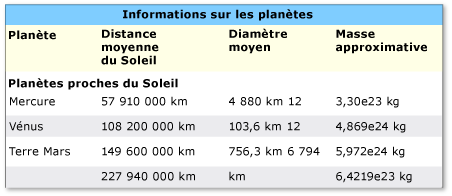

# Impl&#233;mentation du mod&#232;le de contr&#244;le Table d’UI Automation
> [!NOTE]
>  Cette documentation est destinée aux développeurs .NET Framework qui veulent utiliser managé [!INCLUDE[TLA2#tla_uiautomation](../../../includes/tla2sharptla-uiautomation-md.md)] classes définies dans le <xref:System.Windows.Automation> espace de noms. Pour plus d’informations sur [!INCLUDE[TLA2#tla_uiautomation](../../../includes/tla2sharptla-uiautomation-md.md)], consultez [API Windows Automation : UI Automation](http://go.microsoft.com/fwlink/?LinkID=156746).  
  
 Cette rubrique présente les conventions de mise en œuvre et <xref:System.Windows.Automation.Provider.ITableProvider>, notamment des informations sur les propriétés, méthodes et événements. Des liens vers des références supplémentaires sont répertoriés à la fin de la vue d'ensemble.  
  
 Le <xref:System.Windows.Automation.TablePattern> du modèle de contrôle est utilisé pour prendre en charge les contrôles qui agissent comme des conteneurs pour une collection d’éléments enfants. Les enfants de cet élément doivent implémenter <xref:System.Windows.Automation.Provider.ITableItemProvider> et être organisés dans un système de coordonnées logiques à deux dimensions qui peut être parcouru par ligne et colonne. Ce modèle de contrôle est analogue à <xref:System.Windows.Automation.Provider.IgridProvider>, à la différence que tout contrôle implémentant <xref:System.Windows.Automation.Provider.ITableProvider> doit également exposer une relation d’en-tête de colonne et/ou de ligne pour chaque élément enfant. Pour obtenir des exemples de contrôles qui implémentent ce modèle de contrôle, consultez la page [Control Pattern Mapping for UI Automation Clients](../../../docs/framework/ui-automation/control-pattern-mapping-for-ui-automation-clients.md).  
  
   
## Conventions et directives d'implémentation  
 Quand vous implémentez le modèle de contrôle Table, notez les conventions et recommandations suivantes :  
  
-   Accès au contenu des cellules est via un système de coordonnées logiques à deux dimensions ou une table fournie par l’implémentation simultanée requise de <xref:System.Windows.Automation.Provider.IGridProvider>.  
  
-   Un en-tête de colonne ou de ligne peut figurer dans un objet table ou être un objet d’en-tête séparé, associé à un objet table.  
  
-   Les en-têtes de colonne et de ligne peuvent inclure un en-tête principal et des en-têtes de prise en charge quelconques.  
  
> [!NOTE]
>  Ce concept apparaît clairement dans un [!INCLUDE[TLA#tla_xl](../../../includes/tlasharptla-xl-md.md)] feuille de calcul où un utilisateur a défini une colonne « First name ». Cette colonne a désormais deux en-têtes : l’en-tête « Prénom » défini par l’utilisateur et la désignation alphanumérique de cette colonne affectée par l’application.  
  
-   Consultez la page [mise en œuvre le modèle de contrôle Grid d’UI Automation](../../../docs/framework/ui-automation/implementing-the-ui-automation-grid-control-pattern.md) pour les fonctionnalités de grille associées.  
  
   
Exemple de table avec des en-têtes de colonne complexes  
  
   
Exemple de table avec une propriété RowOrColumnMajor ambiguë  
  
   
## Membres requis pour ITableProvider  
 Les propriétés et les méthodes suivantes sont requises pour l’interface ITableProvider.  
  
|Membres nécessaires|Type de membre|Notes|  
|----------------------|-----------------|-----------|  
|<xref:System.Windows.Automation.Provider.ITableProvider.RowOrColumnMajor%2A>|Propriété|Aucun|  
|<xref:System.Windows.Automation.Provider.ITableProvider.GetColumnHeaders%2A>|Méthode|Aucun|  
|<xref:System.Windows.Automation.Provider.ITableProvider.GetRowHeaders%2A>|Méthode|None|  
  
 Ce modèle de contrôle n’est associé à aucun événement.  
  
   
## Exceptions  
 Ce modèle de contrôle n’est associé à aucune exception.  
  
## Voir aussi  
 [Présentation des modèles de contrôle UI Automation](../../../docs/framework/ui-automation/ui-automation-control-patterns-overview.md)   
 [Prise en charge des modèles de contrôle dans un fournisseur UI Automation](../../../docs/framework/ui-automation/support-control-patterns-in-a-ui-automation-provider.md)   
 [Modèles de contrôle UI Automation pour les Clients](../../../docs/framework/ui-automation/ui-automation-control-patterns-for-clients.md)   
 [L’implémentation du modèle de contrôle TableItem d’UI Automation](../../../docs/framework/ui-automation/implementing-the-ui-automation-tableitem-control-pattern.md)   
 [Implémenter le modèle de contrôle Grid d’UI Automation](../../../docs/framework/ui-automation/implementing-the-ui-automation-grid-control-pattern.md)   
 [Vue d’ensemble d’arborescence UI Automation](../../../docs/framework/ui-automation/ui-automation-tree-overview.md)   
 [Utiliser la mise en cache dans UI Automation](../../../docs/framework/ui-automation/use-caching-in-ui-automation.md)