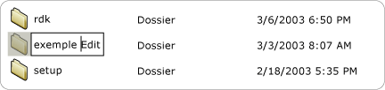

# Implementing the UI Automation Value Control Pattern
> [!NOTE]
>  Cette documentation s'adresse aux développeurs .NET Framework qui souhaitent utiliser les classes [!INCLUDE[TLA2#tla_uiautomation](../../../includes/tla2sharptla-uiautomation-md.md)] managées définies dans l'espace de noms <xref:System.Windows.Automation>. Pour obtenir les dernières informations sur [!INCLUDE[TLA2#tla_uiautomation](../../../includes/tla2sharptla-uiautomation-md.md)], consultez [API Windows Automation : UI Automation](http://go.microsoft.com/fwlink/?LinkID=156746).  
  
 Cette rubrique présente les conventions et recommandations à respecter pour implémenter <xref:System.Windows.Automation.Provider.IValueProvider>, notamment des informations sur les événements et les propriétés. Des liens vers des références supplémentaires sont répertoriés à la fin de la rubrique.  
  
 Le modèle de contrôle <xref:System.Windows.Automation.ValuePattern> est utilisé pour prendre en charge les contrôles qui ont une valeur intrinsèque ne couvrant pas de plage et qui peuvent être représentés sous forme de chaîne. Cette chaîne peut être modifiée, en fonction du contrôle et de ses paramètres. Pour obtenir des exemples de contrôles implémentant ce modèle, consultez [Control Pattern Mapping for UI Automation Clients](../../../docs/framework/ui-automation/control-pattern-mapping-for-ui-automation-clients.md).  
  
   
## Conventions et directives d'implémentation  
 Quand vous implémentez le modèle de contrôle Value, notez les conventions et recommandations suivantes :  
  
-   Les contrôles tels que <xref:System.Windows.Automation.ControlType.ListItem> et <xref:System.Windows.Automation.ControlType.TreeItem> doivent prendre en charge <xref:System.Windows.Automation.ValuePattern> si la valeur d’un des éléments est modifiable, indépendamment du mode d’édition actuel du contrôle. Le contrôle parent doit également prendre en charge <xref:System.Windows.Automation.ValuePattern> si les éléments enfants sont modifiables.  
  
   
Exemple d’élément de liste modifiable  
  
-   Les contrôles d’édition sur une ligne prennent en charge l’accès par programmation à leur contenu en implémentant <xref:System.Windows.Automation.Provider.IValueProvider>. Toutefois, les contrôles d’édition multilignes n’implémentent pas <xref:System.Windows.Automation.Provider.IValueProvider>. Ils fournissent plutôt un accès à leur contenu en implémentant <xref:System.Windows.Automation.Provider.ITextProvider>.  
  
-   Pour récupérer le contenu textuel d’un contrôle d’édition multiligne, le contrôle doit implémenter <xref:System.Windows.Automation.Provider.ITextProvider>. Toutefois, <xref:System.Windows.Automation.Provider.ITextProvider> ne prend pas en charge la définition de la valeur d’un contrôle.  
  
-   <xref:System.Windows.Automation.Provider.IValueProvider> ne prend pas en charge la récupération des informations de mise en forme ou des valeurs d’une sous\-chaîne. Implémentez <xref:System.Windows.Automation.Provider.ITextProvider> dans ces scénarios.  
  
-   <xref:System.Windows.Automation.Provider.IValueProvider> doit être implémenté par des contrôles tels que le contrôle de sélection **Sélecteur de couleurs** de [!INCLUDE[TLA#tla_word](../../../includes/tlasharptla-word-md.md)] \(illustré ci\-dessous\), qui prend en charge le mappage de chaînes entre une valeur de couleur \(par exemple, « jaune »\) et une structure [!INCLUDE[TLA#tla_rgb](../../../includes/tlasharptla-rgb-md.md)] équivalente interne.  
  
   
Exemple de mappage d’une chaîne d’échantillons de couleurs  
  
-   Un contrôle doit avoir <xref:System.Windows.Automation.AutomationElement.IsEnabledProperty> défini sur `true` et <xref:System.Windows.Automation.ValuePattern.IsReadOnlyProperty> défini sur `false` avant d’autoriser un appel à <xref:System.Windows.Automation.Provider.IValueProvider.SetValue%2A>.  
  
   
## Membres obligatoires pour IValueProvider  
 Les propriétés et méthodes suivantes sont nécessaires à l'implémentation d'<xref:System.Windows.Automation.Provider.IValueProvider>.  
  
|Membres nécessaires|Type de membre|Notes|  
|-------------------------|--------------------|-----------|  
|<xref:System.Windows.Automation.ValuePattern.IsReadOnlyProperty>|Propriété|Aucun|  
|<xref:System.Windows.Automation.ValuePattern.ValueProperty>|Propriété|Aucun|  
|<xref:System.Windows.Automation.ValuePattern.SetValue%2A>|Méthode|None|  
  
   
## Exceptions  
 Les fournisseurs doivent lever les exceptions suivantes.  
  
|Type d'exception|Condition|  
|----------------------|---------------|  
|<xref:System.InvalidOperationException>|<xref:System.Windows.Automation.ValuePattern.SetValue%2A>   -   Si des informations spécifiques de paramètres régionaux sont passées à un contrôle dans un format incorrect, par exemple, une date au format incorrect.|  
|<xref:System.ArgumentException>|<xref:System.Windows.Automation.ValuePattern.SetValue%2A>   -   Si une nouvelle valeur ne peut pas être convertie d’une chaîne en un format reconnu par le contrôle.|  
|<xref:System.Windows.Automation.ElementNotEnabledException>|<xref:System.Windows.Automation.ValuePattern.SetValue%2A>   -   Quand une tentative est effectuée pour manipuler un contrôle qui n’est pas activé.|  
  
## Voir aussi  
 [UI Automation Control Patterns Overview](../../../docs/framework/ui-automation/ui-automation-control-patterns-overview.md)   
 [Support Control Patterns in a UI Automation Provider](../../../docs/framework/ui-automation/support-control-patterns-in-a-ui-automation-provider.md)   
 [UI Automation Control Patterns for Clients](../../../docs/framework/ui-automation/ui-automation-control-patterns-for-clients.md)   
 [TextPattern Insert Text Sample](http://msdn.microsoft.com/fr-fr/67353f93-7ee2-42f2-ab76-5c078cf6ca16)   
 [UI Automation Tree Overview](../../../docs/framework/ui-automation/ui-automation-tree-overview.md)   
 [Use Caching in UI Automation](../../../docs/framework/ui-automation/use-caching-in-ui-automation.md)