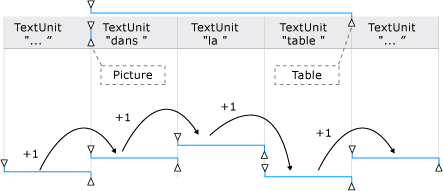

# TextPattern and Embedded Objects Overview
> [!NOTE]
>  Cette documentation s'adresse aux développeurs .NET Framework qui souhaitent utiliser les classes [!INCLUDE[TLA2#tla_uiautomation](../../../includes/tla2sharptla-uiautomation-md.md)] managées définies dans l'espace de noms <xref:System.Windows.Automation>. Pour obtenir les dernières informations sur [!INCLUDE[TLA2#tla_uiautomation](../../../includes/tla2sharptla-uiautomation-md.md)], consultez [API Windows Automation : UI Automation](http://go.microsoft.com/fwlink/?LinkID=156746).  
  
 Cette vue d'ensemble décrit comment [!INCLUDE[TLA#tla_uiautomation](../../../includes/tlasharptla-uiautomation-md.md)] expose des objets incorporés ou des éléments enfants dans un document texte ou un conteneur.  
  
 Dans [!INCLUDE[TLA2#tla_uiautomation](../../../includes/tla2sharptla-uiautomation-md.md)], un objet incorporé est un élément qui a des limites non textuelles ; par exemple, une image, un lien hypertexte, un tableau ou un type de document tel qu'une feuille de calcul [!INCLUDE[TLA#tla_xl](../../../includes/tlasharptla-xl-md.md)] ou un fichier [!INCLUDE[TLA#tla_winmedia](../../../includes/tlasharptla-winmedia-md.md)]. Cette notion est différente de la définition standard, où un élément est créé dans une application et incorporé, ou lié, dans une autre. La modification de l'objet dans son application d'origine est sans importance dans le contexte [!INCLUDE[TLA2#tla_uiautomation](../../../includes/tla2sharptla-uiautomation-md.md)].  
  
   
## Objets incorporés et arborescence UI Automation  
 Les objets incorporés sont traités comme des éléments individuels au sein de la vue de contrôle de l’arborescence [!INCLUDE[TLA2#tla_uiautomation](../../../includes/tla2sharptla-uiautomation-md.md)]. Ils sont exposés en tant qu'enfants du conteneur de texte pour être accessibles via le même modèle que les autres contrôles dans [!INCLUDE[TLA2#tla_uiautomation](../../../includes/tla2sharptla-uiautomation-md.md)].  
  
   
Exemple d'un conteneur de texte avec des objets incorporés tableau, image et lien hypertexte  
  
   
Exemple de l'affichage du contenu pour une partie du conteneur de texte précédent  
  
   
## Exposer des objets incorporés à l'aide de TextPattern et TextPatternRange  
 Utilisées conjointement, la classe de modèle de contrôle <xref:System.Windows.Automation.TextPattern> et la classe <xref:System.Windows.Automation.Text.TextPatternRange> exposent des méthodes et des propriétés qui facilitent la navigation et l’interrogation des objets incorporés.  
  
 Le contenu textuel \(ou texte interne\) d'un conteneur de texte et d'un objet incorporé, tel qu'un lien hypertexte ou une cellule de tableau, est exposé en tant que flux de texte unique et continu dans l'affichage de contrôle et l'affichage du contenu de l'arborescence [!INCLUDE[TLA2#tla_uiautomation](../../../includes/tla2sharptla-uiautomation-md.md)] ; le contour des objets est ignoré. Si un client UI Automation récupère le texte à des fins de récitation, interprétation ou analyse de quelque façon que ce soit, vous devez vérifier les cas spéciaux de la plage de texte, tels qu’un tableau avec du contenu textuel ou d’autres objets incorporés. Vous pouvez le faire en appelant <xref:System.Windows.Automation.Text.TextPatternRange.GetChildren%2A> pour obtenir un <xref:System.Windows.Automation.AutomationElement> pour chaque objet incorporé, puis <xref:System.Windows.Automation.TextPattern.RangeFromChild%2A> pour obtenir une plage de texte pour chaque élément. Cette action se répète jusqu'à ce que tout le contenu textuel ait été récupéré.  
  
   
Exemple de flux de texte avec des objets incorporés et leurs amplitudes  
  
 Quand il est nécessaire de parcourir le contenu d'une plage de texte, il faut effectuer une série d'étapes en arrière\-plan pour assurer la bonne exécution de la méthode <xref:System.Windows.Automation.Text.TextPatternRange.Move%2A>.  
  
1.  La plage de texte est normalisée : elle est réduite en une plage dégénérée au niveau du point de terminaison <xref:System.Windows.Automation.Text.TextPatternRangeEndpoint>, rendant le point de terminaison <xref:System.Windows.Automation.Text.TextPatternRangeEndpoint> superflu. Cette étape est nécessaire pour supprimer toute ambiguïté dans des situations où une plage de texte couvre les limites d’une <xref:System.Windows.Automation.Text.TextUnit> : par exemple, « {L’U}RL [http:\/\/www.microsoft.com](http://www.microsoft.com) est incorporée dans le texte » où « { » et « } » sont les points de terminaison de la plage de texte.  
  
2.  La plage obtenue est déplacée vers l'arrière dans <xref:System.Windows.Automation.TextPattern.DocumentRange%2A> au début de la limite <xref:System.Windows.Automation.Text.TextUnit> demandée.  
  
3.  La plage est avancée ou reculée dans <xref:System.Windows.Automation.TextPattern.DocumentRange%2A> du nombre demandé de limites <xref:System.Windows.Automation.Text.TextUnit>.  
  
4.  La plage est ensuite étendue à partir d'un état de plage dégénérée en déplaçant le point de terminaison <xref:System.Windows.Automation.Text.TextPatternRangeEndpoint> d'une limite <xref:System.Windows.Automation.Text.TextUnit> demandée.  
  
   
Exemples de la façon dont une plage de texte est ajustée pour Move\(\) et ExpandToEnclosingUnit\(\)  
  
   
## Scénarios courants  
 Les sections suivantes présentent les exemples de scénarios les plus courants qui impliquent des objets incorporés.  
  
 Légende des exemples :  
  
 { \= <xref:System.Windows.Automation.Text.TextPatternRangeEndpoint>  
  
 } \= <xref:System.Windows.Automation.Text.TextPatternRangeEndpoint>  
  
   
### Lien hypertexte  
 **Exemple 1 \- Plage de texte contenant un lien hypertexte textuel incorporé**  
  
 {L’URL [http:\/\/www.microsoft.com](http://www.microsoft.com) est incorporée dans le texte}.  
  
|Méthode appelée|Résultat|  
|---------------------|--------------|  
|<xref:System.Windows.Automation.Text.TextPatternRange.GetText%2A>|Retourne la chaîne « L'URL http:\/\/www.microsoft.com est incorporée dans le texte ».|  
|<xref:System.Windows.Automation.Text.TextPatternRange.GetEnclosingElement%2A>|Retourne l'<xref:System.Windows.Automation.AutomationElement> le plus profond qui englobe la plage de texte ; dans ce cas, il s'agit de l'<xref:System.Windows.Automation.AutomationElement> qui représente le fournisseur de texte lui\-même.|  
|<xref:System.Windows.Automation.Text.TextPatternRange.GetChildren%2A>|Retourne un <xref:System.Windows.Automation.AutomationElement> qui représente le contrôle de lien hypertexte.|  
|<xref:System.Windows.Automation.TextPattern.RangeFromChild%2A> où <xref:System.Windows.Automation.AutomationElement> est l'objet retourné par la méthode `GetChildren` précédente.|Retourne la plage qui représente « http:\/\/www.microsoft.com ».|  
  
 **Exemple 2 \- Plage de texte couvrant partiellement un lien hypertexte textuel incorporé**  
  
 L’URL http:\/\/{[www](www)} est incorporée dans le texte.  
  
|Méthode appelée|Résultat|  
|---------------------|--------------|  
|<xref:System.Windows.Automation.Text.TextPatternRange.GetText%2A>|Retourne la chaîne « www ».|  
|<xref:System.Windows.Automation.Text.TextPatternRange.GetEnclosingElement%2A>|Retourne l'<xref:System.Windows.Automation.AutomationElement> le plus profond qui englobe la plage de texte ; dans ce cas, il s'agit du contrôle de lien hypertexte.|  
|<xref:System.Windows.Automation.Text.TextPatternRange.GetChildren%2A>|Retourne `null` étant donné que la plage de texte ne couvre pas entièrement la chaîne d'URL.|  
  
 **Exemple 3 \- Plage de texte couvrant partiellement le contenu d'un conteneur de texte. Le conteneur de texte a un lien hypertexte textuel incorporé qui ne fait pas partie de la plage de texte.**  
  
 {L’URL} [http:\/\/www.microsoft.com](http://www.microsoft.com) est incorporée dans le texte.  
  
|Méthode appelée|Résultat|  
|---------------------|--------------|  
|<xref:System.Windows.Automation.Text.TextPatternRange.GetText%2A>|Retourne la chaîne « L'URL ».|  
|<xref:System.Windows.Automation.Text.TextPatternRange.GetEnclosingElement%2A>|Retourne l'<xref:System.Windows.Automation.AutomationElement> le plus profond qui englobe la plage de texte ; dans ce cas, il s'agit de l'<xref:System.Windows.Automation.AutomationElement> qui représente le fournisseur de texte lui\-même.|  
|<xref:System.Windows.Automation.Text.TextPatternRange.Move%2A> avec les paramètres de \(TextUnit.Word, 1\).|Déplace la plage de texte vers « http », car le texte du lien hypertexte est composé de mots individuels. Dans ce cas, le lien hypertexte n'est pas traité comme un objet unique.   L’URL {[http](../../../ocs/framework/network-programming/http.md)} est incorporée dans le texte.|  
  
   
### Image  
 **Exemple 1 \- Plage de texte contenant une image incorporée**  
  
 {L'image  est incorporée dans le texte}.  
  
|Méthode appelée|Résultat|  
|---------------------|--------------|  
|<xref:System.Windows.Automation.Text.TextPatternRange.GetText%2A>|Retourne la chaîne « L' est incorporée dans le texte ». Tout texte alternatif associé à l'image n'est pas censé être inclus dans le flux de texte.|  
|<xref:System.Windows.Automation.Text.TextPatternRange.GetEnclosingElement%2A>|Retourne l'<xref:System.Windows.Automation.AutomationElement> le plus profond qui englobe la plage de texte ; dans ce cas, il s'agit de l'<xref:System.Windows.Automation.AutomationElement> qui représente le fournisseur de texte lui\-même.|  
|<xref:System.Windows.Automation.Text.TextPatternRange.GetChildren%2A>|Retourne un <xref:System.Windows.Automation.AutomationElement> qui représente le contrôle image.|  
|<xref:System.Windows.Automation.TextPattern.RangeFromChild%2A> où <xref:System.Windows.Automation.AutomationElement> est l'objet retourné par la méthode <xref:System.Windows.Automation.Text.TextPatternRange.GetChildren%2A> précédente.|Retourne la plage dégénérée qui représente «  ».|  
  
 **Exemple 2 \- Plage de texte couvrant partiellement le contenu d'un conteneur de texte. Le conteneur de texte comporte une image incorporée qui ne fait pas partie de la plage de texte.**  
  
 {L'image}  est incorporée dans le texte.  
  
|Méthode appelée|Résultat|  
|---------------------|--------------|  
|<xref:System.Windows.Automation.Text.TextPatternRange.GetText%2A>|Retourne la chaîne « L'image ».|  
|<xref:System.Windows.Automation.Text.TextPatternRange.GetEnclosingElement%2A>|Retourne l'<xref:System.Windows.Automation.AutomationElement> le plus profond qui englobe la plage de texte ; dans ce cas, il s'agit de l'<xref:System.Windows.Automation.AutomationElement> qui représente le fournisseur de texte lui\-même.|  
|<xref:System.Windows.Automation.Text.TextPatternRange.Move%2A> avec les paramètres de \(TextUnit.Word, 1\).|Déplace la plage de texte vers « est ». Étant donné que seuls les objets incorporés basés sur du texte sont considérés comme faisant partie du flux de texte, l'image de cet exemple n'affecte ni Move, ni sa valeur de retour \(dans ce cas, 1\).|  
  
   
### Table  
  
### Tableau utilisé pour les exemples  
  
|Cellule avec l'image|Cellule avec le texte|  
|--------------------------|---------------------------|  
||X|  
||Y|  
|   Image pour Z|Z|  
  
 **Exemple 1 \- Obtenir le conteneur de texte à partir du contenu d'une cellule.**  
  
|Méthode appelée|Résultat|  
|---------------------|--------------|  
|<xref:System.Windows.Automation.GridPattern.GetItem%2A> avec des paramètres \(0,0\)|Retourne l'<xref:System.Windows.Automation.AutomationElement> représentant le contenu de la cellule du tableau ; dans ce cas, l'élément est un contrôle de texte.|  
|<xref:System.Windows.Automation.TextPattern.RangeFromChild%2A> où <xref:System.Windows.Automation.AutomationElement> est l'objet retourné par la méthode `GetItem` précédente.|Retourne la plage qui couvre l'image .|  
|<xref:System.Windows.Automation.Text.TextPatternRange.GetEnclosingElement%2A> pour l'objet retourné par la méthode `RangeFromChild` précédente.|Retourne l'<xref:System.Windows.Automation.AutomationElement> représentant la cellule du tableau ; dans ce cas, l'élément est un contrôle de texte qui prend en charge TableItemPattern.|  
|<xref:System.Windows.Automation.Text.TextPatternRange.GetEnclosingElement%2A> pour l'objet retourné par la méthode `GetEnclosingElement` précédente.|Retourne l'<xref:System.Windows.Automation.AutomationElement> représentant le tableau.|  
|<xref:System.Windows.Automation.Text.TextPatternRange.GetEnclosingElement%2A> pour l'objet retourné par la méthode `GetEnclosingElement` précédente.|Retourne l'<xref:System.Windows.Automation.AutomationElement> représentant le fournisseur de texte lui\-même.|  
  
 **Exemple 2 \- Obtenir le contenu textuel d'une cellule.**  
  
|Méthode appelée|Résultat|  
|---------------------|--------------|  
|<xref:System.Windows.Automation.GridPattern.GetItem%2A> avec des paramètres {1,1}.|Retourne l'<xref:System.Windows.Automation.AutomationElement> représentant le contenu de la cellule du tableau ; dans ce cas, l'élément est un contrôle de texte.|  
|<xref:System.Windows.Automation.TextPattern.RangeFromChild%2A> où <xref:System.Windows.Automation.AutomationElement> est l'objet retourné par la méthode `GetItem` précédente.|Retourne « Y ».|  
  
## Voir aussi  
 <xref:System.Windows.Automation.TextPattern>   
 <xref:System.Windows.Automation.Text.TextPatternRange>   
 <xref:System.Windows.Automation.Provider.ITextProvider>   
 <xref:System.Windows.Automation.Provider.ITextRangeProvider>   
 [Access Embedded Objects Using UI Automation](../../../docs/framework/ui-automation/access-embedded-objects-using-ui-automation.md)   
 [Expose the Content of a Table Using UI Automation](../../../docs/framework/ui-automation/expose-the-content-of-a-table-using-ui-automation.md)   
 [Traverse Text Using UI Automation](../../../docs/framework/ui-automation/traverse-text-using-ui-automation.md)   
 [TextPattern Search and Selection Sample](http://msdn.microsoft.com/fr-fr/0a3bca57-8b72-489d-a57c-da85b7a22c7f)