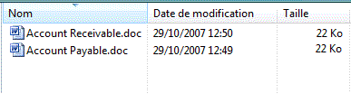

# Prise en charge d'UI Automation pour le type de contrôle DataItemUI Automation Support for the DataItem Control Type
> [!NOTE]
>  Cette documentation s'adresse aux développeurs .NET Framework qui souhaitent utiliser les classes [!INCLUDE[TLA2#tla_uiautomation](../../../includes/tla2sharptla-uiautomation-md.md)] managées définies dans l'espace de noms <xref:System.Windows.Automation>.This documentation is intended for .NET Framework developers who want to use the managed [!INCLUDE[TLA2#tla_uiautomation](../../../includes/tla2sharptla-uiautomation-md.md)] classes defined in the <xref:System.Windows.Automation> namespace. Pour obtenir les dernières informations sur [!INCLUDE[TLA2#tla_uiautomation](../../../includes/tla2sharptla-uiautomation-md.md)], consultez [API Windows Automation : UI Automation](http://go.microsoft.com/fwlink/?LinkID=156746).For the latest information about [!INCLUDE[TLA2#tla_uiautomation](../../../includes/tla2sharptla-uiautomation-md.md)], see [Windows Automation API: UI Automation](http://go.microsoft.com/fwlink/?LinkID=156746).  
  
 Cette rubrique fournit des informations sur la prise en charge de [!INCLUDE[TLA#tla_uiautomation](../../../includes/tlasharptla-uiautomation-md.md)] pour le type de contrôle DataItem.This topic provides information about [!INCLUDE[TLA#tla_uiautomation](../../../includes/tlasharptla-uiautomation-md.md)] support for the DataItem control type. Dans [!INCLUDE[TLA2#tla_uiautomation](../../../includes/tla2sharptla-uiautomation-md.md)] , un type de contrôle est un ensemble de conditions qu’un contrôle doit respecter pour pouvoir utiliser la propriété <xref:System.Windows.Automation.AutomationElement.ControlTypeProperty> .In [!INCLUDE[TLA2#tla_uiautomation](../../../includes/tla2sharptla-uiautomation-md.md)] a control type is a set of conditions that a control must meet in order to use the <xref:System.Windows.Automation.AutomationElement.ControlTypeProperty> property. Les conditions incluent des indications spécifiques pour l’arborescence [!INCLUDE[TLA2#tla_uiautomation](../../../includes/tla2sharptla-uiautomation-md.md)] , les valeurs de propriété [!INCLUDE[TLA2#tla_uiautomation](../../../includes/tla2sharptla-uiautomation-md.md)] et les modèles de contrôle.The conditions include specific guidelines for [!INCLUDE[TLA2#tla_uiautomation](../../../includes/tla2sharptla-uiautomation-md.md)] tree structure, [!INCLUDE[TLA2#tla_uiautomation](../../../includes/tla2sharptla-uiautomation-md.md)] property values and control patterns.  
  
 Une entrée dans une liste de contacts est un exemple de contrôle d’élément de données.An entry in a Contacts list is an example of a data item control. Un contrôle d’élément de données contient des informations intéressantes pour l’utilisateur final.A data item control contains information that is of interest to an end user. Il est plus complexe que l’élément de liste simple, car il contient des informations plus détaillées.It is more complicated than the simple list item because it contains richer information.  
  
 Les sections suivantes définissent l’arborescence, les propriétés, les modèles de contrôle et les événements [!INCLUDE[TLA2#tla_uiautomation](../../../includes/tla2sharptla-uiautomation-md.md)] nécessaires pour le type de contrôle DataItem.The following sections define the required [!INCLUDE[TLA2#tla_uiautomation](../../../includes/tla2sharptla-uiautomation-md.md)] tree structure, properties, control patterns, and events for the DataItem control type. Les exigences relatives à [!INCLUDE[TLA2#tla_uiautomation](../../../includes/tla2sharptla-uiautomation-md.md)] s’appliquent à tous les contrôles d’élément de données, qu’il s’agisse de [!INCLUDE[TLA#tla_winclient](../../../includes/tlasharptla-winclient-md.md)], [!INCLUDE[TLA#tla_win32](../../../includes/tlasharptla-win32-md.md)]ou [!INCLUDE[TLA#tla_winforms](../../../includes/tlasharptla-winforms-md.md)].The [!INCLUDE[TLA2#tla_uiautomation](../../../includes/tla2sharptla-uiautomation-md.md)] requirements apply to all data item controls, whether [!INCLUDE[TLA#tla_winclient](../../../includes/tlasharptla-winclient-md.md)], [!INCLUDE[TLA#tla_win32](../../../includes/tlasharptla-win32-md.md)], or [!INCLUDE[TLA#tla_winforms](../../../includes/tlasharptla-winforms-md.md)].  
  
   
## Arborescence UI Automation obligatoireRequired UI Automation Tree Structure  
 Le tableau suivant représente l’affichage de contrôle et l’affichage du contenu de l’arborescence [!INCLUDE[TLA2#tla_uiautomation](../../../includes/tla2sharptla-uiautomation-md.md)] relative aux contrôles d’élément de données. En outre, il décrit ce que peut contenir chaque affichage.The following table depicts the control view and the content view of the [!INCLUDE[TLA2#tla_uiautomation](../../../includes/tla2sharptla-uiautomation-md.md)] tree that pertains to data item controls and describes what can be contained in each view. Pour plus d’informations sur l’arborescence [!INCLUDE[TLA2#tla_uiautomation](../../../includes/tla2sharptla-uiautomation-md.md)] , consultez [UI Automation Tree Overview](../../../docs/framework/ui-automation/ui-automation-tree-overview.md).For more information about the [!INCLUDE[TLA2#tla_uiautomation](../../../includes/tla2sharptla-uiautomation-md.md)] tree, see [UI Automation Tree Overview](../../../docs/framework/ui-automation/ui-automation-tree-overview.md).  
  
|Arborescence[!INCLUDE[TLA2#tla_uiautomation](../../../includes/tla2sharptla-uiautomation-md.md)] - Affichage de contrôle[!INCLUDE[TLA2#tla_uiautomation](../../../includes/tla2sharptla-uiautomation-md.md)] Tree - Control View|Arborescence[!INCLUDE[TLA2#tla_uiautomation](../../../includes/tla2sharptla-uiautomation-md.md)] - Affichage de contenu[!INCLUDE[TLA2#tla_uiautomation](../../../includes/tla2sharptla-uiautomation-md.md)] Tree - Content View|  
|------------------------------------------------------------------------------------------------|------------------------------------------------------------------------------------------------|  
|DataItemDataItem   -Varie (0 ou plus ; peut être structuré dans une hiérarchie)-   Varies (0 or more; can be structured in hierarchy)|DataItemDataItem   -Varie (0 ou plus ; peut être structuré dans une hiérarchie)-   Varies (0 or more; can be structured in hierarchy)|  
  
 Un élément de données dans une grille de données peut héberger divers objets, notamment une autre couche d’éléments de données ou des éléments de grille spécifiques tels que du texte, des images ou des contrôles d’édition.A data item element in a data grid can host a variety of objects, including another layer of data items, or specific grid elements such as text, images, or edit controls. Si l’élément de données a un rôle d’objet spécifique, il doit être exposé en tant que type de contrôle spécifique, par exemple un type de contrôle ListItem pour un élément de données sélectionnable dans la grille.If the data item element has a specific object role, the element should be exposed as a specific control type; for example, a ListItem control type for a selectable data item in the grid.  
  
   
## Propriétés UI Automation obligatoiresRequired UI Automation Properties  
 Le tableau suivant répertorie les propriétés dont la valeur ou la définition est particulièrement pertinente pour les contrôles d’élément de données.The following table lists the properties whose value or definition is especially relevant to data item controls. Pour plus d’informations sur les propriétés [!INCLUDE[TLA2#tla_uiautomation](../../../includes/tla2sharptla-uiautomation-md.md)] , consultez [UI Automation Properties for Clients](../../../docs/framework/ui-automation/ui-automation-properties-for-clients.md).For more information about [!INCLUDE[TLA2#tla_uiautomation](../../../includes/tla2sharptla-uiautomation-md.md)] properties, see [UI Automation Properties for Clients](../../../docs/framework/ui-automation/ui-automation-properties-for-clients.md).  
  
|PropriétéProperty|ValueValue|NotesNotes|  
|--------------|-----------|-----------|  
|<xref:System.Windows.Automation.AutomationElementIdentifiers.AutomationIdProperty>|Consultez les notes.See notes.|La valeur de cette propriété doit être unique dans tous les contrôles d’une application.The value of this property needs to be unique across all controls in an application.|  
|<xref:System.Windows.Automation.AutomationElementIdentifiers.BoundingRectangleProperty>|Consultez les notes.See notes.|Rectangle externe qui contient l’ensemble du contrôle.The outermost rectangle that contains the whole control.|  
|<xref:System.Windows.Automation.AutomationElementIdentifiers.ClickablePointProperty>|Consultez les notes.See notes.|Pris en charge s’il existe un rectangle englobant.Supported if there is a bounding rectangle. Si les points du rectangle englobant ne sont pas tous interactifs et que vous effectuez un test de positionnement spécialisé, vous devez remplacer et fournir un point interactif.If not every point within the bounding rectangle is clickable, and you perform specialized hit testing, then override and provide a clickable point.|  
|<xref:System.Windows.Automation.AutomationElementIdentifiers.ControlTypeProperty>|DataItemDataItem|Cette valeur est identique pour toutes les infrastructures d’interface utilisateur.This value is the same for all UI frameworks.|  
|<xref:System.Windows.Automation.AutomationElementIdentifiers.IsContentElementProperty>|TrueTrue|Le contrôle d’élément de données doit toujours être du contenu.The data item control must always be content.|  
|<xref:System.Windows.Automation.AutomationElementIdentifiers.IsControlElementProperty>|TrueTrue|Le contrôle d’élément de données doit toujours être un contrôle.The data item control must always be a control.|  
|<xref:System.Windows.Automation.AutomationElementIdentifiers.IsKeyboardFocusableProperty>|Consultez les notes.See notes.|Si le contrôle peut recevoir le focus clavier, il doit prendre en charge cette propriété.If the control can receive keyboard focus, it must support this property.|  
|<xref:System.Windows.Automation.AutomationElementIdentifiers.ItemStatusProperty>|Consultez les notes.See notes.|Si le contrôle contient l’état mis à jour dynamiquement, cette propriété doit être prise en charge pour qu’une technologie d’assistance puisse recevoir des mises à jour quand l’état de l’élément change.If the control contains status that is being updated dynamically then this property must be supported so that an assistive technology can receive updates when the status of the element changes.|  
|<xref:System.Windows.Automation.AutomationElementIdentifiers.ItemTypeProperty>|Consultez les notes.See notes.|Il s’agit de la valeur de chaîne qui transmet à l’utilisateur final l’objet sous-jacent représenté par l’élément.This is the string value that conveys to the end user the underlying object that the item represents. « Fichier multimédia » ou « Contact » en sont des exemples.Examples are "Media File" or "Contact".|  
|<xref:System.Windows.Automation.AutomationElementIdentifiers.LabeledByProperty>|`Null`|Les contrôles d’élément de données n’ont pas d’étiquette de texte statique.Data item controls do not have a static text label.|  
|<xref:System.Windows.Automation.AutomationElementIdentifiers.LocalizedControlTypeProperty>|"élément de données""data item"|Chaîne localisée correspondant au type de contrôle DataItem.Localized string corresponding to the DataItem control type.|  
|<xref:System.Windows.Automation.AutomationElementIdentifiers.NameProperty>|Consultez les notes.See notes.|Le contrôle d’élément de données contient toujours un élément de texte principal qui se rapporte à ce que l’utilisateur peut associer comme identificateur le plus sémantique pour l’élément.The data item control always contains a primary text element that relates to what the user would associate as the most semantic identifier for the item.|  
  
   
## Modèles de contrôle UI Automation obligatoiresRequired UI Automation Control Patterns  
 Le tableau suivant répertorie les modèles de contrôle [!INCLUDE[TLA#tla_uiautomation](../../../includes/tlasharptla-uiautomation-md.md)] qui doivent être pris en charge par tous les contrôles d’élément de données.The following table lists the [!INCLUDE[TLA#tla_uiautomation](../../../includes/tlasharptla-uiautomation-md.md)] control patterns required to be supported by all data item controls. Pour plus d’informations sur les modèles de contrôle, consultez [UI Automation Control Patterns Overview](../../../docs/framework/ui-automation/ui-automation-control-patterns-overview.md).For more information about control patterns, see [UI Automation Control Patterns Overview](../../../docs/framework/ui-automation/ui-automation-control-patterns-overview.md).  
  
|Modèle de contrôleControl Pattern|AssistanceSupport|NotesNotes|  
|---------------------|-------------|-----------|  
|<xref:System.Windows.Automation.Provider.IExpandCollapseProvider>|Selon le casDepends|Si l’élément de données peut être développé ou réduit pour afficher et masquer des informations, le modèle ExpandCollapse doit être pris en charge.If the data item can be expanded or collapsed to show and hide information, the Expand Collapse pattern must be supported.|  
|<xref:System.Windows.Automation.Provider.IGridItemProvider>|Selon le casDepends|Les éléments de données prennent en charge le modèle GridItem quand une collection d’éléments de données est disponible dans un conteneur pouvant être parcouru de manière spatiale d’un élément à un autre.Data items will support the Grid Item pattern when a collection of data items is available within a container that can be spatially navigated item-to-item.|  
|<xref:System.Windows.Automation.Provider.IScrollItemProvider>|Selon le casDepends|Tous les éléments de données prennent en charge la capacité de défilement de l’affichage via le modèle ScrollItem quand leur conteneur de données contient plus d’éléments que l’écran ne peut en afficher.All data items support the ability to be scrolled into view with the Scroll Item pattern when their data container has more items than can fit on the screen.|  
|<xref:System.Windows.Automation.Provider.ISelectionItemProvider>|OuiYes|Tous les éléments de données doivent prendre en charge le modèle SelectionItem pour indiquer le moment où l’élément est sélectionné.All data items must support the Selection Item pattern to indicate when the item is selected.|  
|<xref:System.Windows.Automation.Provider.ITableItemProvider>|Selon le casDepends|Si l’élément de données est contenu dans un contrôle de type DataGrid, il prend en charge ce modèle.If the data item is contained within a Data Grid control type then it will support this pattern.|  
|<xref:System.Windows.Automation.Provider.IToggleProvider>|Selon le casDepends|Si l’élément de données contient un état qui peut être parcouru.If the data item contains a state that can be cycled through.|  
|<xref:System.Windows.Automation.Provider.IValueProvider>|Selon le casDepends|Si le texte principal de l’élément de données est modifiable, le modèle Value doit être pris en charge.If the data item's primary text is editable then the Value pattern must be supported.|  
  
   
## Utilisation d’éléments de données dans les longues listesWorking with Data Items in Large Lists  
 Les longues listes sont souvent des données virtualisées dans des infrastructures d’ [!INCLUDE[TLA2#tla_ui](../../../includes/tla2sharptla-ui-md.md)] pour faciliter les performances.Large lists are often data virtualized within [!INCLUDE[TLA2#tla_ui](../../../includes/tla2sharptla-ui-md.md)] frameworks to assist in performance. Ainsi, un client UI Automation ne peut pas utiliser la fonctionnalité de requête [!INCLUDE[TLA2#tla_uiautomation](../../../includes/tla2sharptla-uiautomation-md.md)] pour capturer le contenu de l’arborescence complète de la même façon que dans d’autres conteneurs d’éléments.Due to this, a UI Automation client cannot use the [!INCLUDE[TLA2#tla_uiautomation](../../../includes/tla2sharptla-uiautomation-md.md)] query feature to scrape the contents of the full tree in the same way that it can in other item containers. Un client doit faire défiler l’élément dans l’affichage (ou développer le contrôle pour afficher toutes les options pertinentes) avant d’accéder à l’ensemble des informations de l’élément de données.A client should scroll the item into view (or expand the control to show all valuable options)prior to accessing the full set of information from the data item.  
  
 Durant l’appel de `SetFocus` sur l’élément [!INCLUDE[TLA2#tla_uiautomation](../../../includes/tla2sharptla-uiautomation-md.md)] pour l’élément de données, la casse de l’ [!INCLUDE[TLA#tla_winexpl](../../../includes/tlasharptla-winexpl-md.md)] est correctement retournée. En outre, le focus est affecté au contrôle d’édition dans la sous-arborescence de l’élément de données.When calling `SetFocus` on the [!INCLUDE[TLA2#tla_uiautomation](../../../includes/tla2sharptla-uiautomation-md.md)] element for the data item, the [!INCLUDE[TLA#tla_winexpl](../../../includes/tlasharptla-winexpl-md.md)] case will return successfully and cause focus to be set to the Edit within the data item subtree.  
  
   
## Événements UI Automation requisRequired UI Automation Events  
 Le tableau suivant répertorie les événements [!INCLUDE[TLA2#tla_uiautomation](../../../includes/tla2sharptla-uiautomation-md.md)] qui doivent être pris en charge par tous les contrôles d’élément de données.The following table lists the [!INCLUDE[TLA2#tla_uiautomation](../../../includes/tla2sharptla-uiautomation-md.md)] events required to be supported by all data item controls. Pour plus d’informations sur les événements, consultez [UI Automation Events Overview](../../../docs/framework/ui-automation/ui-automation-events-overview.md).For more information about events, see [UI Automation Events Overview](../../../docs/framework/ui-automation/ui-automation-events-overview.md).  
  
|Événement[!INCLUDE[TLA2#tla_uiautomation](../../../includes/tla2sharptla-uiautomation-md.md)] [!INCLUDE[TLA2#tla_uiautomation](../../../includes/tla2sharptla-uiautomation-md.md)] Event|AssistanceSupport|NotesNotes|  
|---------------------------------------------------------------------------------|-------------|-----------|  
|<xref:System.Windows.Automation.AutomationElementIdentifiers.AutomationFocusChangedEvent>|ObligatoireRequired|Aucun.None|  
|Événement de modification de propriété<xref:System.Windows.Automation.AutomationElementIdentifiers.BoundingRectangleProperty> <xref:System.Windows.Automation.AutomationElementIdentifiers.BoundingRectangleProperty> property-changed event.|ObligatoireRequired|Aucun.None|  
|Événement de modification de propriété<xref:System.Windows.Automation.AutomationElementIdentifiers.IsEnabledProperty> .<xref:System.Windows.Automation.AutomationElementIdentifiers.IsEnabledProperty> property-changed event.|ObligatoireRequired|Aucun.None|  
|Événement de modification de propriété<xref:System.Windows.Automation.AutomationElementIdentifiers.IsOffscreenProperty> .<xref:System.Windows.Automation.AutomationElementIdentifiers.IsOffscreenProperty> property-changed event.|ObligatoireRequired|Aucun.None|  
|Événement de modification de propriété<xref:System.Windows.Automation.AutomationElementIdentifiers.NameProperty> <xref:System.Windows.Automation.AutomationElementIdentifiers.NameProperty> property-changed event.|ObligatoireRequired|Aucun.None|  
|<xref:System.Windows.Automation.AutomationElementIdentifiers.StructureChangedEvent>|ObligatoireRequired|Aucun.None|  
|<xref:System.Windows.Automation.InvokePatternIdentifiers.InvokedEvent>|Selon le casDepends|Aucun.None|  
|Événement de modification de propriété<xref:System.Windows.Automation.ExpandCollapsePatternIdentifiers.ExpandCollapseStateProperty> <xref:System.Windows.Automation.ExpandCollapsePatternIdentifiers.ExpandCollapseStateProperty> property-changed event.|Selon le casDepends|Aucun.None|  
|<xref:System.Windows.Automation.SelectionItemPatternIdentifiers.ElementAddedToSelectionEvent>|ObligatoireRequired|Aucun.None|  
|<xref:System.Windows.Automation.SelectionItemPatternIdentifiers.ElementRemovedFromSelectionEvent>|ObligatoireRequired|Aucun.None|  
|<xref:System.Windows.Automation.SelectionItemPatternIdentifiers.ElementSelectedEvent>|ObligatoireRequired|Aucun.None|  
|Événement de modification de propriété<xref:System.Windows.Automation.TogglePatternIdentifiers.ToggleStateProperty> <xref:System.Windows.Automation.TogglePatternIdentifiers.ToggleStateProperty> property-changed event.|Selon le casDepends|Aucun.None|  
|Événement de modification de propriété<xref:System.Windows.Automation.ValuePatternIdentifiers.ValueProperty> <xref:System.Windows.Automation.ValuePatternIdentifiers.ValueProperty> property-changed event.|Selon le casDepends|Aucun.None|  
  
   
## Exemple de type de contrôle DataItemDataItem Control Type Example  
 L’image suivante illustre un contrôle de type DataItem dans un contrôle ListView avec prise en charge des informations détaillées pour les colonnes.The following image illustrates a DataItem control type in a List View control with support for rich information for the columns.  
  
   
  
 L’affichage de contrôle et l’affichage du contenu de l’arborescence [!INCLUDE[TLA2#tla_uiautomation](../../../includes/tla2sharptla-uiautomation-md.md)] relative au contrôle d’élément de données sont indiqués ci-dessous.The Control View and the Content View of the [!INCLUDE[TLA2#tla_uiautomation](../../../includes/tla2sharptla-uiautomation-md.md)] tree that pertains to the data item control is displayed below. Les modèles de contrôle de chaque élément Automation sont indiqués entre parenthèses.The control patterns for each automation element are shown in parentheses. Le groupe « Contoso » fait également partie de la grille du contrôle hôte de grille de données.The Group "Contoso" is also part of the grid of the Data Grid host control.  
  
|Arborescence[!INCLUDE[TLA2#tla_uiautomation](../../../includes/tla2sharptla-uiautomation-md.md)] - Affichage de contrôle[!INCLUDE[TLA2#tla_uiautomation](../../../includes/tla2sharptla-uiautomation-md.md)] Tree - Control View|Arborescence[!INCLUDE[TLA2#tla_uiautomation](../../../includes/tla2sharptla-uiautomation-md.md)] - Affichage de contenu[!INCLUDE[TLA2#tla_uiautomation](../../../includes/tla2sharptla-uiautomation-md.md)] Tree - Content View|  
|------------------------------------------------------------------------------------------------|------------------------------------------------------------------------------------------------|  
|-Group « Contoso » (Table, Grid)-   Group "Contoso" (Table, Grid) -DataItem « Accounts Receivable.doc » (TableItem, GridItem, SelectionItem, Invoke)-   DataItem "Accounts Receivable.doc" (TableItem, GridItem, SelectionItem, Invoke) -Image « Accounts Receivable.doc »-   Image "Accounts Receivable.doc" -Modifier « Name » (TableItem, GridItem, valeur « Accounts Receivable.doc »)-   Edit "Name" (TableItem, GridItem, Value "Accounts Receivable.doc") -Modifier la « Date de modification » (TableItem, GridItem, valeur « 25/8/2006 3:29 PM »)-   Edit "Date modified" (TableItem, GridItem, Value "8/25/2006 3:29 PM") -Modifier la « Taille » (GridItem, TableItem, Value « 11.0 Ko)-   Edit "Size" (GridItem, TableItem, Value "11.0 KB) -DataItem « Accounts Payable.doc » (TableItem, GridItem, SelectionItem, Invoke)-   DataItem "Accounts Payable.doc" (TableItem, GridItem, SelectionItem, Invoke) -   ...-   ...|-Group « Contoso » (Table, Grid)-   Group "Contoso" (Table, Grid) -DataItem « Accounts Receivable.doc » (TableItem, GridItem, SelectionItem, Invoke)-   DataItem "Accounts Receivable.doc" (TableItem, GridItem, SelectionItem, Invoke) -Image « Accounts Receivable.doc »-   Image "Accounts Receivable.doc" -Modifier « Name » (TableItem, GridItem, valeur « Accounts Receivable.doc »)-   Edit "Name" (TableItem, GridItem, Value "Accounts Receivable.doc") -Modifier la « Date de modification » (TableItem, GridItem, valeur « 25/8/2006 3:29 PM »)-   Edit "Date modified" (TableItem, GridItem, Value "8/25/2006 3:29 PM") -Modifier la « Taille » (GridItem, TableItem, Value « 11.0 Ko)-   Edit "Size" (GridItem, TableItem, Value "11.0 KB) -DataItem « Accounts Payable.doc » (TableItem, GridItem, SelectionItem, Invoke)-   DataItem "Accounts Payable.doc" (TableItem, GridItem, SelectionItem, Invoke) -   …-   …|  
  
 Si une grille représente une liste d’éléments sélectionnables, les éléments d’interface correspondants peuvent être exposés avec le type de contrôle ListItem au lieu du type de contrôle DataItem.If a grid represents a list of selectable items, the corresponding UI elements can be exposed with the ListItem control type instead of the DataItem control type. Dans l’exemple précédent, vous pouvez améliorer les éléments DataItem ("Accounts Receivable.doc" et "Accounts Payable.doc") sous Group ("Contoso") en les exposant en tant que types de contrôle ListItem, car ce type prend déjà en charge le modèle de contrôle SelectionItem.In the preceding example, the DataItem elements ("Accounts Receivable.doc" and "Accounts Payable.doc") under Group ("Contoso") can be improved by exposing them as ListItem control types because that type already supports the SelectionItem control pattern.  
  
## Voir aussiSee Also  
 <xref:System.Windows.Automation.ControlType.DataItem>  
 [Vue d’ensemble des types de contrôle UI AutomationUI Automation Control Types Overview](../../../docs/framework/ui-automation/ui-automation-control-types-overview.md)  
 [Vue d’ensemble d’UI AutomationUI Automation Overview](../../../docs/framework/ui-automation/ui-automation-overview.md)
