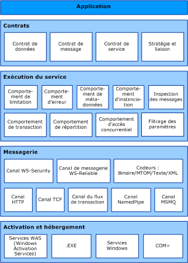

# Architecture Windows Communication Foundation
Le graphique suivant illustre les principales couches de l'architecture [!INCLUDE[indigo1](../../../includes/indigo1-md.md)].  
  
## Architecture WCF  
   
  
### Contrats et descriptions  
 Les contrats définissent les différents aspects du système de messages. Le contrat de données décrit chaque paramètre qui compose chaque message qu'un service peut créer ou consommer. Les paramètres de message sont définis par des documents en langage XSD (XML Schema Definition), ce qui permet à tout système comprenant XML de gérer les documents. Le contrat de message définit des parties de message spécifiques à l'aide de protocoles SOAP, et permet un contrôle plus fin de celles-ci, lorsque l'interopérabilité exige une telle précision. Le contrat de service spécifie les signatures de méthode réelles du service et est distribué en tant qu'interface dans un des langages de programmation pris en charge, tels que Visual Basic ou Visual C#.  
  
 Les stratégies et liaisons stipulent les conditions requises pour communiquer avec un service.  Par exemple, la liaison doit spécifier (au minimum) le transport utilisé (par exemple, HTTP ou TCP) et un encodage. Les stratégies incluent des spécifications de sécurité et d'autres conditions qui doivent être remplies pour communiquer avec un service.  
  
### Exécution du service  
 La couche d'exécution du service contient les comportements qui se produisent uniquement pendant le fonctionnement du service, autrement dit, les comportements au moment de l'exécution du service. La limitation contrôle le nombre de messages traités, qui peut varier si la demande pour le service atteint une limite prédéfinie. Un comportement d'erreur spécifie ce qui se passe lorsqu'une erreur interne se produit sur le service, par exemple, en contrôlant les informations communiquées au client. (Trop d'informations peuvent donner un avantage à un utilisateur malveillant pour mettre en œuvre une attaque.) Un comportement de métadonnées détermine si les métadonnées sont mises à la disposition du monde extérieur et comment elles le sont. Un comportement d'instance définit le nombre d'instances du service qui peuvent être exécutées (par exemple, un singleton spécifie une seule instance pour traiter tous les messages). Un comportement de transaction permet de restaurer les opérations traitées en cas de défaillance. Un comportement de répartition permet de contrôler la manière dont un message est traité par l'infrastructure [!INCLUDE[indigo2](../../../includes/indigo2-md.md)].  
  
 L'extensibilité permet la personnalisation des processus d'exécution. Par exemple, l'inspection de message est la fonctionnalité qui permet d'inspecter des parties d'un message, et le filtrage de paramètre permet d'exécuter des actions prédéfinies en fonction de filtres appliqués aux en-têtes de message.  
  
### Messagerie  
 La couche de messagerie est composée de *canaux*. Un canal est un composant qui traite un message d'une certaine façon, par exemple, en l'authentifiant. Un ensemble de canaux est également appelé un *pile de canaux*. Les canaux agissent sur les messages et leurs en-têtes, à la différence de la couche d'exécution du service qui a pour fonction principale de traiter le contenu des corps de message.  
  
 Il existe deux types de canaux : les canaux de transport et les canaux de protocole.  
  
 Les canaux de transport lisent et écrivent des messages à partir du réseau (ou tout autre point de communication avec le monde extérieur). Certains transports utilisent un encodeur pour convertir les messages (représentés sous forme d'ensembles d'informations XML) vers et à partir de la représentation de flux d'octets utilisée par le réseau. Voici des exemples de transports : HTTP, canaux nommés, TCP et MSMQ. Voici des exemples d'encodages : XML et binaire optimisé.  
  
 Les canaux de protocole implémentent des protocoles de traitement de message, souvent en lisant ou en écrivant des en-têtes supplémentaires dans le message. Ces protocoles sont notamment WS-Security et WS-Reliability.  
  
 La couche de messagerie illustre les formats et modèles d’échange possibles des données. WS-Security est une implémentation de la spécification WS-Security qui active la sécurité au niveau de la couche de message. Le canal de messagerie WS-Reliable active la garantie de remise des messages. Les encodeurs présentent divers encodages qui permettent de répondre aux besoins du message. Le canal HTTP spécifie que le protocole HTTP (HyperText Transport Protocol) est utilisé pour la remise des messages. De même, le canal TCP spécifie le protocole TCP. Le canal de flux de transaction définit les modèles de messages traités. Le canal nommé active la communication entre processus. Le canal MSMQ active l'interopérabilité avec les applications MSMQ.  
  
### Hébergement et activation  
 Sous sa forme définitive, un service est un programme. Comme tout autre programme, un service doit être exécuté dans un fichier exécutable. Il s’agit comme un *auto-hébergé* service.  
  
 Services peuvent également être *hébergé*, ou s’exécuter dans un fichier exécutable géré par un agent externe, telles que les services IIS ou le Service d’Activation Windows (WAS). Le service WAS permet d'activer automatiquement les applications [!INCLUDE[indigo2](../../../includes/indigo2-md.md)] lorsqu'elles sont déployées sur un ordinateur WAS. Les services peuvent également être exécutés manuellement comme des fichiers exécutables (fichiers .exe). Un service peut également être exécuté automatiquement en tant que service Windows. Les composants COM+ peuvent également être hébergés en tant que services [!INCLUDE[indigo2](../../../includes/indigo2-md.md)].  
  
## Voir aussi  
 [Présentation de Windows Communication Foundation](../../../docs/framework/wcf/whats-wcf.md)  
 [Concepts fondamentaux de Windows Communication Foundation](../../../docs/framework/wcf/fundamental-concepts.md)
